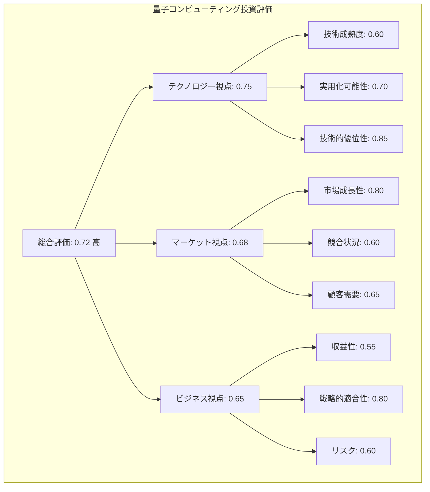
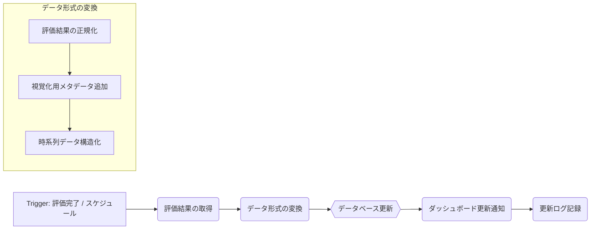

## 4. インターフェース設計と視覚化

**目的：読者がコンセンサスモデルの結果を直感的に理解し、意思決定に活用できるようにする**

コンセンサスモデルの真価は、その計算結果をいかに分かりやすく、意思決定者に伝えられるかにかかっています。本セクションでは、モデルの出力を効果的に視覚化し、ユーザーが直感的に理解できるインターフェースの設計方法を解説します。単なる数値の羅列ではなく、情報の階層性や関連性を明確に表現し、意思決定者が瞬時に状況を把握できるダッシュボードの構築方法を示します。

### 4.1. ダッシュボード設計の基本原則

効果的なダッシュボードは、複雑な情報を整理し、意思決定者が必要な洞察を素早く得られるように設計されています。コンセンサスモデルのダッシュボード設計においては、以下の基本原則が重要です。

**情報の階層化と優先順位付け**

ダッシュボードでは、最も重要な情報を最も目立つ位置に配置し、詳細情報は必要に応じてドリルダウンできる構造にします。具体的には：

- 最上位層：総合評価スコアと判断結果（Go/No-Go/要検討など）
- 第二層：3つの視点（テクノロジー、マーケット、ビジネス）ごとの評価スコア
- 第三層：各視点内の評価要素（例：技術成熟度、市場規模、収益性など）
- 第四層：個別の評価データポイントと根拠情報

この階層構造により、意思決定者は全体像を素早く把握しつつ、必要に応じて詳細情報にアクセスできます。

**視覚的一貫性と直感的理解**

情報の表現方法は一貫性を持ち、直感的に理解できるものであるべきです。

- 色彩コード：評価結果を一貫した色で表現（例：緑=高評価、黄=中評価、赤=低評価）
- アイコンと形状：各視点や評価要素を識別しやすいアイコンで表現
- スケールの統一：すべての評価要素で0〜1のスケールを使用し、比較を容易にする
- 閾値の明示：判断基準となる閾値を視覚的に示し、現在の評価がどの位置にあるかを明確にする

**インタラクティブ性と探索可能性**

静的な表示だけでなく、ユーザーが情報を探索し、異なる角度から分析できる機能を提供します。

- フィルタリング：特定の条件に基づいて情報を絞り込む機能
- ソート：異なる基準で情報を並べ替える機能
- シミュレーション：「もし〜ならば」のシナリオを試せる機能
- 時系列表示：評価の変化を時間軸で追跡できる機能

これらの機能により、意思決定者は受動的に情報を受け取るだけでなく、能動的に情報を探索し、より深い洞察を得ることができます。

### 4.2. 効果的な視覚化手法

コンセンサスモデルの結果を視覚化するためには、複数の手法を目的に応じて使い分けることが効果的です。以下に、特に有用な視覚化手法とその具体的な実装例を示します。

**レーダーチャート：多次元評価の統合表示**

レーダーチャートは、複数の評価軸を同時に表示し、全体のバランスを視覚的に把握するのに適しています。コンセンサスモデルでは、3つの視点や各視点内の評価要素をレーダーチャートで表現することで、強みと弱みを一目で確認できます。

```javascript
// Chart.jsを使用したレーダーチャート実装例
const ctx = document.getElementById('consensusRadar').getContext('2d');
const chart = new Chart(ctx, {
    type: 'radar',
    data: {
        labels: ['技術成熟度', '実用化可能性', '技術的優位性', '市場成長性', 
                '競合状況', '顧客需要', '収益性', '戦略的適合性', 'リスク'],
        datasets: [{
            label: '現在の評価',
            data: [0.6, 0.7, 0.85, 0.8, 0.6, 0.65, 0.55, 0.8, 0.6],
            backgroundColor: 'rgba(54, 162, 235, 0.2)',
            borderColor: 'rgb(54, 162, 235)',
            pointBackgroundColor: 'rgb(54, 162, 235)'
        }, {
            label: '目標値',
            data: [0.7, 0.8, 0.9, 0.85, 0.7, 0.75, 0.7, 0.85, 0.7],
            backgroundColor: 'rgba(255, 99, 132, 0.2)',
            borderColor: 'rgb(255, 99, 132)',
            pointBackgroundColor: 'rgb(255, 99, 132)'
        }]
    },
    options: {
        scales: {
            r: {
                angleLines: {
                    display: true
                },
                suggestedMin: 0,
                suggestedMax: 1
            }
        }
    }
});
```

**階層型ツリーマップ：情報の階層と重要度の表現**

ツリーマップは、階層構造を持つデータを面積で表現し、各要素の相対的な重要度を視覚化するのに適しています。コンセンサスモデルでは、3つの視点とその下位要素の重み付けや評価結果をツリーマップで表現することで、影響度の大きい要素を直感的に把握できます。

```javascript
// D3.jsを使用したツリーマップ実装例
const data = {
    name: "総合評価",
    value: 0.72,
    children: [
        {
            name: "テクノロジー視点",
            value: 0.75,
            children: [
                { name: "技術成熟度", value: 0.60 },
                { name: "実用化可能性", value: 0.70 },
                { name: "技術的優位性", value: 0.85 }
            ]
        },
        {
            name: "マーケット視点",
            value: 0.68,
            children: [
                { name: "市場成長性", value: 0.80 },
                { name: "競合状況", value: 0.60 },
                { name: "顧客需要", value: 0.65 }
            ]
        },
        {
            name: "ビジネス視点",
            value: 0.65,
            children: [
                { name: "収益性", value: 0.55 },
                { name: "戦略的適合性", value: 0.80 },
                { name: "リスク", value: 0.60 }
            ]
        }
    ]
};

const width = 960;
const height = 570;

const treemap = d3.treemap()
    .size([width, height])
    .padding(1)
    .round(true);

const root = d3.hierarchy(data)
    .sum(d => d.value)
    .sort((a, b) => b.value - a.value);

treemap(root);

const svg = d3.select("#treemap")
    .append("svg")
    .attr("width", width)
    .attr("height", height);

const cell = svg.selectAll("g")
    .data(root.leaves())
    .enter().append("g")
    .attr("transform", d => `translate(${d.x0},${d.y0})`);

cell.append("rect")
    .attr("width", d => d.x1 - d.x0)
    .attr("height", d => d.y1 - d.y0)
    .attr("fill", d => {
        // 評価値に基づいて色を決定
        const value = d.data.value;
        if (value >= 0.7) return "#4CAF50";  // 高評価：緑
        if (value >= 0.5) return "#FFC107";  // 中評価：黄
        return "#F44336";                    // 低評価：赤
    });

cell.append("text")
    .attr("x", 5)
    .attr("y", 15)
    .text(d => d.data.name);

cell.append("text")
    .attr("x", 5)
    .attr("y", 30)
    .text(d => d.data.value.toFixed(2));
```

**フローチャートとサンキーダイアグラム：プロセスと影響関係の可視化**

フローチャートやサンキーダイアグラムは、プロセスの流れや要素間の影響関係を視覚化するのに適しています。コンセンサスモデルでは、評価プロセスの流れや、各視点間の情報の流れと影響度をこれらの図で表現することで、モデルの動作原理を直感的に理解できます。



**ヒートマップとマトリックス：相関関係と比較分析**

ヒートマップやマトリックスは、複数の要素間の相関関係や比較分析を視覚化するのに適しています。コンセンサスモデルでは、異なる評価要素間の相関関係や、複数の評価対象（例：異なる技術投資案）の比較をこれらの図で表現することで、パターンや傾向を発見しやすくなります。

```javascript
// Chart.jsを使用したヒートマップ実装例
const ctx = document.getElementById('correlationHeatmap').getContext('2d');
const chart = new Chart(ctx, {
    type: 'matrix',
    data: {
        datasets: [{
            data: [
                { x: '技術成熟度', y: '市場成長性', v: 0.8 },
                { x: '技術成熟度', y: '収益性', v: 0.6 },
                { x: '実用化可能性', y: '市場成長性', v: 0.7 },
                { x: '実用化可能性', y: '収益性', v: 0.9 },
                // 他の組み合わせも同様に定義
            ],
            backgroundColor(context) {
                const value = context.dataset.data[context.dataIndex].v;
                const alpha = value;
                return `rgba(54, 162, 235, ${alpha})`;
            },
            borderColor: 'white',
            borderWidth: 1,
            width: ({ chart }) => (chart.chartArea || {}).width / 9 - 1,
            height: ({ chart }) => (chart.chartArea || {}).height / 9 - 1
        }]
    },
    options: {
        plugins: {
            tooltip: {
                callbacks: {
                    title() {
                        return '';
                    },
                    label(context) {
                        const v = context.dataset.data[context.dataIndex];
                        return [`${v.x} vs ${v.y}`, `相関係数: ${v.v.toFixed(2)}`];
                    }
                }
            }
        },
        scales: {
            x: {
                type: 'category',
                labels: ['技術成熟度', '実用化可能性', '技術的優位性', '市場成長性', 
                        '競合状況', '顧客需要', '収益性', '戦略的適合性', 'リスク'],
                offset: true
            },
            y: {
                type: 'category',
                labels: ['技術成熟度', '実用化可能性', '技術的優位性', '市場成長性', 
                        '競合状況', '顧客需要', '収益性', '戦略的適合性', 'リスク'],
                offset: true
            }
        }
    }
});
```

### 4.3. n8nによるダッシュボード連携

コンセンサスモデルの評価結果をリアルタイムでダッシュボードに反映するためには、n8nワークフローとダッシュボードシステムを効果的に連携させる必要があります。ここでは、n8nを使用してダッシュボードを更新する方法と、実際の連携例を示します。

**n8nとダッシュボードの連携アーキテクチャ**

n8nワークフローからダッシュボードへのデータ連携には、主に以下の3つのアプローチがあります。

1. **APIを介した直接連携**：ダッシュボードツール（例：Grafana, Power BI）が提供するAPIを使用して、n8nから直接データを送信する方法。

2. **データベースを介した間接連携**：n8nの評価結果をデータベース（例：PostgreSQL, MongoDB）に保存し、ダッシュボードツールがそのデータベースを参照する方法。

3. **メッセージングシステムを介した連携**：n8nからメッセージングシステム（例：Kafka, RabbitMQ）にデータを送信し、ダッシュボードシステムがそれをサブスクライブする方法。

多くの場合、2番目のアプローチ（データベースを介した間接連携）が最も柔軟性が高く、実装も比較的容易です。以下に、このアプローチに基づく連携例を示します。

**n8nからダッシュボードへのデータ連携ワークフロー**



このワークフローでは、評価が完了したタイミングまたは定期的なスケジュールでトリガーされ、最新の評価結果を取得します。その後、データをダッシュボード表示に適した形式に変換し、データベースに保存します。必要に応じて、ダッシュボードシステムに更新通知を送信し、更新ログを記録します。

**n8nワークフロー実装例**

以下に、PostgreSQLデータベースとGrafanaダッシュボードを使用した連携の実装例を示します。

```javascript
// n8nワークフロー定義（JSON形式）
{
  "nodes": [
    {
      "parameters": {
        "rule": {
          "interval": [
            {
              "field": "hours",
              "minutesInterval": 1
            }
          ]
        }
      },
      "name": "Schedule Trigger",
      "type": "n8n-nodes-base.scheduleTrigger",
      "position": [
        250,
        300
      ]
    },
    {
      "parameters": {
        "functionCode": "// 最新の評価結果を取得する関数\nconst getLatestEvaluation = async () => {\n  // 実際の実装では、APIやデータベースから最新データを取得\n  return {\n    timestamp: new Date().toISOString(),\n    overallScore: 0.72,\n    perspectives: {\n      technology: {\n        score: 0.75,\n        elements: {\n          maturity: 0.60,\n          feasibility: 0.70,\n          advantage: 0.85\n        }\n      },\n      market: {\n        score: 0.68,\n        elements: {\n          growth: 0.80,\n          competition: 0.60,\n          demand: 0.65\n        }\n      },\n      business: {\n        score: 0.65,\n        elements: {\n          profitability: 0.55,\n          strategic_fit: 0.80,\n          risk: 0.60\n        }\n      }\n    },\n    topic: \"量子コンピューティング投資\",\n    decision: \"要検討\"\n  };\n};\n\n// メイン処理\nconst main = async () => {\n  const evaluation = await getLatestEvaluation();\n  return {evaluation};\n};\n\nreturn await main();"
      },
      "name": "Get Latest Evaluation",
      "type": "n8n-nodes-base.function",
      "position": [
        450,
        300
      ]
    },
    {
      "parameters": {
        "functionCode": "// ダッシュボード表示用にデータを変換する関数\nconst transformData = (evaluation) => {\n  // 時系列データ用の構造\n  const timeSeriesData = {\n    timestamp: evaluation.timestamp,\n    topic: evaluation.topic,\n    overall_score: evaluation.overallScore,\n    technology_score: evaluation.perspectives.technology.score,\n    market_score: evaluation.perspectives.market.score,\n    business_score: evaluation.perspectives.business.score,\n    decision: evaluation.decision\n  };\n  \n  // 詳細評価要素用の構造\n  const elementData = [];\n  \n  // テクノロジー視点の要素\n  Object.entries(evaluation.perspectives.technology.elements).forEach(([key, value]) => {\n    elementData.push({\n      timestamp: evaluation.timestamp,\n      topic: evaluation.topic,\n      perspective: 'technology',\n      element: key,\n      score: value\n    });\n  });\n  \n  // マーケット視点の要素\n  Object.entries(evaluation.perspectives.market.elements).forEach(([key, value]) => {\n    elementData.push({\n      timestamp: evaluation.timestamp,\n      topic: evaluation.topic,\n      perspective: 'market',\n      element: key,\n      score: value\n    });\n  });\n  \n  // ビジネス視点の要素\n  Object.entries(evaluation.perspectives.business.elements).forEach(([key, value]) => {\n    elementData.push({\n      timestamp: evaluation.timestamp,\n      topic: evaluation.topic,\n      perspective: 'business',\n      element: key,\n      score: value\n    });\n  });\n  \n  return {\n    timeSeriesData,\n    elementData\n  };\n};\n\n// メイン処理\nconst main = () => {\n  const evaluation = $input.first().json.evaluation;\n  const transformedData = transformData(evaluation);\n  return transformedData;\n};\n\nreturn main();"
      },
      "name": "Transform for Dashboard",
      "type": "n8n-nodes-base.function",
      "position": [
        650,
        300
      ]
    },
    {
      "parameters": {
        "operation": "insert",
        "schema": "public",
        "table": "consensus_timeseries",
        "columns": "timestamp, topic, overall_score, technology_score, market_score, business_score, decision",
        "additionalFields": {},
        "host": "postgres",
        "port": 5432,
        "database": "consensus_db",
        "user": "postgres",
        "password": "password"
      },
      "name": "Insert TimeSeries Data",
      "type": "n8n-nodes-base.postgres",
      "position": [
        850,
        200
      ]
    },
    {
      "parameters": {
        "operation": "insert",
        "schema": "public",
        "table": "consensus_elements",
        "columns": "timestamp, topic, perspective, element, score",
        "additionalFields": {},
        "host": "postgres",
        "port": 5432,
        "database": "consensus_db",
        "user": "postgres",
        "password": "password"
      },
      "name": "Insert Element Data",
      "type": "n8n-nodes-base.postgres",
      "position": [
        850,
        400
      ]
    },
    {
      "parameters": {
        "url": "http://grafana:3000/api/dashboards/db/consensus-model",
        "authentication": "genericCredentialType",
        "genericAuthType": "httpHeaderAuth",
        "httpHeaderAuth": {
          "name": "Authorization",
          "value": "Bearer eyJrIjoiT0tTcG1pUlY2RnVKZTFVaDFsNFZXdE9ZWmNrMkZYbk="
        },
        "sendBody": true,
        "bodyParameters": {
          "parameters": [
            {
              "name": "dashboard",
              "value": "{\"annotations\":{\"list\":[]},\"editable\":true,\"gnetId\":null,\"graphTooltip\":0,\"hideControls\":false,\"links\":[],\"refresh\":\"5s\",\"rows\":[],\"schemaVersion\":16,\"style\":\"dark\",\"tags\":[],\"templating\":{\"list\":[]},\"time\":{\"from\":\"now-6h\",\"to\":\"now\"},\"timepicker\":{\"refresh_intervals\":[\"5s\",\"10s\",\"30s\",\"1m\",\"5m\",\"15m\",\"30m\",\"1h\",\"2h\",\"1d\"],\"time_options\":[\"5m\",\"15m\",\"1h\",\"6h\",\"12h\",\"24h\",\"2d\",\"7d\",\"30d\"]},\"timezone\":\"browser\",\"title\":\"Consensus Model Dashboard\",\"version\":1}"
            },
            {
              "name": "overwrite",
              "value": "true"
            }
          ]
        },
        "options": {}
      },
      "name": "Update Grafana Dashboard",
      "type": "n8n-nodes-base.httpRequest",
      "position": [
        1050,
        300
      ]
    }
  ],
  "connections": {
    "Schedule Trigger": {
      "main": [
        [
          {
            "node": "Get Latest Evaluation",
            "type": "main",
            "index": 0
          }
        ]
      ]
    },
    "Get Latest Evaluation": {
      "main": [
        [
          {
            "node": "Transform for Dashboard",
            "type": "main",
            "index": 0
          }
        ]
      ]
    },
    "Transform for Dashboard": {
      "main": [
        [
          {
            "node": "Insert TimeSeries Data",
            "type": "main",
            "index": 0
          },
          {
            "node": "Insert Element Data",
            "type": "main",
            "index": 0
          }
        ]
      ]
    },
    "Insert TimeSeries Data": {
      "main": [
        [
          {
            "node": "Update Grafana Dashboard",
            "type": "main",
            "index": 0
          }
        ]
      ]
    },
    "Insert Element Data": {
      "main": [
        [
          {
            "node": "Update Grafana Dashboard",
            "type": "main",
            "index": 0
          }
        ]
      ]
    }
  }
}
```

このワークフローでは、1時間ごとに最新の評価結果を取得し、ダッシュボード表示用にデータを変換した後、PostgreSQLデータベースに保存します。そして、Grafana APIを呼び出してダッシュボードを更新します。

**ダッシュボード設計のベストプラクティス**

コンセンサスモデルのダッシュボード設計において、特に重要なベストプラクティスを以下にまとめます。

1. **ユーザーの意思決定プロセスに沿った設計**：ダッシュボードは、ユーザーの意思決定プロセスに沿った流れで情報を提示すべきです。例えば、「全体状況の把握 → 問題領域の特定 → 詳細分析 → 意思決定」という流れに対応する形で情報を配置します。

2. **コンテキスト情報の提供**：評価スコアだけでなく、その背景となるコンテキスト情報（評価時点、評価対象の特性、前回からの変化など）も提供し、数値の意味を正しく解釈できるようにします。

3. **適切なアラートとハイライト**：閾値を超えた項目や、特に注目すべき変化があった項目を視覚的にハイライトし、ユーザーの注意を適切に誘導します。

4. **比較と参照点の提供**：現在の評価結果を過去のデータや目標値、業界平均などと比較できるようにし、相対的な位置づけを理解しやすくします。

5. **モバイル対応とレスポンシブデザイン**：様々なデバイスやスクリーンサイズでも適切に表示されるレスポンシブなデザインを採用し、いつでもどこでも必要な情報にアクセスできるようにします。

これらのベストプラクティスを踏まえたダッシュボード設計により、コンセンサスモデルの評価結果を最大限に活用し、より質の高い意思決定を支援することができます。
