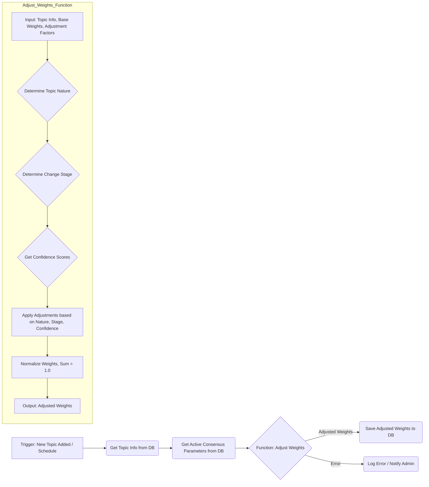

## 5. 実際の運用例とユースケース

**目的：読者が実際の業務課題にコンセンサスモデルを適用するイメージを持てるようにする**

理論的な理解だけでは、実際の業務にコンセンサスモデルを適用することは難しいものです。本セクションでは、具体的なユースケースを通じて、コンセンサスモデルがどのように実際の意思決定を支援するのかを示します。

### 5.1. 先端技術投資判断：量子コンピューティング

先端技術への投資判断は、不確実性が高く、多角的な視点からの評価が必要な典型的な意思決定課題です。ある大手IT企業が量子コンピューティング技術への投資を検討するケースを考えてみましょう。

この企業では、テクノロジー視点、マーケット視点、ビジネス視点の3つの視点から評価を行いました。テクノロジー視点では、技術成熟度（0.60）、実用化可能性（0.70）、技術的優位性（0.85）を評価。マーケット視点では、市場成長性（0.80）、競合状況（0.60）、顧客需要（0.65）を評価。ビジネス視点では、収益性（0.55）、戦略的適合性（0.80）、リスク（0.60）を評価しました。

これらの評価結果をコンセンサスモデルに入力した結果、テクノロジー視点のスコアは0.75、マーケット視点のスコアは0.68、ビジネス視点のスコアは0.65となり、総合評価は0.72（高）という結果になりました。この結果から、技術的な優位性と市場成長性が高く評価される一方、収益性に関しては懸念があることが明確になりました。

企業はこの結果を踏まえ、量子コンピューティング技術への段階的な投資を決定。短期的な収益よりも、長期的な技術優位性と市場ポジショニングを重視する戦略を採用しました。また、収益性の懸念に対応するため、初期段階ではコンサルティングサービスやパートナーシップモデルを通じた収益化を図る計画を立てました。

このケースでは、コンセンサスモデルによって、単なる「投資する/しない」の二択ではなく、リスクと機会のバランスを考慮した段階的アプローチが可能になりました。

### 5.2. 新興市場参入判断：東南アジアeコマース

グローバル展開を検討する企業にとって、新興市場への参入判断は複雑な意思決定プロセスを伴います。ある日本の小売企業が東南アジアのeコマース市場への参入を検討するケースを見てみましょう。

この企業では、テクノロジー視点では、プラットフォーム適合性（0.75）、現地技術インフラ（0.60）、デジタル決済対応（0.85）を評価。マーケット視点では、市場成長率（0.90）、競合状況（0.50）、消費者行動（0.70）を評価。ビジネス視点では、初期投資（0.40）、収益見込み（0.65）、リスク（0.55）を評価しました。

コンセンサスモデルによる評価の結果、テクノロジー視点のスコアは0.73、マーケット視点のスコアは0.70、ビジネス視点のスコアは0.53となり、総合評価は0.65（中〜高）という結果になりました。この結果から、市場の成長性と技術的な準備は整っているものの、ビジネス面での課題が大きいことが明確になりました。

企業はこの結果を踏まえ、リスクを抑えつつ市場参入するための段階的アプローチを採用。まず現地パートナーとの提携を通じて小規模に参入し、市場理解を深めながら徐々に事業を拡大する戦略を選択しました。また、初期投資の負担を軽減するため、既存のeコマースプラットフォームを活用する方針を決定しました。

このケースでは、コンセンサスモデルによって、各視点のバランスを考慮した現実的な市場参入戦略の策定が可能になりました。特に、ビジネス視点の課題を明確にすることで、リスクを最小化しながら市場機会を活かす方法を見出すことができました。

### 5.3. 製品開発方針決定：AIアシスタント

急速に変化する技術トレンドの中で、製品開発の方向性を決定することは企業にとって重要な課題です。あるソフトウェア企業がAIアシスタント製品の開発方針を決定するケースを考えてみましょう。

この企業では、テクノロジー視点では、AI技術成熟度（0.80）、開発リソース適合性（0.65）、技術的差別化（0.70）を評価。マーケット視点では、市場需要（0.85）、競合状況（0.45）、顧客フィードバック（0.75）を評価。ビジネス視点では、収益モデル（0.60）、戦略的重要性（0.90）、開発リスク（0.50）を評価しました。

コンセンサスモデルによる評価の結果、テクノロジー視点のスコアは0.72、マーケット視点のスコアは0.68、ビジネス視点のスコアは0.67となり、総合評価は0.69（中〜高）という結果になりました。この結果から、技術的な実現可能性と市場需要は高いものの、競合の激しさと開発リスクが課題であることが明確になりました。

企業はこの結果を踏まえ、汎用AIアシスタントではなく、特定の業界や用途に特化したAIアシスタントの開発に注力する戦略を採用。競合との差別化を図りつつ、開発リスクを管理可能な範囲に抑える方針を決定しました。また、初期段階から顧客と共同開発するアプローチを採用し、市場ニーズに確実に応える製品開発を目指すことにしました。

このケースでは、コンセンサスモデルによって、技術トレンドと市場競争の中で、自社の強みを活かした製品開発戦略の策定が可能になりました。特に、各視点のスコアバランスを分析することで、リスクと機会のトレードオフを考慮した現実的な開発方針を決定できました。

### 5.4. 動的重み付け調整の実践例

コンセンサスモデルの強みの一つは、評価対象や状況に応じて各視点の重み付けを動的に調整できる点にあります。以下に、動的重み付け調整の実践例を示します。

**n8nによる動的重み付け調整ワークフロー**

以下に、n8nを使用した動的重み付け調整ワークフローの概念図を示します。

このワークフローでは、トピックの性質（技術駆動型、市場駆動型など）、変化の段階（初期、成長期、成熟期など）、各視点の情報の確信度などの要因に基づいて、基本重みを動的に調整します。調整された重みは、次回の評価プロセスで使用されます。

例えば、新興技術の評価では、初期段階ではテクノロジー視点の重みを高く（0.5）、マーケット視点（0.3）とビジネス視点（0.2）を低めに設定します。技術が成熟するにつれて、マーケット視点の重みを徐々に高め（0.4）、テクノロジー視点の重みを下げる（0.4）調整を行います。さらに市場が形成されると、ビジネス視点の重みを高める（0.4）調整を行い、テクノロジー視点（0.3）とマーケット視点（0.3）のバランスを取ります。

このような動的調整により、評価対象の発展段階や特性に応じた適切な評価が可能になり、より現実に即した意思決定を支援することができます。

### 5.5. ユースケースから得られる共通の教訓

これらのユースケースから、コンセンサスモデルの実践において重要な共通の教訓が得られます。

まず、多角的な視点からの評価が意思決定の質を高めることが明確になりました。単一の視点（例えば技術的な実現可能性のみ）で判断するのではなく、テクノロジー、マーケット、ビジネスの3つの視点からバランスよく評価することで、より包括的な判断が可能になります。

次に、定量的評価と定性的判断の組み合わせの重要性が挙げられます。コンセンサスモデルは数値スコアを提供しますが、最終的な意思決定は、これらの数値を解釈し、組織の戦略や価値観と照らし合わせて行う必要があります。モデルは意思決定を代行するものではなく、より良い判断を支援するツールとして位置づけるべきです。

また、継続的な評価と調整の重要性も明らかになりました。初期評価だけでなく、状況の変化に応じて定期的に再評価を行い、必要に応じて戦略を調整することが成功への鍵となります。n8nを活用した動的重み付け調整は、この継続的な評価プロセスを効率化し、一貫性を保つのに役立ちます。

最後に、組織内でのコンセンサス形成ツールとしての価値が挙げられます。異なる部門や専門性を持つメンバーが、共通のフレームワークを通じて議論することで、より建設的な対話が可能になります。コンセンサスモデルは、単なる計算ツールではなく、組織内の協働と合意形成を促進するプラットフォームとしても機能します。

これらの教訓を踏まえることで、コンセンサスモデルを自組織の意思決定プロセスに効果的に統合し、より質の高い判断を実現することができるでしょう。
