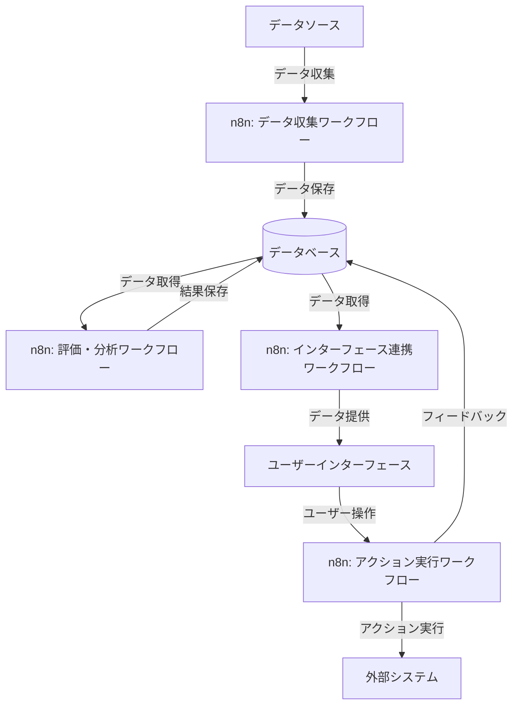
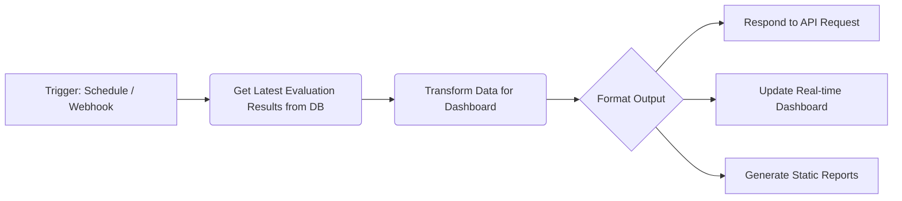
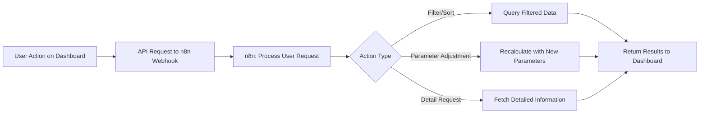

## 4. インターフェース設計と視覚化

**目的：読者がコンセンサスモデルを効果的に操作・理解するためのインターフェースを設計できるようにする**

コンセンサスモデルの理論的な設計と実装だけでは不十分です。実際の利用者がモデルを効果的に操作し、その結果を直感的に理解できるインターフェースが必要です。本セクションでは、コンセンサスモデルのためのユーザーインターフェース設計と視覚化の原則、具体的な実装方法、そしてn8nワークフローとの連携方法について詳細に解説します。特に、複雑な多次元データを直感的に理解できるダッシュボード設計や、意思決定者が重要な情報を素早く把握できるビジュアライゼーション手法に焦点を当て、理論と実践を橋渡しする具体的な方法論を提供します。

### 4.1. ユーザーインターフェース設計の原則

コンセンサスモデルのユーザーインターフェース（UI）設計は、単なる見た目の問題ではなく、モデルの有効性と採用率に直接影響する重要な要素です。適切に設計されたUIは、ユーザーがモデルを効果的に操作し、その結果を正確に解釈することを可能にします。ここでは、コンセンサスモデルのUI設計における5つの核心的な原則について解説します。

**1. 直感性と学習容易性**

コンセンサスモデルのUIは、初めて使用するユーザーでも直感的に操作できるように設計する必要があります。これは、ユーザーの認知負荷を最小限に抑え、モデルの採用障壁を下げるために不可欠です。

具体的な実装ポイント：
- **一貫したメンタルモデル**：テクノロジー、マーケット、ビジネスという3つの視点を一貫して表現し、ユーザーが全体構造を容易に理解できるようにします。例えば、各視点を常に同じ色やアイコンで表現することで、視覚的一貫性を確保します。
- **段階的な情報開示**：基本的な情報から詳細情報へと段階的に開示する設計により、ユーザーが情報過多に圧倒されることを防ぎます。例えば、最初は総合評価スコアのみを表示し、ユーザーの操作に応じて詳細な評価要素や根拠を表示する方法が効果的です。
- **自己説明的な要素**：ボタンやコントロールの機能が視覚的に明確であり、詳細なマニュアルなしでも操作できるようにします。ツールチップやコンテキストヘルプを効果的に活用することも重要です。

**2. 情報の階層化と優先順位付け**

コンセンサスモデルでは、大量の情報と複数の評価軸が存在します。これらの情報を効果的に階層化し、ユーザーが最も重要な情報に素早くアクセスできるようにすることが重要です。

具体的な実装ポイント：
- **視覚的階層**：フォントサイズ、色の濃淡、配置などを活用して、情報の重要度を視覚的に表現します。例えば、総合評価スコアは大きなフォントで目立つ位置に、詳細な評価要素はそれより小さく配置するなどの工夫が効果的です。
- **注目すべき情報の強調**：閾値を超えた重要な変化や、整合性の低い評価結果など、ユーザーが特に注目すべき情報を視覚的に強調します。例えば、警告色の使用やアニメーション効果などが考えられます。
- **コンテキストに応じた表示**：ユーザーの現在のタスクや関心に応じて、関連性の高い情報を優先的に表示します。例えば、技術評価に焦点を当てている場合は、テクノロジー視点の詳細情報を優先的に表示するなどの工夫が効果的です。

**3. インタラクティブ性と探索性**

ユーザーが受動的に情報を受け取るだけでなく、能動的に情報を探索し、異なる角度から分析できるインタラクティブな設計が重要です。これにより、ユーザーはモデルの結果をより深く理解し、自身の判断に活かすことができます。

具体的な実装ポイント：
- **フィルタリングとソート機能**：様々な基準（重要度、確信度、日付など）でデータをフィルタリングやソートできる機能を提供します。これにより、ユーザーは自身の関心に応じてデータを整理し、パターンや傾向を発見できます。
- **ドリルダウン機能**：総合評価から詳細な評価要素へと掘り下げていける階層的なナビゲーション構造を提供します。例えば、総合スコアをクリックすると各視点のスコアが表示され、さらに各視点のスコアをクリックすると詳細な評価要素が表示されるといった設計が効果的です。
- **シナリオ分析ツール**：パラメータ（重み付けなど）を調整し、その影響をリアルタイムで確認できる機能を提供します。これにより、ユーザーは「もし〜ならば」型の分析を行い、異なるシナリオを探索できます。

**4. 透明性と説明可能性**

コンセンサスモデルの判断プロセスと結果が「ブラックボックス」にならないよう、透明性と説明可能性を確保することが重要です。ユーザーがモデルの判断根拠を理解できることで、信頼性が高まり、より効果的な意思決定が可能になります。

具体的な実装ポイント：
- **判断根拠の可視化**：評価結果だけでなく、その根拠となったデータや評価プロセスも表示します。例えば、「このスコアは以下の3つの要素に基づいています」といった説明と共に、各要素の詳細を表示する方法が効果的です。
- **重み付けの明示**：各視点や評価要素にどのような重みが適用されているかを明示し、必要に応じてユーザーが調整できるようにします。
- **データソースへのリンク**：評価の基となった原データや情報源へのリンクを提供し、ユーザーが必要に応じて詳細を確認できるようにします。

**5. 適応性とカスタマイズ性**

異なるユーザーや組織には異なるニーズがあります。UIが柔軟に適応し、カスタマイズ可能であることで、より幅広い状況やユーザーに対応できます。

具体的な実装ポイント：
- **ユーザー設定**：表示する情報の種類や量、視覚化の方法などをユーザーが自身の好みや必要に応じて調整できるようにします。
- **役割に応じたビュー**：経営層、中間管理職、専門家など、異なる役割や関心を持つユーザーに適したビューを提供します。例えば、経営層向けには高レベルの概要を、専門家向けには詳細なデータと分析ツールを提供するなどの工夫が効果的です。
- **コンテキスト認識**：ユーザーの過去の行動や現在のコンテキストに基づいて、UIを動的に調整します。例えば、特定のトピックを頻繁に分析するユーザーには、関連するショートカットや推奨分析を提供するなどの工夫が考えられます。

これらの原則を適切に組み合わせることで、コンセンサスモデルの複雑さを隠しつつ、その強力な機能を最大限に活用できるUIを設計することができます。次のセクションでは、これらの原則を具体的なダッシュボード設計に落とし込む方法について解説します。

### 4.2. ダッシュボード設計と視覚化手法

コンセンサスモデルの複雑な評価結果を効果的に伝えるためには、適切なダッシュボード設計と視覚化手法が不可欠です。ここでは、前述のUI設計原則を踏まえた具体的なダッシュボード構成と、各種データの視覚化手法について解説します。

**ダッシュボードの基本構成**

効果的なコンセンサスモデルのダッシュボードは、以下の4つの主要セクションから構成されることが推奨されます：

1. **概要パネル（Overview Panel）**：
   ダッシュボードの最上部に配置し、最も重要な情報を一目で把握できるようにします。具体的には以下の要素を含みます：
   - 総合コンセンサススコア（3つの視点を統合した全体評価）
   - 各視点（テクノロジー、マーケット、ビジネス）の個別スコア
   - 重要なアラートや注意点（閾値を超えた変化、整合性の低い評価など）
   - 時系列での変化傾向（上昇/下降/安定）

   このパネルは、意思決定者が最初に目を通し、全体状況を素早く把握するためのものです。視覚的に明確で、詳細情報へのドリルダウンリンクを提供します。

2. **視点別詳細パネル（Perspective Detail Panels）**：
   3つの視点それぞれの詳細情報を表示するパネルです。タブ形式や折りたたみパネルなどで切り替え可能にし、以下の要素を含みます：
   - 視点ごとの評価スコアの内訳（重要度、確信度、整合性）
   - 主要な評価要素とその値
   - 関連するデータポイントや指標
   - 時系列での変化グラフ

   このパネルは、各視点の評価結果をより深く理解し、その根拠を確認するためのものです。

3. **比較・分析パネル（Comparison & Analysis Panel）**：
   複数のトピックや時点での評価結果を比較したり、より高度な分析を行うためのパネルです。以下の要素を含みます：
   - トピック間または時点間の比較チャート
   - 相関分析や傾向分析のグラフ
   - シナリオ分析ツール（パラメータ調整と結果シミュレーション）
   - カスタム分析のためのフィルタリングとソートオプション

   このパネルは、より深い洞察を得るための探索的分析をサポートします。

4. **アクション・推奨パネル（Action & Recommendation Panel）**：
   評価結果に基づく具体的なアクションや推奨事項を表示するパネルです。以下の要素を含みます：
   - 優先的に対応すべき項目のリスト
   - 推奨アクションとその根拠
   - フォローアップのためのタスク管理ツール
   - 関連リソースや参考情報へのリンク

   このパネルは、評価結果を具体的なアクションに変換し、意思決定プロセスを促進するためのものです。

**効果的な視覚化手法**

コンセンサスモデルの各種データを効果的に視覚化するための手法を、データタイプ別に解説します：

1. **総合評価スコアの視覚化**：
   - **ゲージチャート**：スピードメーターのような半円形のゲージを使用し、スコアの位置を直感的に表現します。色のグラデーション（例：赤→黄→緑）を併用することで、スコアの良し悪しを視覚的に強調できます。
   - **レーダーチャート（スパイダーチャート）**：3つの視点と複数の評価要素を同時に表示できる多角形のチャートです。各軸が評価要素を表し、塗りつぶされた領域の大きさで総合的な評価を表現します。バランスの取れた評価結果は正三角形に近い形状になり、偏りのある評価は歪んだ形状になります。

2. **視点間の関係性の視覚化**：
   - **三角形プロット**：3つの視点を三角形の各頂点に配置し、評価結果の位置をプロットします。これにより、どの視点に評価が偏っているかを直感的に理解できます。
   - **バブルチャート**：x軸、y軸、バブルの大きさの3次元で3つの視点を表現します。これにより、視点間の相対的な重要性や関係性を視覚化できます。

3. **時系列データの視覚化**：
   - **スパークライン**：小さなスペースに収まるミニマルな折れ線グラフで、各指標の時間的変化を簡潔に表現します。概要パネルの各スコアの横に配置することで、トレンドを即座に把握できます。
   - **ヒートマップタイムライン**：時間軸に沿って色の濃淡でスコアの変化を表現します。複数の指標を並べて表示することで、異なる指標間の時間的な関係性も把握できます。

4. **整合性と矛盾の視覚化**：
   - **ネットワークグラフ**：情報間の関係性をノードとエッジで表現し、整合性の高い情報は強い結合で、矛盾する情報は破線や警告色で表示します。
   - **マトリックスヒートマップ**：行と列に評価要素を配置し、セルの色で整合性の度合いを表現します。対角線上に高い整合性（濃い色）が集中し、それ以外の領域に低い整合性（薄い色）が分布するパターンが理想的です。

5. **不確実性と確信度の視覚化**：
   - **エラーバー付きチャート**：ポイント推定値と共に不確実性の範囲を表示します。確信度が高いほどエラーバーが短く、低いほど長くなります。
   - **ファンチャート**：時系列予測において、将来に向かって広がる扇形の領域で不確実性の増大を表現します。確信度が高い予測は狭い範囲に、低い予測は広い範囲に分布します。

**インタラクティブ要素の実装**

ダッシュボードの有効性を高めるためのインタラクティブ要素として、以下の実装を検討します：

1. **ドリルダウン機能**：
   概要レベルの情報をクリックすると、より詳細なレベルの情報が表示される階層的なナビゲーション構造を実装します。例えば、総合スコアをクリックすると視点別スコアが表示され、さらに視点別スコアをクリックすると評価要素の詳細が表示されるといった具合です。

2. **フィルタリングとソート機能**：
   日付範囲、スコア範囲、トピックカテゴリなど、様々な基準でデータをフィルタリングできるコントロールを提供します。また、異なる列や基準でデータをソートする機能も実装します。

3. **パラメータ調整スライダー**：
   重み付けや閾値などのパラメータをリアルタイムで調整し、その影響を即座に視覚化に反映させるスライダーコントロールを実装します。これにより、「もし〜ならば」型のシナリオ分析が可能になります。

4. **ツールチップと詳細情報**：
   グラフやチャートの要素にマウスオーバーすると、詳細情報や説明が表示されるツールチップ機能を実装します。これにより、視覚的な簡潔さを維持しながら、必要に応じて詳細情報にアクセスできます。

5. **カスタムビューの保存と共有**：
   ユーザーが特定のフィルター設定やビュー構成をブックマークとして保存し、他のユーザーと共有できる機能を実装します。これにより、チーム内での分析結果の共有と議論が促進されます。

**レスポンシブデザインとデバイス対応**

現代の業務環境では、様々なデバイスからダッシュボードにアクセスする可能性があります。そのため、以下のポイントを考慮したレスポンシブデザインが重要です：

1. **画面サイズに応じたレイアウト調整**：
   大画面では全てのパネルを同時に表示し、小画面では重要なパネルを優先表示するなど、画面サイズに応じてレイアウトを最適化します。

2. **タッチインターフェース対応**：
   タブレットやタッチスクリーンデバイスでの操作を考慮し、十分なタッチターゲットサイズと適切なジェスチャー対応を実装します。

3. **情報密度の調整**：
   デバイスの性能や画面サイズに応じて、表示する情報の量と詳細度を調整します。例えば、モバイルデバイスでは概要情報を中心に表示し、詳細情報はドリルダウン操作で確認できるようにします。

これらのダッシュボード設計と視覚化手法を適切に組み合わせることで、コンセンサスモデルの複雑な評価結果を直感的に理解し、効果的な意思決定に活用することが可能になります。次のセクションでは、これらのインターフェースをn8nワークフローと連携させる方法について解説します。

### 4.3. n8nワークフローとの連携

コンセンサスモデルのインターフェースとn8nワークフローを効果的に連携させることで、データの収集から分析、視覚化、そして意思決定支援までの一連のプロセスを自動化し、シームレスに統合することができます。ここでは、n8nを活用したインターフェース連携の具体的な方法と実装例について解説します。

**データフローとシステム連携の全体像**

コンセンサスモデルとインターフェースを中心としたデータフローの全体像は以下のようになります：



*図：コンセンサスモデルのデータフローとシステム連携の概念図*

この図に示すように、n8nワークフローは以下の4つの主要な役割を担います：

1. **データ収集ワークフロー**：外部データソース（API、ウェブスクレイピング、ファイル、データベースなど）からデータを収集し、必要な前処理を行った上でデータベースに保存します。
2. **評価・分析ワークフロー**：データベースからデータを取得し、コンセンサスモデルのロジックに基づいて評価・分析を行い、結果をデータベースに保存します。
3. **インターフェース連携ワークフロー**：データベースから評価結果や関連データを取得し、ユーザーインターフェース（ダッシュボード）に提供します。
4. **アクション実行ワークフロー**：ユーザーインターフェースからの操作やリクエストに応じて、特定のアクション（追加分析、通知送信、外部システムとの連携など）を実行します。

**インターフェース連携ワークフローの実装**

インターフェース連携ワークフローは、コンセンサスモデルの評価結果をダッシュボードに提供するための中核的なワークフローです。以下に、その具体的な実装例を示します：



*図：インターフェース連携ワークフローの概念図*

このワークフローは、定期的なスケジュール（例：1時間ごと）またはWebhookトリガー（例：ユーザーがダッシュボードを開いたとき）によって起動します。データベースから最新の評価結果を取得し、ダッシュボード表示に適した形式に変換した後、APIレスポンス、リアルタイムダッシュボード更新、静的レポート生成などの形で出力します。

**n8nノードの設定例**

1. **Trigger Node**：
   - **Schedule Trigger**：定期的な更新のために、例えば1時間ごとに実行するようスケジュール設定します。
   - **Webhook Trigger**：ユーザーがダッシュボードを開いたときなど、オンデマンドでデータを取得するためのエンドポイントを設定します。

2. **Database Nodes**：
   - **Postgres / MySQL / MongoDB Node**：データベースから最新の評価結果を取得するクエリを設定します。例えば、「過去30日間の評価結果を取得し、日付の降順でソート」などのクエリを実行します。

3. **Function Node**：
   - データをダッシュボード表示に適した形式に変換するJavaScriptコードを実装します。例えば、時系列データの集約、スコアの正規化、視覚化に必要な追加計算などを行います。

4. **Output Nodes**：
   - **Respond to Webhook**：Webhookトリガーに対して、処理結果をJSON形式で返します。
   - **WebSocket**：リアルタイムダッシュボードを更新するためのWebSocketメッセージを送信します。
   - **Write Binary File**：静的なレポート（PDF、Excel、CSVなど）を生成し、ファイルシステムに保存します。

**ユーザーアクションに応じたワークフロー実行**

ダッシュボード上でのユーザーアクション（フィルター適用、パラメータ調整、詳細表示リクエストなど）に応じて、n8nワークフローを実行する仕組みも重要です。以下に、その実装例を示します：



*図：ユーザーアクションに応じたワークフロー実行の概念図*

このフローでは、ダッシュボード上でのユーザーアクションがAPIリクエストとしてn8nのWebhookに送信され、アクションの種類に応じて適切な処理が実行されます。処理結果はダッシュボードに返され、ユーザーインターフェースが更新されます。

**実装上の注意点とベストプラクティス**

1. **パフォーマンスの最適化**：
   - 大量のデータを扱う場合は、必要なデータのみを取得するようクエリを最適化します。
   - 計算負荷の高い処理は、オンデマンドではなく事前計算しておくことを検討します。
   - キャッシュ機構を導入し、頻繁にアクセスされるデータの読み込み時間を短縮します。

2. **エラーハンドリングと回復メカニズム**：
   - データベース接続エラーやAPIタイムアウトなどの一般的な障害に対する適切なエラーハンドリングを実装します。
   - 障害発生時にユーザーに適切なフィードバックを提供し、可能な場合は代替データや機能を提供します。
   - 重要なワークフローには自動リトライ機能を実装し、一時的な障害からの回復を図ります。

3. **セキュリティ考慮事項**：
   - APIエンドポイントには適切な認証と認可を実装し、不正アクセスを防止します。
   - センシティブなデータを扱う場合は、データの暗号化と安全な通信チャネルの使用を検討します。
   - ユーザーの役割や権限に基づいて、アクセス可能なデータと機能を制限します。

4. **スケーラビリティの確保**：
   - ユーザー数やデータ量の増加に対応できるよう、ワークフローを設計します。
   - 負荷の高い処理は非同期で実行し、ユーザーインターフェースの応答性を維持します。
   - 必要に応じて、水平スケーリング（複数のn8nインスタンス）や垂直スケーリング（リソース増強）を検討します。

**具体的な実装例：ダッシュボードデータ提供API**

以下に、ダッシュボードにデータを提供するためのn8n Function Nodeの実装例を示します：

```javascript
// n8n Function Node: Transform Data for Dashboard

// 入力データの取得（前のノードからの評価結果データ）
const evaluationResults = $input.items[0].json.results;

// ダッシュボード用にデータを変換
const dashboardData = {
  // 概要パネル用データ
  overview: {
    consensusScore: calculateConsensusScore(evaluationResults),
    perspectiveScores: {
      technology: calculatePerspectiveScore(evaluationResults, 'technology'),
      market: calculatePerspectiveScore(evaluationResults, 'market'),
      business: calculatePerspectiveScore(evaluationResults, 'business')
    },
    alerts: generateAlerts(evaluationResults),
    trends: calculateTrends(evaluationResults)
  },
  
  // 視点別詳細パネル用データ
  perspectiveDetails: {
    technology: extractPerspectiveDetails(evaluationResults, 'technology'),
    market: extractPerspectiveDetails(evaluationResults, 'market'),
    business: extractPerspectiveDetails(evaluationResults, 'business')
  },
  
  // 比較・分析パネル用データ
  comparisonData: generateComparisonData(evaluationResults),
  
  // アクション・推奨パネル用データ
  recommendations: generateRecommendations(evaluationResults)
};

// メタデータの追加
dashboardData.metadata = {
  lastUpdated: new Date().toISOString(),
  dataSource: evaluationResults.source,
  recordCount: evaluationResults.records.length
};

// 出力
return {
  json: {
    success: true,
    data: dashboardData
  }
};

// ヘルパー関数（実際の実装はより複雑になります）
function calculateConsensusScore(data) { /* ... */ }
function calculatePerspectiveScore(data, perspective) { /* ... */ }
function generateAlerts(data) { /* ... */ }
function calculateTrends(data) { /* ... */ }
function extractPerspectiveDetails(data, perspective) { /* ... */ }
function generateComparisonData(data) { /* ... */ }
function generateRecommendations(data) { /* ... */ }
```

このコードは、データベースから取得した評価結果を、ダッシュボードの各パネル（概要、視点別詳細、比較・分析、アクション・推奨）に適した形式に変換します。実際の実装では、各ヘルパー関数の中で、データの集約、計算、フォーマット変換などの処理が行われます。

n8nワークフローとインターフェースを効果的に連携させることで、コンセンサスモデルの評価結果をリアルタイムで視覚化し、ユーザーの操作に応じて動的に情報を提供することが可能になります。これにより、意思決定者はモデルの結果を直感的に理解し、より効果的な判断を下すことができるようになります。
