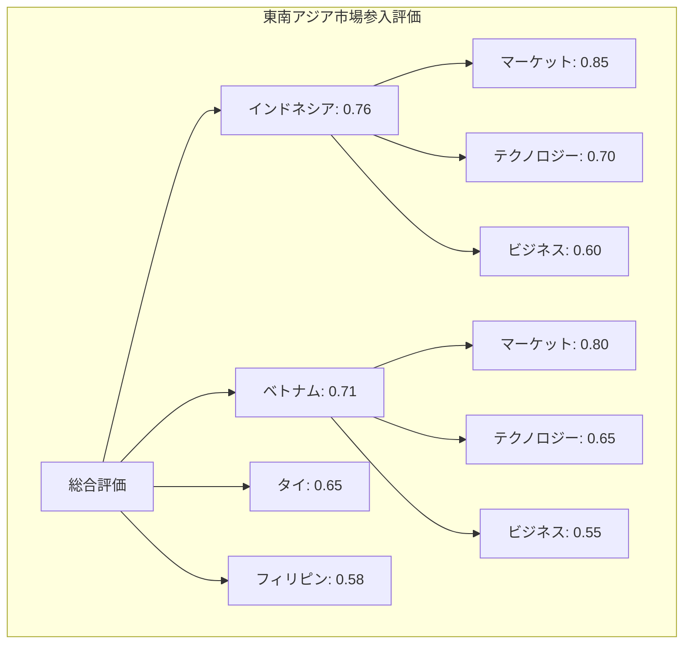
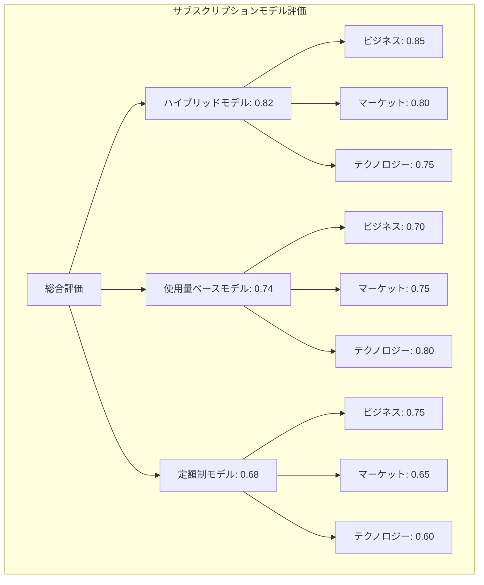

## 5. 実際の運用例とユースケース

**目的：読者が実際の業務シナリオでコンセンサスモデルを活用できるようにする**

理論的な説明だけでは、実際の業務でコンセンサスモデルをどのように活用すればよいのか、具体的なイメージを持つことが難しい場合があります。本セクションでは、様々な業界や意思決定シナリオにおけるコンセンサスモデルの具体的な適用例を紹介します。特に、技術トレンド評価、市場参入判断、ビジネスモデル変革といった実際のビジネスシナリオにおいて、コンセンサスモデルがどのように構成され、どのような価値をもたらすのかを具体的に解説します。これにより、読者は自組織の課題に対してコンセンサスモデルをどのように適用すればよいのか、より明確なイメージを持つことができるようになります。

### 5.1. 技術トレンド評価：量子コンピューティングの例

技術の急速な進化に伴い、どの技術トレンドに注目し、投資すべきかを判断することは、多くの組織にとって重要な課題です。ここでは、量子コンピューティング技術の評価を例に、コンセンサスモデルの適用方法を解説します。

**シナリオ設定**

あるIT企業が、量子コンピューティング技術に対する投資判断を行うために、コンセンサスモデルを活用するケースを考えます。具体的には、「今後5年以内に量子コンピューティングに関する研究開発・人材育成に投資すべきか」という問いに対して、テクノロジー、マーケット、ビジネスの3つの視点から評価を行います。

**各視点からの評価内容**

1. **テクノロジー視点**：
   テクノロジー視点では、量子コンピューティングの技術的成熟度、実用化までの課題、既存技術との互換性などを評価します。具体的には以下のような情報を収集・分析します：
   
   - 量子ビット（キュービット）の安定性と誤り訂正の進展状況
   - 量子アルゴリズムの開発状況と実用的な応用可能性
   - 量子コンピュータのハードウェア実装における技術的障壁
   - 主要研究機関や企業の技術開発ロードマップ
   - 量子コンピューティングと古典的コンピューティングのハイブリッドアプローチの可能性

   これらの情報を分析した結果、テクノロジー視点からは「量子コンピューティングは技術的に急速に進展しているが、汎用的な実用化にはまだ多くの課題がある。ただし、特定の問題領域（暗号解読、材料科学、最適化問題など）では、5年以内に実用的な応用が見込まれる」という評価が得られました。

2. **マーケット視点**：
   マーケット視点では、量子コンピューティングの市場需要、競合状況、顧客の受容性などを評価します。具体的には以下のような情報を収集・分析します：
   
   - 量子コンピューティングサービスの市場規模予測と成長率
   - 主要顧客セグメント（金融、製薬、物流など）の関心度と投資意欲
   - 競合企業の動向と市場ポジショニング
   - 量子コンピューティングに関する特許出願動向
   - クラウドベースの量子コンピューティングサービス（Quantum Computing as a Service）の普及可能性

   これらの情報を分析した結果、マーケット視点からは「量子コンピューティング市場は現時点では小規模だが、年率30%以上で成長しており、特に金融、製薬、物流分野での需要が高まっている。主要テクノロジー企業はすでに量子コンピューティング分野に積極投資しており、市場競争が激化している」という評価が得られました。

3. **ビジネス視点**：
   ビジネス視点では、量子コンピューティングへの投資が自社のビジネスにもたらす影響、収益性、リスクなどを評価します。具体的には以下のような情報を収集・分析します：
   
   - 量子コンピューティング関連サービスの収益モデルと利益率
   - 初期投資額と回収期間の試算
   - 自社の既存事業との相乗効果
   - 投資リスクと失敗した場合の影響
   - 人材獲得・育成コストと市場での人材獲得競争の激しさ

   これらの情報を分析した結果、ビジネス視点からは「量子コンピューティングへの投資は短期的には収益化が難しいが、中長期的には自社の競争力強化に不可欠。特に、既存のクラウドサービスと量子コンピューティングを組み合わせたハイブリッドサービスに事業機会がある。ただし、人材獲得競争の激化により、投資コストは上昇傾向にある」という評価が得られました。

**コンセンサスモデルの適用**

これら3つの視点からの評価を、コンセンサスモデルを用いて統合します。このシナリオでは、トピックの性質（技術駆動型）と変化の段階（初期段階）を考慮して、テクノロジー視点の重みを増加させた動的重み付けを適用します：

- テクノロジー視点：0.40（基本重み0.30から増加）
- マーケット視点：0.35（基本重み0.40から減少）
- ビジネス視点：0.25（基本重み0.30から減少）

各視点の評価結果と重み付けに基づいて計算された総合評価スコアは0.72（高）となり、「量子コンピューティングへの投資は戦略的に重要であり、特に特定の問題領域に焦点を当てた研究開発と人材育成に優先的に投資すべき」という結論が導かれました。

**具体的なアクション推奨**

コンセンサスモデルの評価結果に基づき、以下の具体的なアクションが推奨されました：

1. 量子アルゴリズム研究チームの立ち上げ（特に最適化問題と機械学習に焦点）
2. 主要大学・研究機関との共同研究プログラムの開始
3. クラウドプラットフォーム上での量子コンピューティングサービス（QCaaS）の開発計画策定
4. 金融・製薬業界の顧客向けに、量子コンピューティングの実証実験プログラムを開始
5. 量子コンピューティング人材の採用・育成計画の策定と実施

**評価結果の視覚化**

評価結果は、以下のようなレーダーチャートで視覚化されました：

```mermaid
graph TD
    subgraph "量子コンピューティング投資評価"
        A[総合評価: 0.72 (高)] --> B[テクノロジー視点: 0.75]
        A --> C[マーケット視点: 0.68]
        A --> D[ビジネス視点: 0.65]
        
        B --> B1[技術成熟度: 0.60]
        B --> B2[実用化可能性: 0.70]
        B --> B3[技術的優位性: 0.85]
        
        C --> C1[市場成長性: 0.80]
        C --> C2[競合状況: 0.60]
        C --> C3[顧客需要: 0.65]
        
        D --> D1[収益性: 0.55]
        D --> D2[戦略的適合性: 0.80]
        D --> D3[リスク: 0.60]
    end
```

*図：量子コンピューティング投資評価のコンセンサスモデル結果*

このレーダーチャートにより、量子コンピューティングへの投資判断において、技術的優位性と市場成長性が高く評価される一方、短期的な収益性には課題があることが視覚的に理解できます。

このケーススタディは、技術トレンド評価においてコンセンサスモデルがどのように活用できるかを示しています。特に、技術的な可能性と市場の現実、そしてビジネス上の制約を統合的に考慮することで、より均衡の取れた投資判断が可能になります。

### 5.2. 市場参入判断：東南アジアeコマース市場の例

グローバル展開を検討する企業にとって、新たな市場への参入判断は重要な戦略的決定です。ここでは、ある日本のeコマース企業が東南アジア市場への参入を検討するケースを例に、コンセンサスモデルの適用方法を解説します。

**シナリオ設定**

日本国内で成功を収めているeコマースプラットフォーム企業が、成長戦略の一環として東南アジア市場（特にインドネシア、ベトナム、タイ、フィリピン）への参入を検討しています。「今後2年以内に東南アジア市場に参入すべきか、またどの国から参入すべきか」という問いに対して、コンセンサスモデルを活用して評価を行います。

**各視点からの評価内容**

1. **マーケット視点**：
   マーケット視点では、東南アジアeコマース市場の規模、成長性、競合状況、消費者行動などを評価します。具体的には以下のような情報を収集・分析します：
   
   - 各国のeコマース市場規模と成長率
   - スマートフォン普及率とインターネット利用率
   - 主要競合プラットフォームの市場シェアと強み・弱み
   - 消費者の購買行動と嗜好（モバイル決済の普及度、商品カテゴリ別の需要など）
   - 各国の小売市場におけるeコマースの浸透率と今後の予測

   これらの情報を分析した結果、マーケット視点からは「東南アジアのeコマース市場は年率20%以上で急成長しており、特にインドネシアとベトナムの成長率が高い。ただし、Shopee、Lazada、Tokopediaなどの既存プラットフォームが強固な市場ポジションを確立しており、差別化が課題となる」という評価が得られました。

2. **テクノロジー視点**：
   テクノロジー視点では、東南アジア市場特有の技術的要件、自社の技術的優位性、インフラ整備状況などを評価します。具体的には以下のような情報を収集・分析します：
   
   - 各国の通信インフラとモバイルネットワークの品質
   - 決済システムの普及状況（キャッシュレス決済、銀行口座保有率など）
   - 物流インフラの整備状況と配送効率
   - 自社プラットフォームの多言語・多通貨対応の技術的課題
   - データセンターの地理的配置とパフォーマンス最適化の可能性

   これらの情報を分析した結果、テクノロジー視点からは「東南アジア市場では、モバイルファーストのアプローチが不可欠であり、低速ネットワークでも快適に動作する軽量アプリの開発が必要。また、多様な決済方法（モバイル決済、代金引換など）への対応が技術的課題となる。自社の既存プラットフォームは大幅な改修が必要だが、技術的には実現可能」という評価が得られました。

3. **ビジネス視点**：
   ビジネス視点では、市場参入の収益性、投資回収期間、リスク、規制環境などを評価します。具体的には以下のような情報を収集・分析します：
   
   - 初期投資額と運営コストの試算
   - 収益モデルと利益率の予測
   - 各国の規制環境とコンプライアンス要件
   - 現地パートナーシップの可能性と条件
   - 為替リスクと資金調達コスト

   これらの情報を分析した結果、ビジネス視点からは「東南アジア市場参入には相当の初期投資が必要であり、収益化までに3〜5年を要する見込み。各国の規制環境も複雑で、特に外資規制や決済ライセンスの取得が課題。ただし、現地パートナーとの提携により、リスクと初期投資を抑制できる可能性がある」という評価が得られました。

**コンセンサスモデルの適用**

これら3つの視点からの評価を、コンセンサスモデルを用いて統合します。このシナリオでは、トピックの性質（市場駆動型）と変化の段階（成長段階）を考慮して、マーケット視点の重みを増加させた動的重み付けを適用します：

- マーケット視点：0.50（基本重み0.40から増加）
- テクノロジー視点：0.25（基本重み0.30から減少）
- ビジネス視点：0.25（基本重み0.30から減少）

各視点の評価結果と重み付けに基づいて計算された総合評価スコアは、国別に以下のようになりました：
- インドネシア：0.76（高）
- ベトナム：0.71（中高）
- タイ：0.65（中高）
- フィリピン：0.58（中）

この結果から、「東南アジア市場への参入は戦略的に重要であり、特にインドネシアを最初の参入国として優先すべき。ただし、現地パートナーとの提携モデルを採用し、段階的に展開することが推奨される」という結論が導かれました。

**具体的なアクション推奨**

コンセンサスモデルの評価結果に基づき、以下の具体的なアクションが推奨されました：

1. インドネシアの有力eコマース企業またはマーケットプレイス運営企業との戦略的提携の検討
2. モバイルファーストのアプローチに基づく、東南アジア市場向けプラットフォームの開発
3. インドネシア市場に特化した商品カテゴリと差別化戦略の策定
4. 現地の規制環境に詳しい法務・コンプライアンス専門家の採用
5. 段階的な市場展開計画の策定（インドネシア→ベトナム→タイ→フィリピンの順）

**評価結果の視覚化**

評価結果は、以下のような棒グラフとレーダーチャートの組み合わせで視覚化されました：



*図：東南アジア市場参入評価のコンセンサスモデル結果*

このビジュアライゼーションにより、インドネシアが最も有望な参入市場であること、また各国においてマーケット面での評価が高い一方、ビジネス面（収益性、規制環境など）での課題があることが視覚的に理解できます。

このケーススタディは、市場参入判断においてコンセンサスモデルがどのように活用できるかを示しています。特に、複数の候補市場を客観的な基準で比較評価し、段階的な展開戦略を策定する上で有効です。

### 5.3. ビジネスモデル変革：サブスクリプションモデル導入の例

デジタル化の進展に伴い、多くの企業が従来のビジネスモデルの見直しを迫られています。ここでは、ある製造業企業がサブスクリプションモデルの導入を検討するケースを例に、コンセンサスモデルの適用方法を解説します。

**シナリオ設定**

産業機器メーカーが、従来の機器販売モデル（一時的な売上）から、機器のサブスクリプションモデル（継続的な収益）への移行を検討しています。「主力製品ラインをサブスクリプションモデルに移行すべきか、またどのようなモデル設計が最適か」という問いに対して、コンセンサスモデルを活用して評価を行います。

**各視点からの評価内容**

1. **ビジネス視点**：
   ビジネス視点では、サブスクリプションモデルの収益性、キャッシュフローへの影響、顧客生涯価値などを評価します。具体的には以下のような情報を収集・分析します：
   
   - 短期的な収益減少と長期的な収益安定化のトレードオフ
   - サブスクリプション料金設定と収益モデルのシミュレーション
   - 初期投資と運用コストの試算
   - 顧客生涯価値（LTV）の変化予測
   - 財務諸表への影響と投資家の反応予測

   これらの情報を分析した結果、ビジネス視点からは「サブスクリプションモデルへの移行は短期的には収益減少をもたらすが、3年目以降は安定した収益成長と顧客生涯価値の大幅な向上が見込まれる。ただし、移行期間中のキャッシュフロー管理が課題となる」という評価が得られました。

2. **マーケット視点**：
   マーケット視点では、顧客のサブスクリプションモデルへの受容性、競合状況、市場トレンドなどを評価します。具体的には以下のような情報を収集・分析します：
   
   - 顧客アンケートと市場調査結果
   - 競合他社のビジネスモデル動向
   - 業界全体のサブスクリプション化トレンド
   - 顧客セグメント別の受容性の違い
   - サブスクリプションモデルに対する顧客の懸念事項

   これらの情報を分析した結果、マーケット視点からは「大企業顧客は初期投資抑制とコスト予測可能性の観点からサブスクリプションモデルに前向きだが、中小企業顧客は長期的なコスト増加を懸念している。競合他社も同様のモデル移行を検討しており、先行者利益を得るチャンスがある」という評価が得られました。

3. **テクノロジー視点**：
   テクノロジー視点では、サブスクリプションモデルを支える技術基盤、製品設計の変更、データ活用などを評価します。具体的には以下のような情報を収集・分析します：
   
   - IoTセンサーと遠隔モニタリング技術の実装可能性
   - 課金・契約管理システムの開発要件
   - 製品のモジュール化と定期的なアップデート設計
   - データ収集・分析基盤の構築コストと期間
   - セキュリティとプライバシー保護の技術的課題

   これらの情報を分析した結果、テクノロジー視点からは「主力製品へのIoTセンサー実装と遠隔モニタリングシステムの開発は技術的に実現可能だが、12〜18ヶ月の開発期間が必要。また、従来の製品設計を使用量ベースの課金に適したモジュール設計に変更する必要がある」という評価が得られました。

**コンセンサスモデルの適用**

これら3つの視点からの評価を、コンセンサスモデルを用いて統合します。このシナリオでは、トピックの性質（ビジネス駆動型）と変化の段階（成熟段階への移行）を考慮して、ビジネス視点の重みを増加させた動的重み付けを適用します：

- ビジネス視点：0.40（基本重み0.30から増加）
- マーケット視点：0.35（基本重み0.40から減少）
- テクノロジー視点：0.25（基本重み0.30から減少）

各視点の評価結果と重み付けに基づいて計算された総合評価スコアは、サブスクリプションモデルの3つの候補設計に対して以下のようになりました：

- 使用量ベースモデル：0.74（中高）
- 定額制モデル：0.68（中高）
- ハイブリッドモデル（基本料金＋使用量課金）：0.82（高）

この結果から、「サブスクリプションモデルへの移行は戦略的に重要であり、特にハイブリッドモデル（基本料金＋使用量課金）が最適。ただし、段階的な移行と並行期間の設定が推奨される」という結論が導かれました。

**具体的なアクション推奨**

コンセンサスモデルの評価結果に基づき、以下の具体的なアクションが推奨されました：

1. ハイブリッドサブスクリプションモデル（基本料金＋使用量課金）の詳細設計
2. IoTセンサーと遠隔モニタリングシステムの開発プロジェクト立ち上げ
3. 主要顧客向けのパイロットプログラムの実施（6ヶ月間）
4. 営業・サポート部門の再編成と教育プログラムの実施
5. 2年間の移行期間を設定し、従来モデルとサブスクリプションモデルを並行提供

**評価結果の視覚化**

評価結果は、以下のような比較チャートで視覚化されました：



*図：サブスクリプションモデル評価のコンセンサスモデル結果*

このビジュアライゼーションにより、ハイブリッドモデルが3つの視点すべてでバランスの取れた高評価を得ていることが視覚的に理解できます。

このケーススタディは、ビジネスモデル変革においてコンセンサスモデルがどのように活用できるかを示しています。特に、複数の候補モデルを多角的に評価し、最適な移行戦略を策定する上で有効です。

### 5.4. 自組織への適用ガイド

前述のケーススタディを参考に、読者が自組織の課題にコンセンサスモデルを適用するための具体的なステップを解説します。

**適用プロセスの概要**

コンセンサスモデルを自組織に適用するプロセスは、以下の7つのステップで構成されます：

1. **評価対象の明確化**：
   何を評価するのか（技術トレンド、市場参入、ビジネスモデルなど）、具体的な問いを明確に定義します。例：「当社は今後2年以内にAI技術に投資すべきか？」「新製品Xを海外市場に展開すべきか？」

2. **評価チームの編成**：
   テクノロジー、マーケット、ビジネスの3つの視点をカバーする専門知識を持つメンバーでチームを編成します。各視点に少なくとも1名、理想的には2〜3名の専門家を配置します。

3. **情報収集計画の策定**：
   各視点で必要な情報と、その収集方法を計画します。内部データ、市場調査、専門家インタビュー、競合分析など、多様な情報源を活用します。

4. **評価基準とパラメータの設定**：
   組織の特性や評価対象に合わせて、評価基準（重要度、確信度、整合性の要素）と重み付けパラメータを設定します。必要に応じて、標準的なパラメータをカスタマイズします。

5. **評価の実施**：
   収集した情報に基づき、各視点からの評価を実施します。評価プロセスの透明性と客観性を確保するため、評価根拠を明確に記録します。

6. **コンセンサスモデルの適用**：
   3つの視点からの評価結果を、設定した重み付けに基づいて統合し、総合評価を導出します。必要に応じて、感度分析（パラメータを変化させた場合の結果の変化）も実施します。

7. **結果の解釈とアクション計画の策定**：
   評価結果を解釈し、具体的なアクション計画を策定します。評価結果の視覚化と共有を通じて、組織内での合意形成を促進します。

**組織特性に応じたカスタマイズポイント**

コンセンサスモデルは、組織の特性や課題に応じてカスタマイズすることで、より効果的に活用できます。主なカスタマイズポイントは以下の通りです：

1. **視点の重み付け**：
   組織の戦略的優先事項や業界特性に応じて、3つの視点の基本重みを調整します。例えば、研究開発型組織ではテクノロジー視点の重みを高く、消費財企業ではマーケット視点の重みを高く設定することが考えられます。

2. **評価要素の選定**：
   重要度、確信度、整合性の各評価要素について、組織に最も関連性の高い要素を選定または追加します。例えば、規制の厳しい業界では「規制適合性」という要素を追加することが考えられます。

3. **閾値の調整**：
   組織のリスク許容度や意思決定の重要性に応じて、評価結果の解釈に用いる閾値を調整します。リスク回避的な組織では、より厳格な閾値（例：「高」を0.85以上に設定）を採用することが考えられます。

4. **評価プロセスの統合**：
   コンセンサスモデルを既存の意思決定プロセスや会議体にどのように統合するかを検討します。例えば、経営会議の前に評価結果を準備し、議論の基礎資料として活用するなどの方法があります。

**導入時の注意点と成功要因**

コンセンサスモデルを効果的に導入するための注意点と成功要因は以下の通りです：

1. **段階的導入**：
   いきなり重要な意思決定にコンセンサスモデルを適用するのではなく、比較的小規模な決定から始めて、経験を積みながら徐々に適用範囲を拡大することが推奨されます。

2. **経営層の支持**：
   コンセンサスモデルの導入には、経営層の理解と支持が不可欠です。モデルの価値と期待される効果を明確に説明し、経営層の積極的な関与を促します。

3. **透明性の確保**：
   評価プロセスと結果の透明性を確保することで、モデルへの信頼性を高めます。「ブラックボックス」化を避け、評価根拠を明確に記録・共有します。

4. **継続的な改善**：
   初期のモデル設計は完璧である必要はありません。実際の使用経験に基づいて、パラメータや評価プロセスを継続的に改善していくことが重要です。

5. **文化的側面への配慮**：
   コンセンサスモデルの導入は、単なるツールの導入ではなく、データと多角的視点に基づく意思決定文化への変革でもあります。組織文化の側面にも配慮し、必要に応じて変革管理アプローチを採用します。

これらのガイドラインを参考に、読者は自組織の特性と課題に合わせてコンセンサスモデルをカスタマイズし、効果的に活用することができます。コンセンサスモデルは、複雑な意思決定を支援する強力なツールですが、最終的な判断は人間が行うものであり、モデルはその判断を支援するものであることを忘れないことが重要です。
