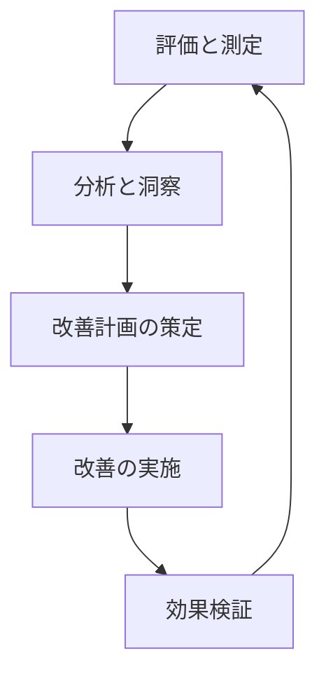

## 6. 評価と最適化

**目的：読者がコンセンサスモデルの評価方法と継続的な最適化プロセスを理解できるようにする**

コンセンサスモデルを実装した後は、その有効性を評価し、継続的に最適化していくことが重要です。本セクションでは、コンセンサスモデルの評価指標、パフォーマンス測定方法、そして実際のフィードバックに基づいた最適化プロセスについて解説します。これにより、読者は自組織のコンセンサスモデルを継続的に改善し、より精度の高い意思決定支援を実現するための具体的な方法を理解することができます。

### 6.1. 評価指標と測定方法

コンセンサスモデルの有効性を客観的に評価するためには、適切な評価指標と測定方法が不可欠です。ここでは、コンセンサスモデルの評価に使用できる主要な指標と、それらを測定するための具体的な方法について解説します。

**定量的評価指標**

1. **予測精度**：
   コンセンサスモデルの主要な目的の一つは、将来の展開を予測することです。予測精度は、モデルの予測がどれだけ実際の結果と一致したかを測定します。

   測定方法：
   - 過去の予測と実際の結果を比較し、誤差率を計算します。
   - 例えば、「技術Xは1年以内に市場シェア10%を獲得する」という予測に対して、実際の市場シェアが8%だった場合、誤差率は20%となります。
   - 複数の予測の平均誤差率を計算し、時間経過に伴う誤差率の変化をトラッキングします。

2. **一貫性スコア**：
   コンセンサスモデルの評価結果が、時間や評価者によって大きく変動しないことも重要な指標です。一貫性スコアは、同じ条件下での評価結果の安定性を測定します。

   測定方法：
   - 同じトピックに対して、異なる評価者が独立して評価を行い、結果の分散を計算します。
   - 同じトピックに対して、時間を置いて再評価を行い、結果の変動を測定します。
   - 標準偏差や変動係数を用いて、評価結果の安定性を数値化します。

3. **意思決定影響度**：
   最終的に、コンセンサスモデルは意思決定に影響を与えることが目的です。意思決定影響度は、モデルの評価結果が実際の意思決定にどれだけ影響を与えたかを測定します。

   測定方法：
   - 意思決定者へのアンケートやインタビューを通じて、モデルの評価結果が意思決定にどの程度影響したかを5段階評価などで定量化します。
   - モデルの推奨と実際の意思決定の一致率を計算します。
   - モデルを使用した意思決定と使用しなかった意思決定の結果を比較分析します。

4. **処理効率**：
   コンセンサスモデルの実用性を評価する上で、処理効率も重要な指標です。評価プロセスにかかる時間やリソースを測定します。

   測定方法：
   - 評価完了までの平均所要時間を測定します。
   - 評価に関わる人員のワークロード（人時）を記録します。
   - システムリソース（CPU使用率、メモリ使用量など）を監視し、最適化の余地を特定します。

**定性的評価指標**

1. **ユーザー満足度**：
   コンセンサスモデルのユーザー（評価者や意思決定者）が、モデルの使いやすさや有用性にどれだけ満足しているかを評価します。

   測定方法：
   - 定期的なユーザーアンケートやフィードバックセッションを実施します。
   - システムユーザビリティスケール（SUS）などの標準的な満足度測定ツールを活用します。
   - ユーザーからの自発的なフィードバックや改善提案を収集・分析します。

2. **説明可能性**：
   コンセンサスモデルの評価結果が、ユーザーにとって理解しやすく説明可能であることも重要です。「ブラックボックス」ではなく、透明性の高いモデルであることが求められます。

   測定方法：
   - 評価結果の根拠を説明するよう求められた際に、ユーザーが適切に説明できるかをテストします。
   - 評価結果に対する「なぜ」という質問への回答の質と速さを評価します。
   - モデルの内部ロジックや重み付けが、非技術者にも理解できる形で文書化されているかを確認します。

3. **適応性**：
   コンセンサスモデルが、新しい状況や要件の変化に適応できる柔軟性を持っているかを評価します。

   測定方法：
   - 新しいタイプのトピックや問題に対してモデルを適用し、その有効性を評価します。
   - パラメータ調整の容易さと、調整後の効果を測定します。
   - 予期せぬ状況（例：市場の急変、技術の破壊的革新など）に対するモデルの対応能力を評価します。

**評価データの収集と分析プロセス**

コンセンサスモデルの評価データを効果的に収集・分析するためのプロセスは以下の通りです：

1. **ベースライン確立**：
   モデル導入初期に、上記の各指標についてベースライン測定を行います。これにより、将来の改善を測定するための基準点が確立されます。

2. **定期的な測定サイクル**：
   四半期ごとなど、定期的な測定サイクルを確立し、各指標の推移を追跡します。これにより、モデルの性能変化や改善の効果を時系列で分析できます。

3. **多角的データ収集**：
   定量データ（システムログ、評価結果履歴など）と定性データ（ユーザーフィードバック、インタビューなど）を組み合わせて収集します。これにより、数値だけでは捉えきれない側面も評価できます。

4. **比較分析**：
   - 時系列比較：同じモデルの性能を時間経過に伴って比較
   - 設定比較：異なるパラメータ設定間の性能比較
   - ケース比較：異なるタイプの意思決定問題間での性能比較

5. **可視化とレポーティング**：
   収集したデータを視覚的に分かりやすく表現し、定期的なレポートとして関係者に共有します。ダッシュボード形式で主要指標の推移を一目で把握できるようにすることが効果的です。

**評価結果の解釈と活用**

収集・分析した評価データは、以下のように解釈・活用します：

1. **強みと弱みの特定**：
   モデルが特に高いパフォーマンスを示している領域と、改善が必要な領域を特定します。例えば、技術評価では高い精度を示すが、市場評価では精度が低いといった傾向が見られる場合があります。

2. **パターンと傾向の分析**：
   評価データの時系列分析から、モデルの性能に影響を与えるパターンや傾向を特定します。例えば、特定のタイプの問題や、特定の市場条件下でモデルの精度が低下するといったパターンが見られる場合があります。

3. **改善優先順位の決定**：
   特定された弱みや課題に基づいて、改善活動の優先順位を決定します。影響度の大きい課題や、比較的少ない労力で改善できる課題を優先することが効果的です。

4. **成功事例の共有**：
   モデルが特に効果的だった意思決定ケースを成功事例として文書化し、組織内で共有します。これにより、モデルの価値を示すとともに、効果的な活用方法の理解を促進します。

評価は一度きりのものではなく、継続的なプロセスとして位置づけることが重要です。次のセクションでは、評価結果に基づいてコンセンサスモデルを最適化するための具体的な方法について解説します。

### 6.2. パフォーマンス最適化の方法

評価プロセスで特定された課題や改善点に基づいて、コンセンサスモデルのパフォーマンスを最適化するための具体的な方法について解説します。最適化は、モデルの精度向上だけでなく、使いやすさや処理効率の改善も含む包括的なプロセスです。

**パラメータ調整による最適化**

1. **重み付けパラメータの最適化**：
   3つの視点（テクノロジー、マーケット、ビジネス）の重み付けは、モデルの精度に大きな影響を与えます。以下のアプローチで最適化を図ります：

   - **履歴データ分析**：過去の成功した意思決定ケースを分析し、最適な重み付けパターンを特定します。例えば、技術駆動型の意思決定では、テクノロジー視点の重みを増やすことが効果的だったかを検証します。
   
   - **感度分析**：重み付けパラメータを少しずつ変化させ、評価結果への影響を測定します。これにより、パラメータの最適範囲を特定できます。
   
   - **A/Bテスト**：異なる重み付け設定を並行して運用し、どちらがより精度の高い結果をもたらすかを比較します。

   実装例：
   ```javascript
   // 重み付けパラメータの最適化関数
   function optimizeWeightingParameters(historicalData) {
     const weightCombinations = generateWeightCombinations();
     let bestWeights = null;
     let bestAccuracy = 0;
     
     for (const weights of weightCombinations) {
       const accuracy = evaluateAccuracy(weights, historicalData);
       if (accuracy > bestAccuracy) {
         bestAccuracy = accuracy;
         bestWeights = weights;
       }
     }
     
     return {
       optimizedWeights: bestWeights,
       expectedAccuracy: bestAccuracy,
       improvementPercentage: calculateImprovement(bestWeights)
     };
   }
   ```

2. **閾値の最適化**：
   評価結果の解釈に使用する閾値（例：「高」「中」「低」の境界値）も、最適化の対象となります。

   - **ROC曲線分析**：異なる閾値設定における真陽性率と偽陽性率をプロットし、最適な閾値を特定します。
   
   - **コスト関数の導入**：誤った判断のコスト（例：機会損失、リスク実現など）を考慮した閾値設定を行います。例えば、リスクの高い意思決定では、より保守的な閾値設定が適切な場合があります。

   実装例：
   ```javascript
   // 閾値最適化関数
   function optimizeThresholds(historicalData, costFunction) {
     const thresholdRange = generateThresholdRange();
     let bestThresholds = null;
     let lowestCost = Infinity;
     
     for (const thresholds of thresholdRange) {
       const cost = evaluateCost(thresholds, historicalData, costFunction);
       if (cost < lowestCost) {
         lowestCost = cost;
         bestThresholds = thresholds;
       }
     }
     
     return {
       optimizedThresholds: bestThresholds,
       expectedCost: lowestCost
     };
   }
   ```

3. **評価要素の重み付け調整**：
   各視点内の評価要素（重要度、確信度、整合性）の重み付けも最適化の対象です。

   - **相関分析**：各評価要素と最終的な意思決定の成功度の相関を分析し、より相関の高い要素の重みを増やします。
   
   - **機械学習アプローチ**：十分なデータがある場合は、機械学習アルゴリズム（例：勾配ブースティング）を用いて最適な重み付けを自動的に学習させることも可能です。

**プロセス最適化**

1. **評価ワークフローの効率化**：
   評価プロセス自体の効率を高めることで、より迅速かつ頻繁な評価が可能になります。

   - **並列処理の導入**：複数の視点からの評価を並行して行うワークフローを設計します。
   
   - **自動化の拡大**：データ収集、前処理、基本的な分析などのステップを自動化します。
   
   - **テンプレートとチェックリストの活用**：評価の一貫性と完全性を確保するためのテンプレートやチェックリストを整備します。

   n8nワークフロー最適化例：
   ```mermaid
   graph TD
     A[トリガー: 評価リクエスト] --> B{並列処理}
     B --> C[テクノロジー視点評価]
     B --> D[マーケット視点評価]
     B --> E[ビジネス視点評価]
     C --> F[結果統合]
     D --> F
     E --> F
     F --> G[コンセンサス計算]
     G --> H[結果保存・通知]
   ```

2. **データ収集の最適化**：
   評価の基となるデータ収集プロセスを最適化することで、より質の高い評価が可能になります。

   - **情報源の多様化**：複数の情報源からデータを収集し、バイアスを軽減します。
   
   - **自動データ収集の拡充**：APIやウェブスクレイピングを活用して、データ収集を自動化します。
   
   - **データ品質チェックの導入**：収集したデータの品質（完全性、正確性、最新性など）を自動的にチェックするプロセスを導入します。

3. **フィードバックループの強化**：
   評価結果と実際の意思決定結果のフィードバックループを強化することで、継続的な改善が可能になります。

   - **結果追跡システムの構築**：評価に基づく意思決定の結果を体系的に追跡するシステムを構築します。
   
   - **定期的な振り返りセッション**：評価チームと意思決定者が定期的に集まり、モデルの有効性と改善点を議論するセッションを設けます。
   
   - **学習データベースの構築**：過去の評価と実際の結果のデータベースを構築し、モデル改善の基礎資料とします。

**技術的最適化**

1. **アルゴリズムの改良**：
   コンセンサスモデルの核となるアルゴリズムを改良することで、精度と効率を向上させます。

   - **計算効率の向上**：計算ステップの最適化や、不要な再計算の排除などにより、処理速度を向上させます。
   
   - **非線形関係の考慮**：評価要素間の非線形的な関係を考慮したアルゴリズムに発展させることで、より複雑な状況にも対応できるようにします。
   
   - **異常値処理の改善**：極端な評価値や矛盾する評価に対する堅牢性を高めます。

   アルゴリズム改良例：
   ```javascript
   // 改良版コンセンサス計算アルゴリズム
   function calculateEnhancedConsensus(perspectives, weights) {
     // 異常値検出と処理
     const normalizedPerspectives = detectAndHandleOutliers(perspectives);
     
     // 非線形関係を考慮した統合
     const nonlinearIntegration = applyNonlinearIntegration(normalizedPerspectives, weights);
     
     // 整合性チェックと調整
     const consistencyAdjusted = checkAndAdjustConsistency(nonlinearIntegration);
     
     return consistencyAdjusted;
   }
   ```

2. **システム統合の最適化**：
   コンセンサスモデルと他のシステムやツールとの統合を最適化することで、全体的な効率と有用性を高めます。

   - **APIの拡充**：外部システムとのデータ交換を容易にするAPIを拡充します。
   
   - **データパイプラインの最適化**：データの流れをスムーズにし、ボトルネックを解消します。
   
   - **リアルタイム処理の強化**：必要に応じて、リアルタイムでの評価と結果提供を可能にします。

3. **ユーザーインターフェースの最適化**：
   評価者や意思決定者が使用するインターフェースを最適化することで、ユーザー体験と生産性を向上させます。

   - **ユーザビリティテスト**：実際のユーザーを対象としたテストを実施し、インターフェースの問題点を特定します。
   
   - **パーソナライズ機能の追加**：ユーザーの役割や好みに応じてインターフェースをカスタマイズできる機能を追加します。
   
   - **視覚化の改善**：データと結果の視覚化を改善し、直感的な理解を促進します。

**最適化の実施と効果測定のサイクル**

最適化は一度きりの活動ではなく、継続的なサイクルとして実施することが重要です。以下のPDCAサイクルに基づいて最適化を進めることを推奨します：

1. **計画（Plan）**：
   - 評価データに基づいて改善点を特定
   - 最適化の目標と指標を設定
   - 具体的な最適化アクションを計画

2. **実行（Do）**：
   - パラメータ調整、プロセス改善、技術的最適化を実施
   - 変更を段階的に導入し、影響を管理

3. **確認（Check）**：
   - 最適化後の性能を測定
   - 目標達成度を評価
   - 予期せぬ副作用がないか確認

4. **改善（Act）**：
   - 結果に基づいて更なる改善点を特定
   - 成功した最適化を標準化
   - 次のサイクルの計画を開始

このサイクルを3〜6ヶ月ごとに繰り返すことで、コンセンサスモデルを継続的に進化させ、変化する環境や要件に適応させることができます。

最適化の効果を最大化するためには、技術的な側面だけでなく、組織的な側面（スキル開発、プロセス改善、文化的変革など）にも注目することが重要です。次のセクションでは、コンセンサスモデルの継続的な改善と発展のための組織的アプローチについて解説します。

### 6.3. 継続的改善と発展のためのフレームワーク

コンセンサスモデルを一度実装して終わりではなく、継続的に改善・発展させていくためのフレームワークについて解説します。このフレームワークは、技術的な最適化だけでなく、組織的な側面も含めた包括的なアプローチを提供します。

**継続的改善のための組織体制**

1. **コンセンサスモデル運営チーム**：
   コンセンサスモデルの継続的な運営と改善を担当する専任または兼任のチームを設置します。このチームは以下の役割を担います：
   
   - モデルの運用と監視
   - 評価データの収集と分析
   - 改善提案の策定と実施
   - ユーザーサポートとトレーニング
   
   理想的なチーム構成は、テクノロジー、マーケット、ビジネスの各視点に精通したメンバーと、データ分析やシステム開発のスキルを持つメンバーの組み合わせです。

2. **ガバナンス委員会**：
   コンセンサスモデルの戦略的方向性と重要な変更を監督する委員会を設置します。この委員会は以下の役割を担います：
   
   - モデルの戦略的方向性の決定
   - 重要なパラメータ変更の承認
   - モデルの成果と価値の評価
   - 必要なリソースの確保
   
   委員会のメンバーには、各部門の意思決定者や、モデルを活用する主要ステークホルダーを含めることが重要です。

3. **ユーザーコミュニティ**：
   コンセンサスモデルを実際に使用する評価者や意思決定者のコミュニティを形成し、以下の活動を促進します：
   
   - 経験と知見の共有
   - ベストプラクティスの蓄積
   - 改善アイデアの提案
   - 相互サポートとトレーニング
   
   定期的なユーザーミーティングやオンラインフォーラムなどを通じて、コミュニティの活動を支援します。

**知識管理と能力開発**

1. **知識ベースの構築**：
   コンセンサスモデルに関する知識、経験、ベストプラクティスを体系的に蓄積・共有するための知識ベースを構築します。具体的には以下の要素を含みます：
   
   - モデルの理論的背景と設計原理
   - 評価プロセスのガイドラインとチェックリスト
   - 成功事例と失敗事例の分析
   - よくある質問と回答
   - トラブルシューティングガイド
   
   この知識ベースは、新しいユーザーのオンボーディングや、既存ユーザーのスキルアップに活用できます。

2. **トレーニングプログラム**：
   コンセンサスモデルの効果的な活用に必要なスキルを開発するためのトレーニングプログラムを設計・実施します。プログラムには以下のモジュールを含めることを推奨します：
   
   - 基本概念と理論（初級）
   - 評価プロセスと方法論（中級）
   - 高度な分析と結果解釈（上級）
   - モデルのカスタマイズと最適化（専門）
   
   トレーニングは、座学だけでなく、実際のケースを用いたワークショップや、実践的な演習を含めることが効果的です。

3. **メンタリングとコーチング**：
   経験豊富なユーザーが新しいユーザーをサポートするメンタリングプログラムを導入します。これにより、形式的なトレーニングでは伝えきれない暗黙知やノウハウの共有が促進されます。

**イノベーションと進化のプロセス**

1. **実験文化の醸成**：
   コンセンサスモデルの新しいアプローチや機能を安全に試すことができる「実験環境」を整備します。この環境では、以下のような活動を奨励します：
   
   - 新しいパラメータ設定のテスト
   - 代替アルゴリズムの試行
   - 新しい視覚化手法の検証
   - 新たな評価要素の導入実験
   
   実験の結果は体系的に記録・分析し、成功した実験は本番環境への導入を検討します。

2. **外部知見の取り込み**：
   コンセンサスモデルの進化に役立つ外部の知見や技術を積極的に取り込むプロセスを確立します。具体的には以下のアプローチが考えられます：
   
   - 学術研究や業界動向のモニタリング
   - 外部専門家との協働や諮問
   - 関連分野（意思決定科学、データ分析、UXデザインなど）からの知見の応用
   - オープンソースコミュニティとの連携（適用可能な場合）

3. **バージョン管理と進化計画**：
   コンセンサスモデルの進化を計画的に管理するためのバージョン管理と進化計画を策定します。これには以下の要素が含まれます：
   
   - 明確なバージョニングスキーム（例：メジャー.マイナー.パッチ）
   - 各バージョンの機能追加・変更のロードマップ
   - 後方互換性の管理方針
   - 移行・アップグレードのガイドライン

**測定と評価のフレームワーク**

1. **成熟度モデル**：
   組織のコンセンサスモデル活用の成熟度を評価するためのモデルを導入します。典型的な成熟度レベルは以下のようになります：
   
   - レベル1（初期）：基本的な実装、限定的な活用
   - レベル2（発展）：標準的なプロセスの確立、定期的な活用
   - レベル3（定着）：組織的な統合、広範な活用
   - レベル4（最適化）：継続的な改善、データ駆動の最適化
   - レベル5（革新）：戦略的活用、新たな応用領域の開拓
   
   定期的に成熟度評価を行い、次のレベルへの移行に必要なアクションを特定します。

2. **バランススコアカード**：
   コンセンサスモデルの総合的な価値と効果を測定するためのバランススコアカードを導入します。このスコアカードは以下の4つの視点から評価指標を設定します：
   
   - 財務的視点（例：ROI、コスト削減）
   - 顧客視点（例：ユーザー満足度、採用率）
   - 内部プロセス視点（例：評価効率、意思決定速度）
   - 学習と成長視点（例：スキル向上、イノベーション）
   
   四半期または半期ごとにスコアカードを更新し、総合的な進捗を評価します。

3. **ビジネスインパクト分析**：
   コンセンサスモデルが組織のビジネス成果にもたらす具体的なインパクトを分析します。これには以下のような分析が含まれます：
   
   - 意思決定の質の向上による財務的効果
   - リスク回避による損失防止効果
   - 意思決定プロセスの効率化による時間短縮効果
   - 組織的合意形成の促進による間接的効果
   
   可能な限り、これらの効果を定量化し、モデルの投資対効果（ROI）を算出します。

**持続可能性と拡張性の確保**

1. **リソース計画**：
   コンセンサスモデルの継続的な運用と改善に必要なリソース（人員、予算、システム）を計画的に確保します。特に以下の点に注意します：
   
   - 運用コストの予測と予算化
   - 必要なスキルセットの確保と育成
   - システムキャパシティの計画と拡張
   - 外部依存性（ツール、データソースなど）の管理

2. **スケーラビリティ設計**：
   コンセンサスモデルが組織の成長や活用範囲の拡大に対応できるよう、スケーラビリティを考慮した設計を行います。具体的には以下の点に注目します：
   
   - ユーザー数の増加への対応
   - 評価トピック数の増加への対応
   - 複数部門・地域での並行活用への対応
   - データ量の増加に伴うパフォーマンス確保

3. **リスク管理**：
   コンセンサスモデルの継続的な運用と発展に関するリスクを特定し、管理するプロセスを確立します。主なリスクカテゴリには以下があります：
   
   - 技術的リスク（システム障害、セキュリティ問題など）
   - 運用リスク（スキル不足、プロセス不備など）
   - 戦略的リスク（組織変更、優先順位変更など）
   - 外部リスク（規制変更、市場環境変化など）
   
   各リスクに対して、予防策と対応策を策定します。

**継続的改善サイクルの制度化**

継続的改善を組織の文化と制度に組み込むために、以下のサイクルを確立します：



*図：コンセンサスモデル継続的改善サイクル*

このサイクルを四半期または半期ごとに実施し、以下のステップを含めます：

1. **評価と測定**：
   - 定量的・定性的評価指標の測定
   - ユーザーフィードバックの収集
   - システムパフォーマンスデータの収集

2. **分析と洞察**：
   - データの分析と傾向の特定
   - 強みと改善点の特定
   - 根本原因分析

3. **改善計画の策定**：
   - 優先的な改善項目の選定
   - 具体的なアクションプランの策定
   - 必要なリソースの確保

4. **改善の実施**：
   - パラメータ調整や機能追加の実装
   - プロセスやガイドラインの更新
   - ユーザートレーニングの実施

5. **効果検証**：
   - 改善の効果測定
   - 目標達成度の評価
   - 学びと教訓の文書化

このサイクルを繰り返し実施することで、コンセンサスモデルは組織の変化するニーズや環境に適応し、継続的に価値を提供し続けることができます。

コンセンサスモデルの継続的改善と発展は、単なる技術的な取り組みではなく、組織全体の取り組みとして位置づけることが重要です。経営層の支持、ユーザーの積極的な参加、そして改善文化の醸成が、長期的な成功の鍵となります。
