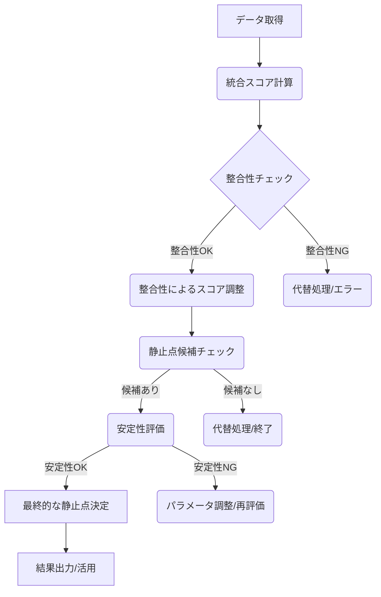

```mermaid
graph TD
    A[データ取得] --> B(統合スコア計算);
    B --> C{整合性チェック};
    C -- 整合性OK --> D(整合性によるスコア調整);
    C -- 整合性NG --> E(代替処理/エラー);
    D --> F(静止点候補チェック);
    F -- 候補あり --> G(安定性評価);
    F -- 候補なし --> H(代替処理/終了);
    G -- 安定性OK --> I[最終的な静止点決定];
    G -- 安定性NG --> J(パラメータ調整/再評価);
    I --> K[結果出力/活用];
```
