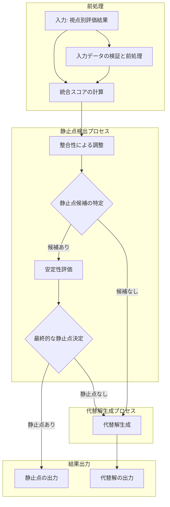

# コンセンサスモデルの実装（パート4：静止点検出と評価方法）

## 静止点検出アルゴリズム

静止点の概念的理解を踏まえ、本セクションではこれを実際に検出するための具体的なアルゴリズムについて解説します。静止点検出アルゴリズムは、3つの視点からの評価データを入力として受け取り、それらを統合・分析することで最適な意思決定ポイントを特定するプロセスです。このアルゴリズムは理論的な堅牢性と実務的な実用性のバランスを取りながら設計されており、n8nワークフローとして実装することで、組織の意思決定プロセスに組み込むことが可能です。

静止点検出の全体プロセスは、データの前処理から始まり、統合スコアの計算、整合性による調整、候補の特定、安定性評価を経て、最終的な静止点の決定に至ります。各ステップは論理的に連続しており、前のステップの出力が次のステップの入力となる構造になっています。以下のフローチャートは、このプロセス全体を視覚的に表現したものです：



このフローチャートは、静止点検出の全体像を示しています。入力データが前処理され、一連の分析ステップを経て、最終的に静止点または代替解が出力されるまでの流れが明確に表現されています。特に注目すべきは、静止点候補が見つからない場合や、候補の安定性が不十分な場合に代替解生成プロセスに移行する分岐点です。これにより、どのような状況でも何らかの意思決定支援情報を提供できる堅牢なシステムとなっています。

それでは、このフローチャートの各ステップについて詳細に解説していきましょう。

### 1. 統合スコアの計算

静止点検出の最初のステップは、3つの視点からの評価結果と重みを使用して統合スコアを計算することです。この統合スコアは、各視点の評価結果にその視点の重要度（重み）を掛け合わせ、それらを合計することで算出されます。

統合スコアの計算式は以下の通りです：

```
統合スコア = (テクノロジー視点のスコア × テクノロジー視点の重み)
           + (マーケット視点のスコア × マーケット視点の重み)
           + (ビジネス視点のスコア × ビジネス視点の重み)
```

この計算方法は、単純な平均ではなく、各視点の相対的重要度を考慮した加重平均となっています。重みの設定はパート3で説明した重み付け方法に基づいており、評価対象のトピックや組織の戦略的優先順位によって適切に調整されます。

例えば、新興テクノロジーの評価では、テクノロジー視点の重みが0.4、マーケット視点が0.4、ビジネス視点が0.2と設定されるかもしれません。一方、既存製品の改良評価では、マーケット視点の重みが0.5、ビジネス視点が0.3、テクノロジー視点が0.2というように、状況に応じて異なる重み付けが適用されます。

統合スコアの計算は単純ですが、入力となる各視点のスコアと重みの質が結果を大きく左右します。そのため、パート2で説明した視点別評価プロセスと、パート3で説明した重み付け方法の適切な実施が、正確な静止点検出の前提条件となります。

### 2. 整合性による調整

統合スコアを計算した後、次のステップは整合性評価結果に基づいてスコアを調整することです。整合性とは、3つの視点の評価結果がどの程度一致しているかを表す指標です。視点間の評価に大きな乖離がある場合、それは各視点が異なる側面を評価しているか、あるいは評価自体に不確実性が含まれている可能性を示唆します。

整合性による調整は、以下の式で行われます：

```
調整後統合スコア = 統合スコア × (0.7 + 0.3 × 整合性スコア)
```

この調整式では、整合性スコアが最大値（1.0）の場合、統合スコアは変わりません（1.0倍）。これは、3つの視点の評価が完全に一致している理想的な状況を表します。一方、整合性スコアが最小値（0.0）の場合、統合スコアは0.7倍に減少します。これは、視点間の評価に大きな乖離がある場合、その評価結果の信頼性に一定の割引を適用することを意味します。

この調整メカニズムの背後にある理論的根拠は、意思決定理論における「合意の価値」の概念に基づいています。複数の独立した情報源が同じ結論に達する場合、その結論の信頼性は高まるという原則です。逆に、情報源間で大きな不一致がある場合、慎重な判断が求められます。

整合性スコア自体は、パート3で説明した方法で計算されます。具体的には、各視点ペア（テクノロジー-マーケット、マーケット-ビジネス、ビジネス-テクノロジー）の評価の類似度を測定し、それらの平均を取ることで算出されます。

整合性による調整は、特に不確実性の高い状況や、視点間の評価に大きな差異がある複雑なケースで重要な役割を果たします。例えば、新興技術の評価では、テクノロジー視点では高評価でも、マーケット視点では不確実性が高く評価が低い場合があります。このような状況では、整合性スコアが低くなり、統合スコアが適切に調整されることで、過度に楽観的な判断を避けることができます。

### 3. 静止点候補の特定

整合性による調整を行った後、次のステップは静止点候補を特定することです。静止点候補とは、調整後統合スコア、重要度、確信度、整合性の各指標が一定の閾値を超える評価点を指します。これらの閾値は、アプリケーションの要件や期待される精度に応じて調整可能です。

静止点候補の特定は、以下の条件式で表されます：

```
静止点候補 = 調整後統合スコア >= 閾値1
           AND 重要度 >= 閾値2
           AND 確信度 >= 閾値3
           AND 整合性 >= 閾値4
```

この条件式は、単に高いスコアを持つ点を選ぶのではなく、重要度、確信度、整合性という質的な側面も考慮していることが特徴です。これにより、数値的には高評価でも、重要性が低い、確信度が不足している、あるいは視点間の整合性に問題があるケースを除外することができます。

静止点候補の特定プロセスは、段階的なフィルタリングとして理解することができます。まず調整後統合スコアで基本的なフィルタリングを行い、次に重要度、確信度、整合性という質的指標で更に絞り込みを行います。このプロセスを図示すると以下のようになります：

各閾値の設定は、組織の意思決定ポリシーや評価対象の性質によって調整されるべきものです。一般的な設定例としては、調整後統合スコアの閾値（閾値1）は0.7、重要度の閾値（閾値2）は0.6、確信度の閾値（閾値3）は0.7、整合性の閾値（閾値4）は0.65などが挙げられます。

これらの閾値を高く設定すると、より厳格な条件で静止点候補が選ばれるため、検出される候補の数は減少しますが、その質は向上する傾向があります。逆に閾値を低く設定すると、より多くの候補が検出されますが、質にばらつきが生じる可能性があります。閾値の適切な設定は、組織の意思決定における「見逃しコスト」と「誤検出コスト」のバランスを考慮して決定されるべきでしょう。

静止点候補の特定プロセスは、実務的には「有望な意思決定ポイントの一次スクリーニング」と捉えることができます。このステップで特定された候補は、次の安定性評価でさらに詳細に分析されることになります。

### 4. 安定性評価

静止点候補が特定された後、次のステップはその安定性を評価することです。安定性とは、入力パラメータの小さな変化に対する出力の変化の度合いで測定される指標です。安定性の高い静止点は、入力データの小さな変動に対して堅牢であり、一時的なノイズや不確実性に左右されにくいという特性を持ちます。

安定性評価の数学的根拠は、感度分析（Sensitivity Analysis）の手法に基づいています。感度分析とは、モデルの入力パラメータの変化が出力にどの程度影響を与えるかを分析する手法です。静止点検出における安定性評価では、各視点のスコアに小さな変動を加え、それによって統合スコアがどの程度変化するかを測定します。

安定性評価のプロセスは以下の手順で行われます：

1. 基準となる統合スコアを計算します。これは、元の入力パラメータを用いた統合スコアです。
2. 各視点のスコアに小さな変動（例：±5%）を加えます。
3. 変動後の統合スコアを計算します。
4. 基準スコアからの変化率を測定します。
5. 最大変化率に基づいて安定性スコアを算出します。

安定性スコアの計算式は以下の通りです：

```
安定性スコア = 1 - (出力変化の最大値 / 入力変化の最大値)
```

この式では、入力の変化に対する出力の変化の比率が小さいほど、安定性スコアは高くなります。理想的には、入力の変化よりも出力の変化が小さい（つまり、システムが変化を「吸収」する）場合に高い安定性スコアが得られます。

安定性評価の具体的な計算例を見てみましょう。テクノロジー視点スコア = 0.8、マーケット視点スコア = 0.7、ビジネス視点スコア = 0.75、各視点の重みはそれぞれ0.3、0.4、0.3という状況を考えます。

まず、基準統合スコアを計算します：
基準統合スコア = 0.8×0.3 + 0.7×0.4 + 0.75×0.3 = 0.745

次に、各視点のスコアに±5%の変動を加えて、統合スコアの変化を測定します：

1. テクノロジー視点スコアを5%増加（0.8 → 0.84）した場合：
   変動後統合スコア = 0.84×0.3 + 0.7×0.4 + 0.75×0.3 = 0.757
   変化率 = (0.757 - 0.745) / 0.745 = 1.6%

2. マーケット視点スコアを5%減少（0.7 → 0.665）した場合：
   変動後統合スコア = 0.8×0.3 + 0.665×0.4 + 0.75×0.3 = 0.731
   変化率 = (0.745 - 0.731) / 0.745 = 1.9%

3. ビジネス視点スコアを5%増加（0.75 → 0.7875）した場合：
   変動後統合スコア = 0.8×0.3 + 0.7×0.4 + 0.7875×0.3 = 0.75125
   変化率 = (0.75125 - 0.745) / 0.745 = 0.8%

これらの変化率の中で最大のものは1.9%です。したがって、安定性スコアは以下のように計算されます：
安定性スコア = 1 - (1.9% / 5%) = 0.62

この例では、入力の5%の変化に対して最大で1.9%の出力変化があり、安定性スコアは0.62となります。これは中程度の安定性を示しており、入力の変動が出力に一定程度影響するものの、その影響は入力の変動よりも小さいことを意味します。

安定性評価は、特に不確実性の高い環境での意思決定において重要な役割を果たします。高い安定性を持つ静止点は、データの小さな変動や不確実性に対して堅牢であり、長期的な意思決定の基盤として信頼性が高いと言えます。

### 5. 最終的な静止点の決定

安定性評価を行った後、最終ステップは静止点候補の安定性スコアに基づいて、最終的な静止点を決定することです。この決定は、安定性スコアが一定の閾値を超えるかどうかに基づいて行われます。

最終的な静止点の決定は、以下の条件式で表されます：

```
静止点 = 静止点候補 AND 安定性スコア >= 閾値5
```

閾値5は一般的に0.5～0.7の範囲で設定されます。この閾値を超える安定性スコアを持つ静止点候補が、最終的な静止点として採用されます。閾値の設定は、アプリケーションの要件や期待される安定性のレベルによって調整されるべきものです。

例えば、長期的な戦略的意思決定では、高い安定性が求められるため、閾値を0.7程度に設定することが適切かもしれません。一方、より機動的な戦術的意思決定では、0.5程度の閾値でも十分な場合があります。

最終的な静止点が決定されると、それは意思決定の基盤として使用されます。静止点の情報には、統合スコア、各視点の貢献度、安定性スコアなどが含まれ、これらの情報は意思決定者に提供されます。これにより、意思決定者は静止点の特性を理解した上で、適切な判断を下すことができます。

静止点が検出されない場合（静止点候補がない、または候補の安定性が不十分な場合）、システムは代替解を生成します。代替解は、完全な静止点ではないものの、現状で最も有望な意思決定ポイントを表します。代替解の生成方法については、本文書の範囲を超えるため詳細は割愛しますが、基本的には閾値を緩和したり、異なる重み付けを試したりすることで、代替的な意思決定ポイントを探索するプロセスとなります。

静止点検出アルゴリズムの全体を通じて重要なのは、このプロセスが単なる数値計算ではなく、組織の意思決定哲学や戦略的優先順位を反映したものであるという点です。閾値の設定、重みの調整、代替解の生成方法など、アルゴリズムの各要素は組織の特性や意思決定コンテキストに合わせてカスタマイズされるべきものです。

次のセクションでは、ここで説明した静止点検出アルゴリズムをn8nワークフローとして実装する方法について解説します。n8nの柔軟な機能を活用することで、理論的なアルゴリズムを実務で使用可能な自動化システムへと変換する方法を示します。
