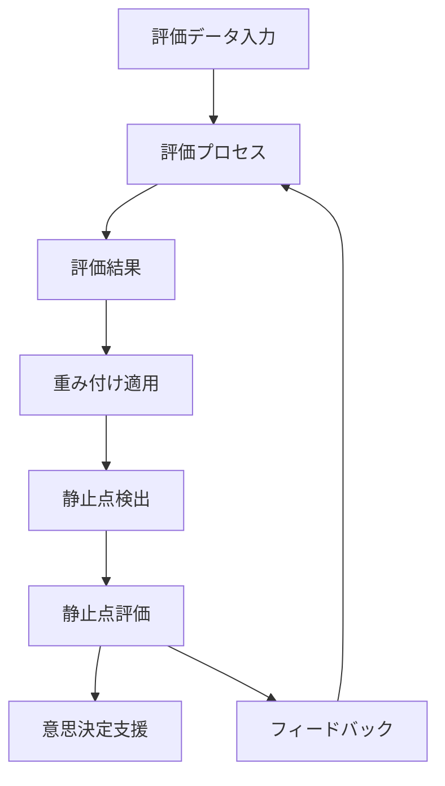

# コンセンサスモデルの実装（パート4：静止点検出と評価方法）

## 1. はじめに

本資料は、多視点型の意思決定支援システムの実装に関する5部構成シリーズの第4部です。このシリーズは、[パート1：基本構造と設計原則](#p1)、[パート2：基本ロジックと評価メカニズム](#p2)、[パート3：コンセンサス基準と重み付け方法](#p3)、そして[パート5：n8nによる全体オーケストレーション](#p5)で構成されています。

[パート1](#p1)で説明した設計原則、[パート2](#p2)で解説した評価メカニズム、そして[パート3](#p3)で詳述したコンセンサス基準と重み付け方法を基盤として、本パートでは静止点検出と評価方法について詳細に説明します。静止点検出は、多視点からの評価結果が収束する最適な意思決定点を特定するための核心的なプロセスです。

## 2. 静止点検出の概念と理論

静止点検出は、異なる視点からの評価結果が収束する点、または各視点の要求を最大限に満たす均衡点を特定するプロセスです。この概念は[パート1の多視点統合の原則](#p1-s4-1)と[整合性確保の原則](#p1-s4-3)に基づいており、[パート3のコンセンサス基準](#p3-s2)を具体的に実現するためのメカニズムです。

### 2.1 静止点の定義

多視点型意思決定支援システムにおける静止点とは、以下の特性を持つ状態を指します：

1. **収束性**：異なる視点からの評価結果が一定の範囲内に収まる
2. **安定性**：小さな入力変化に対して結果が大きく変動しない
3. **整合性**：視点間の矛盾や対立が最小化されている
4. **最適性**：[パート3のコンセンサス基準](#p3-s2-2)に基づく最適条件を満たす

静止点は、単一の点ではなく、許容範囲を持つ領域として捉えることもあります。

### 2.2 静止点の理論的背景

静止点の概念は、以下の理論的背景に基づいています：

1. **ゲーム理論**：ナッシュ均衡など、プレイヤー間の戦略的相互作用における均衡点
2. **システム理論**：動的システムにおける安定状態や吸引子
3. **最適化理論**：多目的最適化における非劣解（パレート最適解）
4. **合意形成理論**：異なる利害関係者間の合意点

これらの理論は、[パート3のコンセンサス基準の種類](#p3-s2-2)で説明した各種基準の基盤となっています。

### 2.3 静止点の特性と分類

静止点は、以下の特性に基づいて分類できます：

1. **強度による分類**：
   - 強静止点：全ての視点が完全に満足する点
   - 弱静止点：一部の視点のみが満足する点

2. **安定性による分類**：
   - 安定静止点：外部からの小さな擾乱に対して元の状態に戻る
   - 不安定静止点：小さな擾乱でも別の状態に移行する

3. **一意性による分類**：
   - 単一静止点：システム内に唯一の静止点が存在
   - 複数静止点：複数の静止点が共存

これらの特性は、静止点の評価と選択において重要な判断基準となります。

## 3. 静止点検出アルゴリズム

静止点検出アルゴリズムは、[パート2の評価結果](#p2-s3-3)と[パート3の重み付け方法](#p3-s3)を入力として、最適な静止点を特定するためのプロセスです。このアルゴリズムは[パート1のデータフローと処理シーケンス](#p1-s5-3)の重要な構成要素であり、[パート5の静止点検出ワークフロー](#p5-s4-3)として実装されます。

### 3.1 統合スコア計算

統合スコアは、各視点からの評価結果を[パート3の重み付け方法](#p3-s3)に基づいて統合した値です。計算式の一般形は以下の通りです：

```
統合スコア = Σ(視点iのスコア × 視点iの重み) / Σ(視点iの重み)
```

この計算は、[パート2の評価結果の計算](#p2-s3-3)で説明した方法を拡張したものです。統合スコアは静止点候補を特定するための基礎となります。

### 3.2 整合性による調整

整合性による調整は、視点間の矛盾や対立を検出し、調整するプロセスです。この調整は[パート3の動的重み付け](#p3-s3-2)と密接に関連しています。

調整プロセスには以下のステップが含まれます：

1. **矛盾検出**：視点間の評価の差異が閾値を超える場合に矛盾と判断
2. **原因分析**：矛盾の原因となる評価要素の特定
3. **調整方法決定**：重み調整、評価基準調整、または追加情報収集
4. **調整実施**：決定した方法による調整の実行
5. **再評価**：調整後の整合性の再確認

整合性調整は反復的に行われ、十分な整合性が得られるまで継続されます。

### 3.3 静止点候補のチェック

統合スコアと整合性調整に基づいて、静止点候補をチェックするプロセスです。このプロセスは[パート3のコンセンサス形成のプロセス](#p3-s2-3)の「収束確認」ステップに対応します。

チェック基準には以下が含まれます：

1. **収束条件**：反復間の変化が閾値以下
2. **整合性条件**：視点間の矛盾が許容範囲内
3. **安定性条件**：入力の小さな変化に対する結果の安定性
4. **最適性条件**：[パート3のコンセンサス基準](#p3-s2-2)に基づく条件

これらの条件を満たす点が静止点候補として特定されます。

### 3.4 複数静止点の処理

複数の静止点候補が特定された場合、以下の方法で処理します：

1. **優先順位付け**：各静止点の強度、安定性、整合性などに基づく順位付け
2. **クラスタリング**：類似の特性を持つ静止点のグループ化
3. **代表点選択**：各クラスタから代表的な静止点の選択
4. **比較分析**：選択された静止点の詳細比較

複数静止点の処理は、[パート1の透明性と説明可能性の原則](#p1-s4-4)に基づき、意思決定者が理解しやすい形で提示されるべきです。

## 4. n8nによる実装方法

n8nは、ノーコードワークフロー自動化ツールであり、静止点検出アルゴリズムの実装に適しています。n8nの基本概念と設定については[パート5のn8nの基本概念と設定](#p5-s2)で詳しく説明し、静止点検出の具体的な実装例は[パート5の静止点検出ワークフロー](#p5-s4-3)で紹介します。また、[パート5のパート1～4で説明された概念や技術のn8n実装対応表](#p5-s3)では、本パートで説明した概念のn8n実装方法を体系的に整理しています。

### 4.1 静止点検出ワークフローの設計

静止点検出ワークフローは、入力データの取得から静止点の特定と評価までの一連のプロセスを自動化します。このワークフローは[パート5の静止点検出ワークフロー](#p5-s4-3)で詳しく説明し、[パート2の評価ワークフロー](#p5-s4-1)および[パート3の重み付け調整ワークフロー](#p5-s4-2)との連携方法も紹介します。

ワークフローの主要コンポーネント：

1. **データ取得ノード**：評価結果と重み付けパラメータの取得
2. **統合計算ノード**：統合スコアの計算
3. **整合性チェックノード**：視点間の整合性の評価
4. **収束検出ノード**：静止点候補の特定
5. **評価ノード**：静止点の評価と選択
6. **出力ノード**：結果の保存と可視化

### 4.2 データモデルと構造

静止点検出に必要なデータモデルと構造は以下の通りです：

1. **評価結果モデル**：[パート2の評価結果](#p2-s3-3)の構造
2. **重み付けモデル**：[パート3の重み付け方法](#p3-s3)のパラメータ
3. **静止点モデル**：
   - 位置（各視点のスコア）
   - 特性（強度、安定性など）
   - メタデータ（検出時間、反復回数など）
4. **履歴モデル**：過去の静止点と検出プロセスの履歴

これらのデータモデルは、[パート5のデータ連携と統合](#p5-s5)で説明するデータ連携の基盤となります。

### 4.3 パフォーマンス最適化

静止点検出アルゴリズムのパフォーマンスを最適化するための方法：

1. **計算の効率化**：不要な再計算の回避、増分計算の活用
2. **並列処理**：独立した計算の並列実行
3. **キャッシング**：頻繁に使用される中間結果のキャッシング
4. **早期終了条件**：収束が見込めない場合の早期終了

これらの最適化手法は、[パート5のパフォーマンス最適化](#p5-s6-2)で詳しく説明します。

## 5. 静止点の評価と活用

静止点を特定した後、その評価と活用が重要です。この評価プロセスは[パート1の透明性と説明可能性の原則](#p1-s4-4)と[継続的改善の原則](#p1-s4-5)に基づいており、[パート2の結果の解釈ガイドライン](#p2-s4-3)を適用します。また、評価結果の視覚化には[パート3のインターフェース設計と視覚化](#p3-s4)の手法を活用します。

### 5.1 静止点の評価基準

静止点を評価するための基準には以下が含まれます：

1. **強度**：各視点の満足度の高さ
2. **安定性**：入力変化に対する堅牢性
3. **整合性**：視点間の矛盾の少なさ
4. **実現可能性**：実際の実装における制約条件との適合性
5. **説明可能性**：結果の解釈のしやすさと説明の容易さ

これらの基準に基づいて、静止点の総合的な評価を行います。

### 5.2 静止点の視覚化

静止点を効果的に視覚化するための手法：

1. **多次元スケーリング**：多次元の評価空間を2次元または3次元に縮約
2. **レーダーチャート**：各視点の評価値を多角形で表示
3. **ヒートマップ**：評価空間における静止点の分布を色で表現
4. **時系列グラフ**：静止点の時間的変化を表示
5. **インタラクティブ可視化**：ユーザーが視点の重みを調整できる対話的な表示

これらの視覚化手法は、[パート3のコンセンサス形成の視覚化](#p3-s4-2)で説明した方法を拡張したものです。

### 5.3 収束パターンの分析

静止点への収束パターンを分析することで、意思決定プロセスの特性を理解できます。主なパターン：

1. **単調収束**：徐々に一つの点に近づく
2. **振動収束**：振動しながら徐々に収束する
3. **多点収束**：複数の点に分かれて収束する
4. **カオス的挙動**：予測不能な動きを示す

収束パターンの分析は、[パート3の重み付け方法](#p3-s3)の選択や調整に役立ちます。

### 5.4 意思決定への活用

静止点を意思決定に活用するためのアプローチ：

1. **直接採用**：静止点をそのまま意思決定として採用
2. **参考情報**：静止点を参考に人間が最終判断
3. **シナリオ分析**：複数の静止点を異なるシナリオとして検討
4. **感度分析**：パラメータ変更による静止点の変化を分析
5. **継続的モニタリング**：時間経過による静止点の変化を追跡

活用方法は、意思決定の性質や組織の意思決定プロセスによって異なります。

## 6. 静止点検出アルゴリズムの改善

静止点検出アルゴリズムは、継続的な改善が必要です。この改善プロセスは[パート1の継続的改善の原則](#p1-s4-5)に基づいており、[パート3の評価と最適化](#p3-s6)とも連携しています。

### 6.1 アルゴリズムの評価指標

アルゴリズムを評価するための指標：

1. **収束速度**：静止点に到達するまでの反復回数
2. **計算効率**：必要な計算リソースと時間
3. **精度**：特定された静止点の質
4. **堅牢性**：ノイズや外れ値に対する耐性
5. **スケーラビリティ**：視点や評価要素の数の増加に対する対応能力

これらの指標を定期的に測定し、改善の方向性を特定します。

### 6.2 改善アプローチ

アルゴリズムを改善するためのアプローチ：

1. **パラメータチューニング**：閾値や重みなどのパラメータ調整
2. **アルゴリズム変更**：より効率的なアルゴリズムへの置き換え
3. **ハイブリッドアプローチ**：複数のアルゴリズムの組み合わせ
4. **機械学習の活用**：過去のデータに基づく最適パラメータの学習
5. **ヒューリスティックの導入**：問題特有の知識を活用した効率化

改善は、実際の使用データと結果に基づいて行うことが重要です。

### 6.3 継続的改善のプロセス

継続的改善のプロセスには、以下のステップが含まれます：

1. **データ収集**：アルゴリズムの性能データの収集
2. **分析**：評価指標の計算と問題点の特定
3. **改善案の設計**：改善アプローチに基づく改善案の設計
4. **テスト**：改善案のテストと評価
5. **実装**：検証された改善案の本番環境への実装

このプロセスを定期的に繰り返すことで、アルゴリズムの継続的な進化を実現します。

## 7. 実践的な適用例

静止点検出の理論的な理解だけでなく、実際のビジネスシナリオへの適用方法を理解することが重要です。ここでは、[パート2の実践的な適用例](#p2-s6)と[パート3の実際の運用例とユースケース](#p3-s5)で紹介したシナリオに対して、静止点検出と評価の適用例を示します。

### 7.1 技術投資判断

技術投資判断における静止点検出と評価の適用例：

1. **評価設定**：[パート2の評価プロセス](#p2-s3)に基づく各視点からの評価
2. **重み付け**：[パート3の重み付け例](#p3-s5-1)に基づく重み設定
3. **静止点検出**：統合スコア計算と収束検出
4. **評価と解釈**：検出された静止点の強度と安定性の評価
5. **意思決定**：静止点に基づく投資判断と優先順位付け

### 7.2 製品開発優先順位付け

製品開発優先順位付けにおける静止点検出と評価の適用例：

1. **評価設定**：各製品案の視点別評価
2. **重み付け**：[パート3の重み付け例](#p3-s5-2)に基づく重み設定
3. **静止点検出**：複数の製品案に対する静止点の特定
4. **比較分析**：静止点の位置と特性に基づく製品案の比較
5. **優先順位決定**：静止点の評価に基づく開発優先順位の決定

### 7.3 パートナー選定

パートナー選定における静止点検出と評価の適用例：

1. **評価設定**：各パートナー候補の視点別評価
2. **重み付け**：[パート3の重み付け例](#p3-s5-3)に基づく重み設定
3. **静止点検出**：各パートナー候補の静止点特定
4. **多次元比較**：静止点の多次元的な比較と視覚化
5. **選定決定**：静止点の評価に基づくパートナーの選定

## 8. パート2の評価メカニズムと静止点評価の統合方法

本セクションでは、パート2で説明した評価メカニズムとパート4の静止点評価の統合方法について詳細に解説します。両者は密接に連携しており、効果的な意思決定支援システムの実装には両方の理解と統合が不可欠です。

### 8.1 評価メカニズムと静止点評価の連携ポイント

評価メカニズムと静止点評価の主要な連携ポイントは以下の通りです：

1. **データフロー連携**：[パート2の評価結果](#p2-s3-3)が静止点検出の入力となり、静止点評価の結果が[パート2の結果の解釈](#p2-s4-3)に活用されます。

2. **評価基準の整合性**：[パート2の評価基準](#p2-s2-3)と静止点の[評価基準](#p4-s5-1)の間で整合性を確保することが重要です。

3. **確信度の活用**：[パート2の不確実性と信頼度](#p2-s4-2)の情報が静止点の[安定性評価](#p4-s5-1)に活用されます。

4. **フィードバックループ**：静止点評価の結果が[パート2の評価プロセス](#p2-s3)の改善にフィードバックされます。

### 8.2 統合アーキテクチャの設計

評価メカニズムと静止点評価を統合するためのアーキテクチャ設計：

#### 8.2.1 データモデルの統合

統合データモデルには以下の要素が含まれます：

1. **共通マスタデータ**：評価対象、視点、評価要素などの基本情報
2. **評価データ**：[パート2の評価結果](#p2-s3-3)の構造
3. **静止点データ**：静止点の位置、特性、メタデータ

これらのデータモデル間の関連付けと整合性管理が重要です。

#### 8.2.2 プロセス統合

統合プロセスは以下のフェーズで構成されます：

1. **評価フェーズ**：[パート2の評価プロセス](#p2-s3)に基づく評価の実施
2. **静止点検出フェーズ**：評価結果に基づく静止点の検出
3. **フィードバックフェーズ**：静止点評価結果の評価プロセスへのフィードバック

これらのフェーズは、[パート5の全体ワークフロー](#p5-s4)として実装されます。



### 8.3 n8nによる統合実装方法

n8nを使用して評価メカニズムと静止点評価を統合する方法：

#### 8.3.1 ワークフロー設計

統合ワークフローには以下のコンポーネントが含まれます：

1. **評価ワークフロー**：[パート2のn8nによる実装方法](#p2-s5)で説明したワークフロー
2. **静止点検出ワークフロー**：本パートで説明したワークフロー
3. **フィードバックワークフロー**：評価と静止点検出の間のフィードバックを処理

これらのワークフローの連携方法は[パート5の全体ワークフローの設計と実装](#p5-s4)で詳しく説明します。

#### 8.3.2 データ連携方法

評価メカニズムと静止点評価の間のデータ連携方法：

1. **データベース連携**：共通データベースを通じたデータ共有
2. **ファイルベース連携**：JSONやCSVファイルを介したデータ交換
3. **APIベース連携**：RESTful APIを通じたデータ交換
4. **イベントベース連携**：イベントトリガーによるワークフロー間連携

これらの連携方法の詳細は[パート5のデータ連携と統合](#p5-s5)で説明します。

### 8.4 実践的な統合シナリオ

評価メカニズムと静止点評価の統合を活用した実践的なシナリオを紹介します：

#### 8.4.1 技術投資判断シナリオ

技術投資判断では、以下のように統合を活用できます：

1. 初期評価段階：[パート2の評価プロセス](#p2-s3)で各技術オプションを評価
2. 重み付け段階：[パート3の重み付け方法](#p3-s3)で視点の重要度を設定
3. 静止点検出段階：本パートの手法で最適な投資ポイントを特定
4. 比較分析段階：複数の技術オプションの静止点を比較
5. 意思決定段階：静止点の評価に基づく投資判断

#### 8.4.2 製品開発方針決定シナリオ

製品開発方針決定では、以下のように統合を活用できます：

1. 要件評価段階：[パート2の評価プロセス](#p2-s3)で製品要件を評価
2. 優先順位付け段階：[パート3の重み付け方法](#p3-s3)で要件の重要度を設定
3. 静止点検出段階：本パートの手法で最適な製品仕様を特定
4. 反復改善段階：静止点評価に基づく製品仕様の反復的改善
5. 最終決定段階：最適な静止点に基づく製品開発方針の決定

### 8.5 業種別の適用ガイド

評価メカニズムと静止点評価の統合の業種別適用ガイド：

#### 8.5.1 製造業

製造業での適用ポイント：
- 製品設計における多視点評価と最適設計点の特定
- サプライチェーン最適化における均衡点の検出
- 品質管理における許容範囲と最適パラメータの特定

#### 8.5.2 金融業

金融業での適用ポイント：
- 投資ポートフォリオ最適化におけるリスク・リターンの均衡点
- 融資審査における多角的評価と判断基準の最適化
- 金融商品設計における顧客ニーズと収益性の均衡点

#### 8.5.3 小売業

小売業での適用ポイント：
- 商品ラインナップ決定における顧客ニーズと収益性の均衡
- 店舗立地選定における多要素評価と最適地点の特定
- 価格戦略における競争力と利益率の最適バランス

## 9. まとめと次のステップ

本資料では、多視点型意思決定支援システムの静止点検出と評価方法について詳細に説明しました。次のステップとして、[パート5：n8nによる全体オーケストレーション](#p5)では、これまでの全てのコンポーネントを統合した実装方法を説明します。

静止点検出と評価は、[パート1：基本構造と設計原則](#p1)で説明した設計原則を実現するための具体的な手段であり、[パート2：基本ロジックと評価メカニズム](#p2)で説明した評価結果と[パート3：コンセンサス基準と重み付け方法](#p3)で説明したコンセンサス基準を効果的に活用するための基盤となります。適切な静止点検出アルゴリズムを選択・実装することで、バランスの取れた堅牢な意思決定を支援することができます。
