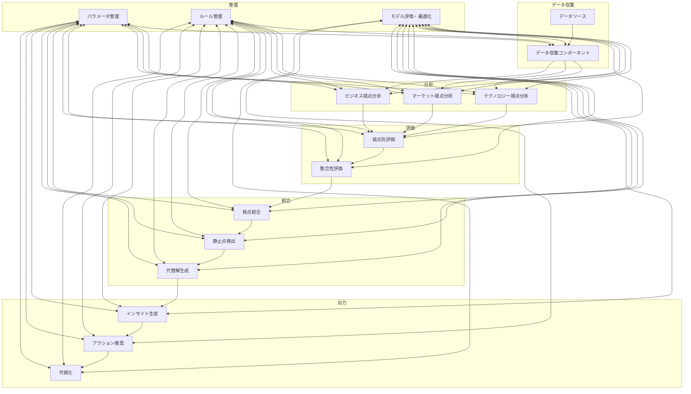

# コンセンサスモデルの実装（パート5）改善項目整理

## 概要

「コンセンサスモデルの実装（パート5：n8nによる全体オーケストレーション）」の校正評価に基づき、以下の7つの改善項目を特定しました。これらの項目を改訂版に反映することで、セクションの実用性と理解しやすさを向上させます。

## 改善項目

### 1. システムアーキテクチャの視覚化

**現状の課題:**
- 全体アーキテクチャの視覚的表現が不足している
- コンポーネント間の連携を理解するための図解がない

**改善内容:**
- コンセンサスモデルの全体アーキテクチャを示すMermaid図を追加
- コンポーネント間のデータフローを視覚化したフローチャートを追加
- 各ワークフローの関係性を示す概要図を追加

**実装方針:**

### 2. ワークフロー説明の強化

**現状の課題:**
- 各ワークフローの目的と処理内容の概要説明が不足している
- 複雑な関数コードの説明が限定的である

**改善内容:**
- 各ワークフローの前に、目的と処理内容の概要説明を追加
- 複雑な関数コードに、処理の流れを説明するコメントを追加
- 各ノードの役割と連携方法の説明を強化

**実装方針:**
- マスターオーケストレーションワークフローの説明を追加
- アクション推奨生成ワークフローの説明を追加
- 結果可視化ワークフローの説明を追加
- 各ワークフローのコード内にセクション別のコメントを追加

### 3. 実際の運用例の追加

**現状の課題:**
- 異なる業界や用途に応じた具体的なユースケースが不足している
- 実際のダッシュボード出力例が示されていない

**改善内容:**
- 製造業、IT業界、金融業界の具体的な運用例を追加
- 各業界のパラメータ設定例を表形式で提示
- ダッシュボードのモックアップ画像を追加

**実装方針:**
- 「3.1 業界別運用例」セクションを新設
- 「3.2 ダッシュボード実装例」セクションを新設
- 各業界の具体的なユースケースを3つずつ記載

### 4. スケーラビリティとパフォーマンスの考慮事項

**現状の課題:**
- 大規模データ処理時のパフォーマンス最適化方法の説明が不足している
- 分散環境での運用方法や考慮事項が説明されていない

**改善内容:**
- 大規模データ処理のためのパフォーマンス最適化手法を追加
- 分散環境での運用方法と考慮事項を説明
- キャッシュ戦略とバッチ処理の実装例を追加

**実装方針:**
- 「4.1 大規模データ処理の最適化」セクションを新設
- 「4.2 分散環境での運用」セクションを新設
- パフォーマンスモニタリングとチューニングの方法を説明

### 5. エラーハンドリングとリカバリーの強化

**現状の課題:**
- エラーハンドリング戦略の詳細が不足している
- 障害発生時のリカバリー方法が具体的に説明されていない

**改善内容:**
- より詳細なエラーハンドリング戦略を追加
- 障害発生時のリカバリー方法を具体的に説明
- エラーログ記録と監視の仕組みを追加

**実装方針:**
- 「5.1 エラーハンドリング戦略」セクションを新設
- 「5.2 障害リカバリー」セクションを新設
- エラー発生時のフォールバック処理の実装例を追加

### 6. インターフェース設計と視覚化の追加

**現状の課題:**
- ダッシュボードのデザインと構成に関する説明が不足している
- ユーザーインターフェースの設計原則と実装例が示されていない

**改善内容:**
- ダッシュボードのデザインと構成に関する説明を追加
- ユーザーインターフェースの設計原則と実装例を追加
- 多層的ダッシュボードの設計概念を説明

**実装方針:**
- 「6.1 ダッシュボード設計」セクションを新設
- 「6.2 ユーザーインターフェース実装」セクションを新設
- ダッシュボードのモックアップ画像と説明を追加

### 7. セキュリティ考慮事項の追加

**現状の課題:**
- データセキュリティとアクセス制御に関する説明が不足している
- セキュアな運用のためのベストプラクティスが示されていない

**改善内容:**
- データセキュリティとアクセス制御に関する説明を追加
- セキュアな運用のためのベストプラクティスを追加
- セキュリティ監査とコンプライアンスの考慮事項を説明

**実装方針:**
- 「7.1 データセキュリティ」セクションを新設
- 「7.2 アクセス制御」セクションを新設
- 「7.3 セキュリティ監査とコンプライアンス」セクションを新設

## 優先順位

改善項目の優先順位は以下の通りです：

1. システムアーキテクチャの視覚化（最重要）
2. ワークフロー説明の強化
3. インターフェース設計と視覚化の追加
4. 実際の運用例の追加
5. エラーハンドリングとリカバリーの強化
6. スケーラビリティとパフォーマンスの考慮事項
7. セキュリティ考慮事項の追加

## 次のステップ

これらの改善項目を反映した「コンセンサスモデルの実装（パート5：n8nによる全体オーケストレーション）」の改訂版を作成します。特に、システムアーキテクチャの視覚化とワークフロー説明の強化を優先的に実施します。
