# コンセンサスモデルの実装(仮：20250604統合版)

## 1. コンセンサスモデルの概要と目的

トリプルパースペクティブ型戦略AIレーダーの中核をなすコンセンサスモデルは、テクノロジー、マーケット、ビジネスという3つの異なる視点から得られた分析結果を統合し、多角的かつ信頼性の高い解釈と戦略的な意思決定を支援するためのエンジンです。単一の視点では見落としがちな機会やリスクを捉え、複雑な状況下でも最適な判断を導き出すことを目指します。

本セクション（パート1）では、コンセンサスモデルの基本的な構造と、その設計において重視すべき原則、そしてn8nを用いた初期設定の実装について解説します。

### 1.1. コンセンサスモデルの主要な目的

コンセンサスモデルは、以下の主要な目的を達成するために設計されます：

1.  **複数視点からの情報統合**: テクノロジー（実現可能性）、マーケット（受容性・需要）、ビジネス（実効性・収益性）の各視点から得られる多様な情報を構造化し、統合的な理解を形成します。
2.  **変化点の重要度評価**: 検出された市場や技術の変化、ビジネス上のイベントなどの重要度を、影響範囲、変化の大きさ、戦略的関連性、時間的緊急性といった多角的な基準で評価します。
3.  **静止点（最適解）の検出**: 3つの視点の評価を総合し、現在の状況における最も有効な解釈や戦略的なポジション（静止点）を特定します。これには、判断の確信度評価や代替解の提示も含まれます。
4.  **アクション推奨の生成**: 検出された静止点や重要な変化に基づき、具体的な戦略的アクションを推奨します。アクションの優先順位付けや実行タイミングの提案も行います。

## 2. コンセンサスモデルの基本構造とアーキテクチャ

コンセンサスモデルは、入力、評価、統合、出力の4つの主要なレイヤーで構成されます。以下にその基本構造と、全体アーキテクチャの概念図を示します。

### 2.1. 基本構造（テキスト表現）

```
コンセンサスモデル
├── 入力レイヤ (Input Layer)
│   ├── テクノロジー視点入力プロセッサ (Technology Input Processor)
│   ├── マーケット視点入力プロセッサ (Market Input Processor)
│   └── ビジネス視点入力プロセッサ (Business Input Processor)
├── 評価レイヤ (Evaluation Layer)
│   ├── 重要度評価エンジン (Importance Evaluation Engine)
│   ├── 確信度評価エンジン (Confidence Evaluation Engine)
│   └── 整合性評価エンジン (Coherence Evaluation Engine)
├── 統合レイヤ (Integration Layer)
│   ├── 視点統合エンジン (Perspective Integration Engine)
│   ├── 静止点検出エンジン (Equilibrium Detection Engine)
│   └── 代替解生成エンジン (Alternative Solution Generation Engine)
└── 出力レイヤ (Output Layer)
    ├── インサイト生成エンジン (Insight Generation Engine)
    ├── アクション推奨エンジン (Action Recommendation Engine)
    └── 可視化エンジン (Visualization Engine)
```

### 2.2. 全体アーキテクチャ図 (Mermaid)

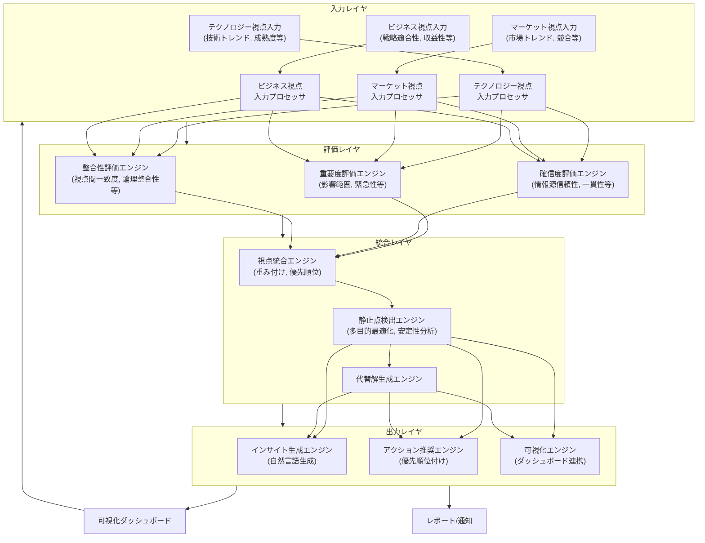
```mermaid
graph TD
    subgraph InputLayer["入力レイヤ"]
        direction LR
        TechInput["テクノロジー視点入力<br/>(技術トレンド, 成熟度等)"] --> TechProcessor["テクノロジー視点<br/>入力プロセッサ"]
        MarketInput["マーケット視点入力<br/>(市場トレンド, 競合等)"] --> MarketProcessor["マーケット視点<br/>入力プロセッサ"]
        BusinessInput["ビジネス視点入力<br/>(戦略適合性, 収益性等)"] --> BusinessProcessor["ビジネス視点<br/>入力プロセッサ"]
    end

    subgraph EvaluationLayer["評価レイヤ"]
        direction LR
        ImportanceEngine["重要度評価エンジン<br/>(影響範囲, 緊急性等)"]
        ConfidenceEngine["確信度評価エンジン<br/>(情報源信頼性, 一貫性等)"]
        CoherenceEngine["整合性評価エンジン<br/>(視点間一致度, 論理整合性等)"]
    end

    subgraph IntegrationLayer["統合レイヤ"]
        direction LR
        IntegrationEngine["視点統合エンジン<br/>(重み付け, 優先順位)"]
        EquilibriumEngine["静止点検出エンジン<br/>(多目的最適化, 安定性分析)"]
        AlternativeEngine["代替解生成エンジン"]
    end

    subgraph OutputLayer["出力レイヤ"]
        direction LR
        InsightEngine["インサイト生成エンジン<br/>(自然言語生成)"]
        ActionEngine["アクション推奨エンジン<br/>(優先順位付け)"]
        VizEngine["可視化エンジン<br/>(ダッシュボード連携)"]
    end

    %% レイヤー間の接続
    InputLayer --> EvaluationLayer
    EvaluationLayer --> IntegrationLayer
    IntegrationLayer --> OutputLayer

    %% 評価レイヤ内部接続 (概念)
    TechProcessor --> ImportanceEngine & ConfidenceEngine & CoherenceEngine
    MarketProcessor --> ImportanceEngine & ConfidenceEngine & CoherenceEngine
    BusinessProcessor --> ImportanceEngine & ConfidenceEngine & CoherenceEngine

    %% 統合レイヤ内部接続 (概念)
    ImportanceEngine & ConfidenceEngine & CoherenceEngine --> IntegrationEngine
    IntegrationEngine --> EquilibriumEngine
    EquilibriumEngine --> AlternativeEngine

    %% 出力レイヤ内部接続 (概念)
    EquilibriumEngine & AlternativeEngine --> InsightEngine & ActionEngine & VizEngine

    %% 外部連携
    OutputLayer --> Dashboard["可視化ダッシュボード"]
    OutputLayer --> Report["レポート/通知"]

    %% フィードバックループ
    Dashboard --> InputLayer
```
*図1: コンセンサスモデルの全体アーキテクチャ概念図*

### 2.3. 各レイヤーの詳細

#### 2.3.1. 入力レイヤ (Input Layer)

3つの視点からの分析結果（構造化データ、非構造化データ、スコア、トレンド情報など）を受け取り、後続の評価・統合プロセスで利用可能な統一された形式（例：特徴ベクトル、評価スコア付きオブジェクト）に変換・正規化します。

-   **テクノロジー視点入力プロセッサ**: 技術トレンド分析、特許分析、研究論文分析などの結果を入力。技術の成熟度（例：Gartner Hype Cycle）、採用率、将来のインパクトスコアなどを抽出・正規化。
-   **マーケット視点入力プロセッサ**: 市場調査レポート、競合情報、顧客レビュー、SNS分析などの結果を入力。市場規模、成長率、顧客センチメント、競合ポジショニングなどを抽出・正規化。
-   **ビジネス視点入力プロセッサ**: 財務諸表分析、社内KPIデータ、戦略文書などの結果を入力。ROI予測、戦略適合性スコア、リソース可用性、リスク評価などを抽出・正規化。

#### 2.3.2. 評価レイヤ (Evaluation Layer)

入力された情報を、定義された基準に基づいて評価し、スコアリングします。

-   **重要度評価エンジン**: 各情報の戦略的な重要性を評価。影響範囲（例：影響を受ける顧客数、市場規模）、変化の大きさ（例：成長率の変化幅）、戦略的関連性（例：KPIへの影響度）、時間的緊急性（例：対応までの猶予期間）などを複合的に評価し、重要度スコアを算出。
-   **確信度評価エンジン**: 各情報の信頼性や確からしさを評価。情報源の信頼性（例：過去の実績、専門性）、データ量と質、分析手法の妥当性、結果の一貫性・再現性などを評価し、確信度スコアを算出。
-   **整合性評価エンジン**: 異なる視点からの情報が互いに矛盾なく整合しているかを評価。視点間の一致度（例：技術的に有望だが市場ニーズがない）、論理的整合性（例：前提と結論の矛盾）、時間的整合性（例：過去のトレンドとの整合性）、コンテキスト整合性（例：業界全体の動向との整合性）などを評価し、整合性スコアを算出。

#### 2.3.3. 統合レイヤ (Integration Layer)

評価された情報を統合し、総合的な解釈と判断を導き出します。

-   **視点統合エンジン**: 3つの視点の評価結果（重要度、確信度、整合性スコア）を、定義された重み付けやルールに基づいて統合。例えば、「マーケット視点を先行指標とし、テクノロジー視点を実現可能性の基盤、ビジネス視点を最終的な実効性判断とする」といったルールを適用。統合スコアを算出。
-   **静止点検出エンジン**: 統合された評価空間の中から、最も安定的かつ有望な状態（静止点）を検出。多目的最適化アルゴリズム（例：NSGA-II）やパレート最適解探索、クラスタリング（例：DBSCAN）などの手法を用いて、複数の評価指標（例：高重要度、高確信度、高整合性）をバランス良く満たす解を探索。解の安定性（例：微小な入力変化に対する頑健性）も評価。
-   **代替解生成エンジン**: 最適解（静止点）だけでなく、次善の解や異なるトレードオフを持つ代替的な解釈・戦略オプションを生成。感度分析やシナリオプランニングの手法を用いて、異なる条件下での解を提示。

#### 2.3.4. 出力レイヤ (Output Layer)

統合結果を人間が理解しやすい形で提示します。

-   **インサイト生成エンジン**: 検出された静止点や重要な変化、代替解について、その意味合いや背景、潜在的な影響などを自然言語で解説。要約レポートやアラートを生成。
-   **アクション推奨エンジン**: 導き出されたインサイトに基づき、具体的な戦略的アクション（例：研究開発投資の強化、新規市場参入の検討、パートナーシップ締結）を推奨。アクションの優先順位、推奨される実行タイミング、期待される効果、必要なリソースなどを提示。
-   **可視化エンジン**: コンセンサスモデルの評価・統合プロセスと結果を、ダッシュボードやレポートを通じて視覚的に表示。レーダーチャート、散布図、時系列グラフ、ヒートマップなどを用いて、複雑な情報を直感的に理解できるように支援。

## 3. コンセンサスモデルの設計原則

効果的なコンセンサスモデルを構築するためには、以下の設計原則を重視します。

### 3.1. 視点間の関係性の尊重 (Respecting Perspective Relationships)

3つの視点は独立しているのではなく、相互に関連しています。この関係性をモデルに組み込むことが重要です。

-   **マーケット視点の先行性**: 市場のニーズや受容性がなければ、優れた技術もビジネスとして成立しません。マーケット視点の評価を初期のフィルターや重要な重みとして扱います。
-   **テクノロジー視点の基盤性**: 技術的な実現可能性がなければ、市場の要求に応えることはできません。テクノロジー視点の評価を、実現可能性の制約条件として考慮します。
-   **ビジネス視点の実効性**: 市場と技術が有望でも、事業として採算が合わなければ持続しません。ビジネス視点の評価を、最終的な実行可能性と収益性の判断基準とします。

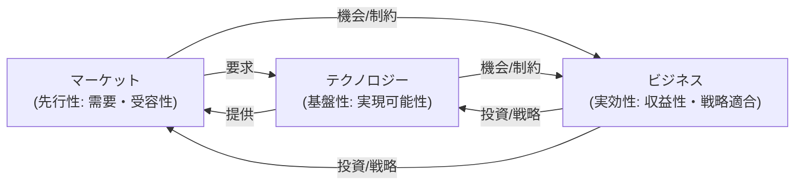
```mermaid
graph LR
    Market["マーケット<br/>(先行性: 需要・受容性)"] -- "要求" --> Tech["テクノロジー<br/>(基盤性: 実現可能性)"]
    Tech -- "提供" --> Market
    Market -- "機会/制約" --> Business["ビジネス<br/>(実効性: 収益性・戦略適合)"]
    Tech -- "機会/制約" --> Business
    Business -- "投資/戦略" --> Tech
    Business -- "投資/戦略" --> Market
```
*図2: 3つの視点の関係性概念図*

### 3.2. 多層的評価の実施 (Multi-Layered Evaluation)

評価は単一のスコアではなく、複数の層で行うことで、情報の信頼性と解釈の深さを向上させます。

-   **個別視点内評価**: 各視点内で、入力情報の重要度、確信度を評価。
-   **視点間整合性評価**: 異なる視点からの情報が互いに矛盾しないか評価。
-   **総合評価**: 全ての評価結果を統合し、全体としての重要度、確信度、整合性を評価。

### 3.3. 静止点の明確な定義と検出 (Clear Definition and Detection of Equilibrium)

「静止点」とは何かを明確に定義し、それを検出するための客観的な基準とアルゴリズムを設定します。

-   **定義**: 3つの視点の評価（重要度、確信度、整合性）が総合的に高く、かつ安定している状態。戦略的に注力すべき、あるいは現状維持が妥当と判断されるポイント。
-   **検出基準**: 事前に定義された重要度、確信度、整合性の閾値、およびそれらの組み合わせルール。
-   **安定性評価**: 検出された静止点が、入力情報のわずかな変動に対してどの程度安定しているかを評価（感度分析）。

### 3.4. 透明性と説明可能性の確保 (Transparency and Explainability)

コンセンサスモデルがどのように結論に至ったのかを追跡・説明できることが重要です。

-   **判断根拠の明示**: 各評価スコアの算出根拠、適用されたルール、統合プロセスを記録・提示。
-   **確信度の提示**: 最終的な判断や推奨アクションに対する確信度スコアを提示。
-   **代替解の提示**: 最適解だけでなく、代替的な解釈やオプションが存在することを示す。
-   **What-if分析**: 特定の入力やパラメータを変更した場合に結果がどう変わるかシミュレーションできる機能。

### 3.5. 適応性と学習能力の実装 (Adaptability and Learning Capability)

ビジネス環境は常に変化するため、コンセンサスモデルも変化に適応し、学習する能力を持つべきです。

-   **パラメータの自動調整**: モデルの予測や推奨と実際の結果との乖離に基づき、評価基準の重みや閾値を自動調整（例：強化学習、オンライン学習）。
-   **フィードバックの取り込み**: ユーザー（専門家、意思決定者）からのフィードバック（例：評価スコアの妥当性、推奨アクションの有効性）をモデルに反映。
-   **モデルの継続的改善**: 定期的にモデルの性能を評価し、必要に応じて構造やアルゴリズム自体を見直すプロセスを確立。

## 4. n8nによるコンセンサスモデルの基本実装（初期化）

n8nを活用して、コンセンサスモデルの基本構造を実装します。ここでは、モデルの動作に必要なパラメータやルールを定義し、データベースに保存する初期化ワークフローを示します。これは、コンセンサスモデルを実際に運用する前の準備段階にあたります。

### 4.1. コンセンサスモデル初期化ワークフロー (n8n)

このワークフローは、手動トリガーで開始され、コンセンサスモデルの動作に必要なパラメータ（各視点の重み、評価閾値など）と、評価・統合のためのルールを定義し、PostgreSQLデータベースに保存します。また、結果を格納するためのテーブルスキーマも作成します。

```javascript
// n8n workflow: Initialize Consensus Model
// Trigger: Manual
// Description: Defines and saves initial parameters, rules, and DB schema for the consensus model.
[
  {
    "id": "start",
    "type": "n8n-nodes-base.manualTrigger",
    "parameters": {},
    "typeVersion": 1,
    "notes": "コンセンサスモデルの初期化を手動で開始します。"
  },
  {
    "id": "defineConsensusParameters",
    "type": "n8n-nodes-base.function",
    "parameters": {
      "functionCode": `
        // Define consensus model parameters
        // これらの値は初期値であり、運用中に調整される可能性があります。
        const consensusParameters = {
          // Perspective weights (合計が1になるように)
          perspectiveWeights: {
            technology: 0.33,
            market: 0.34, // マーケット視点をわずかに重視
            business: 0.33
          },
          
          // Importance evaluation parameters (各要素の重みと評価閾値)
          importanceParameters: {
            impactScope: { weight: 0.25, thresholds: { low: 0.3, medium: 0.6, high: 0.8 } },
            changeMagnitude: { weight: 0.25, thresholds: { low: 0.3, medium: 0.6, high: 0.8 } },
            strategicRelevance: { weight: 0.30, thresholds: { low: 0.3, medium: 0.6, high: 0.8 } },
            timeUrgency: { weight: 0.20, thresholds: { low: 0.3, medium: 0.6, high: 0.8 } }
          },
          
          // Confidence evaluation parameters
          confidenceParameters: {
            sourceReliability: { weight: 0.30, thresholds: { low: 0.3, medium: 0.6, high: 0.8 } },
            dataVolume: { weight: 0.20, thresholds: { low: 0.3, medium: 0.6, high: 0.8 } },
            consistency: { weight: 0.30, thresholds: { low: 0.3, medium: 0.6, high: 0.8 } },
            verifiability: { weight: 0.20, thresholds: { low: 0.3, medium: 0.6, high: 0.8 } }
          },
          
          // Coherence evaluation parameters
          coherenceParameters: {
            perspectiveAgreement: { weight: 0.40, thresholds: { low: 0.3, medium: 0.6, high: 0.8 } },
            logicalCoherence: { weight: 0.30, thresholds: { low: 0.3, medium: 0.6, high: 0.8 } },
            temporalCoherence: { weight: 0.20, thresholds: { low: 0.3, medium: 0.6, high: 0.8 } },
            contextualCoherence: { weight: 0.10, thresholds: { low: 0.3, medium: 0.6, high: 0.8 } }
          },
          
          // Equilibrium point detection parameters (静止点検出の閾値)
          equilibriumParameters: {
            minImportance: 0.6, // 最低限必要な重要度
            minConfidence: 0.7, // 最低限必要な確信度
            minCoherence: 0.65, // 最低限必要な整合性
            stabilityThreshold: 0.1 // 安定性評価の閾値 (例: 感度分析でのスコア変動幅)
          }
        };
        
        return {json: {consensusParameters}};
      `
    },
    "notes": "コンセンサスモデルの評価と統合に使用するパラメータ（重み、閾値）を定義します。"
  },
  {
    "id": "saveConsensusParameters",
    "type": "n8n-nodes-base.postgres",
    "parameters": {
      "operation": "executeQuery",
      "query": `
        -- consensus_parameters テーブルが存在しない場合は作成
        CREATE TABLE IF NOT EXISTS consensus_parameters (
          id SERIAL PRIMARY KEY,
          parameters JSONB NOT NULL, -- パラメータ全体をJSONBで保存
          created_at TIMESTAMP WITH TIME ZONE DEFAULT CURRENT_TIMESTAMP,
          is_active BOOLEAN DEFAULT TRUE -- 現在有効なパラメータセットを示すフラグ
        );
        
        -- 既存の有効なパラメータを無効化 (常に最新の1セットのみ有効とする場合)
        UPDATE consensus_parameters
        SET is_active = FALSE
        WHERE is_active = TRUE;
        
        -- 新しいパラメータセットを挿入
        INSERT INTO consensus_parameters (parameters)
        VALUES ($1::jsonb); -- Functionノードからの出力をパラメータとして使用
      `,
      "values": "={{ JSON.stringify($json.consensusParameters) }}" // Functionノードの出力をJSON文字列として渡す
    },
    "notes": "定義したパラメータをPostgreSQLの`consensus_parameters`テーブルに保存します。常に最新のパラメータセットが有効になります。"
  },
  {
    "id": "defineConsensusRules",
    "type": "n8n-nodes-base.function",
    "parameters": {
      "functionCode": `
        // Define consensus rules (ルールベースの評価・統合ロジック)
        // これらは例であり、実際のビジネスロジックに合わせて定義・拡張します。
        const consensusRules = [
          // --- 視点統合ルール --- 
          {
            id: 'rule_market_first',
            name: 'マーケット視点先行ルール',
            description: 'マーケット視点の重要度が特に高い場合、その重みをさらに増加させる。',
            condition: 'market.importance > 0.8 && market.confidence > 0.7', // 条件式 (例)
            action: 'adjust_weight("market", 1.2)', // 実行アクション (例: 重みを1.2倍)
            priority: 10 // ルール適用優先度
          },
          {
            id: 'rule_tech_foundation',
            name: 'テクノロジー視点基盤ルール',
            description: 'テクノロジーの実現可能性（確信度）が低い場合、全体の確信度を下げる。',
            condition: 'technology.confidence < 0.5',
            action: 'adjust_overall_confidence(0.8)', // 全体確信度を0.8倍
            priority: 9
          },
          {
            id: 'rule_business_effectiveness',
            name: 'ビジネス視点実効性ルール',
            description: 'ビジネス視点の整合性が高い場合、推奨アクションの優先度を上げる。',
            condition: 'business.coherence > 0.8 && business.importance > 0.6',
            action: 'boost_action_priority(1.5)', // アクション優先度を1.5倍
            priority: 8
          },
          
          // --- 静止点検出ルール --- 
          {
            id: 'rule_high_consensus',
            name: '高コンセンサスルール',
            description: '全視点で重要度・確信度・整合性が高く、視点間の一致度も高い場合、強い静止点として検出。',
            condition: 'overall_importance > 0.8 && overall_confidence > 0.8 && overall_coherence > 0.7 && perspective_agreement > 0.8',
            action: 'mark_as_equilibrium("strong", 1.0)', // 強い静止点、スコア1.0
            priority: 10
          },
          {
            id: 'rule_market_tech_aligned',
            name: 'マーケット・テクノロジー一致ルール',
            description: 'マーケットとテクノロジーは一致しているがビジネス視点が不一致の場合、ビジネス課題を強調。',
            condition: 'agreement(market, technology) > 0.7 && agreement(market, business) < 0.5 && agreement(technology, business) < 0.5',
            action: 'highlight_issue("business_alignment")',
            priority: 7
          },
          {
            id: 'rule_all_perspectives_conflict',
            name: '全視点不一致ルール',
            description: '全ての視点が大きく不一致の場合、静止点検出は困難とし、代替解生成を促す。',
            condition: 'perspective_agreement < 0.4',
            action: 'trigger_alternative_generation(3)', // 代替解を3つ生成
            priority: 6
          }
          // 他にも多数のルールを定義可能...
        ];
        
        // ルールエンジンで解釈可能な形式で返す
        return {json: {consensusRules}};
      `
    },
    "notes": "コンセンサス形成のためのルールを定義します。条件(condition)と実行アクション(action)で構成されます。"
  },
  {
    "id": "saveConsensusRules",
    "type": "n8n-nodes-base.postgres",
    "parameters": {
      "operation": "executeQuery",
      "query": `
        -- consensus_rules テーブルが存在しない場合は作成
        CREATE TABLE IF NOT EXISTS consensus_rules (
          id VARCHAR(50) PRIMARY KEY, -- ルールの一意なID
          name VARCHAR(100) NOT NULL, -- ルールの名称
          description TEXT, -- ルールの説明
          condition TEXT NOT NULL, -- 適用条件式 (ルールエンジンで解釈)
          action TEXT NOT NULL, -- 実行アクション (ルールエンジンで解釈)
          priority INTEGER NOT NULL, -- 適用優先度 (高いほど優先)
          is_active BOOLEAN DEFAULT TRUE, -- ルールの有効/無効フラグ
          created_at TIMESTAMP WITH TIME ZONE DEFAULT CURRENT_TIMESTAMP,
          updated_at TIMESTAMP WITH TIME ZONE DEFAULT CURRENT_TIMESTAMP
        );

        -- ルール更新用のトリガー関数 (updated_atを自動更新)
        CREATE OR REPLACE FUNCTION update_updated_at_column()
        RETURNS TRIGGER AS $$
        BEGIN
           NEW.updated_at = now(); 
           RETURN NEW;
        END;
        $$ language 'plpgsql';

        DROP TRIGGER IF EXISTS update_consensus_rules_updated_at ON consensus_rules;
        CREATE TRIGGER update_consensus_rules_updated_at
        BEFORE UPDATE ON consensus_rules
        FOR EACH ROW
        EXECUTE FUNCTION update_updated_at_column();

        -- 既存のルールを一旦削除 (あるいはis_active=FALSEに更新)
        -- ここでは単純化のため全削除
        -- DELETE FROM consensus_rules;

        -- 新しいルールを挿入または更新 (UPSERT)
        INSERT INTO consensus_rules (id, name, description, condition, action, priority, is_active)
        VALUES
        
          (
            '{{ rule.id }}',
            '{{ rule.name | replace("'", "''") }}', -- シングルクォートをエスケープ
            '{{ rule.description | replace("'", "''") }}',
            '{{ rule.condition | replace("'", "''") }}',
            '{{ rule.action | replace("'", "''") }}',
            {{ rule.priority }},
            TRUE
          ),
        
        ON CONFLICT (id) DO UPDATE SET
          name = EXCLUDED.name,
          description = EXCLUDED.description,
          condition = EXCLUDED.condition,
          action = EXCLUDED.action,
          priority = EXCLUDED.priority,
          is_active = TRUE, -- 更新時も有効化
          updated_at = NOW(); -- updated_atを手動で更新
      `
    },
    "notes": "定義したルールをPostgreSQLの`consensus_rules`テーブルに保存（UPSERT）します。ルールはIDで管理されます。"
  },
  {
    "id": "createConsensusSchema",
    "type": "n8n-nodes-base.postgres",
    "parameters": {
      "operation": "executeQuery",
      "query": `
        -- コンセンサス結果を保存するテーブル (consensus_results)
        CREATE TABLE IF NOT EXISTS consensus_results (
          id SERIAL PRIMARY KEY, -- 結果ID
          execution_id VARCHAR(100) UNIQUE NOT NULL, -- ワークフロー実行ID
          analysis_target TEXT NOT NULL, -- 分析対象 (例: 特定技術、市場セグメント)
          analysis_timestamp TIMESTAMP WITH TIME ZONE NOT NULL, -- 分析時点
          perspective_inputs JSONB NOT NULL, -- 各視点からの入力データ
          evaluation_scores JSONB NOT NULL, -- 重要度、確信度、整合性の評価スコア
          integration_result JSONB NOT NULL, -- 統合結果 (総合スコア、ルール適用結果など)
          is_equilibrium BOOLEAN NOT NULL, -- 静止点として検出されたか
          equilibrium_details JSONB, -- 静止点の詳細 (スコア、安定性など)
          alternative_solutions JSONB, -- 代替解 (存在する場合)
          generated_insights TEXT, -- 生成されたインサイト (自然言語)
          created_at TIMESTAMP WITH TIME ZONE DEFAULT CURRENT_TIMESTAMP
        );
        
        -- 推奨アクションを保存するテーブル (consensus_actions)
        CREATE TABLE IF NOT EXISTS consensus_actions (
          id SERIAL PRIMARY KEY, -- アクションID
          consensus_result_id INTEGER NOT NULL REFERENCES consensus_results(id) ON DELETE CASCADE, -- 紐づく結果ID
          action_type VARCHAR(50) NOT NULL, -- アクション種別 (例: R&D, M&A, Marketing)
          action_description TEXT NOT NULL, -- アクション内容
          priority FLOAT NOT NULL, -- 優先度スコア
          recommended_timing VARCHAR(50), -- 推奨実行タイミング (例: Short-term, Mid-term)
          expected_impact TEXT, -- 期待される効果
          required_resources TEXT, -- 必要リソース (概算)
          confidence_level FLOAT, -- 推奨の確信度
          created_at TIMESTAMP WITH TIME ZONE DEFAULT CURRENT_TIMESTAMP
        );

        -- インデックス作成 (クエリパフォーマンス向上のため)
        CREATE INDEX IF NOT EXISTS idx_consensus_results_timestamp ON consensus_results(analysis_timestamp DESC);
        CREATE INDEX IF NOT EXISTS idx_consensus_results_target ON consensus_results(analysis_target);
        CREATE INDEX IF NOT EXISTS idx_consensus_actions_result_id ON consensus_actions(consensus_result_id);
      `
    }
  }
]
```
*コード1: コンセンサスモデル初期化ワークフロー (n8n)*

**コード解説:**

1.  **`start`**: ワークフローを手動で開始します。
2.  **`defineConsensusParameters` (Function Node)**: JavaScriptコード内で、コンセンサスモデルの動作に必要な各種パラメータ（視点ごとの重み、重要度・確信度・整合性評価の各要素の重みと閾値、静止点検出の閾値など）を定義します。これらの値は初期値であり、後の学習やチューニングで変更される可能性があります。
3.  **`saveConsensusParameters` (Postgres Node)**: `defineConsensusParameters`で定義されたパラメータをJSONB形式で`consensus_parameters`テーブルに保存します。`is_active`フラグにより、常に最新のパラメータセットのみが有効になるように管理します。
4.  **`defineConsensusRules` (Function Node)**: コンセンサス形成のためのルールを定義します。各ルールはID、名称、説明、適用条件（`condition`）、実行アクション（`action`）、優先度（`priority`）を持ちます。条件式やアクションは、後続のルールエンジン（パート2以降で実装）で解釈・実行されることを想定した形式で記述します。
5.  **`saveConsensusRules` (Postgres Node)**: `defineConsensusRules`で定義されたルールを`consensus_rules`テーブルに保存します。UPSERT（Insert or Update）処理により、既存のルールIDがあれば更新し、なければ新規挿入します。
6.  **`createConsensusSchema` (Postgres Node)**: コンセンサスモデルの実行結果（`consensus_results`）と、それに基づいて生成される推奨アクション（`consensus_actions`）を保存するためのテーブルスキーマを定義し、存在しない場合に作成します。適切なインデックスも作成し、クエリパフォーマンスを考慮します。

この初期化ワークフローを実行することで、コンセンサスモデルの評価・統合プロセスを実行するための基本的な設定とデータベース構造が準備されます。

## 5. まとめと次のステップ

本セクションでは、コンセンサスモデルの基本的な概念、4つのレイヤーからなる構造、設計における5つの重要な原則、そしてn8nを用いた初期化ワークフローについて解説しました。

コンセンサスモデルは、多様な情報を統合し、複雑な状況下での意思決定を支援する強力なツールとなり得ます。しかし、その効果を最大限に引き出すためには、明確な設計原則に基づき、透明性と適応性を持った実装を行うことが不可欠です。

次のセクション（パート2）では、今回定義した基本構造と原則に基づき、評価レイヤ（重要度、確信度、整合性評価エンジン）の具体的な実装方法について、n8nワークフローと連携するPythonスクリプトやAPIの活用例を交えながら詳細に解説していきます。

---

**(パート1 了)**

**(ここから改善提案に基づく追加セクション)**

## 6. 実装詳細の補強（パート1の範囲）

パート1で示した基本構造と初期化ワークフローに関連する実装の詳細を補強します。

### 6.1. パラメータとルールの管理

初期化ワークフローで定義・保存したパラメータとルールは、コンセンサスモデルの挙動を決定する重要な要素です。

-   **バージョニング**: `consensus_parameters`テーブルの`is_active`フラグや`created_at`タイムスタンプを利用して、パラメータセットの変更履歴を管理し、必要に応じて過去のバージョンに戻せるようにします。
-   **UIによる管理**: n8nのUIや、別途開発する管理画面を通じて、パラメータやルールをGUIで編集・管理できるようにすると、運用性が向上します。
-   **ルールのテスト**: 新しいルールを追加・変更する際には、そのルールが意図通りに動作するか、他のルールとの相互作用に問題がないかをテストする仕組み（ユニットテストやシナリオテスト）が必要です。

### 6.2. データ形式の標準化（入力レイヤ）

入力レイヤのプロセッサは、多様な形式の入力データを、後続の評価・統合レイヤで扱える標準化された形式に変換する必要があります。例えば、以下のようなJSON形式が考えられます。

```json
{
  "source_perspective": "market", // or "technology", "business"
  "data_source": "Gartner Report Q1 2025",
  "extracted_info": "AI in manufacturing adoption rate increased by 15%",
  "timestamp": "2025-06-03T10:00:00Z",
  "raw_data_reference": "/path/to/gartner_report.pdf",
  "initial_scores": { // Optional: Source system might provide initial scores
    "relevance": 0.8,
    "reliability": 0.9
  },
  "metadata": {
    "topic": "AI in Manufacturing",
    "region": "Global"
  }
}
```

## 7. 技術的課題と対応策（パート1の範囲）

初期化段階においても、いくつかの技術的課題が想定されます。

-   **データベーススキーマの柔軟性**: 将来的にパラメータやルールの構造が変更される可能性を考慮し、JSONB型を使用するなど、スキーマの柔軟性を確保します。
-   **パラメータ・ルールの整合性**: 多数のパラメータやルールを定義する際、設定ミスや矛盾が生じる可能性があります。定義時にバリデーションチェックを行う、あるいはテストケースで整合性を検証する仕組みが必要です。
-   **n8nワークフローの管理**: 初期化ワークフローが複雑化する場合、バージョン管理システム（Gitなど）でワークフロー定義（JSON）を管理することが推奨されます。

## 8. 評価と検証フレームワーク（パート1の範囲）

初期設定の妥当性を評価・検証するための考え方です。

-   **専門家レビュー**: 定義したパラメータの重みや閾値、ルールの妥当性について、対象分野の専門家によるレビューを実施します。
-   **感度分析**: 特定のパラメータ値を変更した場合に、想定される評価結果がどのように変化するかをシミュレーションし、パラメータの感度を確認します。
-   **初期ルールのカバレッジ**: 定義したルールが、想定される典型的なシナリオをカバーできているかを確認します。

## 9. 段階的実装ガイド（パート1の範囲）

コンセンサスモデル全体は複雑ですが、パート1の初期化部分は比較的独立して実装できます。

1.  **ステップ1: データモデル定義**: `consensus_parameters`, `consensus_rules`, `consensus_results`, `consensus_actions`のテーブルスキーマを設計・確定します。
2.  **ステップ2: パラメータ・ルールの初期値決定**: 専門家との議論や過去の事例に基づき、パラメータとルールの初期値を決定します。
3.  **ステップ3: n8n初期化ワークフロー実装**: コード1に示したn8nワークフローを実装し、パラメータとルールが正しくデータベースに保存されることを確認します。
4.  **ステップ4: スキーマ作成**: `createConsensusSchema`ノードを実行し、結果格納用のテーブルが正しく作成されることを確認します。

この段階まで完了すれば、コンセンサスモデルの評価・統合プロセス（パート2以降）を実装するための基盤が整います。

## 10. ユースケース例（パート1の範囲）

コンセンサスモデルの初期設定は、特定のユースケースを念頭に置いて行うことが効果的です。

-   **製造業（新技術導入評価）**: パラメータ設定において、「テクノロジー視点」の実現可能性と「ビジネス視点」のROIを特に重視する。ルール設定では、「既存プロセスとの互換性」や「サプライチェーンへの影響」を評価する条件を追加する。
-   **小売業（新市場参入評価）**: 「マーケット視点」の市場規模・成長性と「ビジネス視点」の競合状況・ブランド適合性を重視する。ルールでは、「現地法規制への対応」や「物流網構築の難易度」を評価する条件を追加する。
-   **金融業（新規投資戦略評価）**: 「マーケット視点」のマクロ経済動向と「ビジネス視点」のリスク・リターン評価を重視する。ルールでは、「規制当局の動向」や「ポートフォリオ全体への影響」を評価する条件を追加する。

初期設定段階でこれらのユースケースを考慮することで、より目的に合致したコンセンサスモデルの基盤を構築できます。

---

**(改善提案反映 終了)**

# コンセンサスモデルの実装（パート2：基本ロジックと評価メカニズム）- スタイル編集版

## 1. コンセンサスモデルの評価メカニズムの概要と目的

パート1で解説したコンセンサスモデルの基本構造と設計原則に基づき、本稿（パート2）では、その中核をなす評価メカニズムの具体的な実装ロジックに焦点を当てます。評価メカニズムは、トリプルパースペクティブ型戦略AIレーダーが多様な情報源から得られたインプットを処理し、信頼性の高い判断を導き出すための重要なステップです。

### 1.1. 評価メカニズムの位置づけと重要性

コンセンサスモデル全体において、評価メカニズムは「情報の質と意味合いを定量化・定性化する」役割を担います。テクノロジー、マーケット、ビジネスという3つの異なる視点から収集された情報は、そのままでは比較や統合が困難です。評価メカニズムは、これらの情報を共通の基準で評価し、それぞれの「重要度」と「確信度」、そして視点間の「整合性」を明らかにすることで、後続の統合プロセスと意思決定支援の基盤を築きます。

この評価プロセスを通じて、単なる情報の羅列ではなく、戦略的な意味合いを持つインサイトへと昇華させることが可能になります。特に、変化の激しい現代のビジネス環境においては、情報の重要性や信頼性を迅速かつ正確に評価する能力が、競争優位性を確立する上で不可欠です。

### 1.2. 評価メカニズムの主要な目的

評価メカニズムは、以下の主要な目的を達成するために設計されます：

1.  **視点別情報の重要度と確信度の定量化**: 各視点から得られた情報（変化点、分析結果など）が、戦略的にどれほど重要か、そしてその情報がどれほど確からしいかを客観的なスコアとレベルで示します。
2.  **視点間の整合性の評価と検証**: 3つの視点からの評価結果が互いに矛盾なく整合しているか、あるいはどの視点間で不一致が生じているかを評価し、判断の信頼性を検証します。
3.  **信頼性の高い統合評価結果の導出**: 個別の評価結果を統合し、全体としての重要度、確信度、整合性を示すことで、多角的な視点を反映した総合的な評価を提供します。
4.  **意思決定支援のための明確な指標提供**: 評価結果を、意思決定者が理解しやすい明確な指標（スコア、レベル、アラートなど）として提示し、迅速かつ適切な判断を支援します。

## 2. 評価メカニズムの基本構造とアーキテクチャ

評価メカニズムは、大きく「視点別評価プロセス」と「整合性評価プロセス」の2つの段階で構成されます。以下にその基本構造とプロセス全体のフローを示します。

### 2.1. 評価プロセス全体のフロー（テキスト表現）

```
評価メカニズム
├── 視点別評価プロセス (Perspective Evaluation Process)
│   ├── 重要度評価コンポーネント (Importance Evaluation Component)
│   │   ├── 影響範囲評価 (Impact Scope Evaluation)
│   │   ├── 変化の大きさ評価 (Change Magnitude Evaluation)
│   │   ├── 戦略的関連性評価 (Strategic Relevance Evaluation)
│   │   └── 時間的緊急性評価 (Time Urgency Evaluation)
│   └── 確信度評価コンポーネント (Confidence Evaluation Component)
│       ├── 情報源信頼性評価 (Source Reliability Evaluation)
│       ├── データ量・質評価 (Data Volume/Quality Evaluation)
│       ├── 一貫性評価 (Consistency Evaluation)
│       └── 検証可能性評価 (Verifiability Evaluation)
└── 整合性評価プロセス (Coherence Evaluation Process)
    ├── 視点間一致度評価 (Perspective Agreement Evaluation)
    ├── 論理的整合性評価 (Logical Coherence Evaluation)
    ├── 時間的整合性評価 (Temporal Coherence Evaluation)
    └── コンテキスト整合性評価 (Contextual Coherence Evaluation)
```

### 2.2. 評価プロセス全体のフロー図（Mermaid）

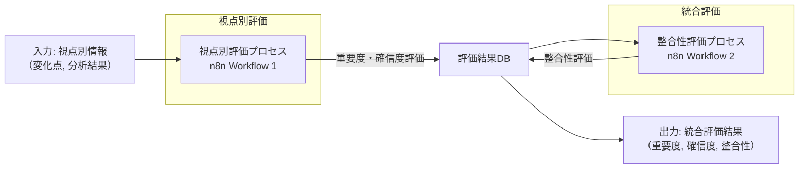
```mermaid
graph LR
    A["入力: 視点別情報<br>（変化点, 分析結果）"] --> B["視点別評価プロセス<br>n8n Workflow 1"]
    B -- "重要度・確信度評価" --> C["評価結果DB"]
    C --> D["整合性評価プロセス<br>n8n Workflow 2"]
    
    subgraph "視点別評価"
        B
    end
    
    subgraph "統合評価"
        D
    end
    
    D -- "整合性評価" --> C
    C --> E["出力: 統合評価結果<br>（重要度, 確信度, 整合性）"]
```
*図1: コンセンサスモデル評価プロセス全体のフロー図。視点別評価と整合性評価の連携を示す。*

このフロー図は、まず各視点からの情報が「視点別評価プロセス」で個別に評価され（重要度・確信度）、その結果がデータベースに保存されることを示しています。その後、「整合性評価プロセス」がデータベースから各視点の評価結果を取得し、それらの間の整合性を評価します。最終的に、重要度、確信度、整合性の3つの評価軸に基づいた統合評価結果が出力されます。

### 2.3. 各評価コンポーネントの詳細

#### 2.3.1. 重要度評価コンポーネント

入力された情報が戦略的にどれほど重要かを評価します。以下の4つの要素から構成されます：

-   **影響範囲評価**: その情報が影響を及ぼす範囲の広さ（例：影響を受ける顧客数、市場規模、関連部署数）を評価します。
-   **変化の大きさ評価**: 検出された変化の度合い（例：成長率の変化幅、技術的進歩の度合い、競合のシェア変動率）を評価します。
-   **戦略的関連性評価**: その情報が自社の戦略目標や重要業績評価指標（KPI）にどれほど関連しているかを評価します。
-   **時間的緊急性評価**: その情報に対して対応が必要となるまでの時間的な猶予（例：市場投入までの期間、競合の動きに対する反応速度）を評価します。

#### 2.3.2. 確信度評価コンポーネント

入力された情報の信頼性や確からしさを評価します。以下の4つの要素から構成されます：

-   **情報源信頼性評価**: 情報の出所（例：公式発表、信頼できる調査機関、専門家の意見、匿名の情報）の信頼性を評価します。
-   **データ量・質評価**: 評価の根拠となるデータの量（例：データポイント数、サンプルサイズ）と質（例：データの網羅性、正確性、最新性）を評価します。
-   **一貫性評価**: 同じ情報源からの時系列データの一貫性や、複数の情報源間での情報の一致度を評価します。
-   **検証可能性評価**: その情報が客観的な事実に基づいており、第三者による検証が可能かどうかを評価します。

#### 2.3.3. 整合性評価コンポーネント

3つの視点からの評価結果が互いに矛盾なく整合しているかを評価します。以下の4つの要素から構成されます：

-   **視点間一致度評価**: テクノロジー、マーケット、ビジネスの各視点からの評価結果（例：重要度スコア、確信度レベル）がどれほど一致しているかを評価します。
-   **論理的整合性評価**: 各視点の評価の根拠となるロジックや前提条件に矛盾がないかを評価します。
-   **時間的整合性評価**: 現在の評価結果が、過去のトレンドや評価結果と整合しているかを評価します。
-   **コンテキスト整合性評価**: 評価結果が、より広範な業界動向やマクロ環境の文脈と整合しているかを評価します。

## 3. 評価メカニズムの設計原則

効果的な評価メカニズムを構築するためには、パート1で述べたコンセンサスモデル全体の設計原則に加え、評価プロセス特有の以下の原則を重視します。

### 3.1. 定量的評価と定性的解釈の両立

評価結果は、客観的な比較と判断を可能にするための定量的なスコアと、その意味合いを直感的に理解するための定性的なレベル（例：High/Medium/Low）の両方で表現します。単なる数値だけでなく、その数値が示す具体的な意味合いや背景を解釈するためのガイドラインを提供することが重要です。また、定量評価には限界があることを認識し、最終的な判断においては専門家による定性的な解釈も加味できる柔軟性を持たせます。

### 3.2. 多層的評価アプローチ

評価は単一の指標で行うのではなく、複数の要素を組み合わせた多層的なアプローチを採用します。例えば、重要度評価では影響範囲、変化の大きさ、戦略的関連性、時間的緊急性という複数の要素を評価し、それらを重み付けして統合スコアを算出します。これにより、評価の網羅性と信頼性を高めます。各要素の重み付けや評価レベルを決定する閾値は、ビジネスの状況や目的に応じて調整可能であるべきです。

### 3.3. 評価の透明性と説明可能性

評価メカニズムが「ブラックボックス」にならないよう、どのように評価スコアやレベルが算出されたのかを追跡・説明できることが不可欠です。どのデータが評価に用いられ、どのような計算ロジック（重み付け、閾値など）が適用されたのかを記録し、必要に応じてユーザーが確認できるようにします。これにより、評価結果への信頼を高め、ユーザーが結果を解釈し、次のアクションを検討する際の助けとなります。

### 3.4. 評価結果のフィードバックと継続的改善

評価メカニズムは一度構築したら終わりではなく、継続的にその有効性を検証し、改善していく必要があります。評価結果と実際のビジネス成果との関連性を分析したり、ユーザーからのフィードバック（例：評価スコアの妥当性、見逃していた重要な要素）を収集したりすることで、評価ロジックやパラメータを定期的に見直し、最適化していくプロセスを組み込みます。将来的には、機械学習の手法を用いてパラメータを自動調整するメカニズムの導入も検討できます。

---
*(セクション4以降、順次追記)*


## 4. 視点別評価プロセスの実装

ここからは、評価メカニズムの第一段階である「視点別評価プロセス」の具体的な実装について解説します。このプロセスでは、テクノロジー、マーケット、ビジネスの各視点から入力された情報を個別に評価し、その「重要度」と「確信度」を算出します。実装にはn8nワークフローを活用し、評価結果をデータベースに永続化します。

### 4.1. n8nによる視点別評価ワークフロー

視点別評価プロセスは、外部からのトリガー（例：新しい分析結果の通知）を受けて起動し、関連データの取得、評価ロジックの実行、結果の保存、そして後続の整合性評価プロセスのトリガーまでを自動化するn8nワークフローとして実装します。

#### 4.1.1. ワークフロー構造（Mermaid）

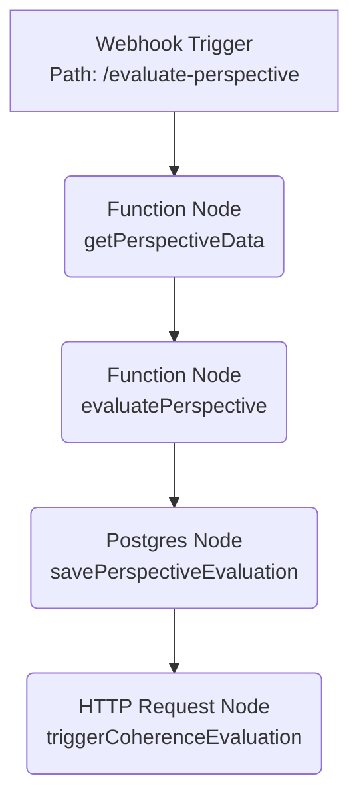
```mermaid
graph TD
    Webhook[Webhook Trigger<br>Path: /evaluate-perspective] --> GetData(Function Node<br>getPerspectiveData);
    GetData --> Evaluate(Function Node<br>evaluatePerspective);
    Evaluate --> SaveDB(Postgres Node<br>savePerspectiveEvaluation);
    SaveDB --> TriggerCoherence(HTTP Request Node<br>triggerCoherenceEvaluation);
```
*図2: n8n視点別評価ワークフローの構造。Webhookトリガーから整合性評価トリガーまでの一連の流れを示す。*

このワークフローは以下の主要ノードで構成されます：

1.  **Webhook Trigger**: `/evaluate-perspective` パスへのHTTP POSTリクエストを受け付け、ワークフローを開始します。リクエストボディには、評価対象のトピックIDや視点IDなどの情報が含まれます。
2.  **Function Node (getPerspectiveData)**: Webhookで受け取った情報に基づき、関連する分析結果や基礎データをデータベースや他の情報源から取得します。
3.  **Function Node (evaluatePerspective)**: 取得したデータと事前定義された評価パラメータを用いて、重要度と確信度の評価ロジックを実行します。
4.  **Postgres Node (savePerspectiveEvaluation)**: 算出された評価結果（スコア、レベル、構成要素）を、後述する`perspective_evaluations`テーブルに保存します。
5.  **HTTP Request Node (triggerCoherenceEvaluation)**: 視点別評価が完了したことを通知するため、整合性評価ワークフロー（`/check-coherence`）をHTTPリクエストでトリガーします。

#### 4.1.2. 重要度評価ロジック（JavaScript）

`evaluatePerspective` Function Node内で実行される重要度評価の主要なロジック例を以下に示します。このコードは、入力データとパラメータに基づき、4つの評価要素（影響範囲、変化の大きさ、戦略的関連性、時間的緊急性）のスコアを算出し、重み付け統合スコアと評価レベルを決定します。

```javascript
/**
 * 視点別情報の重要度を評価する関数
 * @param {object} analysisResults - 分析結果データ（影響範囲、変化の大きさ等の情報を含む）
 * @param {object} params - 重要度評価パラメータ（各要素の重み、閾値など）
 * @returns {object} - 重要度評価結果（スコア、レベル、各要素のスコア）
 */
function evaluateImportance(analysisResults, params) {
  // デフォルト値やエラーハンドリングを追加することが望ましい
  if (!analysisResults || !params) {
    console.error("評価に必要なデータまたはパラメータが不足しています。");
    return { score: 0, level: 'low', components: {} };
  }

  // 1. 影響範囲の評価 (例: 0-100のスコアに正規化)
  // analysisResults.impactMetrics.customerCount などを使用
  const impactScore = calculateImpactScope(analysisResults.impactMetrics, params.impactScope);
  
  // 2. 変化の大きさの評価 (例: 0-100のスコアに正規化)
  // analysisResults.changeMetrics.growthRateDelta などを使用
  const magnitudeScore = calculateChangeMagnitude(analysisResults.changeMetrics, params.changeMagnitude);
  
  // 3. 戦略的関連性の評価 (例: 0-100のスコアに正規化)
  // analysisResults.relevanceMetrics.kpiImpact などを使用
  const relevanceScore = calculateStrategicRelevance(analysisResults.relevanceMetrics, params.strategicRelevance);
  
  // 4. 時間的緊急性の評価 (例: 0-100のスコアに正規化)
  // analysisResults.urgencyMetrics.timeToMarket などを使用
  const urgencyScore = calculateTimeUrgency(analysisResults.urgencyMetrics, params.timeUrgency);
  
  // 5. 重み付け計算 (各要素の重みの合計は1になるように調整)
  const weightedScore = 
    (params.impactScope.weight * impactScore) +
    (params.changeMagnitude.weight * magnitudeScore) +
    (params.strategicRelevance.weight * relevanceScore) +
    (params.timeUrgency.weight * urgencyScore);
  
  // 6. レベル判定 (閾値はパラメータで定義)
  let level;
  if (weightedScore >= params.thresholds.high) {
    level = 'high';
  } else if (weightedScore >= params.thresholds.medium) {
    level = 'medium';
  } else {
    level = 'low';
  }
  
  // 7. 結果オブジェクトの返却
  return {
    score: parseFloat(weightedScore.toFixed(2)), // スコアは小数点以下2桁に丸める
    level: level,
    components: {
      impact_scope: impactScore,
      change_magnitude: magnitudeScore,
      strategic_relevance: relevanceScore,
      time_urgency: urgencyScore
    }
  };
}

// 各要素のスコア計算関数 (calculateImpactScope など) は別途定義する必要がある
// これらの関数は、入力データとパラメータに基づき、0-100の範囲でスコアを返す
function calculateImpactScope(metrics, params) { /* ... 実装 ... */ return 75; }
function calculateChangeMagnitude(metrics, params) { /* ... 実装 ... */ return 60; }
function calculateStrategicRelevance(metrics, params) { /* ... 実装 ... */ return 80; }
function calculateTimeUrgency(metrics, params) { /* ... 実装 ... */ return 50; }

// --- 実行例 ---
/*
const exampleAnalysisResults = {
  impactMetrics: { customerCount: 10000 },
  changeMetrics: { growthRateDelta: 0.15 },
  relevanceMetrics: { kpiImpact: 0.8 },
  urgencyMetrics: { timeToMarket: 6 }
};
const exampleParams = {
  impactScope: { weight: 0.3, /* ...他のパラメータ... */ },
  changeMagnitude: { weight: 0.2, /* ...他のパラメータ... */ },
  strategicRelevance: { weight: 0.3, /* ...他のパラメータ... */ },
  timeUrgency: { weight: 0.2, /* ...他のパラメータ... */ },
  thresholds: { high: 75, medium: 50 }
};

const importanceResult = evaluateImportance(exampleAnalysisResults, exampleParams);
console.log(importanceResult);
// 出力例: { score: 68.50, level: 'medium', components: { impact_scope: 75, change_magnitude: 60, strategic_relevance: 80, time_urgency: 50 } }
*/
```
*コード1: 重要度評価ロジックのJavaScript実装例。各評価要素のスコア計算と重み付け統合を行う。*

#### 4.1.3. 確信度評価ロジック（JavaScript）

同様に、`evaluatePerspective` Function Node内で実行される確信度評価の主要なロジック例を以下に示します。このコードは、入力データとパラメータに基づき、4つの評価要素（情報源信頼性、データ量・質、一貫性、検証可能性）のスコアを算出し、重み付け統合スコアと評価レベルを決定します。

```javascript
/**
 * 視点別情報の確信度を評価する関数
 * @param {object} analysisResults - 分析結果データ（情報源、データ品質等の情報を含む）
 * @param {object} params - 確信度評価パラメータ（各要素の重み、閾値など）
 * @returns {object} - 確信度評価結果（スコア、レベル、各要素のスコア）
 */
function evaluateConfidence(analysisResults, params) {
  // デフォルト値やエラーハンドリングを追加することが望ましい
  if (!analysisResults || !params) {
    console.error("評価に必要なデータまたはパラメータが不足しています。");
    return { score: 0, level: 'low', components: {} };
  }

  // 1. 情報源信頼性の評価 (例: 0-100のスコアに正規化)
  // analysisResults.sourceInfo.reliabilityScore などを使用
  const reliabilityScore = calculateSourceReliability(analysisResults.sourceInfo, params.sourceReliability);
  
  // 2. データ量・質の評価 (例: 0-100のスコアに正規化)
  // analysisResults.dataMetrics.volume, analysisResults.dataMetrics.quality などを使用
  const dataScore = calculateDataVolumeQuality(analysisResults.dataMetrics, params.dataVolumeQuality);
  
  // 3. 一貫性の評価 (例: 0-100のスコアに正規化)
  // analysisResults.consistencyMetrics.internalConsistency, analysisResults.consistencyMetrics.externalConsistency などを使用
  const consistencyScore = calculateConsistency(analysisResults.consistencyMetrics, params.consistency);
  
  // 4. 検証可能性の評価 (例: 0-100のスコアに正規化)
  // analysisResults.verifiabilityMetrics.isVerifiable などを使用
  const verifiabilityScore = calculateVerifiability(analysisResults.verifiabilityMetrics, params.verifiability);
  
  // 5. 重み付け計算 (各要素の重みの合計は1になるように調整)
  const weightedScore = 
    (params.sourceReliability.weight * reliabilityScore) +
    (params.dataVolumeQuality.weight * dataScore) +
    (params.consistency.weight * consistencyScore) +
    (params.verifiability.weight * verifiabilityScore);
  
  // 6. レベル判定 (閾値はパラメータで定義)
  let level;
  if (weightedScore >= params.thresholds.high) {
    level = 'high';
  } else if (weightedScore >= params.thresholds.medium) {
    level = 'medium';
  } else {
    level = 'low';
  }
  
  // 7. 結果オブジェクトの返却
  return {
    score: parseFloat(weightedScore.toFixed(2)), // スコアは小数点以下2桁に丸める
    level: level,
    components: {
      source_reliability: reliabilityScore,
      data_volume_quality: dataScore,
      consistency: consistencyScore,
      verifiability: verifiabilityScore
    }
  };
}

// 各要素のスコア計算関数 (calculateSourceReliability など) は別途定義する必要がある
function calculateSourceReliability(sourceInfo, params) { /* ... 実装 ... */ return 85; }
function calculateDataVolumeQuality(dataMetrics, params) { /* ... 実装 ... */ return 70; }
function calculateConsistency(consistencyMetrics, params) { /* ... 実装 ... */ return 75; }
function calculateVerifiability(verifiabilityMetrics, params) { /* ... 実装 ... */ return 90; }

// --- 実行例 ---
/*
const exampleAnalysisResultsConf = {
  sourceInfo: { reliabilityScore: 0.9 },
  dataMetrics: { volume: 500, quality: 'good' },
  consistencyMetrics: { internalConsistency: 0.8, externalConsistency: 0.7 },
  verifiabilityMetrics: { isVerifiable: true }
};
const exampleParamsConf = {
  sourceReliability: { weight: 0.3, /* ...他のパラメータ... */ },
  dataVolumeQuality: { weight: 0.2, /* ...他のパラメータ... */ },
  consistency: { weight: 0.2, /* ...他のパラメータ... */ },
  verifiability: { weight: 0.3, /* ...他のパラメータ... */ },
  thresholds: { high: 80, medium: 60 }
};

const confidenceResult = evaluateConfidence(exampleAnalysisResultsConf, exampleParamsConf);
console.log(confidenceResult);
// 出力例: { score: 81.50, level: 'high', components: { source_reliability: 85, data_volume_quality: 70, consistency: 75, verifiability: 90 } }
*/
```
*コード2: 確信度評価ロジックのJavaScript実装例。各評価要素のスコア計算と重み付け統合を行う。*

### 4.2. データベーススキーマ設計

視点別評価プロセスで算出された結果は、後続の整合性評価プロセスや最終的なコンセンサス形成で利用されるため、データベースに永続化する必要があります。ここでは、PostgreSQLを想定したテーブルスキーマの設計例を示します。

#### 4.2.1. 視点別評価結果テーブル（Mermaid）

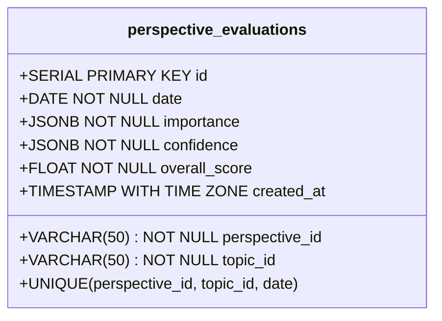
```mermaid
classDiagram
    class perspective_evaluations {
        +SERIAL PRIMARY KEY id
        +VARCHAR(50) NOT NULL perspective_id
        +VARCHAR(50) NOT NULL topic_id
        +DATE NOT NULL date
        +JSONB NOT NULL importance
        +JSONB NOT NULL confidence
        +FLOAT NOT NULL overall_score
        +TIMESTAMP WITH TIME ZONE created_at
        +UNIQUE (perspective_id, topic_id, date)
    }
```
*図3: 視点別評価結果テーブル（`perspective_evaluations`）のスキーマ定義。クラス図形式で表現。*

このテーブルの各カラムは以下の情報を格納します：

-   `id`: 各評価レコードの一意な識別子（自動採番）。
-   `perspective_id`: 評価対象の視点（例：'technology', 'market', 'business'）。
-   `topic_id`: 評価対象のトピックや変化点の一意な識別子。
-   `date`: 評価が実施された日付。
-   `importance`: 重要度評価の結果（スコア、レベル、各要素のスコア）をJSONB形式で格納。
-   `confidence`: 確信度評価の結果（スコア、レベル、各要素のスコア）をJSONB形式で格納。
-   `overall_score`: 重要度と確信度を組み合わせた総合スコア（計算方法は別途定義）。
-   `created_at`: レコードが作成されたタイムスタンプ。
-   `UNIQUE (perspective_id, topic_id, date)`: 同じ視点、同じトピック、同じ日付の評価が重複しないようにするためのユニーク制約。

JSONB型を使用することで、評価要素の内訳などの構造化データを柔軟に格納できます。

### 4.3. APIエンドポイント設計

視点別評価ワークフローを外部からトリガーするためのAPIエンドポイントを設計します。ここでは、Webhookトリガーノードで設定する`/evaluate-perspective`エンドポイントの仕様例を示します。

-   **エンドポイント**: `POST /evaluate-perspective`
-   **説明**: 指定されたトピックと視点について、最新の分析結果に基づき重要度と確信度を評価し、結果をデータベースに保存します。
-   **リクエストボディ (JSON)**:
    ```json
    {
      "topic_id": "tech_trend_001",
      "perspective_id": "technology",
      "analysis_date": "2025-06-03",
      "trigger_source": "data_pipeline_job_123"
    }
    ```
    -   `topic_id` (string, required): 評価対象のトピックID。
    -   `perspective_id` (string, required): 評価対象の視点ID。
    -   `analysis_date` (string, optional): 評価に使用する分析データの基準日（指定がない場合は最新）。
    -   `trigger_source` (string, optional): ワークフローをトリガーした要因（ログ記録用）。
-   **レスポンス**: 
    -   **成功時 (202 Accepted)**: ワークフローが正常に開始されたことを示します。実際の評価は非同期で行われるため、結果はレスポンスボディには含まれません。
        ```json
        {
          "status": "accepted",
          "message": "Perspective evaluation workflow started for topic 'tech_trend_001' and perspective 'technology'.",
          "workflow_execution_id": "exec_abc123xyz"
        }
        ```
    -   **失敗時 (400 Bad Request)**: リクエストボディに必要なパラメータが不足している場合など。
        ```json
        {
          "status": "error",
          "message": "Missing required parameter: topic_id"
        }
        ```
    -   **失敗時 (500 Internal Server Error)**: ワークフローの開始に失敗した場合など。
        ```json
        {
          "status": "error",
          "message": "Failed to start perspective evaluation workflow."
        }
        ```
-   **認証**: 必要に応じてAPIキーやトークンによる認証メカニズムを導入します。
-   **エラーハンドリング**: n8nワークフロー内でエラーが発生した場合、適切なログ記録と通知（例：Slack通知、エラーDBへの記録）を行うように設計します。

このAPIエンドポイントにより、他のシステムやプロセスから容易に視点別評価プロセスを呼び出すことが可能になります。


## 5. 整合性評価プロセスの実装

視点別評価プロセスに続き、評価メカニズムの第二段階である「整合性評価プロセス」の具体的な実装について解説します。このプロセスでは、各視点から得られた評価結果（重要度・確信度）をデータベースから取得し、それらの間の整合性を評価します。これにより、3つの視点からの情報が互いに矛盾なく調和しているか、あるいはどの視点間で不一致が生じているかを明らかにします。実装にはn8nワークフローを活用し、評価結果をデータベースに永続化します。

### 5.1. n8nによる整合性評価ワークフロー

整合性評価プロセスは、視点別評価プロセス完了のトリガー（例：HTTPリクエスト）を受けて起動し、関連する視点別評価結果の取得、整合性評価ロジックの実行、結果の保存、そして最終的なコンセンサス形成プロセスへの通知（またはトリガー）までを自動化するn8nワークフローとして実装します。

#### 5.1.1. ワークフロー構造（Mermaid）

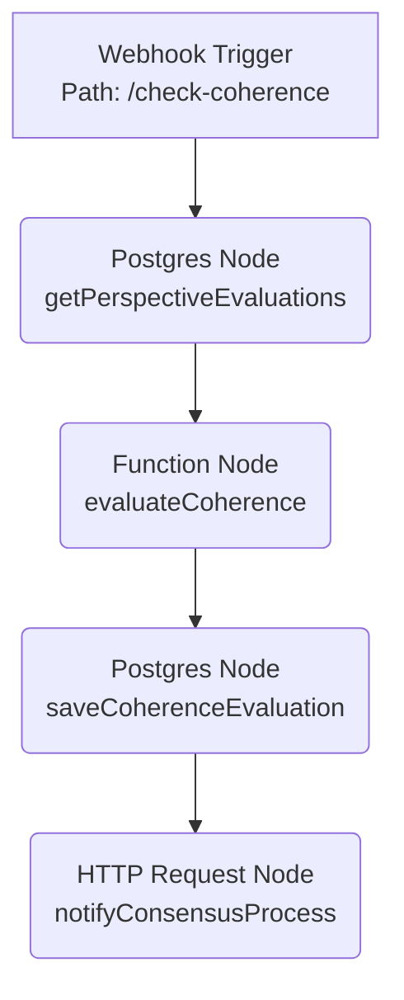
```mermaid
graph TD
    Webhook[Webhook Trigger<br>Path: /check-coherence] --> GetEvaluations(Postgres Node<br>getPerspectiveEvaluations);
    GetEvaluations --> Evaluate(Function Node<br>evaluateCoherence);
    Evaluate --> SaveDB(Postgres Node<br>saveCoherenceEvaluation);
    SaveDB --> NotifyConsensus(HTTP Request Node<br>notifyConsensusProcess);
```
*図4: n8n整合性評価ワークフローの構造。Webhookトリガーからコンセンサスプロセス通知までの一連の流れを示す。*

このワークフローは以下の主要ノードで構成されます：

1.  **Webhook Trigger**: `/check-coherence` パスへのHTTP POSTリクエストを受け付け、ワークフローを開始します。リクエストボディには、評価対象のトピックIDや日付などの情報が含まれます。
2.  **Postgres Node (getPerspectiveEvaluations)**: Webhookで受け取った情報に基づき、関連する視点別評価結果（テクノロジー、マーケット、ビジネスの3視点分）を`perspective_evaluations`テーブルから取得します。
3.  **Function Node (evaluateCoherence)**: 取得した3視点の評価結果と事前定義された評価パラメータを用いて、整合性評価ロジックを実行します。
4.  **Postgres Node (saveCoherenceEvaluation)**: 算出された整合性評価結果（スコア、レベル、各要素のスコア）を、後述する`coherence_evaluations`テーブルに保存します。
5.  **HTTP Request Node (notifyConsensusProcess)**: 整合性評価が完了したことを通知するため、後続のコンセンサス形成プロセス（例：`/trigger-consensus`）をHTTPリクエストでトリガーまたは通知します。

#### 5.1.2. 整合性評価ロジック（JavaScript）

`evaluateCoherence` Function Node内で実行される整合性評価の主要なロジック例を以下に示します。このコードは、入力された3視点の評価結果（重要度・確信度スコア）とパラメータに基づき、4つの評価要素（視点間一致度、論理的整合性、時間的整合性、コンテキスト整合性）のスコアを算出し、重み付け統合スコアと評価レベルを決定します。

```javascript
/**
 * 3視点の評価結果間の整合性を評価する関数
 * @param {object} techEval - テクノロジー視点の評価結果 (importance, confidence)
 * @param {object} marketEval - マーケット視点の評価結果 (importance, confidence)
 * @param {object} businessEval - ビジネス視点の評価結果 (importance, confidence)
 * @param {object} params - 整合性評価パラメータ（各要素の重み、閾値など）
 * @returns {object} - 整合性評価結果（スコア、レベル、各要素のスコア）
 */
function evaluateCoherence(techEval, marketEval, businessEval, params) {
  // デフォルト値やエラーハンドリングを追加することが望ましい
  if (!techEval || !marketEval || !businessEval || !params) {
    console.error("評価に必要なデータまたはパラメータが不足しています。");
    return { score: 0, level: 'low', components: {} };
  }

  // 1. 視点間一致度の評価 (例: 各視点のスコア間の標準偏差や差分を基に評価)
  const agreementScore = calculatePerspectiveAgreement(techEval, marketEval, businessEval, params.perspectiveAgreement);
  
  // 2. 論理的整合性の評価 (例: 各評価の根拠となるロジック間の矛盾をチェック)
  // この評価はより複雑な自然言語処理やルールベースのチェックが必要になる場合がある
  const logicalScore = calculateLogicalCoherence(techEval, marketEval, businessEval, params.logicalCoherence);
  
  // 3. 時間的整合性の評価 (例: 現在の評価と過去の評価トレンドとの整合性をチェック)
  // 過去の評価データを取得する必要がある
  const temporalScore = calculateTemporalCoherence(techEval, marketEval, businessEval, params.temporalCoherence);
  
  // 4. コンテキスト整合性の評価 (例: 評価結果と外部の業界動向やマクロ環境との整合性をチェック)
  // 外部コンテキスト情報を取得する必要がある
  const contextualScore = calculateContextualCoherence(techEval, marketEval, businessEval, params.contextualCoherence);
  
  // 5. 重み付け計算 (各要素の重みの合計は1になるように調整)
  const weightedScore = 
    (params.perspectiveAgreement.weight * agreementScore) +
    (params.logicalCoherence.weight * logicalScore) +
    (params.temporalCoherence.weight * temporalScore) +
    (params.contextualCoherence.weight * contextualScore);
  
  // 6. レベル判定 (閾値はパラメータで定義)
  let level;
  if (weightedScore >= params.thresholds.high) {
    level = 'high';
  } else if (weightedScore >= params.thresholds.medium) {
    level = 'medium';
  } else {
    level = 'low';
  }
  
  // 7. 結果オブジェクトの返却
  return {
    score: parseFloat(weightedScore.toFixed(2)), // スコアは小数点以下2桁に丸める
    level: level,
    components: {
      perspective_agreement: agreementScore,
      logical_coherence: logicalScore,
      temporal_coherence: temporalScore,
      contextual_coherence: contextualScore
    }
  };
}

// 各要素のスコア計算関数 (calculatePerspectiveAgreement など) は別途定義する必要がある
// これらの関数は、入力データとパラメータに基づき、0-100の範囲でスコアを返す
// 特に論理的、時間的、コンテキスト整合性の評価は複雑な実装が必要となる可能性がある
function calculatePerspectiveAgreement(tech, market, business, params) { /* ... 実装 ... */ return 80; }
function calculateLogicalCoherence(tech, market, business, params) { /* ... 実装 ... */ return 70; }
function calculateTemporalCoherence(tech, market, business, params) { /* ... 実装 ... */ return 75; }
function calculateContextualCoherence(tech, market, business, params) { /* ... 実装 ... */ return 85; }

// --- 実行例 ---
/*
const exampleTechEval = { importance: { score: 70, level: 'medium' }, confidence: { score: 80, level: 'high' } };
const exampleMarketEval = { importance: { score: 65, level: 'medium' }, confidence: { score: 75, level: 'medium' } };
const exampleBusinessEval = { importance: { score: 75, level: 'high' }, confidence: { score: 85, level: 'high' } };
const exampleParamsCoherence = {
  perspectiveAgreement: { weight: 0.4, /* ...他のパラメータ... */ },
  logicalCoherence: { weight: 0.2, /* ...他のパラメータ... */ },
  temporalCoherence: { weight: 0.2, /* ...他のパラメータ... */ },
  contextualCoherence: { weight: 0.2, /* ...他のパラメータ... */ },
  thresholds: { high: 75, medium: 55 }
};

const coherenceResult = evaluateCoherence(exampleTechEval, exampleMarketEval, exampleBusinessEval, exampleParamsCoherence);
console.log(coherenceResult);
// 出力例: { score: 78.00, level: 'high', components: { perspective_agreement: 80, logical_coherence: 70, temporal_coherence: 75, contextual_coherence: 85 } }
*/
```
*コード3: 整合性評価ロジックのJavaScript実装例。各評価要素のスコア計算と重み付け統合を行う。*

### 5.2. データベーススキーマ設計

整合性評価プロセスで算出された結果も、最終的なコンセンサス形成や分析のためにデータベースに永続化します。以下に、PostgreSQLを想定したテーブルスキーマの設計例を示します。

#### 5.2.1. 整合性評価結果テーブル（Mermaid）

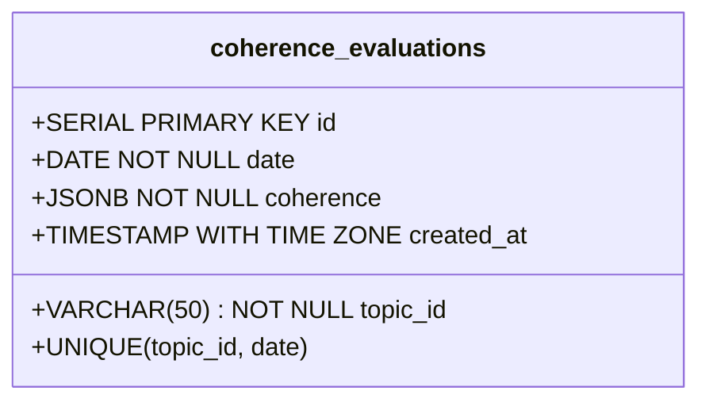
```mermaid
classDiagram
    class coherence_evaluations {
        +SERIAL PRIMARY KEY id
        +VARCHAR(50) NOT NULL topic_id
        +DATE NOT NULL date
        +JSONB NOT NULL coherence
        +TIMESTAMP WITH TIME ZONE created_at
        +UNIQUE (topic_id, date)
    }
```
*図5: 整合性評価結果テーブル（`coherence_evaluations`）のスキーマ定義。クラス図形式で表現。*

このテーブルの各カラムは以下の情報を格納します：

-   `id`: 各評価レコードの一意な識別子（自動採番）。
-   `topic_id`: 評価対象のトピックや変化点の一意な識別子。
-   `date`: 評価が実施された日付。
-   `coherence`: 整合性評価の結果（スコア、レベル、各要素のスコア）をJSONB形式で格納。
-   `created_at`: レコードが作成されたタイムスタンプ。
-   `UNIQUE (topic_id, date)`: 同じトピック、同じ日付の整合性評価が重複しないようにするためのユニーク制約。

### 5.3. APIエンドポイント設計

整合性評価ワークフローを外部（主に視点別評価ワークフロー）からトリガーするためのAPIエンドポイントを設計します。ここでは、Webhookトリガーノードで設定する`/check-coherence`エンドポイントの仕様例を示します。

-   **エンドポイント**: `POST /check-coherence`
-   **説明**: 指定されたトピックと日付について、3視点の評価結果を取得し、それらの間の整合性を評価して結果をデータベースに保存します。
-   **リクエストボディ (JSON)**:
    ```json
    {
      "topic_id": "tech_trend_001",
      "evaluation_date": "2025-06-03",
      "trigger_source": "perspective_eval_workflow_exec_abc123xyz"
    }
    ```
    -   `topic_id` (string, required): 評価対象のトピックID。
    -   `evaluation_date` (string, required): 評価対象の日付。
    -   `trigger_source` (string, optional): ワークフローをトリガーした要因（ログ記録用）。
-   **レスポンス**: 
    -   **成功時 (202 Accepted)**: ワークフローが正常に開始されたことを示します。実際の評価は非同期で行われるため、結果はレスポンスボディには含まれません。
        ```json
        {
          "status": "accepted",
          "message": "Coherence evaluation workflow started for topic 'tech_trend_001' on date '2025-06-03'.",
          "workflow_execution_id": "exec_def456uvw"
        }
        ```
    -   **失敗時 (400 Bad Request)**: リクエストボディに必要なパラメータが不足している場合や、指定されたトピック・日付に対する3視点の評価結果が揃っていない場合など。
        ```json
        {
          "status": "error",
          "message": "Missing required parameter: topic_id" 
          // または "Perspective evaluations not found for all three perspectives for topic 'tech_trend_001' on date '2025-06-03'."
        }
        ```
    -   **失敗時 (500 Internal Server Error)**: ワークフローの開始に失敗した場合など。
        ```json
        {
          "status": "error",
          "message": "Failed to start coherence evaluation workflow."
        }
        ```
-   **認証**: 必要に応じてAPIキーやトークンによる認証メカニズムを導入します。
-   **エラーハンドリング**: n8nワークフロー内でエラーが発生した場合、適切なログ記録と通知を行うように設計します。

このAPIエンドポイントにより、視点別評価プロセスが完了したタイミングで自動的に整合性評価プロセスを連携させることが可能になります。


## 6. 評価計算ロジックの詳細

前述のセクションでは、視点別評価プロセスと整合性評価プロセスの基本的な実装方法について解説しました。本セクションでは、それらの評価プロセスで使用される計算ロジックの詳細について、より深く掘り下げて説明します。特に、重要度、確信度、整合性の各評価要素の計算方法と、それらを統合する際の考慮点に焦点を当てます。

### 6.1. 重要度評価の計算ロジック

重要度評価は、入力された情報が戦略的にどれほど重要かを定量化するものです。以下に、4つの評価要素（影響範囲、変化の大きさ、戦略的関連性、時間的緊急性）それぞれの計算ロジックの詳細を示します。

#### 6.1.1. 影響範囲評価の計算

影響範囲評価は、その情報が影響を及ぼす範囲の広さを評価します。計算には以下の指標を用います：

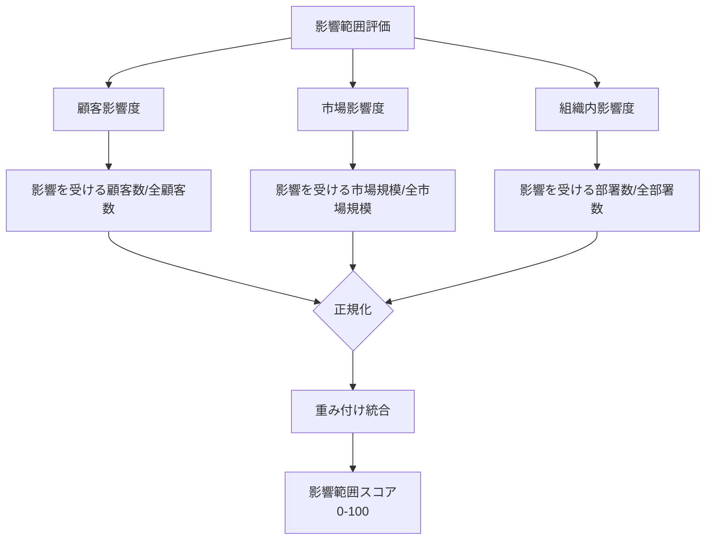
```mermaid
graph TD
    A[影響範囲評価] --> B[顧客影響度]
    A --> C[市場影響度]
    A --> D[組織内影響度]
    B --> E[影響を受ける顧客数/全顧客数]
    C --> F[影響を受ける市場規模/全市場規模]
    D --> G[影響を受ける部署数/全部署数]
    E --> H{正規化}
    F --> H
    G --> H
    H --> I[重み付け統合]
    I --> J[影響範囲スコア<br>0-100]
```
*図6: 影響範囲評価の計算フロー。顧客・市場・組織内の影響度を統合して最終スコアを算出する。*

影響範囲スコアの計算式は以下の通りです：

```javascript
function calculateImpactScope(metrics, params) {
  // 各指標の正規化（0-100のスケールに変換）
  const normalizedCustomerImpact = normalizeMetric(
    metrics.affectedCustomers / metrics.totalCustomers,
    params.customerImpact.min,
    params.customerImpact.max
  );
  
  const normalizedMarketImpact = normalizeMetric(
    metrics.affectedMarketSize / metrics.totalMarketSize,
    params.marketImpact.min,
    params.marketImpact.max
  );
  
  const normalizedOrgImpact = normalizeMetric(
    metrics.affectedDepartments / metrics.totalDepartments,
    params.orgImpact.min,
    params.orgImpact.max
  );
  
  // 重み付け統合
  return (
    params.customerImpact.weight * normalizedCustomerImpact +
    params.marketImpact.weight * normalizedMarketImpact +
    params.orgImpact.weight * normalizedOrgImpact
  );
}

// 指標を0-100のスケールに正規化する関数
function normalizeMetric(value, min, max) {
  if (value <= min) return 0;
  if (value >= max) return 100;
  return ((value - min) / (max - min)) * 100;
}
```
*コード4: 影響範囲評価の計算ロジック。各指標を正規化し、重み付けして統合する。*

#### 6.1.2. 変化の大きさ評価の計算

変化の大きさ評価は、検出された変化の度合いを評価します。計算には以下の指標を用います：

- **成長率変化**: 前期比や前年比での成長率の変化幅
- **技術進歩度**: 既存技術からの進歩の度合い（例：性能向上率、コスト削減率）
- **競合変動率**: 競合のシェアや戦略の変動率

これらの指標も同様に正規化し、重み付けして統合します。業種や評価対象によって、使用する指標や重み付けを調整することが重要です。

#### 6.1.3. 戦略的関連性評価の計算

戦略的関連性評価は、その情報が自社の戦略目標やKPIにどれほど関連しているかを評価します。計算には以下の指標を用います：

- **戦略目標関連度**: 自社の戦略目標との関連度（例：0-5のスケール）
- **KPI影響度**: 主要KPIへの影響度（例：予測される変化率）
- **コア事業関連度**: コア事業領域との関連度（例：0-5のスケール）

これらの指標も同様に正規化し、重み付けして統合します。特に、戦略目標関連度やコア事業関連度のような定性的な指標は、評価者の主観に依存する部分があるため、複数の評価者による評価の平均を取るなどの工夫が必要です。

#### 6.1.4. 時間的緊急性評価の計算

時間的緊急性評価は、その情報に対して対応が必要となるまでの時間的な猶予を評価します。計算には以下の指標を用います：

- **対応期限**: 対応が必要となるまでの期間（例：月数）
- **競合対応速度**: 競合が同様の情報に対応するまでの予測期間（例：月数）
- **市場変化速度**: 関連市場の変化速度（例：年間変化率）

これらの指標も同様に正規化し、重み付けして統合します。特に、対応期限が短いほど緊急性が高いため、正規化の際には逆数を取るなどの処理が必要です。

### 6.2. 確信度評価の計算ロジック

確信度評価は、入力された情報の信頼性や確からしさを定量化するものです。以下に、4つの評価要素（情報源信頼性、データ量・質、一貫性、検証可能性）それぞれの計算ロジックの詳細を示します。

#### 6.2.1. 情報源信頼性評価の計算

情報源信頼性評価は、情報の出所の信頼性を評価します。計算には以下の指標を用います：

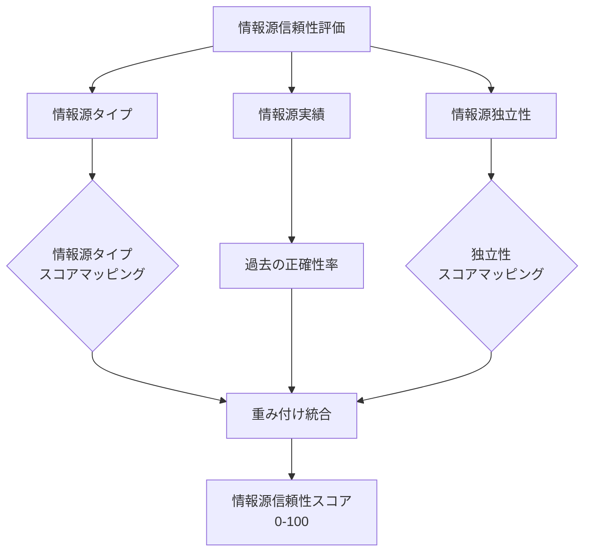
```mermaid
graph TD
    A[情報源信頼性評価] --> B[情報源タイプ]
    A --> C[情報源実績]
    A --> D[情報源独立性]
    B --> E{情報源タイプ<br>スコアマッピング}
    C --> F[過去の正確性率]
    D --> G{独立性<br>スコアマッピング}
    E --> H[重み付け統合]
    F --> H
    G --> H
    H --> I[情報源信頼性スコア<br>0-100]
```
*図7: 情報源信頼性評価の計算フロー。情報源のタイプ、実績、独立性を統合して最終スコアを算出する。*

情報源タイプは、以下のようなスコアマッピングを用いて評価します：

| 情報源タイプ | スコア (0-100) |
|------------|--------------|
| 公式発表（政府、企業など） | 90-100 |
| 信頼できる調査機関 | 80-90 |
| 専門家の意見 | 70-80 |
| 業界メディア | 60-70 |
| 一般メディア | 50-60 |
| SNS（検証済みアカウント） | 40-50 |
| SNS（一般） | 20-40 |
| 匿名の情報 | 0-20 |

情報源実績は、その情報源の過去の情報提供における正確性率を用いて評価します。情報源独立性は、その情報源が評価対象に対して利害関係を持っているかどうかを考慮します。

#### 6.2.2. データ量・質評価の計算

データ量・質評価は、評価の根拠となるデータの量と質を評価します。計算には以下の指標を用います：

- **データポイント数**: 評価に使用されたデータポイントの数
- **サンプルサイズ**: 調査や分析に使用されたサンプルの大きさ
- **データ網羅性**: データが対象領域をどれだけ網羅しているか（例：0-5のスケール）
- **データ最新性**: データの収集時期と現在の時間差

これらの指標も同様に正規化し、重み付けして統合します。特に、データポイント数やサンプルサイズは、評価対象の性質によって「十分な量」が大きく異なるため、業種や評価対象ごとに適切な基準値を設定することが重要です。

#### 6.2.3. 一貫性評価の計算

一貫性評価は、同じ情報源からの時系列データの一貫性や、複数の情報源間での情報の一致度を評価します。計算には以下の指標を用います：

- **時系列一貫性**: 同じ情報源からの時系列データの変動係数（標準偏差/平均）
- **情報源間一致度**: 複数の情報源間での情報の一致率

これらの指標も同様に正規化し、重み付けして統合します。特に、時系列一貫性は値が小さいほど一貫性が高いため、正規化の際には逆数を取るなどの処理が必要です。

#### 6.2.4. 検証可能性評価の計算

検証可能性評価は、その情報が客観的な事実に基づいており、第三者による検証が可能かどうかを評価します。計算には以下の指標を用います：

- **事実ベース度**: 情報が客観的な事実に基づいている度合い（例：0-5のスケール）
- **再現可能性**: 同じ条件で同じ結果が得られる可能性（例：0-5のスケール）
- **検証手段有無**: 検証するための手段や方法が存在するかどうか（例：0/1のバイナリ値）

これらの指標も同様に正規化し、重み付けして統合します。特に、事実ベース度や再現可能性のような定性的な指標は、評価者の主観に依存する部分があるため、複数の評価者による評価の平均を取るなどの工夫が必要です。

### 6.3. 整合性評価の計算ロジック

整合性評価は、3つの視点からの評価結果が互いに矛盾なく整合しているかを定量化するものです。以下に、4つの評価要素（視点間一致度、論理的整合性、時間的整合性、コンテキスト整合性）それぞれの計算ロジックの詳細を示します。

#### 6.3.1. 視点間一致度評価の計算

視点間一致度評価は、テクノロジー、マーケット、ビジネスの各視点からの評価結果がどれほど一致しているかを評価します。計算には以下の指標を用います：

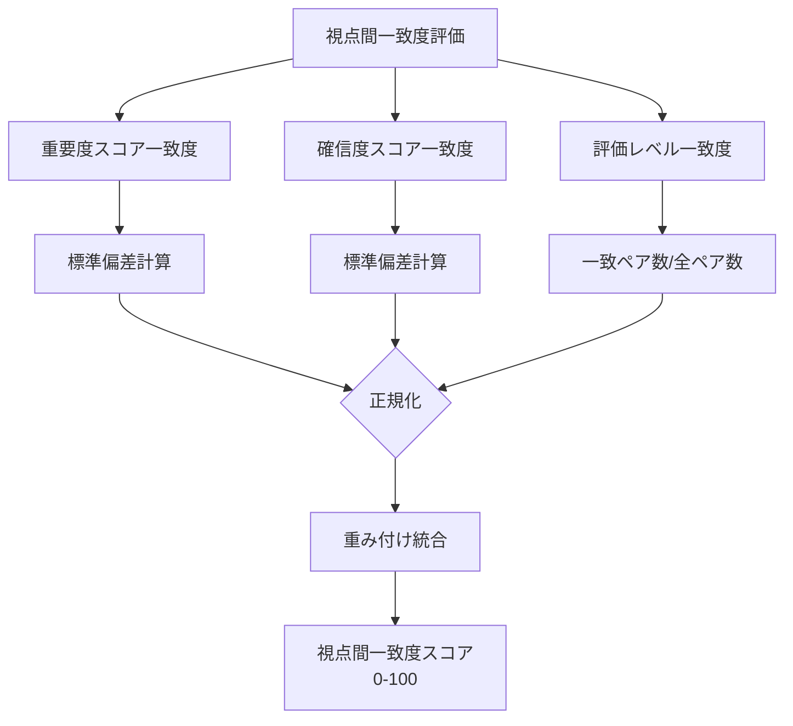
```mermaid
graph TD
    A[視点間一致度評価] --> B[重要度スコア一致度]
    A --> C[確信度スコア一致度]
    A --> D[評価レベル一致度]
    B --> E[標準偏差計算]
    C --> F[標準偏差計算]
    D --> G[一致ペア数/全ペア数]
    E --> H{正規化}
    F --> H
    G --> H
    H --> I[重み付け統合]
    I --> J[視点間一致度スコア<br>0-100]
```
*図8: 視点間一致度評価の計算フロー。重要度・確信度スコアの標準偏差と評価レベルの一致度を統合して最終スコアを算出する。*

視点間一致度スコアの計算式は以下の通りです：

```javascript
function calculatePerspectiveAgreement(tech, market, business, params) {
  // 重要度スコアの標準偏差を計算
  const importanceScores = [
    tech.importance.score,
    market.importance.score,
    business.importance.score
  ];
  const importanceStdDev = calculateStandardDeviation(importanceScores);
  
  // 確信度スコアの標準偏差を計算
  const confidenceScores = [
    tech.confidence.score,
    market.confidence.score,
    business.confidence.score
  ];
  const confidenceStdDev = calculateStandardDeviation(confidenceScores);
  
  // 評価レベルの一致度を計算
  const importanceLevels = [
    tech.importance.level,
    market.importance.level,
    business.importance.level
  ];
  const confidenceLevels = [
    tech.confidence.level,
    market.confidence.level,
    business.confidence.level
  ];
  const levelAgreementRate = calculateLevelAgreementRate(
    importanceLevels.concat(confidenceLevels)
  );
  
  // 標準偏差を一致度スコアに変換（標準偏差が小さいほど一致度が高い）
  const maxStdDev = 50; // 想定される最大標準偏差
  const importanceAgreement = 100 * (1 - Math.min(importanceStdDev / maxStdDev, 1));
  const confidenceAgreement = 100 * (1 - Math.min(confidenceStdDev / maxStdDev, 1));
  
  // 重み付け統合
  return (
    params.importanceAgreement.weight * importanceAgreement +
    params.confidenceAgreement.weight * confidenceAgreement +
    params.levelAgreement.weight * (levelAgreementRate * 100)
  );
}

// 標準偏差を計算する関数
function calculateStandardDeviation(values) {
  const n = values.length;
  const mean = values.reduce((sum, val) => sum + val, 0) / n;
  const variance = values.reduce((sum, val) => sum + Math.pow(val - mean, 2), 0) / n;
  return Math.sqrt(variance);
}

// 評価レベルの一致率を計算する関数
function calculateLevelAgreementRate(levels) {
  let agreementCount = 0;
  const totalPairs = (levels.length * (levels.length - 1)) / 2;
  
  for (let i = 0; i < levels.length; i++) {
    for (let j = i + 1; j < levels.length; j++) {
      if (levels[i] === levels[j]) {
        agreementCount++;
      }
    }
  }
  
  return agreementCount / totalPairs;
}
```
*コード5: 視点間一致度評価の計算ロジック。重要度・確信度スコアの標準偏差と評価レベルの一致率を統合する。*

#### 6.3.2. 論理的整合性評価の計算

論理的整合性評価は、各視点の評価の根拠となるロジックや前提条件に矛盾がないかを評価します。この評価は、単純な数値計算だけでは難しく、より高度な自然言語処理や専門家の判断を要する場合があります。以下に、簡易的な計算アプローチを示します：

1. 各視点の評価根拠を構造化データ（例：キーとなる前提条件、ロジックのステップ）として抽出
2. 前提条件間の矛盾をルールベースでチェック（例：「市場は拡大する」と「市場は縮小する」は矛盾）
3. ロジックのステップ間の矛盾をチェック（例：「コスト増加」と「利益率向上」が同時に主張される場合は要検証）
4. 矛盾の数と重大度に基づいてスコアを算出

#### 6.3.3. 時間的整合性評価の計算

時間的整合性評価は、現在の評価結果が、過去のトレンドや評価結果と整合しているかを評価します。計算には以下の指標を用います：

- **トレンド整合性**: 現在の評価結果が過去のトレンドの延長線上にあるかどうか
- **変化率の妥当性**: 前回評価からの変化率が妥当な範囲内かどうか
- **予測との一致度**: 過去の予測と現在の実績の一致度

これらの指標も同様に正規化し、重み付けして統合します。特に、急激な変化が検出された場合は、その変化に対する説明や根拠が十分かどうかを追加で評価することが重要です。

#### 6.3.4. コンテキスト整合性評価の計算

コンテキスト整合性評価は、評価結果が、より広範な業界動向やマクロ環境の文脈と整合しているかを評価します。計算には以下の指標を用います：

- **業界トレンド整合性**: 評価結果が業界全体のトレンドと整合しているかどうか
- **マクロ環境整合性**: 評価結果が経済、政治、社会などのマクロ環境と整合しているかどうか
- **競合動向整合性**: 評価結果が競合他社の動向と整合しているかどうか

これらの指標も同様に正規化し、重み付けして統合します。特に、業界やマクロ環境との不整合が検出された場合は、その理由（例：自社特有の状況、新たな破壊的イノベーションの兆候）を追加で評価することが重要です。

### 6.4. 評価パラメータの動的調整メカニズム

評価メカニズムの有効性を継続的に高めるためには、評価パラメータ（重み、閾値など）を動的に調整するメカニズムが重要です。以下に、そのようなメカニズムの実装アプローチを示します。

#### 6.4.1. フィードバックループの構築

評価結果と実際のビジネス成果との関連性を分析し、パラメータを最適化するためのフィードバックループを構築します。

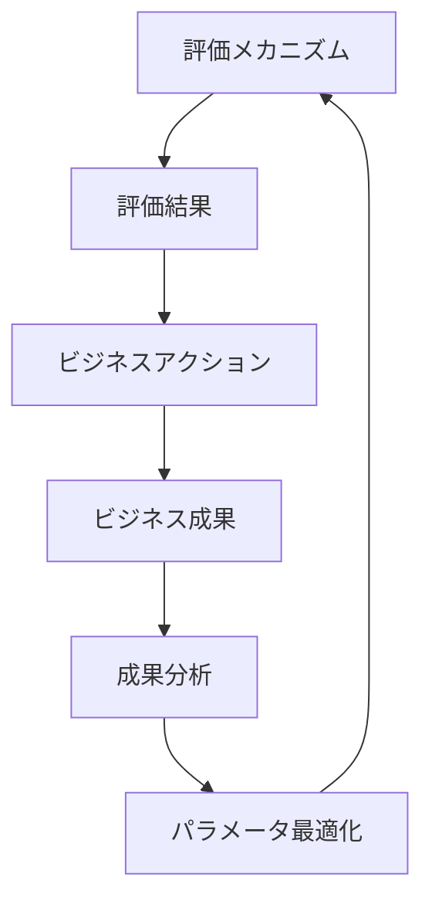
```mermaid
graph TD
    A[評価メカニズム] --> B[評価結果]
    B --> C[ビジネスアクション]
    C --> D[ビジネス成果]
    D --> E[成果分析]
    E --> F[パラメータ最適化]
    F --> A
```
*図9: 評価パラメータの動的調整のためのフィードバックループ。ビジネス成果に基づいてパラメータを最適化する。*

#### 6.4.2. A/Bテスト手法の適用

複数のパラメータセットを並行して運用し、それぞれの有効性を比較するA/Bテスト手法を適用します。例えば、重要度評価の重み付けを変えた2つのバージョンを運用し、どちらがより正確な評価結果を提供するかを検証します。

#### 6.4.3. 機械学習による自動最適化

十分なデータが蓄積された段階では、機械学習アルゴリズムを用いてパラメータを自動最適化することも検討できます。例えば、過去の評価結果とビジネス成果のデータセットを用いて、最適なパラメータを学習させます。

```javascript
/**
 * 評価パラメータを最適化する関数（概念的な例）
 * @param {array} historicalData - 過去の評価結果とビジネス成果のデータセット
 * @param {object} currentParams - 現在のパラメータ
 * @returns {object} - 最適化されたパラメータ
 */
function optimizeParameters(historicalData, currentParams) {
  // 1. 評価結果とビジネス成果の相関分析
  const correlationAnalysis = analyzeCorrelation(historicalData);
  
  // 2. 相関係数に基づく重み調整
  const adjustedWeights = adjustWeightsByCorrelation(
    currentParams.weights,
    correlationAnalysis
  );
  
  // 3. 閾値の最適化（例：分類精度を最大化する閾値を探索）
  const optimizedThresholds = findOptimalThresholds(
    historicalData,
    adjustedWeights
  );
  
  // 4. 最適化されたパラメータを返却
  return {
    weights: adjustedWeights,
    thresholds: optimizedThresholds
  };
}
```
*コード6: 評価パラメータを最適化するための概念的なコード例。過去データに基づいて重みと閾値を調整する。*

#### 6.4.4. 業種別パラメータ調整ガイド

評価パラメータは業種によって最適値が異なる場合が多いため、主要業種ごとの調整ガイドを提供することも有用です。以下に、3つの代表的な業種における重要度評価の重み付け例を示します：

| 評価要素 | 製造業 | 小売業 | 金融業 |
|--------|------|------|------|
| 影響範囲 | 0.25 | 0.30 | 0.20 |
| 変化の大きさ | 0.20 | 0.15 | 0.25 |
| 戦略的関連性 | 0.30 | 0.25 | 0.30 |
| 時間的緊急性 | 0.25 | 0.30 | 0.25 |

このような業種別ガイドは、初期設定値として参考にしつつ、各組織の特性に合わせて微調整することが推奨されます。

## 7. 実践的ユースケース

ここまで、コンセンサスモデルの評価メカニズムの理論的な側面と技術的な実装方法について解説してきました。本セクションでは、この評価メカニズムが実際のビジネスシーンでどのように活用できるかを、具体的なユースケースを通じて説明します。製造業、小売業、金融業の3つの業種における活用例を紹介し、それぞれの業種特有の課題と対応方法を示します。

### 7.1. 製造業：新製品開発評価

製造業では、新製品開発の意思決定において、技術的実現可能性、市場ニーズ、ビジネス採算性の3つの視点のバランスが重要です。コンセンサスモデルの評価メカニズムを活用することで、これらの視点を統合した意思決定が可能になります。

#### 7.1.1. 具体的なシナリオ

ある自動車部品メーカーが、次世代の電気自動車向け高効率モーターの開発を検討しているとします。この意思決定には、以下の3つの視点からの情報が関係します：

- **テクノロジー視点**: 新素材の性能データ、試作品のテスト結果、特許状況
- **マーケット視点**: 電気自動車市場の成長予測、競合他社の動向、顧客（自動車メーカー）のニーズ
- **ビジネス視点**: 開発コスト、量産時の原価、予想利益率、投資回収期間

#### 7.1.2. 評価パラメータの調整

製造業の新製品開発評価では、以下のようなパラメータ調整が効果的です：

- **重要度評価**: 戦略的関連性の重みを高く設定（例：0.30）し、自社の技術ロードマップとの整合性を重視
- **確信度評価**: データ量・質の重みを高く設定（例：0.30）し、十分なテストデータに基づく判断を重視
- **整合性評価**: 論理的整合性の重みを高く設定（例：0.30）し、技術的制約と市場ニーズの矛盾を検出

#### 7.1.3. 評価ワークフローの例

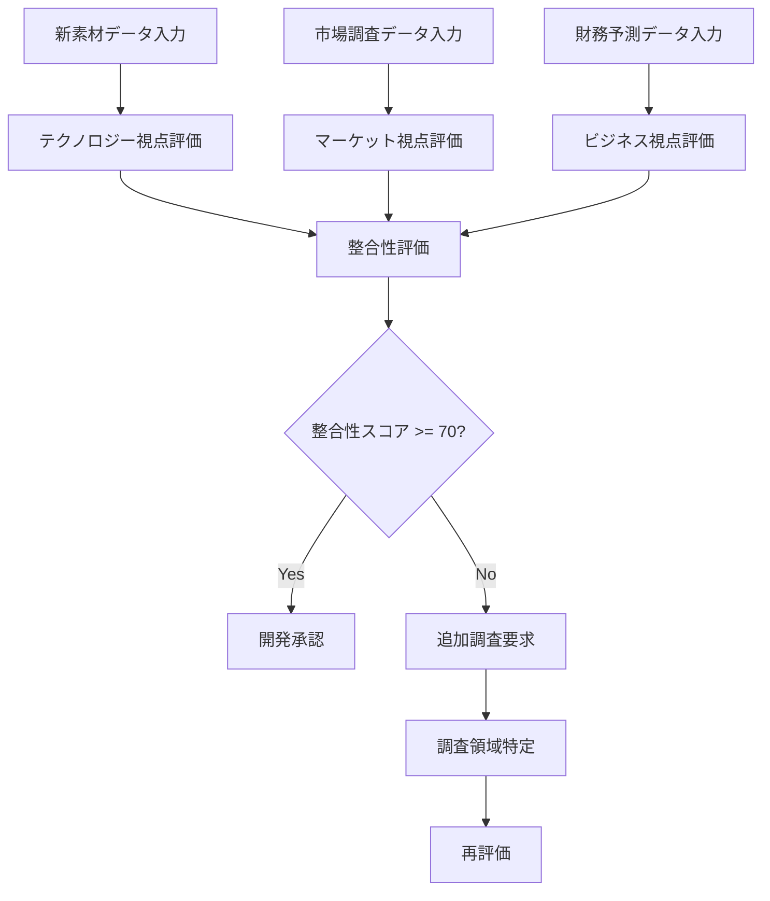
```mermaid
graph TD
    A[新素材データ入力] --> B[テクノロジー視点評価]
    C[市場調査データ入力] --> D[マーケット視点評価]
    E[財務予測データ入力] --> F[ビジネス視点評価]
    B --> G[整合性評価]
    D --> G
    F --> G
    G --> H{整合性スコア >= 70?}
    H -- Yes --> I[開発承認]
    H -- No --> J[追加調査要求]
    J --> K[調査領域特定]
    K --> L[再評価]
```
*図10: 製造業における新製品開発評価のワークフロー例。3視点の評価結果の整合性に基づいて意思決定を行う。*

#### 7.1.4. 実装上の注意点

製造業の新製品開発評価では、以下の点に注意が必要です：

- **長期的視点の反映**: 製品開発サイクルが長いため、時間的緊急性の評価では短期的な変化だけでなく、長期的なトレンドも考慮する
- **技術的不確実性の考慮**: 新技術の場合、確信度評価において技術的不確実性を適切に反映する
- **サプライチェーンの影響**: 影響範囲評価において、サプライチェーン全体への波及効果を考慮する

### 7.2. 小売業：新市場参入評価

小売業では、新しい地域や商品カテゴリーへの参入判断において、消費者トレンド、競合状況、事業採算性の3つの視点のバランスが重要です。コンセンサスモデルの評価メカニズムを活用することで、これらの視点を統合した意思決定が可能になります。

#### 7.2.1. 具体的なシナリオ

ある食品小売チェーンが、オーガニック食品専門店の新規出店を検討しているとします。この意思決定には、以下の3つの視点からの情報が関係します：

- **テクノロジー視点**: 食品保存技術の進化、サプライチェーン管理システム、オンラインとの連携技術
- **マーケット視点**: オーガニック食品の需要トレンド、競合店舗の状況、消費者の購買行動データ
- **ビジネス視点**: 出店コスト、運営コスト、予想売上、投資回収期間

#### 7.2.2. 評価パラメータの調整

小売業の新市場参入評価では、以下のようなパラメータ調整が効果的です：

- **重要度評価**: 影響範囲と時間的緊急性の重みを高く設定（例：各0.30）し、市場の広がりと変化の速さを重視
- **確信度評価**: 情報源信頼性と一貫性の重みを高く設定（例：各0.30）し、市場調査データの信頼性を重視
- **整合性評価**: 視点間一致度の重みを高く設定（例：0.40）し、3視点の評価結果の一致を重視

#### 7.2.3. 評価ワークフローの例

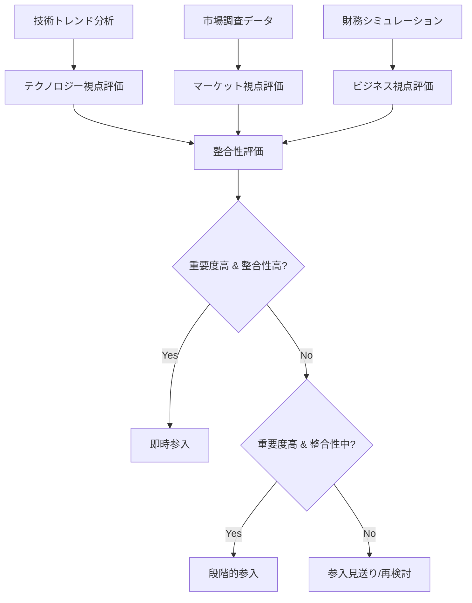
```mermaid
graph TD
    A[技術トレンド分析] --> B[テクノロジー視点評価]
    C[市場調査データ] --> D[マーケット視点評価]
    E[財務シミュレーション] --> F[ビジネス視点評価]
    B --> G[整合性評価]
    D --> G
    F --> G
    G --> H{重要度高 & 整合性高?}
    H -- Yes --> I[即時参入]
    H -- No --> J{重要度高 & 整合性中?}
    J -- Yes --> K[段階的参入]
    J -- No --> L[参入見送り/再検討]
```
*図11: 小売業における新市場参入評価のワークフロー例。重要度と整合性に基づいて参入戦略を決定する。*

#### 7.2.4. 実装上の注意点

小売業の新市場参入評価では、以下の点に注意が必要です：

- **地域特性の反映**: 地域ごとの消費者特性や競合状況の違いを評価パラメータに反映する
- **季節変動の考慮**: 時間的整合性評価において、季節による需要変動を考慮する
- **消費者行動データの活用**: 確信度評価において、実際の消費者行動データ（POSデータなど）を重視する

### 7.3. 金融業：投資戦略評価

金融業では、新たな投資戦略や金融商品の開発において、市場動向、リスク評価、収益性の3つの視点のバランスが重要です。コンセンサスモデルの評価メカニズムを活用することで、これらの視点を統合した意思決定が可能になります。

#### 7.3.1. 具体的なシナリオ

ある資産運用会社が、AIを活用した新しい投資戦略の導入を検討しているとします。この意思決定には、以下の3つの視点からの情報が関係します：

- **テクノロジー視点**: AI技術の成熟度、データ分析能力、システム安定性
- **マーケット視点**: 市場の効率性、類似戦略の実績、投資家のニーズ
- **ビジネス視点**: 開発コスト、運用コスト、予想リターン、リスク指標

#### 7.3.2. 評価パラメータの調整

金融業の投資戦略評価では、以下のようなパラメータ調整が効果的です：

- **重要度評価**: 変化の大きさの重みを高く設定（例：0.30）し、市場の変動性を重視
- **確信度評価**: 検証可能性の重みを高く設定（例：0.30）し、バックテストや実証データを重視
- **整合性評価**: 時間的整合性の重みを高く設定（例：0.30）し、市場サイクルとの整合性を重視

#### 7.3.3. 評価ワークフローの例

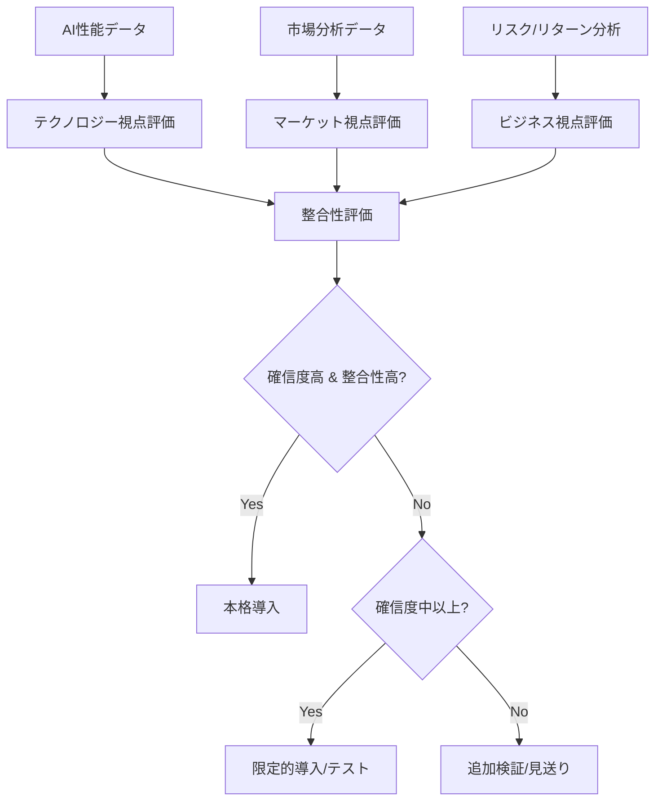
```mermaid
graph TD
    A[AI性能データ] --> B[テクノロジー視点評価]
    C[市場分析データ] --> D[マーケット視点評価]
    E[リスク/リターン分析] --> F[ビジネス視点評価]
    B --> G[整合性評価]
    D --> G
    F --> G
    G --> H{確信度高 & 整合性高?}
    H -- Yes --> I[本格導入]
    H -- No --> J{確信度中以上?}
    J -- Yes --> K[限定的導入/テスト]
    J -- No --> L[追加検証/見送り]
```
*図12: 金融業における投資戦略評価のワークフロー例。確信度と整合性に基づいて導入範囲を決定する。*

#### 7.3.4. 実装上の注意点

金融業の投資戦略評価では、以下の点に注意が必要です：

- **リスク評価の重視**: 確信度評価において、下振れリスクの評価を特に重視する
- **市場環境の変化への対応**: 評価パラメータを市場環境（強気相場/弱気相場など）に応じて動的に調整する
- **規制要件の考慮**: 整合性評価において、規制要件との整合性も評価要素に含める

## 8. 技術的課題と対応策

コンセンサスモデルの評価メカニズムを実装する際には、いくつかの技術的課題が生じる可能性があります。本セクションでは、主要な課題とその対応策について解説します。

### 8.1. パフォーマンスとスケーラビリティ

#### 8.1.1. 課題

評価対象のトピック数や評価頻度が増加すると、計算負荷が高まり、レスポンス時間が長くなる可能性があります。特に、整合性評価プロセスでは複数の視点からのデータを統合して処理する必要があるため、ボトルネックとなりやすい傾向があります。

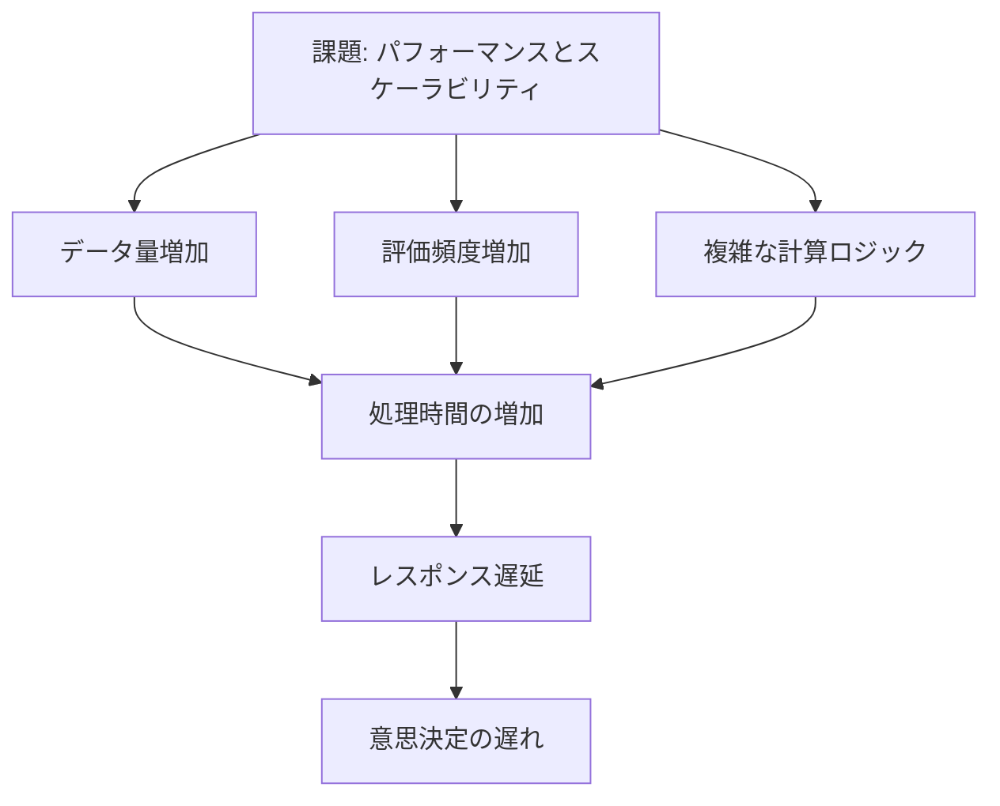
```mermaid
graph TD
    A[課題: パフォーマンスとスケーラビリティ] --> B[データ量増加]
    A --> C[評価頻度増加]
    A --> D[複雑な計算ロジック]
    B --> E[処理時間の増加]
    C --> E
    D --> E
    E --> F[レスポンス遅延]
    F --> G[意思決定の遅れ]
```
*図13: パフォーマンスとスケーラビリティの課題と影響。データ量や評価頻度の増加が意思決定の遅れにつながる可能性がある。*

#### 8.1.2. 対応策

1. **非同期処理の導入**: 評価プロセスを非同期で実行し、結果が必要になるまでにバックグラウンドで処理を完了させる
2. **キャッシュ機構の実装**: 頻繁に参照される評価結果をキャッシュし、再計算を回避する
3. **分散処理の活用**: 大量のトピックの評価を複数のワーカーノードに分散して処理する
4. **段階的評価の導入**: まず簡易的な評価を行い、重要なトピックのみ詳細な評価を行う2段階アプローチを採用する

```javascript
/**
 * 評価プロセスのパフォーマンス最適化例
 * @param {array} topics - 評価対象のトピックリスト
 */
async function optimizedEvaluationProcess(topics) {
  // 1. トピックの優先順位付け
  const prioritizedTopics = prioritizeTopics(topics);
  
  // 2. バッチ処理の準備
  const batches = createBatches(prioritizedTopics, BATCH_SIZE);
  
  // 3. バッチごとに並列処理
  const evaluationPromises = batches.map(batch => 
    Promise.all(batch.map(topic => evaluateTopic(topic)))
  );
  
  // 4. バッチ処理の実行と結果の統合
  const batchResults = await Promise.all(evaluationPromises);
  const allResults = batchResults.flat();
  
  // 5. 結果のキャッシュ保存
  cacheResults(allResults);
  
  return allResults;
}

// キャッシュからの結果取得を試みる関数
function tryGetFromCache(topic) {
  const cachedResult = cache.get(`evaluation:${topic.id}`);
  if (cachedResult && !isExpired(cachedResult)) {
    return cachedResult;
  }
  return null;
}

// 評価結果をキャッシュに保存する関数
function cacheResults(results) {
  results.forEach(result => {
    cache.set(`evaluation:${result.topic_id}`, result, CACHE_TTL);
  });
}
```
*コード7: 評価プロセスのパフォーマンス最適化のためのコード例。優先順位付け、バッチ処理、キャッシュを活用する。*

### 8.2. データの品質と一貫性

#### 8.2.1. 課題

評価メカニズムの精度は、入力データの品質に大きく依存します。データの欠損、不整合、古さなどの問題は、評価結果の信頼性を低下させる可能性があります。特に、3つの視点からのデータが異なるソースや形式で提供される場合、データの統合と正規化が課題となります。

#### 8.2.2. 対応策

1. **データ検証メカニズムの導入**: 入力データの形式、範囲、論理的整合性などを自動的に検証する
2. **データクレンジングパイプラインの構築**: 欠損値の補完、外れ値の処理、重複の除去などを行う前処理パイプラインを実装する
3. **データ鮮度の監視**: データの最終更新日時を追跡し、一定期間を超えた古いデータには警告フラグを立てる
4. **データソースの多様化**: 単一のデータソースへの依存を避け、複数のソースからのデータを統合する

```javascript
/**
 * 入力データの品質を検証する関数
 * @param {object} data - 検証対象のデータ
 * @returns {object} - 検証結果（有効かどうか、問題点のリストなど）
 */
function validateInputData(data) {
  const issues = [];
  
  // 1. 必須フィールドの存在チェック
  const requiredFields = ['topic_id', 'perspective_id', 'metrics'];
  requiredFields.forEach(field => {
    if (!data[field]) {
      issues.push(`Missing required field: ${field}`);
    }
  });
  
  // 2. データ型のチェック
  if (data.metrics && typeof data.metrics !== 'object') {
    issues.push('Metrics must be an object');
  }
  
  // 3. 値の範囲チェック
  if (data.metrics) {
    Object.entries(data.metrics).forEach(([key, value]) => {
      if (typeof value === 'number' && (value < 0 || value > 100)) {
        issues.push(`Metric ${key} out of range (0-100): ${value}`);
      }
    });
  }
  
  // 4. データの鮮度チェック
  if (data.timestamp) {
    const dataAge = Date.now() - new Date(data.timestamp).getTime();
    const maxAge = 30 * 24 * 60 * 60 * 1000; // 30日
    if (dataAge > maxAge) {
      issues.push(`Data is too old: ${Math.floor(dataAge / (24 * 60 * 60 * 1000))} days`);
    }
  } else {
    issues.push('Missing timestamp');
  }
  
  return {
    isValid: issues.length === 0,
    issues: issues
  };
}
```
*コード8: 入力データの品質を検証するためのコード例。必須フィールド、データ型、値の範囲、データの鮮度をチェックする。*

### 8.3. 評価ロジックの透明性と説明可能性

#### 8.3.1. 課題

評価メカニズムが複雑になるほど、なぜその評価結果になったのかを説明することが難しくなります。特に、重み付けや閾値の設定根拠が不明確な場合、ユーザーは評価結果を信頼しにくくなります。また、評価ロジックがブラックボックス化すると、問題の特定や改善が困難になります。

#### 8.3.2. 対応策

1. **評価プロセスの可視化**: 各ステップでの中間結果を記録し、評価の流れを可視化する
2. **説明生成機能の実装**: 評価結果に加えて、その結果に至った主要な要因や根拠を自然言語で説明する機能を提供する
3. **感度分析ツールの提供**: パラメータ（重み、閾値など）を変更した場合の評価結果の変化をシミュレートできるツールを提供する
4. **評価ログの詳細化**: 評価プロセスの各ステップでのデータ、計算、判断をログとして記録し、後から追跡可能にする

```javascript
/**
 * 評価結果に説明を付加する関数
 * @param {object} evaluationResult - 評価結果オブジェクト
 * @returns {object} - 説明が付加された評価結果オブジェクト
 */
function addExplanation(evaluationResult) {
  const { importance, confidence, coherence } = evaluationResult;
  let explanation = '';
  
  // 1. 重要度の説明
  explanation += `重要度は${importance.level}（スコア: ${importance.score}）と評価されました。`;
  
  // 主要因の特定
  const topImportanceFactors = getTopFactors(importance.components);
  explanation += `主な要因は${topImportanceFactors.join('と')}です。`;
  
  // 2. 確信度の説明
  explanation += `確信度は${confidence.level}（スコア: ${confidence.score}）と評価されました。`;
  
  // 主要因の特定
  const topConfidenceFactors = getTopFactors(confidence.components);
  explanation += `主な要因は${topConfidenceFactors.join('と')}です。`;
  
  // 3. 整合性の説明
  if (coherence) {
    explanation += `3つの視点の整合性は${coherence.level}（スコア: ${coherence.score}）と評価されました。`;
    
    // 不一致がある場合の説明
    if (coherence.level !== 'high') {
      const disagreements = getDisagreements(coherence.details);
      explanation += `特に${disagreements.join('と')}の間で不一致が見られます。`;
    }
  }
  
  // 4. 総合的な推奨事項
  explanation += generateRecommendation(evaluationResult);
  
  return {
    ...evaluationResult,
    explanation: explanation
  };
}

// 評価要素の中から最も影響の大きい要素を抽出する関数
function getTopFactors(components) {
  return Object.entries(components)
    .sort((a, b) => b[1] - a[1])
    .slice(0, 2)
    .map(([key, value]) => {
      const readableKey = key.replace(/_/g, ' ');
      return `${readableKey}（${value}点）`;
    });
}

// 視点間の不一致を特定する関数
function getDisagreements(details) {
  // 実装省略
  return ['テクノロジー視点とビジネス視点の重要度評価'];
}

// 評価結果に基づく推奨事項を生成する関数
function generateRecommendation(evaluationResult) {
  // 実装省略
  return '総合的に見て、このトピックは注視すべき重要な変化点ですが、さらなるデータ収集が推奨されます。';
}
```
*コード9: 評価結果に説明を付加するためのコード例。重要度、確信度、整合性の評価結果から自然言語の説明を生成する。*

### 8.4. システム統合とワークフロー自動化

#### 8.4.1. 課題

コンセンサスモデルの評価メカニズムを既存のシステムやワークフローに統合する際には、データ形式の違い、API連携の複雑さ、認証・認可の問題などが課題となります。また、評価プロセス全体を自動化し、人間の介入を最小限に抑えることも重要です。

#### 8.4.2. 対応策

1. **標準化されたAPIの設計**: RESTful APIやGraphQL APIなど、広く採用されている標準に準拠したAPIを設計する
2. **イベント駆動アーキテクチャの採用**: 特定のイベント（例：新しいデータの到着、定期的なスケジュール）をトリガーとして評価プロセスを自動的に開始する
3. **データ変換レイヤーの実装**: 異なるシステム間でのデータ形式の変換を担当する中間レイヤーを実装する
4. **ワークフロー管理ツールの活用**: n8nなどのワークフロー管理ツールを活用して、複数のシステムやサービスを連携させる

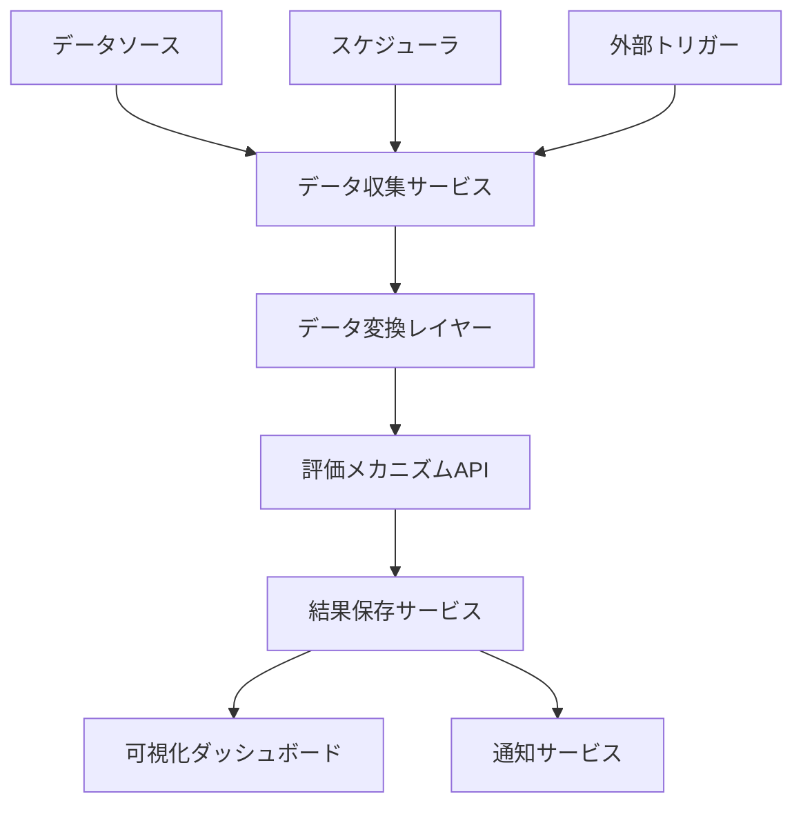
```mermaid
graph TD
    A[データソース] --> B[データ収集サービス]
    B --> C[データ変換レイヤー]
    C --> D[評価メカニズムAPI]
    D --> E[結果保存サービス]
    E --> F[可視化ダッシュボード]
    E --> G[通知サービス]
    H[スケジューラ] --> B
    I[外部トリガー] --> B
```
*図14: システム統合アーキテクチャの例。データ収集から結果の可視化・通知までの流れを示す。*

n8nを活用したワークフロー自動化の例を以下に示します：

1. **データ収集ワークフロー**: 複数のソース（API、データベース、ファイルなど）からデータを定期的に収集
2. **データ前処理ワークフロー**: 収集したデータのクレンジング、変換、統合を行う
3. **評価実行ワークフロー**: 前処理されたデータを用いて評価プロセスを実行
4. **結果通知ワークフロー**: 評価結果に基づいて、関係者への通知やアラートを送信

これらのワークフローをn8nで連携させることで、データの収集から評価結果の通知までの一連のプロセスを自動化できます。

## 9. 評価と検証フレームワーク

コンセンサスモデルの評価メカニズムを継続的に改善し、その有効性を確保するためには、評価メカニズム自体を評価・検証するフレームワークが必要です。本セクションでは、そのようなフレームワークの構築方法と実装アプローチについて解説します。

### 9.1. 評価メカニズムの精度測定

#### 9.1.1. 精度指標の定義

評価メカニズムの精度を測定するためには、適切な指標を定義する必要があります。以下に、主要な精度指標を示します：

- **予測精度**: 評価結果に基づく予測と実際の結果の一致度
- **一貫性**: 同様の入力に対する評価結果の安定性
- **識別力**: 重要な情報と重要でない情報を区別する能力
- **適時性**: 重要な変化を適切なタイミングで検出する能力

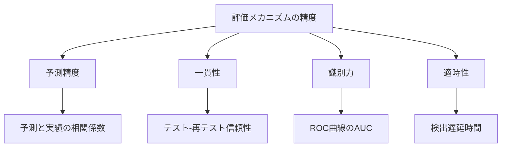
```mermaid
graph TD
    A[評価メカニズムの精度] --> B[予測精度]
    A --> C[一貫性]
    A --> D[識別力]
    A --> E[適時性]
    B --> F[予測と実績の相関係数]
    C --> G[テスト-再テスト信頼性]
    D --> H[ROC曲線のAUC]
    E --> I[検出遅延時間]
```
*図15: 評価メカニズムの精度指標の階層構造。4つの主要指標とその測定方法を示す。*

#### 9.1.2. ベンチマークデータセットの構築

評価メカニズムの精度を客観的に測定するためには、ベンチマークデータセットを構築することが重要です。このデータセットには、以下の要素を含めるべきです：

1. **過去の評価対象**: 過去に評価された情報や変化点のサンプル
2. **ゴールド標準**: 専門家によって判断された「正解」の評価結果
3. **実際の結果**: その情報や変化点がビジネスに与えた実際の影響
4. **多様なケース**: 様々な業種、状況、重要度レベルのケース

このようなベンチマークデータセットを用いて、評価メカニズムの精度を定期的に測定し、改善の効果を客観的に評価することができます。

#### 9.1.3. A/Bテスト手法

評価メカニズムの改善案を検証するためには、A/Bテスト手法が有効です。以下のステップで実施します：

1. **テスト設計**: 現行版（A）と改善版（B）の評価メカニズムを並行して運用する計画を立てる
2. **データ分割**: 評価対象を無作為に2つのグループに分け、それぞれAとBで評価する
3. **結果比較**: 両グループの評価結果の精度、一貫性、識別力、適時性を比較する
4. **統計的検証**: 差異が統計的に有意かどうかを検証する

```javascript
/**
 * A/Bテストの結果を分析する関数
 * @param {array} resultsA - 現行版の評価結果
 * @param {array} resultsB - 改善版の評価結果
 * @param {array} groundTruth - ゴールド標準（正解データ）
 * @returns {object} - 分析結果
 */
function analyzeABTest(resultsA, resultsB, groundTruth) {
  // 1. 予測精度の比較
  const accuracyA = calculateAccuracy(resultsA, groundTruth);
  const accuracyB = calculateAccuracy(resultsB, groundTruth);
  
  // 2. 一貫性の比較
  const consistencyA = calculateConsistency(resultsA);
  const consistencyB = calculateConsistency(resultsB);
  
  // 3. 識別力の比較
  const discriminationA = calculateROCAUC(resultsA, groundTruth);
  const discriminationB = calculateROCAUC(resultsB, groundTruth);
  
  // 4. 適時性の比較
  const timelinessA = calculateTimeliness(resultsA, groundTruth);
  const timelinessB = calculateTimeliness(resultsB, groundTruth);
  
  // 5. 統計的有意差の検定
  const significanceTests = {
    accuracy: performTTest(accuracyA, accuracyB),
    consistency: performTTest(consistencyA, consistencyB),
    discrimination: performTTest(discriminationA, discriminationB),
    timeliness: performTTest(timelinessA, timelinessB)
  };
  
  // 6. 総合評価
  const overallImprovement = calculateOverallImprovement({
    accuracy: accuracyB - accuracyA,
    consistency: consistencyB - consistencyA,
    discrimination: discriminationB - discriminationA,
    timeliness: timelinessB - timelinessA
  }, significanceTests);
  
  return {
    metrics: {
      accuracy: { A: accuracyA, B: accuracyB, diff: accuracyB - accuracyA },
      consistency: { A: consistencyA, B: consistencyB, diff: consistencyB - consistencyA },
      discrimination: { A: discriminationA, B: discriminationB, diff: discriminationB - discriminationA },
      timeliness: { A: timelinessA, B: timelinessB, diff: timelinessB - timelinessA }
    },
    significanceTests: significanceTests,
    overallImprovement: overallImprovement,
    recommendation: overallImprovement > 0.1 ? 'Adopt version B' : 'Keep version A'
  };
}
```
*コード10: A/Bテストの結果を分析するためのコード例。4つの精度指標を比較し、統計的有意差を検定する。*

### 9.2. フィードバックループの構築

#### 9.2.1. フィードバック収集メカニズム

評価メカニズムを継続的に改善するためには、ユーザーからのフィードバックを効率的に収集するメカニズムが必要です。以下に、主要なフィードバック収集方法を示します：

1. **明示的フィードバック**: 評価結果に対する「正確/不正確」のフラグ付け、5段階評価など
2. **暗黙的フィードバック**: ユーザーの行動（評価結果に基づいたアクションを取ったかどうかなど）の追跡
3. **構造化コメント**: 特定の側面（重要度、確信度、整合性など）に対する詳細なコメント
4. **定期的なユーザーインタビュー**: 評価メカニズムの使用体験に関する深堀りインタビュー

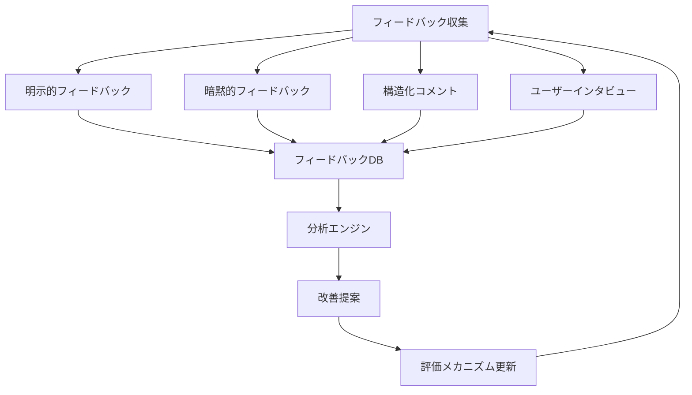
```mermaid
graph TD
    A[フィードバック収集] --> B[明示的フィードバック]
    A --> C[暗黙的フィードバック]
    A --> D[構造化コメント]
    A --> E[ユーザーインタビュー]
    B --> F[フィードバックDB]
    C --> F
    D --> F
    E --> F
    F --> G[分析エンジン]
    G --> H[改善提案]
    H --> I[評価メカニズム更新]
    I --> A
```
*図16: フィードバックループの構造。フィードバック収集から評価メカニズム更新までの循環を示す。*

#### 9.2.2. フィードバック分析と優先順位付け

収集したフィードバックを効果的に活用するためには、適切な分析と優先順位付けが重要です。以下のアプローチが有効です：

1. **フィードバックの分類**: フィードバックを種類（バグ報告、機能要望、使いやすさ改善など）ごとに分類
2. **影響度評価**: 各フィードバックが評価メカニズムの精度や有用性に与える影響を評価
3. **実装難易度評価**: 各改善提案の実装難易度や必要リソースを評価
4. **優先順位マトリクス**: 影響度と実装難易度に基づいて優先順位を決定

```javascript
/**
 * フィードバックの優先順位を決定する関数
 * @param {array} feedbackItems - フィードバック項目のリスト
 * @returns {array} - 優先順位付けされたフィードバック項目のリスト
 */
function prioritizeFeedback(feedbackItems) {
  // 1. 各フィードバック項目の影響度と実装難易度を評価
  const scoredItems = feedbackItems.map(item => {
    const impactScore = evaluateImpact(item);
    const difficultyScore = evaluateDifficulty(item);
    
    // 2. 優先度スコアを計算（影響度が高く、難易度が低いものが高スコア）
    const priorityScore = impactScore / (difficultyScore + 1);
    
    return {
      ...item,
      impactScore,
      difficultyScore,
      priorityScore
    };
  });
  
  // 3. 優先度スコアでソート
  return scoredItems.sort((a, b) => b.priorityScore - a.priorityScore);
}

// フィードバックの影響度を評価する関数
function evaluateImpact(feedbackItem) {
  let score = 0;
  
  // 影響を受けるユーザー数
  if (feedbackItem.affectedUsers === 'all') score += 5;
  else if (feedbackItem.affectedUsers === 'many') score += 3;
  else score += 1;
  
  // 精度への影響
  if (feedbackItem.accuracyImpact === 'high') score += 5;
  else if (feedbackItem.accuracyImpact === 'medium') score += 3;
  else score += 1;
  
  // 頻度
  if (feedbackItem.frequency === 'always') score += 5;
  else if (feedbackItem.frequency === 'often') score += 3;
  else score += 1;
  
  return score;
}

// 実装難易度を評価する関数
function evaluateDifficulty(feedbackItem) {
  let score = 0;
  
  // 技術的複雑さ
  if (feedbackItem.technicalComplexity === 'high') score += 5;
  else if (feedbackItem.technicalComplexity === 'medium') score += 3;
  else score += 1;
  
  // 必要リソース
  if (feedbackItem.requiredResources === 'high') score += 5;
  else if (feedbackItem.requiredResources === 'medium') score += 3;
  else score += 1;
  
  // 依存関係
  if (feedbackItem.dependencies === 'many') score += 5;
  else if (feedbackItem.dependencies === 'some') score += 3;
  else score += 1;
  
  return score;
}
```
*コード11: フィードバックの優先順位を決定するためのコード例。影響度と実装難易度に基づいて優先度スコアを計算する。*

#### 9.2.3. 継続的改善プロセス

フィードバックに基づく継続的改善を実現するためには、以下のようなプロセスを確立することが重要です：

1. **定期的なレビューサイクル**: 月次や四半期ごとに評価メカニズムの性能をレビュー
2. **改善計画の策定**: 優先順位の高いフィードバックに基づいて具体的な改善計画を策定
3. **段階的な実装**: 大きな変更は小さなステップに分割して段階的に実装
4. **効果測定**: 各改善の効果を測定し、期待通りの結果が得られない場合は調整

このような継続的改善プロセスを通じて、評価メカニズムの精度と有用性を徐々に高めていくことができます。

### 9.3. 業種別評価基準の調整

#### 9.3.1. 業種特性の反映

評価メカニズムの有効性を高めるためには、業種ごとの特性を反映した評価基準の調整が重要です。以下に、主要な業種ごとの調整ポイントを示します：

| 業種 | 重要度評価の調整 | 確信度評価の調整 | 整合性評価の調整 |
|-----|--------------|--------------|--------------|
| 製造業 | 技術的変化の影響を重視 | 実験データや試作結果を重視 | 長期的な整合性を重視 |
| 小売業 | 消費者行動の変化を重視 | 販売データや顧客フィードバックを重視 | 季節変動を考慮した整合性を評価 |
| 金融業 | リスク要因の変化を重視 | 定量的データと多様な情報源を重視 | 市場サイクルを考慮した整合性を評価 |
| IT業界 | 技術トレンドの変化を重視 | 技術コミュニティの反応を重視 | 短期的な整合性を重視 |
| ヘルスケア | 規制環境の変化を重視 | 臨床データや研究結果を重視 | 長期的な整合性と安全性を重視 |

#### 9.3.2. カスタマイズ可能なパラメータセット

業種特性を効果的に反映するためには、以下のようなパラメータをカスタマイズ可能にすることが重要です：

1. **評価要素の重み**: 業種ごとに重要な評価要素の重みを調整
2. **閾値**: 重要/非重要、高確信度/低確信度などを区別する閾値を調整
3. **時間スケール**: 短期/中期/長期の定義を業種の特性に合わせて調整
4. **データソースの信頼性**: 業種ごとに信頼性の高いデータソースを定義

```javascript
/**
 * 業種別のパラメータセットを取得する関数
 * @param {string} industry - 業種名
 * @returns {object} - カスタマイズされたパラメータセット
 */
function getIndustryParameters(industry) {
  // 基本パラメータセット
  const baseParams = {
    importance: {
      weights: {
        impactScope: 0.25,
        changeSize: 0.25,
        strategicRelevance: 0.25,
        timeUrgency: 0.25
      },
      thresholds: {
        high: 75,
        medium: 50,
        low: 25
      }
    },
    confidence: {
      weights: {
        sourceReliability: 0.25,
        dataQuality: 0.25,
        consistency: 0.25,
        verifiability: 0.25
      },
      thresholds: {
        high: 75,
        medium: 50,
        low: 25
      }
    },
    coherence: {
      weights: {
        perspectiveAgreement: 0.25,
        logicalCoherence: 0.25,
        temporalCoherence: 0.25,
        contextualCoherence: 0.25
      },
      thresholds: {
        high: 75,
        medium: 50,
        low: 25
      }
    },
    timeScales: {
      short: 3, // 3ヶ月
      medium: 12, // 12ヶ月
      long: 36 // 36ヶ月
    }
  };
  
  // 業種別のカスタマイズ
  switch (industry) {
    case 'manufacturing':
      return {
        ...baseParams,
        importance: {
          ...baseParams.importance,
          weights: {
            ...baseParams.importance.weights,
            changeSize: 0.30, // 変化の大きさを重視
            strategicRelevance: 0.30, // 戦略的関連性を重視
            impactScope: 0.20,
            timeUrgency: 0.20
          }
        },
        confidence: {
          ...baseParams.confidence,
          weights: {
            ...baseParams.confidence.weights,
            dataQuality: 0.35, // データ量・質を重視
            verifiability: 0.30, // 検証可能性を重視
            sourceReliability: 0.20,
            consistency: 0.15
          }
        },
        timeScales: {
          short: 6, // 6ヶ月
          medium: 24, // 24ヶ月
          long: 60 // 60ヶ月
        }
      };
    
    case 'retail':
      // 小売業向けのカスタマイズ（実装省略）
      return { ...baseParams, /* カスタマイズ */ };
    
    case 'finance':
      // 金融業向けのカスタマイズ（実装省略）
      return { ...baseParams, /* カスタマイズ */ };
    
    default:
      return baseParams;
  }
}
```
*コード12: 業種別のパラメータセットを取得するためのコード例。業種ごとに重み、閾値、時間スケールをカスタマイズする。*

## 10. 段階的実装ガイド

コンセンサスモデルの評価メカニズムを効果的に実装するためには、段階的なアプローチが重要です。本セクションでは、初期実装から完全な運用までの段階的な実装ガイドを提供します。

### 10.1. フェーズ1：基盤構築

#### 10.1.1. 目標と成果物

フェーズ1では、評価メカニズムの基盤となるコンポーネントを構築します。主な目標と成果物は以下の通りです：

- **データモデルの設計**: 評価対象、視点、評価結果などのデータモデルを設計
- **基本APIの実装**: データの登録、取得、更新のための基本的なAPIを実装
- **単一視点評価の実装**: まずは単一の視点（例：テクノロジー視点）での評価機能を実装
- **基本的なUIの構築**: 評価結果を閲覧するための最小限のUIを構築

#### 10.1.2. 実装ステップ

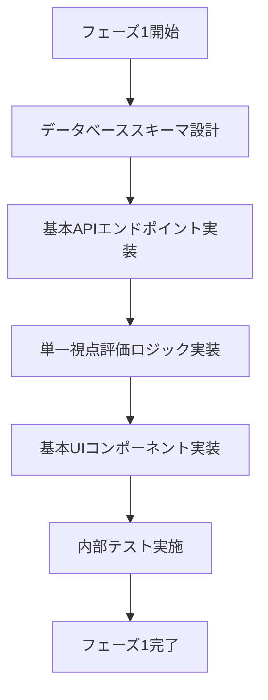
```mermaid
graph TD
    A[フェーズ1開始] --> B[データベーススキーマ設計]
    B --> C[基本APIエンドポイント実装]
    C --> D[単一視点評価ロジック実装]
    D --> E[基本UIコンポーネント実装]
    E --> F[内部テスト実施]
    F --> G[フェーズ1完了]
```
*図17: フェーズ1の実装ステップ。基盤となるコンポーネントを順次構築する。*

#### 10.1.3. 技術的考慮点

- **スケーラビリティを考慮したデータベース設計**: 将来的なデータ量の増加に対応できる設計
- **APIの拡張性**: 将来的な機能追加を見据えたAPI設計
- **モジュール化**: 評価ロジックを独立したモジュールとして実装し、将来的な変更や拡張を容易にする

### 10.2. フェーズ2：複数視点の統合

#### 10.2.1. 目標と成果物

フェーズ2では、複数の視点からの評価を統合する機能を実装します。主な目標と成果物は以下の通りです：

- **複数視点の評価機能**: テクノロジー、マーケット、ビジネスの3つの視点での評価機能を実装
- **整合性評価の実装**: 3つの視点の評価結果の整合性を評価する機能を実装
- **視覚化の強化**: 複数視点の評価結果を効果的に視覚化するUIの強化
- **基本的なレポート機能**: 評価結果のサマリーレポートを生成する機能を実装

#### 10.2.2. 実装ステップ

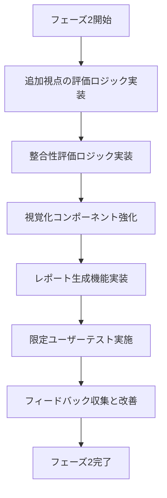
```mermaid
graph TD
    A[フェーズ2開始] --> B[追加視点の評価ロジック実装]
    B --> C[整合性評価ロジック実装]
    C --> D[視覚化コンポーネント強化]
    D --> E[レポート生成機能実装]
    E --> F[限定ユーザーテスト実施]
    F --> G[フィードバック収集と改善]
    G --> H[フェーズ2完了]
```
*図18: フェーズ2の実装ステップ。複数視点の統合と視覚化を強化する。*

#### 10.2.3. 技術的考慮点

- **データ整合性の確保**: 異なる視点からのデータが整合性を保つための仕組み
- **非同期処理**: 複数視点の評価を効率的に処理するための非同期処理の導入
- **ユーザー権限管理**: 視点ごとに異なるユーザー権限を設定する機能

### 10.3. フェーズ3：高度化と自動化

#### 10.3.1. 目標と成果物

フェーズ3では、評価メカニズムの高度化と自動化を進めます。主な目標と成果物は以下の通りです：

- **自動データ収集**: 外部ソースからのデータを自動的に収集する機能を実装
- **機械学習の導入**: 評価パラメータの最適化や予測精度の向上のための機械学習モデルを導入
- **アラート機能**: 重要な変化点を検出した際に自動的に通知するアラート機能を実装
- **高度な分析機能**: 時系列分析、相関分析などの高度な分析機能を実装

#### 10.3.2. 実装ステップ

```mermaid
graph TD
    A[フェーズ3開始] --> B[自動データ収集コネクタ実装]
    B --> C[機械学習モデル統合]
    C --> D[アラートシステム実装]
    D --> E[高度分析機能実装]
    E --> F[全体パフォーマンス最適化]
    F --> G[広範囲ユーザーテスト実施]
    G --> H[本番環境への移行]
    H --> I[フェーズ3完了]
```
*図19: フェーズ3の実装ステップ。高度化と自動化を進め、本番環境への移行を行う。*

#### 10.3.3. 技術的考慮点

- **セキュリティ強化**: 自動データ収集や外部連携におけるセキュリティリスクへの対応
- **パフォーマンス最適化**: 増加するデータ量と処理の複雑化に対応するためのパフォーマンス最適化
- **エラー処理とリカバリー**: 自動化されたプロセスにおけるエラー処理とリカバリーメカニズムの実装

### 10.4. 運用とメンテナンス

#### 10.4.1. 運用体制

評価メカニズムを効果的に運用するためには、適切な運用体制を整えることが重要です。以下に、推奨される運用体制を示します：

- **コアチーム**: システムの技術的な運用とメンテナンスを担当
- **ドメインエキスパート**: 各視点（テクノロジー、マーケット、ビジネス）の専門知識を提供
- **データアナリスト**: 評価結果の分析と改善提案を担当
- **エンドユーザー代表**: 実際のユーザー視点からのフィードバックを提供

#### 10.4.2. 定期的なメンテナンスタスク

システムの健全性と有効性を維持するためには、以下のような定期的なメンテナンスタスクが必要です：

- **週次**: システムの稼働状況の確認、アラートの確認、簡易的なパフォーマンスチェック
- **月次**: 評価精度の検証、ユーザーフィードバックの分析、小規模な改善の実装
- **四半期**: 大規模なパフォーマンス分析、評価パラメータの最適化、中規模な機能改善
- **年次**: システム全体のレビュー、大規模な機能追加や改善、長期的な戦略の見直し

#### 10.4.3. 継続的な改善サイクル

運用フェーズにおいても、継続的な改善サイクルを回すことが重要です。以下のようなサイクルを確立することを推奨します：

```mermaid
graph TD
    A[データ収集] --> B[分析]
    B --> C[改善計画策定]
    C --> D[実装]
    D --> E[効果測定]
    E --> A
```
*図20: 継続的な改善サイクル。データ収集から効果測定までのサイクルを繰り返し回す。*

このサイクルを通じて、評価メカニズムの精度と有用性を継続的に高めていくことができます。

## 11. まとめ

本文書では、コンセンサスモデルの評価メカニズムについて、その基本ロジックから実装方法、運用ガイドラインまで詳細に解説しました。以下に、主要なポイントをまとめます。

### 11.1. 主要な成果

コンセンサスモデルの評価メカニズムは、以下の主要な成果を提供します：

1. **多視点評価の統合**: テクノロジー、マーケット、ビジネスの3つの視点からの評価を統合し、バランスの取れた意思決定を支援
2. **評価の客観性向上**: 重要度、確信度、整合性の3つの軸で定量的に評価することで、主観に依存しない客観的な評価を実現
3. **意思決定の効率化**: 情報の重要性と信頼性を明確に評価することで、注力すべき情報の優先順位付けを支援
4. **組織的な知見の蓄積**: 評価プロセスと結果を体系的に記録・蓄積することで、組織的な知見の形成を促進

### 11.2. 実装のポイント

評価メカニズムを効果的に実装するためのポイントは以下の通りです：

1. **段階的アプローチ**: 基盤構築から始め、徐々に機能を拡張していく段階的なアプローチを採用
2. **カスタマイズ性**: 業種や組織の特性に合わせてパラメータをカスタマイズできる柔軟な設計
3. **フィードバックループ**: 評価結果の精度を継続的に検証し、改善していくためのフィードバックループの構築
4. **ユーザー体験の重視**: 評価結果の理解と活用を促進するための直感的なUIと説明機能の提供

### 11.3. 今後の展望

コンセンサスモデルの評価メカニズムは、今後以下のような方向性で発展していくことが期待されます：

1. **AIとの統合**: 機械学習や自然言語処理技術を活用した評価の自動化と精度向上
2. **リアルタイム評価**: 情報の流入に応じてリアルタイムで評価を更新する機能の強化
3. **予測能力の向上**: 過去の評価データを活用した将来予測能力の強化
4. **エコシステムの拡大**: 外部システムやサービスとの連携を拡大し、より広範なデータソースを活用

次のパートでは、コンセンサスモデルの実装における高度な機能と応用について解説します。


## 4. インターフェース設計と視覚化

**目的：読者がコンセンサスモデルの結果を直感的に理解し、意思決定に活用できるようにする**

コンセンサスモデルの真価は、その計算結果をいかに分かりやすく意思決定者に伝えられるかにかかっています。本セクションでは、モデルの出力を効果的に視覚化し、ユーザーが直感的に理解できるインターフェースの設計方法を解説します。

### 4.1. ダッシュボード設計の基本原則

効果的なダッシュボードは、複雑な情報を整理し、意思決定者が必要な洞察を素早く得られるように設計されています。コンセンサスモデルのダッシュボード設計においては、情報の階層化と優先順位付けが重要です。最も重要な情報を最も目立つ位置に配置し、詳細情報は必要に応じてドリルダウンできる構造にします。

この階層構造により、意思決定者は全体像を素早く把握しつつ、必要に応じて詳細情報にアクセスできます。また、視覚的一貫性と直感的理解のために、評価結果を一貫した色で表現し、各視点や評価要素を識別しやすいアイコンで表現することで、ユーザーの理解を促進します。

インタラクティブ性と探索可能性も重要な要素です。静的な表示だけでなく、ユーザーが情報を探索し、異なる角度から分析できる機能を提供することで、意思決定者は受動的に情報を受け取るだけでなく、能動的に情報を探索し、より深い洞察を得ることができます。

### 4.2. 効果的な視覚化手法

コンセンサスモデルの結果を視覚化するためには、複数の手法を目的に応じて使い分けることが効果的です。レーダーチャートは複数の評価軸を同時に表示し、全体のバランスを視覚的に把握するのに適しています。3つの視点や各視点内の評価要素をレーダーチャートで表現することで、強みと弱みを一目で確認できます。

階層型ツリーマップは、階層構造を持つデータを面積で表現し、各要素の相対的な重要度を視覚化するのに適しています。3つの視点とその下位要素の重み付けや評価結果をツリーマップで表現することで、影響度の大きい要素を直感的に把握できます。

フローチャートやサンキーダイアグラムは、プロセスの流れや要素間の影響関係を視覚化するのに適しています。評価プロセスの流れや、各視点間の情報の流れと影響度をこれらの図で表現することで、モデルの動作原理を直感的に理解できます。

ヒートマップやマトリックスは、複数の要素間の相関関係や比較分析を視覚化するのに適しています。異なる評価要素間の相関関係や、複数の評価対象の比較をこれらの図で表現することで、パターンや傾向を発見しやすくなります。

### 4.3. n8nによるダッシュボード連携

コンセンサスモデルの評価結果をリアルタイムでダッシュボードに反映するためには、n8nワークフローとダッシュボードシステムを効果的に連携させる必要があります。n8nワークフローからダッシュボードへのデータ連携には、APIを介した直接連携、データベースを介した間接連携、メッセージングシステムを介した連携の3つのアプローチがあります。

多くの場合、データベースを介した間接連携が最も柔軟性が高く、実装も比較的容易です。このアプローチでは、評価が完了したタイミングまたは定期的なスケジュールでトリガーされ、最新の評価結果を取得します。その後、データをダッシュボード表示に適した形式に変換し、データベースに保存します。必要に応じて、ダッシュボードシステムに更新通知を送信し、更新ログを記録します。

ダッシュボード設計のベストプラクティスとして、ユーザーの意思決定プロセスに沿った設計、コンテキスト情報の提供、適切なアラートとハイライト、比較と参照点の提供、モバイル対応とレスポンシブデザインが重要です。これらのベストプラクティスを踏まえたダッシュボード設計により、コンセンサスモデルの評価結果を最大限に活用し、より質の高い意思決定を支援することができます。
## 5. 実際の運用例とユースケース

**目的：読者が実際の業務課題にコンセンサスモデルを適用するイメージを持てるようにする**

理論的な理解だけでは、実際の業務にコンセンサスモデルを適用することは難しいものです。本セクションでは、具体的なユースケースを通じて、コンセンサスモデルがどのように実際の意思決定を支援するのかを示します。

### 5.1. 先端技術投資判断：量子コンピューティング

先端技術への投資判断は、不確実性が高く、多角的な視点からの評価が必要な典型的な意思決定課題です。ある大手IT企業が量子コンピューティング技術への投資を検討するケースを考えてみましょう。

この企業では、テクノロジー視点、マーケット視点、ビジネス視点の3つの視点から評価を行いました。テクノロジー視点では、技術成熟度（0.60）、実用化可能性（0.70）、技術的優位性（0.85）を評価。マーケット視点では、市場成長性（0.80）、競合状況（0.60）、顧客需要（0.65）を評価。ビジネス視点では、収益性（0.55）、戦略的適合性（0.80）、リスク（0.60）を評価しました。

これらの評価結果をコンセンサスモデルに入力した結果、テクノロジー視点のスコアは0.75、マーケット視点のスコアは0.68、ビジネス視点のスコアは0.65となり、総合評価は0.72（高）という結果になりました。この結果から、技術的な優位性と市場成長性が高く評価される一方、収益性に関しては懸念があることが明確になりました。

企業はこの結果を踏まえ、量子コンピューティング技術への段階的な投資を決定。短期的な収益よりも、長期的な技術優位性と市場ポジショニングを重視する戦略を採用しました。また、収益性の懸念に対応するため、初期段階ではコンサルティングサービスやパートナーシップモデルを通じた収益化を図る計画を立てました。

このケースでは、コンセンサスモデルによって、単なる「投資する/しない」の二択ではなく、リスクと機会のバランスを考慮した段階的アプローチが可能になりました。

### 5.2. 新興市場参入判断：東南アジアeコマース

グローバル展開を検討する企業にとって、新興市場への参入判断は複雑な意思決定プロセスを伴います。ある日本の小売企業が東南アジアのeコマース市場への参入を検討するケースを見てみましょう。

この企業では、テクノロジー視点では、プラットフォーム適合性（0.75）、現地技術インフラ（0.60）、デジタル決済対応（0.85）を評価。マーケット視点では、市場成長率（0.90）、競合状況（0.50）、消費者行動（0.70）を評価。ビジネス視点では、初期投資（0.40）、収益見込み（0.65）、リスク（0.55）を評価しました。

コンセンサスモデルによる評価の結果、テクノロジー視点のスコアは0.73、マーケット視点のスコアは0.70、ビジネス視点のスコアは0.53となり、総合評価は0.65（中〜高）という結果になりました。この結果から、市場の成長性と技術的な準備は整っているものの、ビジネス面での課題が大きいことが明確になりました。

企業はこの結果を踏まえ、リスクを抑えつつ市場参入するための段階的アプローチを採用。まず現地パートナーとの提携を通じて小規模に参入し、市場理解を深めながら徐々に事業を拡大する戦略を選択しました。また、初期投資の負担を軽減するため、既存のeコマースプラットフォームを活用する方針を決定しました。

このケースでは、コンセンサスモデルによって、各視点のバランスを考慮した現実的な市場参入戦略の策定が可能になりました。特に、ビジネス視点の課題を明確にすることで、リスクを最小化しながら市場機会を活かす方法を見出すことができました。

### 5.3. 製品開発方針決定：AIアシスタント

急速に変化する技術トレンドの中で、製品開発の方向性を決定することは企業にとって重要な課題です。あるソフトウェア企業がAIアシスタント製品の開発方針を決定するケースを考えてみましょう。

この企業では、テクノロジー視点では、AI技術成熟度（0.80）、開発リソース適合性（0.65）、技術的差別化（0.70）を評価。マーケット視点では、市場需要（0.85）、競合状況（0.45）、顧客フィードバック（0.75）を評価。ビジネス視点では、収益モデル（0.60）、戦略的重要性（0.90）、開発リスク（0.50）を評価しました。

コンセンサスモデルによる評価の結果、テクノロジー視点のスコアは0.72、マーケット視点のスコアは0.68、ビジネス視点のスコアは0.67となり、総合評価は0.69（中〜高）という結果になりました。この結果から、技術的な実現可能性と市場需要は高いものの、競合の激しさと開発リスクが課題であることが明確になりました。

企業はこの結果を踏まえ、汎用AIアシスタントではなく、特定の業界や用途に特化したAIアシスタントの開発に注力する戦略を採用。競合との差別化を図りつつ、開発リスクを管理可能な範囲に抑える方針を決定しました。また、初期段階から顧客と共同開発するアプローチを採用し、市場ニーズに確実に応える製品開発を目指すことにしました。

このケースでは、コンセンサスモデルによって、技術トレンドと市場競争の中で、自社の強みを活かした製品開発戦略の策定が可能になりました。特に、各視点のスコアバランスを分析することで、リスクと機会のトレードオフを考慮した現実的な開発方針を決定できました。

### 5.4. 動的重み付け調整の実践例

コンセンサスモデルの強みの一つは、評価対象や状況に応じて各視点の重み付けを動的に調整できる点にあります。以下に、動的重み付け調整の実践例を示します。

**n8nによる動的重み付け調整ワークフロー**

以下に、n8nを使用した動的重み付け調整ワークフローの概念図を示します。

```mermaid
graph LR
    A["Trigger: New Topic Added / Schedule"] --> B(Get Topic Info from DB);
    B --> C(Get Active Consensus Parameters from DB);
    C --> D{Function: Adjust Weights};
    D -- Adjusted Weights --> E(Save Adjusted Weights to DB);
    D -- Error --> F(Log Error / Notify Admin);

    subgraph Adjust_Weights_Function
        D1[Input: Topic Info, Base Weights, Adjustment Factors] --> D2{Determine Topic Nature};
        D2 --> D3{Determine Change Stage};
        D3 --> D4{Get Confidence Scores};
        D4 --> D5[Apply Adjustments based on Nature, Stage, Confidence];
        D5 --> D6[Normalize Weights, Sum = 1.0];
        D6 --> D7[Output: Adjusted Weights];
    end
```

このワークフローでは、トピックの性質（技術駆動型、市場駆動型など）、変化の段階（初期、成長期、成熟期など）、各視点の情報の確信度などの要因に基づいて、基本重みを動的に調整します。調整された重みは、次回の評価プロセスで使用されます。

例えば、新興技術の評価では、初期段階ではテクノロジー視点の重みを高く（0.5）、マーケット視点（0.3）とビジネス視点（0.2）を低めに設定します。技術が成熟するにつれて、マーケット視点の重みを徐々に高め（0.4）、テクノロジー視点の重みを下げる（0.4）調整を行います。さらに市場が形成されると、ビジネス視点の重みを高める（0.4）調整を行い、テクノロジー視点（0.3）とマーケット視点（0.3）のバランスを取ります。

このような動的調整により、評価対象の発展段階や特性に応じた適切な評価が可能になり、より現実に即した意思決定を支援することができます。

### 5.5. ユースケースから得られる共通の教訓

これらのユースケースから、コンセンサスモデルの実践において重要な共通の教訓が得られます。

まず、多角的な視点からの評価が意思決定の質を高めることが明確になりました。単一の視点（例えば技術的な実現可能性のみ）で判断するのではなく、テクノロジー、マーケット、ビジネスの3つの視点からバランスよく評価することで、より包括的な判断が可能になります。

次に、定量的評価と定性的判断の組み合わせの重要性が挙げられます。コンセンサスモデルは数値スコアを提供しますが、最終的な意思決定は、これらの数値を解釈し、組織の戦略や価値観と照らし合わせて行う必要があります。モデルは意思決定を代行するものではなく、より良い判断を支援するツールとして位置づけるべきです。

また、継続的な評価と調整の重要性も明らかになりました。初期評価だけでなく、状況の変化に応じて定期的に再評価を行い、必要に応じて戦略を調整することが成功への鍵となります。n8nを活用した動的重み付け調整は、この継続的な評価プロセスを効率化し、一貫性を保つのに役立ちます。

最後に、組織内でのコンセンサス形成ツールとしての価値が挙げられます。異なる部門や専門性を持つメンバーが、共通のフレームワークを通じて議論することで、より建設的な対話が可能になります。コンセンサスモデルは、単なる計算ツールではなく、組織内の協働と合意形成を促進するプラットフォームとしても機能します。

これらの教訓を踏まえることで、コンセンサスモデルを自組織の意思決定プロセスに効果的に統合し、より質の高い判断を実現することができるでしょう。
## 6. 評価と最適化

**目的：読者がコンセンサスモデルを継続的に改善し、組織の意思決定プロセスに定着させる方法を理解する**

コンセンサスモデルは一度構築して終わりではなく、継続的な評価と最適化を通じて進化させていくべきものです。本セクションでは、モデルの評価方法、パフォーマンス最適化の手法、そして組織への定着化戦略について解説します。

### 6.1. コンセンサスモデルの評価フレームワーク

コンセンサスモデルの有効性を評価するためには、体系的なフレームワークが必要です。以下に、主要な評価軸と具体的な評価指標を示します。

**精度と信頼性の評価**

コンセンサスモデルの最も基本的な評価軸は、その予測や評価の精度です。過去の意思決定事例を用いて、モデルの出力結果と実際の結果を比較することで、精度を測定できます。具体的には、以下の指標が有用です：

- 予測精度：モデルの評価結果と実際の結果の一致度
- 一貫性：同様の条件下での評価結果の安定性
- 信頼区間：評価結果の不確実性の範囲

例えば、過去に実施した10の技術投資案件について、コンセンサスモデルの評価結果と実際の成果を比較し、正確に予測できた割合を測定します。また、同じ評価対象を複数回評価した際の結果のばらつきを分析し、モデルの一貫性を確認します。

**実用性と意思決定への貢献度**

モデルの技術的な精度だけでなく、実際の意思決定プロセスにおける有用性も重要な評価軸です。以下の指標を通じて、モデルの実用的価値を評価できます：

- 意思決定時間：モデル導入前後での意思決定にかかる時間の変化
- 合意形成効率：関係者間での合意に至るまでの議論の効率性
- 意思決定の質：モデルを活用した意思決定と従来の方法による意思決定の質の比較

例えば、コンセンサスモデル導入前は平均4週間かかっていた投資判断が、導入後は2週間に短縮されたといった定量的な効果を測定します。また、意思決定の質については、決定後の方針変更頻度や目標達成率などの指標を用いて評価します。

**ユーザー満足度と組織適合性**

最終的に、モデルが組織内で受け入れられ、活用されるかどうかは、ユーザーの満足度と組織文化との適合性に大きく依存します。以下の指標を通じて、これらの側面を評価します：

- ユーザー満足度：モデルを使用する意思決定者の満足度調査
- 活用頻度：自発的なモデル活用の頻度と範囲
- 組織文化との整合性：モデルの使用方法と組織の意思決定文化の適合度

例えば、定期的なユーザーアンケートを実施し、モデルの使いやすさや有用性に関するフィードバックを収集します。また、どの部門や意思決定タイプでモデルが積極的に活用されているかを追跡し、組織への浸透度を評価します。

### 6.2. パフォーマンス最適化の手法

評価結果に基づき、コンセンサスモデルのパフォーマンスを継続的に最適化することが重要です。以下に、主要な最適化手法を示します。

**パラメータチューニングとモデル調整**

コンセンサスモデルの核心部分であるパラメータ設定を最適化することで、モデルの精度と適合性を高めることができます。

- 重み付け係数の最適化：過去のデータを用いた回帰分析により、最適な重み付け係数を導出
- 閾値の調整：意思決定の境界となる閾値を実績データに基づいて調整
- 評価要素の見直し：不要な要素の削除や新たな要素の追加による評価構造の最適化

例えば、過去の成功事例と失敗事例のデータセットを用いて、各視点の重み付けを調整し、成功事例をより高く、失敗事例をより低く評価するパラメータ設定を見つけ出します。また、実際の意思決定結果と照らし合わせて、「Go/No-Go」の判断基準となる閾値を調整します。

**データ品質と入力プロセスの改善**

どんなに優れたモデルでも、入力データの品質が低ければ良い結果は得られません。データ収集と入力プロセスを最適化することで、モデル全体のパフォーマンスを向上させることができます。

- データ収集の標準化：評価に必要なデータを一貫した方法で収集するプロセスの確立
- 入力支援ツールの開発：データ入力の正確性と効率を高めるためのツールやテンプレートの提供
- データ検証メカニズム：入力データの妥当性を自動的にチェックする仕組みの導入

例えば、各評価要素に関するデータ収集のためのチェックリストやテンプレートを作成し、評価者間での情報収集の一貫性を確保します。また、入力データの範囲チェックや相関チェックなどの検証ルールを実装し、明らかな誤りや矛盾を早期に発見・修正できるようにします。

**ワークフロー統合と自動化の強化**

コンセンサスモデルを組織の既存ワークフローに効果的に統合し、可能な限り自動化することで、使いやすさと効率を高めることができます。

- n8nワークフローの最適化：評価プロセスの自動化と既存システムとの連携強化
- 通知とアラートの設定：重要なイベントや閾値超過時の自動通知機能の実装
- バッチ処理と定期評価：定期的な再評価と傾向分析の自動化

例えば、企業の案件管理システムと連携し、新規案件が登録されると自動的に初期評価を行うワークフローを構築します。また、評価結果が特定の閾値を下回った場合や、重要な指標に大きな変動があった場合に、関係者に自動通知する仕組みを実装します。

### 6.3. 継続的改善と発展のためのフレームワーク

コンセンサスモデルを一時的なプロジェクトではなく、組織の意思決定文化の一部として定着させるためには、継続的な改善と発展のためのフレームワークが必要です。

**継続的改善のための実務体制**

1. **運用タスク管理**：モデルの日常的な運用、データ管理、ユーザーサポートを担当するチーム。技術的な知識と業務知識の両方を持つメンバーで構成されることが理想的です。

2. **ガバナンス運営**：モデルの評価基準、重み付け、閾値などの重要パラメータの変更を承認する役割。各部門の代表者や意思決定権者で構成され、モデルの一貫性と公平性を確保します。

3. **情報共有の仕組み**：モデルのユーザーや関係者が経験や知見を共有し、改善提案を行うプラットフォーム。定期的なミーティングやオンラインフォーラムなどの形で実施されます。

この体制により、日常的な運用から戦略的な方向性まで、異なるレベルでのモデル管理と改善が可能になります。

**学習と適応のサイクル**

コンセンサスモデルを継続的に進化させるためには、以下のような学習と適応のサイクルを確立することが効果的です。

1. **データ収集**：評価結果、実際の成果、ユーザーフィードバックなどのデータを体系的に収集

2. **分析と洞察**：収集したデータを分析し、モデルの強みと弱み、改善機会を特定

3. **改善計画**：分析結果に基づいて、具体的な改善計画を策定

4. **実装とテスト**：改善策を実装し、限定的な範囲でテスト

5. **展開と標準化**：効果が確認された改善策を全体に展開し、新たな標準として確立

このサイクルを3〜6ヶ月ごとに繰り返すことで、モデルを継続的に進化させ、変化する環境や要件に適応させることができます。

**知識管理と組織学習**

コンセンサスモデルの運用を通じて得られた知見や教訓を組織の知的資産として蓄積し、共有することも重要です。

- ケーススタディの作成：成功事例と失敗事例の詳細な分析と教訓の抽出
- ベストプラクティスの文書化：効果的なモデル活用方法や評価プロセスのガイドライン
- トレーニングプログラムの開発：新規ユーザーや関係者向けの教育資料とプログラム

例えば、四半期ごとに代表的な評価事例を選び、詳細な分析レポートを作成して組織内で共有します。また、モデル活用の成功事例から抽出したベストプラクティスをガイドラインとして文書化し、新規プロジェクトや部門への展開時に活用します。

これらの継続的改善と発展のためのフレームワークを通じて、コンセンサスモデルは単なるツールから、組織の意思決定文化を形作る重要な要素へと進化していきます。時間の経過とともに、モデルは組織特有の知識や経験を取り込み、より価値の高い意思決定支援システムとなるでしょう。
