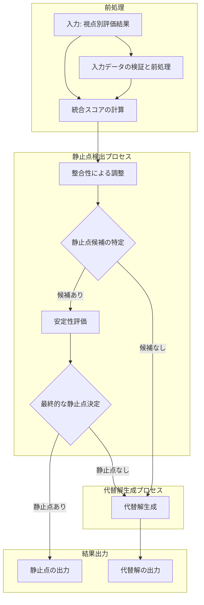
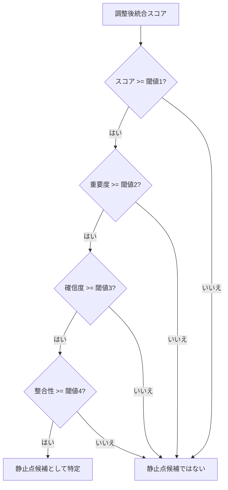
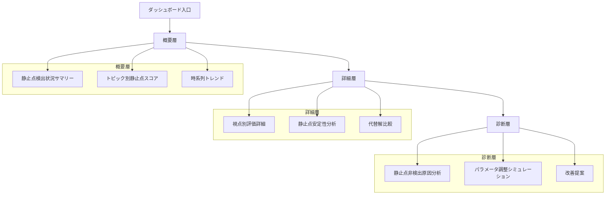

# コンセンサスモデルの実装（パート4：静止点検出と評価方法）[改訂版]

## 静止点検出の概念

トリプルパースペクティブ型戦略AIレーダーにおける「静止点」とは、3つのレイヤ（テクノロジー、マーケット、ビジネス）の総合判定を取りうる点として最も有効解となりうる点を指します。静止点は、単なる平均や多数決ではなく、各視点の役割と関係性を考慮した上での最適解です。このセクションでは、n8nを活用した静止点検出アルゴリズムと評価方法について解説します。

### 静止点の特性

静止点には、以下の特性があります：

1. **最適性**
   - 3つの視点からの評価を最適に統合した解
   - 単純な平均や多数決ではなく、視点間の関係性を考慮

2. **安定性**
   - 小さな入力変化に対して堅牢
   - 一時的なノイズに影響されにくい

3. **説明可能性**
   - 静止点に至った理由が明確
   - 各視点の貢献度が透明

4. **実行可能性**
   - 実際のアクションにつながる具体性を持つ
   - 実装や展開が現実的に可能

### 視点間の関係性と静止点

3つの視点（テクノロジー、マーケット、ビジネス）の関係性は、静止点検出において重要な役割を果たします：

1. **マーケット視点の先行性**
   - 市場の受容性・需要が基点
   - マーケット視点の評価が先行指標として機能

2. **テクノロジー視点の基盤性**
   - 技術的実現可能性が基盤
   - テクノロジー視点の評価が実現可能性の指標として機能

3. **ビジネス視点の実効性**
   - 事業としての成立性を評価
   - ビジネス視点の評価が実効性の指標として機能

これらの関係性を考慮すると、静止点は以下のような特徴を持つことが期待されます：

- マーケット視点で高評価かつテクノロジー視点で実現可能と判断され、ビジネス視点でも実効性があると評価される点
- マーケット視点とテクノロジー視点の不一致が小さく、ビジネス視点との整合性も高い点
- 3つの視点からの総合的な評価が高く、バランスの取れた点

## 静止点検出アルゴリズム

静止点を検出するためのアルゴリズムは、以下のステップで構成されます。以下のフローチャートは、静止点検出の全体プロセスを示しています：



### 1. 統合スコアの計算

まず、3つの視点からの評価結果と重みを使用して、統合スコアを計算します。

```
統合スコア = (テクノロジー視点のスコア × テクノロジー視点の重み)
           + (マーケット視点のスコア × マーケット視点の重み)
           + (ビジネス視点のスコア × ビジネス視点の重み)
```

この計算は、各視点の評価結果に対して、その視点の重要度（重み）を掛け合わせ、それらを合計することで行われます。重みは、パート3で説明した重み付け方法によって決定されます。

### 2. 整合性による調整

整合性評価結果に基づいて、統合スコアを調整します。整合性が高い場合はスコアを維持または強化し、整合性が低い場合はスコアを減少させます。

```
調整後統合スコア = 統合スコア × (0.7 + 0.3 × 整合性スコア)
```

この調整式では、整合性スコアが最大値（1.0）の場合、統合スコアは変わりません（1.0倍）。整合性スコアが最小値（0.0）の場合、統合スコアは0.7倍に減少します。これにより、整合性の低い評価結果は、最終的な判断において割り引かれます。

### 3. 静止点候補の特定

調整後統合スコア、重要度、確信度、整合性に基づいて、静止点候補を特定します。

```
静止点候補 = 調整後統合スコア >= 閾値1
           AND 重要度 >= 閾値2
           AND 確信度 >= 閾値3
           AND 整合性 >= 閾値4
```

静止点候補の特定プロセスを図示すると以下のようになります：



各閾値は、アプリケーションの要件や期待される精度に応じて調整できます。一般的な設定例は以下の通りです：

| 閾値 | 説明 | 一般的な値 |
|------|------|------------|
| 閾値1 | 調整後統合スコアの最小値 | 0.7 |
| 閾値2 | 重要度の最小値 | 0.6 |
| 閾値3 | 確信度の最小値 | 0.7 |
| 閾値4 | 整合性の最小値 | 0.65 |

### 4. 安定性評価

静止点候補の安定性を評価します。安定性は、入力パラメータの小さな変化に対する出力の変化の度合いで測定されます。安定性評価の数学的根拠は、感度分析（Sensitivity Analysis）に基づいています。

安定性評価のプロセスは以下の通りです：

1. 基準となる統合スコアを計算
2. 入力パラメータ（各視点のスコア）に小さな変動を加える
3. 変動後の統合スコアを計算
4. 基準スコアからの変化率を測定
5. 最大変化率に基づいて安定性スコアを算出

```
安定性スコア = 1 - (出力変化の最大値 / 入力変化の最大値)
```

安定性評価の具体的な計算例を示します：

**例**: テクノロジー視点スコア = 0.8、マーケット視点スコア = 0.7、ビジネス視点スコア = 0.75、各視点の重みはそれぞれ0.3、0.4、0.3とします。

1. 基準統合スコア = 0.8×0.3 + 0.7×0.4 + 0.75×0.3 = 0.745
2. テクノロジー視点スコアを5%増加（0.8 → 0.84）した場合の統合スコア = 0.84×0.3 + 0.7×0.4 + 0.75×0.3 = 0.757（変化率 = 1.6%）
3. マーケット視点スコアを5%減少（0.7 → 0.665）した場合の統合スコア = 0.8×0.3 + 0.665×0.4 + 0.75×0.3 = 0.731（変化率 = 1.9%）
4. ビジネス視点スコアを5%増加（0.75 → 0.7875）した場合の統合スコア = 0.8×0.3 + 0.7×0.4 + 0.7875×0.3 = 0.75125（変化率 = 0.8%）
5. 最大変化率 = 1.9%
6. 安定性スコア = 1 - (1.9% / 5%) = 0.62

この例では、入力の5%の変化に対して最大で1.9%の出力変化があり、安定性スコアは0.62となります。

### 5. 最終的な静止点の決定

安定性評価に基づいて、最終的な静止点を決定します。

```
静止点 = 静止点候補 AND 安定性スコア >= 閾値5
```

閾値5は一般的に0.5～0.7の範囲で設定されます。この閾値を超える安定性スコアを持つ静止点候補が、最終的な静止点として採用されます。

## n8nによる静止点検出の実装

n8nを活用して、静止点検出アルゴリズムを実装します。以下では、静止点検出を行うワークフローを示します。

```javascript
// n8n workflow: Equilibrium Point Detection
// Trigger: Webhook
[
  {
    "id": "webhook",
    "type": "n8n-nodes-base.webhook",
    "parameters": {
      "path": "detect-equilibrium",
      "responseMode": "onReceived",
      "options": {}
    }
  },
  {
    "id": "getTopicData",
    "type": "n8n-nodes-base.postgres",
    "parameters": {
      "operation": "executeQuery",
      "query": `
        -- Get topic data including perspective evaluations and coherence
        WITH perspective_data AS (
          SELECT
            pe.perspective_id,
            pe.topic_id,
            pe.date,
            pe.importance,
            pe.confidence,
            pe.overall_score
          FROM
            perspective_evaluations pe
          WHERE
            pe.topic_id = '{{ $json.topic_id }}'
            AND pe.date = '{{ $json.date }}'
        ),
        coherence_data AS (
          SELECT
            ce.topic_id,
            ce.date,
            ce.coherence
          FROM
            coherence_evaluations ce
          WHERE
            ce.topic_id = '{{ $json.topic_id }}'
            AND ce.date = '{{ $json.date }}'
        ),
        topic_weight_data AS (
          SELECT
            tw.topic_id,
            tw.weights,
            tw.adjustment_factors
          FROM
            topic_weights tw
          WHERE
            tw.topic_id = '{{ $json.topic_id }}'
        )
        SELECT
          pd.topic_id,
          pd.date,
          jsonb_agg(
            jsonb_build_object(
              'perspective_id', pd.perspective_id,
              'importance', pd.importance,
              'confidence', pd.confidence,
              'overall_score', pd.overall_score
            )
          ) AS perspective_evaluations,
          cd.coherence,
          twd.weights,
          twd.adjustment_factors
        FROM
          perspective_data pd
        JOIN
          coherence_data cd ON pd.topic_id = cd.topic_id AND pd.date = cd.date
        LEFT JOIN
          topic_weight_data twd ON pd.topic_id = twd.topic_id
        GROUP BY
          pd.topic_id, pd.date, cd.coherence, twd.weights, twd.adjustment_factors
      `
    }
  },
  {
    "id": "getConsensusParameters",
    "type": "n8n-nodes-base.postgres",
    "parameters": {
      "operation": "executeQuery",
      "query": `
        -- Get active consensus parameters
        SELECT parameters
        FROM consensus_parameters
        WHERE is_active = TRUE
        ORDER BY created_at DESC
        LIMIT 1
      `
    }
  },
  {
    "id": "detectEquilibrium",
    "type": "n8n-nodes-base.function",
    "parameters": {
      "functionCode": `
        // メイン処理: 静止点検出
        try {
          const topicData = $input.item.json;
          const consensusParameters = $input.item.json.parameters;
          
          // 入力データの検証
          if (!topicData || !topicData.topic_id || !topicData.date) {
            throw new Error('Invalid input: Missing topic_id or date');
          }
          
          if (!topicData.perspective_evaluations || topicData.perspective_evaluations.length === 0) {
            throw new Error('Invalid input: No perspective evaluations found');
          }
          
          if (!topicData.coherence) {
            throw new Error('Invalid input: Missing coherence data');
          }
          
          // データの抽出
          const topicId = topicData.topic_id;
          const date = topicData.date;
          const perspectiveEvaluations = topicData.perspective_evaluations;
          const coherence = topicData.coherence;
          const weights = topicData.weights || consensusParameters.perspectiveWeights;
          
          // 平衡パラメータの抽出
          const equilibriumParams = consensusParameters.equilibriumParameters;
          
          // 視点別評価をIDで整理
          const evaluations = {};
          for (const eval of perspectiveEvaluations) {
            evaluations[eval.perspective_id] = eval;
          }
          
          // 統合スコアの計算
          const integratedScore = calculateIntegratedScore(evaluations, weights);
          
          // 整合性に基づくスコア調整
          const adjustedScore = adjustScoreByCoherence(integratedScore, coherence.score);
          
          // 静止点候補のチェック
          const isCandidate = checkEquilibriumCandidate(
            adjustedScore,
            evaluations,
            coherence,
            equilibriumParams
          );
          
          // 候補の場合は安定性を評価
          let stabilityScore = 0;
          let isEquilibrium = false;
          
          if (isCandidate) {
            stabilityScore = evaluateStability(
              evaluations,
              weights,
              coherence,
              equilibriumParams
            );
            
            isEquilibrium = stabilityScore >= equilibriumParams.stabilityThreshold;
          }
          
          // 結果の準備
          const result = {
            topic_id: topicId,
            date: date,
            integrated_score: integratedScore,
            adjusted_score: adjustedScore,
            is_equilibrium_candidate: isCandidate,
            stability_score: stabilityScore,
            is_equilibrium: isEquilibrium,
            equilibrium_score: isEquilibrium ? adjustedScore * stabilityScore : 0,
            contributing_factors: getContributingFactors(evaluations, weights, coherence)
          };
          
          // 静止点でない場合は代替解を生成
          if (!isEquilibrium) {
            result.alternative_solutions = generateAlternativeSolutions(
              evaluations, 
              weights, 
              coherence, 
              equilibriumParams
            );
          }
          
          return {json: result};
        } catch (error) {
          // エラーハンドリング
          console.error('Error in equilibrium detection:', error.message);
          
          // エラー情報を含むレスポンスを返す
          return {
            json: {
              error: true,
              message: error.message,
              topic_id: $input.item.json?.topic_id || 'unknown',
              date: $input.item.json?.date || 'unknown',
              // デフォルト値を設定
              integrated_score: 0,
              adjusted_score: 0,
              is_equilibrium_candidate: false,
              stability_score: 0,
              is_equilibrium: false,
              equilibrium_score: 0,
              contributing_factors: {
                perspectives: {},
                coherence: { score: 0, level: 'unknown', contribution: 0 }
              }
            }
          };
        }
        
        // ヘルパー関数: 統合スコアの計算
        function calculateIntegratedScore(evaluations, weights) {
          try {
            let score = 0;
            
            if (evaluations.technology) {
              score += evaluations.technology.overall_score * weights.technology;
            }
            
            if (evaluations.market) {
              score += evaluations.market.overall_score * weights.market;
            }
            
            if (evaluations.business) {
              score += evaluations.business.overall_score * weights.business;
            }
            
            return score;
          } catch (error) {
            console.error('Error in calculateIntegratedScore:', error.message);
            return 0; // エラー時はデフォルト値を返す
          }
        }
        
        // ヘルパー関数: 整合性によるスコア調整
        function adjustScoreByCoherence(score, coherenceScore) {
          try {
            return score * (0.7 + 0.3 * coherenceScore);
          } catch (error) {
            console.error('Error in adjustScoreByCoherence:', error.message);
            return score; // エラー時は元のスコアを返す
          }
        }
        
        // ヘルパー関数: 静止点候補のチェック
        function checkEquilibriumCandidate(adjustedScore, evaluations, coherence, params) {
          try {
            // 調整後スコアの閾値チェック
            if (adjustedScore < params.minAdjustedScore) {
              return false;
            }
            
            // 重要度の閾値チェック
            const techImportance = evaluations.technology?.importance.score || 0;
            const marketImportance = evaluations.market?.importance.score || 0;
            const businessImportance = evaluations.business?.importance.score || 0;
            
            const avgImportance = (techImportance + marketImportance + businessImportance) / 3;
            if (avgImportance < params.minImportance) {
              return false;
            }
            
            // 確信度の閾値チェック
            const techConfidence = evaluations.technology?.confidence.score || 0;
            const marketConfidence = evaluations.market?.confidence.score || 0;
            const businessConfidence = evaluations.business?.confidence.score || 0;
            
            const avgConfidence = (techConfidence + marketConfidence + businessConfidence) / 3;
            if (avgConfidence < params.minConfidence) {
              return false;
            }
            
            // 整合性の閾値チェック
            if (coherence.score < params.minCoherence) {
              return false;
            }
            
            return true;
          } catch (error) {
            console.error('Error in checkEquilibriumCandidate:', error.message);
            return false; // エラー時はfalseを返す
          }
        }
        
        // ヘルパー関数: 安定性評価
        function evaluateStability(evaluations, weights, coherence, params) {
          try {
            // 基準となる統合スコアを計算
            const baseScore = calculateIntegratedScore(evaluations, weights);
            const baseAdjustedScore = adjustScoreByCoherence(baseScore, coherence.score);
            
            // 摂動係数の定義
            const perturbations = [0.95, 0.975, 1.025, 1.05];
            const results = [];
            
            // テクノロジースコアの摂動
            for (const factor of perturbations) {
              const perturbedEvals = JSON.parse(JSON.stringify(evaluations));
              if (perturbedEvals.technology) {
                perturbedEvals.technology.overall_score *= factor;
              }
              
              const perturbedScore = calculateIntegratedScore(perturbedEvals, weights);
              const perturbedAdjustedScore = adjustScoreByCoherence(perturbedScore, coherence.score);
              
              results.push(Math.abs(perturbedAdjustedScore - baseAdjustedScore) / baseAdjustedScore);
            }
            
            // マーケットスコアの摂動
            for (const factor of perturbations) {
              const perturbedEvals = JSON.parse(JSON.stringify(evaluations));
              if (perturbedEvals.market) {
                perturbedEvals.market.overall_score *= factor;
              }
              
              const perturbedScore = calculateIntegratedScore(perturbedEvals, weights);
              const perturbedAdjustedScore = adjustScoreByCoherence(perturbedScore, coherence.score);
              
              results.push(Math.abs(perturbedAdjustedScore - baseAdjustedScore) / baseAdjustedScore);
            }
            
            // ビジネススコアの摂動
            for (const factor of perturbations) {
              const perturbedEvals = JSON.parse(JSON.stringify(evaluations));
              if (perturbedEvals.business) {
                perturbedEvals.business.overall_score *= factor;
              }
              
              const perturbedScore = calculateIntegratedScore(perturbedEvals, weights);
              const perturbedAdjustedScore = adjustScoreByCoherence(perturbedScore, coherence.score);
              
              results.push(Math.abs(perturbedAdjustedScore - baseAdjustedScore) / baseAdjustedScore);
            }
            
            // 安定性スコアの計算 (1 - 最大相対変化)
            const maxChange = Math.max(...results);
            return Math.max(0, 1 - maxChange * 10); // 感度のためのスケーリング
          } catch (error) {
            console.error('Error in evaluateStability:', error.message);
            return 0; // エラー時は0を返す
          }
        }
        
        // ヘルパー関数: 貢献要因の取得
        function getContributingFactors(evaluations, weights, coherence) {
          try {
            const factors = {
              perspectives: {},
              coherence: {
                score: coherence.score,
                level: coherence.level,
                contribution: coherence.score * 0.3 // 調整スコアへの整合性の貢献
              }
            };
            
            // 視点別の貢献度を計算
            const totalScore = calculateIntegratedScore(evaluations, weights);
            
            if (evaluations.technology) {
              factors.perspectives.technology = {
                score: evaluations.technology.overall_score,
                weight: weights.technology,
                contribution: (evaluations.technology.overall_score * weights.technology) / totalScore
              };
            }
            
            if (evaluations.market) {
              factors.perspectives.market = {
                score: evaluations.market.overall_score,
                weight: weights.market,
                contribution: (evaluations.market.overall_score * weights.market) / totalScore
              };
            }
            
            if (evaluations.business) {
              factors.perspectives.business = {
                score: evaluations.business.overall_score,
                weight: weights.business,
                contribution: (evaluations.business.overall_score * weights.business) / totalScore
              };
            }
            
            return factors;
          } catch (error) {
            console.error('Error in getContributingFactors:', error.message);
            return {
              perspectives: {},
              coherence: { score: 0, level: 'unknown', contribution: 0 }
            }; // エラー時はデフォルト値を返す
          }
        }
        
        // ヘルパー関数: 代替解の生成
        function generateAlternativeSolutions(evaluations, weights, coherence, params) {
          try {
            const alternatives = [];
            
            // 代替解1: 重みの調整（マーケット視点を強化）
            const marketWeightAdjusted = {...weights};
            marketWeightAdjusted.market = Math.min(0.6, weights.market * 1.5);
            marketWeightAdjusted.technology = (1 - marketWeightAdjusted.market) * (weights.technology / (weights.technology + weights.business));
            marketWeightAdjusted.business = 1 - marketWeightAdjusted.market - marketWeightAdjusted.technology;
            
            const marketScore = calculateIntegratedScore(evaluations, marketWeightAdjusted);
            const marketAdjustedScore = adjustScoreByCoherence(marketScore, coherence.score);
            
            alternatives.push({
              type: 'weight_adjustment',
              description: 'マーケット視点の重みを強化',
              adjusted_weights: marketWeightAdjusted,
              score: marketAdjustedScore,
              is_candidate: marketAdjustedScore >= params.minAdjustedScore
            });
            
            // 代替解2: 重みの調整（テクノロジー視点を強化）
            const techWeightAdjusted = {...weights};
            techWeightAdjusted.technology = Math.min(0.5, weights.technology * 1.5);
            techWeightAdjusted.market = (1 - techWeightAdjusted.technology) * (weights.market / (weights.market + weights.business));
            techWeightAdjusted.business = 1 - techWeightAdjusted.technology - techWeightAdjusted.market;
            
            const techScore = calculateIntegratedScore(evaluations, techWeightAdjusted);
            const techAdjustedScore = adjustScoreByCoherence(techScore, coherence.score);
            
            alternatives.push({
              type: 'weight_adjustment',
              description: 'テクノロジー視点の重みを強化',
              adjusted_weights: techWeightAdjusted,
              score: techAdjustedScore,
              is_candidate: techAdjustedScore >= params.minAdjustedScore
            });
            
            // 代替解3: 重みの調整（ビジネス視点を強化）
            const businessWeightAdjusted = {...weights};
            businessWeightAdjusted.business = Math.min(0.5, weights.business * 1.5);
            businessWeightAdjusted.market = (1 - businessWeightAdjusted.business) * (weights.market / (weights.market + weights.technology));
            businessWeightAdjusted.technology = 1 - businessWeightAdjusted.business - businessWeightAdjusted.market;
            
            const businessScore = calculateIntegratedScore(evaluations, businessWeightAdjusted);
            const businessAdjustedScore = adjustScoreByCoherence(businessScore, coherence.score);
            
            alternatives.push({
              type: 'weight_adjustment',
              description: 'ビジネス視点の重みを強化',
              adjusted_weights: businessWeightAdjusted,
              score: businessAdjustedScore,
              is_candidate: businessAdjustedScore >= params.minAdjustedScore
            });
            
            // 代替解4: 閾値の緩和
            const relaxedParams = {...params};
            relaxedParams.minAdjustedScore *= 0.9;
            relaxedParams.minImportance *= 0.9;
            relaxedParams.minConfidence *= 0.9;
            relaxedParams.minCoherence *= 0.9;
            
            const isRelaxedCandidate = checkEquilibriumCandidate(
              adjustScoreByCoherence(calculateIntegratedScore(evaluations, weights), coherence.score),
              evaluations,
              coherence,
              relaxedParams
            );
            
            alternatives.push({
              type: 'threshold_relaxation',
              description: '閾値を10%緩和',
              relaxed_parameters: relaxedParams,
              is_candidate: isRelaxedCandidate
            });
            
            // 代替解5: 視点の組み合わせ（最も高いスコアの2つの視点のみを使用）
            const perspectiveScores = [
              { id: 'technology', score: evaluations.technology?.overall_score || 0 },
              { id: 'market', score: evaluations.market?.overall_score || 0 },
              { id: 'business', score: evaluations.business?.overall_score || 0 }
            ];
            
            perspectiveScores.sort((a, b) => b.score - a.score);
            const top2Perspectives = perspectiveScores.slice(0, 2);
            
            const top2Weights = {...weights};
            for (const key in top2Weights) {
              top2Weights[key] = 0;
            }
            
            const totalWeight = weights[top2Perspectives[0].id] + weights[top2Perspectives[1].id];
            top2Weights[top2Perspectives[0].id] = weights[top2Perspectives[0].id] / totalWeight * 0.6;
            top2Weights[top2Perspectives[1].id] = weights[top2Perspectives[1].id] / totalWeight * 0.4;
            
            const top2Score = calculateIntegratedScore(evaluations, top2Weights);
            const top2AdjustedScore = adjustScoreByCoherence(top2Score, coherence.score);
            
            alternatives.push({
              type: 'perspective_combination',
              description: `上位2視点（${top2Perspectives[0].id}、${top2Perspectives[1].id}）の組み合わせ`,
              adjusted_weights: top2Weights,
              score: top2AdjustedScore,
              is_candidate: top2AdjustedScore >= params.minAdjustedScore
            });
            
            // 代替解をスコアでソート
            alternatives.sort((a, b) => (b.score || 0) - (a.score || 0));
            
            return alternatives;
          } catch (error) {
            console.error('Error in generateAlternativeSolutions:', error.message);
            return []; // エラー時は空の配列を返す
          }
        }
      `
    }
  },
  {
    "id": "saveEquilibriumResult",
    "type": "n8n-nodes-base.postgres",
    "parameters": {
      "operation": "executeQuery",
      "query": `
        -- Create equilibrium_results table if not exists
        CREATE TABLE IF NOT EXISTS equilibrium_results (
          id SERIAL PRIMARY KEY,
          topic_id VARCHAR(50) NOT NULL,
          date DATE NOT NULL,
          integrated_score FLOAT NOT NULL,
          adjusted_score FLOAT NOT NULL,
          is_equilibrium_candidate BOOLEAN NOT NULL,
          stability_score FLOAT NOT NULL,
          is_equilibrium BOOLEAN NOT NULL,
          equilibrium_score FLOAT NOT NULL,
          contributing_factors JSONB NOT NULL,
          alternative_solutions JSONB,
          created_at TIMESTAMP WITH TIME ZONE DEFAULT CURRENT_TIMESTAMP,
          
          CONSTRAINT unique_topic_date UNIQUE (topic_id, date)
        );
        
        -- Insert or update equilibrium result
        INSERT INTO equilibrium_results (
          topic_id,
          date,
          integrated_score,
          adjusted_score,
          is_equilibrium_candidate,
          stability_score,
          is_equilibrium,
          equilibrium_score,
          contributing_factors,
          alternative_solutions
        )
        VALUES (
          '{{ $json.topic_id }}',
          '{{ $json.date }}',
          {{ $json.integrated_score }},
          {{ $json.adjusted_score }},
          {{ $json.is_equilibrium_candidate }},
          {{ $json.stability_score }},
          {{ $json.is_equilibrium }},
          {{ $json.equilibrium_score }},
          '{{ $json.contributing_factors | json | replace("'", "''") }}'::jsonb,
          
            '{{ $json.alternative_solutions | json | replace("'", "''") }}'::jsonb
          
            NULL
          
        )
        ON CONFLICT (topic_id, date)
        DO UPDATE SET
          integrated_score = {{ $json.integrated_score }},
          adjusted_score = {{ $json.adjusted_score }},
          is_equilibrium_candidate = {{ $json.is_equilibrium_candidate }},
          stability_score = {{ $json.stability_score }},
          is_equilibrium = {{ $json.is_equilibrium }},
          equilibrium_score = {{ $json.equilibrium_score }},
          contributing_factors = '{{ $json.contributing_factors | json | replace("'", "''") }}'::jsonb,
          alternative_solutions = 
            '{{ $json.alternative_solutions | json | replace("'", "''") }}'::jsonb
          
            NULL
          ,
          created_at = CURRENT_TIMESTAMP;
      `
    }
  },
  {
    "id": "logProcessingResult",
    "type": "n8n-nodes-base.function",
    "parameters": {
      "functionCode": `
        // 処理結果のログ記録
        try {
          const result = $input.item.json;
          
          // エラーチェック
          if (result.error) {
            console.error('Equilibrium detection error:', result.message);
            return {json: result};
          }
          
          // 処理結果のログ
          console.log('Equilibrium detection completed for topic:', result.topic_id);
          console.log('Is equilibrium:', result.is_equilibrium);
          console.log('Equilibrium score:', result.equilibrium_score);
          
          if (!result.is_equilibrium && result.alternative_solutions) {
            console.log('Generated', result.alternative_solutions.length, 'alternative solutions');
          }
          
          return {json: result};
        } catch (error) {
          console.error('Error in logProcessingResult:', error.message);
          return {json: $input.item.json};
        }
      `
    }
  }
]
```

## 静止点検出結果の視覚化と意思決定支援インターフェース

静止点検出の結果を効果的に活用するためには、適切な視覚化と意思決定支援インターフェースが不可欠です。ここでは、n8nを活用した静止点検出結果の視覚化方法について解説します。

### 多層的ダッシュボードの設計

静止点検出結果は、多層的なダッシュボードを通じて視覚化されます。ダッシュボードは以下の層で構成されています：

1. **概要層**: 全体的な静止点の状況を一目で把握できるサマリービュー
2. **詳細層**: 個別トピックの静止点分析と代替解の比較
3. **診断層**: 静止点が検出されない場合の原因分析と改善提案

以下は、多層的ダッシュボードの構造を示す図です：



### 静止点検出結果の視覚化コンポーネント

静止点検出結果を視覚化するための主要なコンポーネントは以下の通りです：

#### 1. 静止点スコアレーダーチャート

3つの視点（テクノロジー、マーケット、ビジネス）のスコア、整合性、安定性を一目で把握できるレーダーチャートです。

```javascript
// レーダーチャートデータの準備
function prepareRadarChartData(equilibriumResult) {
  const data = [
    {
      type: 'scatterpolar',
      r: [
        equilibriumResult.contributing_factors.perspectives.technology?.score || 0,
        equilibriumResult.contributing_factors.perspectives.market?.score || 0,
        equilibriumResult.contributing_factors.perspectives.business?.score || 0,
        equilibriumResult.contributing_factors.coherence.score,
        equilibriumResult.stability_score
      ],
      theta: ['テクノロジー', 'マーケット', 'ビジネス', '整合性', '安定性'],
      fill: 'toself',
      name: '静止点スコア'
    }
  ];
  
  return data;
}
```

#### 2. 静止点時系列トレンドチャート

時間の経過に伴う静止点スコアの変化を示す折れ線グラフです。

```javascript
// 時系列トレンドチャートデータの準備
function prepareTimeSeriesData(equilibriumResults) {
  const dates = equilibriumResults.map(result => result.date);
  const scores = equilibriumResults.map(result => result.equilibrium_score);
  
  const data = [
    {
      type: 'scatter',
      mode: 'lines+markers',
      x: dates,
      y: scores,
      name: '静止点スコア'
    }
  ];
  
  return data;
}
```

#### 3. 代替解比較チャート

静止点が検出されない場合の代替解を比較するバーチャートです。

```javascript
// 代替解比較チャートデータの準備
function prepareAlternativeSolutionsData(equilibriumResult) {
  if (!equilibriumResult.alternative_solutions) {
    return null;
  }
  
  const labels = equilibriumResult.alternative_solutions.map(solution => solution.description);
  const scores = equilibriumResult.alternative_solutions.map(solution => solution.score || 0);
  
  const data = [
    {
      type: 'bar',
      x: labels,
      y: scores,
      name: '代替解スコア'
    }
  ];
  
  return data;
}
```

### サンプルダッシュボードのモックアップ

以下は、静止点検出結果を視覚化するダッシュボードのモックアップ例です：

```
+---------------------------------------------------------------+
|                   戦略AIレーダー: 静止点ダッシュボード                |
+------------------------+--------------------------------------+
|                        |                                      |
|   トピック一覧            |   静止点スコアレーダーチャート              |
|   - 量子コンピューティング  |   [5軸レーダーチャート]                  |
|   - 自動運転技術         |                                      |
|   - メタバース           |                                      |
|   - Web3.0             |                                      |
|                        |                                      |
+------------------------+--------------------------------------+
|                        |                                      |
|   視点別貢献度           |   静止点時系列トレンド                   |
|   [円グラフ]            |   [折れ線グラフ]                       |
|                        |                                      |
|                        |                                      |
+------------------------+--------------------------------------+
|                                                               |
|   静止点検出結果: 量子コンピューティング                             |
|   ステータス: 静止点検出済み                                      |
|   静止点スコア: 0.82                                            |
|   安定性: 高 (0.78)                                            |
|                                                               |
|   推奨アクション:                                                |
|   1. 量子アルゴリズムの研究開発への投資を増加                       |
|   2. 量子コンピューティングの実用化に向けたパートナーシップの構築      |
|   3. 量子技術人材の採用と育成プログラムの強化                       |
|                                                               |
+---------------------------------------------------------------+
```

### n8nとフロントエンドの連携

n8nで処理された静止点検出結果をフロントエンドに連携するためのAPIエンドポイントを実装します。

```javascript
// n8n workflow: Equilibrium Visualization API
[
  {
    "id": "webhookTrigger",
    "type": "n8n-nodes-base.webhook",
    "parameters": {
      "path": "equilibrium-data",
      "responseMode": "lastNode",
      "options": {}
    }
  },
  {
    "id": "getEquilibriumData",
    "type": "n8n-nodes-base.postgres",
    "parameters": {
      "operation": "executeQuery",
      "query": `
        -- Get equilibrium data for visualization
        SELECT
          er.topic_id,
          t.name AS topic_name,
          er.date,
          er.integrated_score,
          er.adjusted_score,
          er.is_equilibrium_candidate,
          er.stability_score,
          er.is_equilibrium,
          er.equilibrium_score,
          er.contributing_factors,
          er.alternative_solutions
        FROM
          equilibrium_results er
        JOIN
          topics t ON er.topic_id = t.id
        WHERE
          er.topic_id = '{{ $json.topic_id }}'
          OR '{{ $json.topic_id }}' = 'all'
        ORDER BY
          er.date DESC
        LIMIT
          CASE WHEN '{{ $json.topic_id }}' = 'all' THEN 100 ELSE 10 END
      `
    }
  },
  {
    "id": "prepareVisualizationData",
    "type": "n8n-nodes-base.function",
    "parameters": {
      "functionCode": `
        // 視覚化用データの準備
        try {
          const rawData = $input.item.json;
          
          // 単一トピックか複数トピックかを判断
          const isSingleTopic = !Array.isArray(rawData) || rawData.length === 1;
          
          if (isSingleTopic) {
            // 単一トピックの詳細データを整形
            const topicData = Array.isArray(rawData) ? rawData[0] : rawData;
            
            // レーダーチャートデータの準備
            const radarChartData = prepareRadarChartData(topicData);
            
            // 視点別貢献度データの準備
            const contributionData = prepareContributionData(topicData);
            
            // 代替解比較データの準備
            const alternativeSolutionsData = prepareAlternativeSolutionsData(topicData);
            
            return {
              json: {
                topic: {
                  id: topicData.topic_id,
                  name: topicData.topic_name
                },
                date: topicData.date,
                is_equilibrium: topicData.is_equilibrium,
                equilibrium_score: topicData.equilibrium_score,
                stability_score: topicData.stability_score,
                visualizations: {
                  radar_chart: radarChartData,
                  contribution_chart: contributionData,
                  alternative_solutions: alternativeSolutionsData
                },
                recommended_actions: generateRecommendedActions(topicData)
              }
            };
          } else {
            // 複数トピックの概要データを整形
            const topicsData = rawData.map(topic => ({
              id: topic.topic_id,
              name: topic.topic_name,
              date: topic.date,
              is_equilibrium: topic.is_equilibrium,
              equilibrium_score: topic.equilibrium_score
            }));
            
            // 時系列トレンドデータの準備
            const timeSeriesData = prepareTimeSeriesData(rawData);
            
            return {
              json: {
                topics: topicsData,
                visualizations: {
                  time_series: timeSeriesData
                }
              }
            };
          }
        } catch (error) {
          console.error('Error in prepareVisualizationData:', error.message);
          return {
            json: {
              error: true,
              message: error.message
            }
          };
        }
        
        // ヘルパー関数: レーダーチャートデータの準備
        function prepareRadarChartData(equilibriumResult) {
          try {
            return {
              type: 'radar',
              data: {
                labels: ['テクノロジー', 'マーケット', 'ビジネス', '整合性', '安定性'],
                datasets: [{
                  label: '静止点スコア',
                  data: [
                    equilibriumResult.contributing_factors.perspectives.technology?.score || 0,
                    equilibriumResult.contributing_factors.perspectives.market?.score || 0,
                    equilibriumResult.contributing_factors.perspectives.business?.score || 0,
                    equilibriumResult.contributing_factors.coherence.score,
                    equilibriumResult.stability_score
                  ],
                  backgroundColor: 'rgba(54, 162, 235, 0.2)',
                  borderColor: 'rgb(54, 162, 235)',
                  pointBackgroundColor: 'rgb(54, 162, 235)',
                  pointBorderColor: '#fff',
                  pointHoverBackgroundColor: '#fff',
                  pointHoverBorderColor: 'rgb(54, 162, 235)'
                }]
              }
            };
          } catch (error) {
            console.error('Error in prepareRadarChartData:', error.message);
            return null;
          }
        }
        
        // ヘルパー関数: 視点別貢献度データの準備
        function prepareContributionData(equilibriumResult) {
          try {
            const perspectives = equilibriumResult.contributing_factors.perspectives;
            
            return {
              type: 'pie',
              data: {
                labels: ['テクノロジー', 'マーケット', 'ビジネス'],
                datasets: [{
                  data: [
                    perspectives.technology?.contribution || 0,
                    perspectives.market?.contribution || 0,
                    perspectives.business?.contribution || 0
                  ],
                  backgroundColor: [
                    'rgba(255, 99, 132, 0.5)',
                    'rgba(54, 162, 235, 0.5)',
                    'rgba(255, 206, 86, 0.5)'
                  ],
                  borderColor: [
                    'rgba(255, 99, 132, 1)',
                    'rgba(54, 162, 235, 1)',
                    'rgba(255, 206, 86, 1)'
                  ],
                  borderWidth: 1
                }]
              }
            };
          } catch (error) {
            console.error('Error in prepareContributionData:', error.message);
            return null;
          }
        }
        
        // ヘルパー関数: 代替解比較データの準備
        function prepareAlternativeSolutionsData(equilibriumResult) {
          try {
            if (!equilibriumResult.alternative_solutions) {
              return null;
            }
            
            return {
              type: 'bar',
              data: {
                labels: equilibriumResult.alternative_solutions.map(solution => solution.description),
                datasets: [{
                  label: '代替解スコア',
                  data: equilibriumResult.alternative_solutions.map(solution => solution.score || 0),
                  backgroundColor: 'rgba(75, 192, 192, 0.5)',
                  borderColor: 'rgb(75, 192, 192)',
                  borderWidth: 1
                }]
              }
            };
          } catch (error) {
            console.error('Error in prepareAlternativeSolutionsData:', error.message);
            return null;
          }
        }
        
        // ヘルパー関数: 時系列トレンドデータの準備
        function prepareTimeSeriesData(equilibriumResults) {
          try {
            // トピックごとにグループ化
            const topicGroups = {};
            
            for (const result of equilibriumResults) {
              if (!topicGroups[result.topic_id]) {
                topicGroups[result.topic_id] = {
                  name: result.topic_name,
                  dates: [],
                  scores: []
                };
              }
              
              topicGroups[result.topic_id].dates.push(result.date);
              topicGroups[result.topic_id].scores.push(result.equilibrium_score);
            }
            
            // データセットの準備
            const datasets = [];
            const colors = [
              'rgb(255, 99, 132)',
              'rgb(54, 162, 235)',
              'rgb(255, 206, 86)',
              'rgb(75, 192, 192)',
              'rgb(153, 102, 255)'
            ];
            
            let colorIndex = 0;
            for (const topicId in topicGroups) {
              const group = topicGroups[topicId];
              
              // 日付でソート
              const sortedIndices = group.dates
                .map((date, index) => ({ date, index }))
                .sort((a, b) => new Date(a.date) - new Date(b.date))
                .map(item => item.index);
              
              const sortedDates = sortedIndices.map(index => group.dates[index]);
              const sortedScores = sortedIndices.map(index => group.scores[index]);
              
              datasets.push({
                label: group.name,
                data: sortedScores,
                borderColor: colors[colorIndex % colors.length],
                backgroundColor: colors[colorIndex % colors.length].replace('rgb', 'rgba').replace(')', ', 0.1)'),
                fill: false,
                tension: 0.1
              });
              
              colorIndex++;
            }
            
            return {
              type: 'line',
              data: {
                labels: datasets.length > 0 ? 
                  topicGroups[Object.keys(topicGroups)[0]].dates.map(date => 
                    new Date(date).toLocaleDateString()
                  ) : [],
                datasets: datasets
              }
            };
          } catch (error) {
            console.error('Error in prepareTimeSeriesData:', error.message);
            return null;
          }
        }
        
        // ヘルパー関数: 推奨アクションの生成
        function generateRecommendedActions(equilibriumResult) {
          try {
            const actions = [];
            
            if (equilibriumResult.is_equilibrium) {
              // 静止点が検出された場合の推奨アクション
              const perspectives = equilibriumResult.contributing_factors.perspectives;
              const topPerspective = Object.entries(perspectives)
                .sort((a, b) => b[1].contribution - a[1].contribution)[0][0];
              
              if (topPerspective === 'technology') {
                actions.push('技術開発への投資を継続・強化する');
                actions.push('技術的優位性を活かした市場展開を検討する');
                actions.push('技術人材の採用と育成を強化する');
              } else if (topPerspective === 'market') {
                actions.push('市場拡大のためのマーケティング施策を強化する');
                actions.push('顧客ニーズに合わせた製品・サービスの改良を行う');
                actions.push('競合他社の動向を継続的にモニタリングする');
              } else if (topPerspective === 'business') {
                actions.push('ビジネスモデルの最適化を進める');
                actions.push('収益性向上のための施策を実施する');
                actions.push('組織体制の強化と効率化を図る');
              }
            } else {
              // 静止点が検出されなかった場合の推奨アクション
              if (equilibriumResult.alternative_solutions && equilibriumResult.alternative_solutions.length > 0) {
                const topSolution = equilibriumResult.alternative_solutions[0];
                
                if (topSolution.type === 'weight_adjustment') {
                  if (topSolution.description.includes('マーケット')) {
                    actions.push('市場調査を強化し、顧客ニーズの理解を深める');
                    actions.push('マーケティング戦略の見直しを行う');
                  } else if (topSolution.description.includes('テクノロジー')) {
                    actions.push('技術的な実現可能性を詳細に検証する');
                    actions.push('研究開発への投資を見直す');
                  } else if (topSolution.description.includes('ビジネス')) {
                    actions.push('ビジネスモデルの再検討を行う');
                    actions.push('収益構造の分析と最適化を進める');
                  }
                } else if (topSolution.type === 'threshold_relaxation') {
                  actions.push('評価基準の見直しを検討する');
                  actions.push('より長期的な視点での評価を行う');
                } else if (topSolution.type === 'perspective_combination') {
                  actions.push('特定の視点に焦点を当てた戦略の検討');
                  actions.push('視点間の整合性を高めるための施策を実施');
                }
              } else {
                actions.push('各視点からの評価を再検討する');
                actions.push('より詳細なデータ収集と分析を行う');
                actions.push('外部専門家の意見を取り入れる');
              }
            }
            
            return actions;
          } catch (error) {
            console.error('Error in generateRecommendedActions:', error.message);
            return ['評価データを再確認してください', '各視点からの分析を詳細に行ってください'];
          }
        }
      `
    }
  }
]
```

## 実際の運用例とユースケース

静止点検出アルゴリズムは、様々な業界や状況で活用できます。以下では、具体的なユースケースを紹介します。

### 製造業における活用例

製造業では、新技術の採用判断や製品開発の方向性決定に静止点検出を活用できます。

**パラメータ設定例**:

| パラメータ | 新技術評価 | 製品開発 | 設備投資 |
|------------|------------|----------|----------|
| 視点の重み（テクノロジー） | 0.40 | 0.30 | 0.25 |
| 視点の重み（マーケット） | 0.35 | 0.45 | 0.30 |
| 視点の重み（ビジネス） | 0.25 | 0.25 | 0.45 |
| 調整後スコア閾値 | 0.75 | 0.70 | 0.80 |
| 重要度閾値 | 0.65 | 0.60 | 0.70 |
| 確信度閾値 | 0.70 | 0.65 | 0.75 |
| 整合性閾値 | 0.65 | 0.60 | 0.70 |
| 安定性閾値 | 0.60 | 0.55 | 0.65 |

**活用シナリオ**:

1. **新素材技術の評価と採用判断**
   - 3つの視点から新素材技術を評価
   - 静止点検出により最適な採用タイミングを判断
   - 代替解分析により、採用を促進するための施策を特定

2. **製造プロセスの自動化技術の評価**
   - 自動化技術の技術的実現可能性、市場競争力、投資対効果を評価
   - 静止点検出により最適な自動化レベルを判断
   - 時系列分析により、技術の成熟度と採用タイミングを最適化

3. **設備投資の意思決定**
   - 大規模設備投資の技術的妥当性、市場ニーズ、財務的実現可能性を評価
   - 静止点検出により投資の優先順位を決定
   - 代替解分析により、投資規模や時期の最適化を図る

### IT業界における活用例

IT業界では、新技術トレンドの評価や技術投資判断に静止点検出を活用できます。

**パラメータ設定例**:

| パラメータ | 新興技術評価 | プラットフォーム選定 | レガシーシステム刷新 |
|------------|--------------|----------------------|----------------------|
| 視点の重み（テクノロジー） | 0.40 | 0.35 | 0.30 |
| 視点の重み（マーケット） | 0.40 | 0.35 | 0.25 |
| 視点の重み（ビジネス） | 0.20 | 0.30 | 0.45 |
| 調整後スコア閾値 | 0.70 | 0.75 | 0.65 |
| 重要度閾値 | 0.60 | 0.65 | 0.55 |
| 確信度閾値 | 0.65 | 0.70 | 0.60 |
| 整合性閾値 | 0.60 | 0.65 | 0.55 |
| 安定性閾値 | 0.55 | 0.60 | 0.50 |

**活用シナリオ**:

1. **クラウドサービスプロバイダーの選定**
   - 主要クラウドプロバイダーの技術的特性、市場シェア、コスト効率を評価
   - 静止点検出により最適なプロバイダーを特定
   - 代替解分析により、マルチクラウド戦略の可能性を検討

2. **AIプラットフォームの評価と導入判断**
   - AIプラットフォームの技術的成熟度、市場での採用状況、ROIを評価
   - 静止点検出により導入の是非と範囲を判断
   - 時系列分析により、技術の進化と市場の変化を追跡

3. **レガシーシステムの刷新計画**
   - 刷新の技術的必要性、ユーザーニーズ、コスト対効果を評価
   - 静止点検出により刷新の優先順位と範囲を決定
   - 代替解分析により、段階的移行や部分的刷新の可能性を検討

### 金融業界における活用例

金融業界では、投資判断やリスク評価に静止点検出を活用できます。

**パラメータ設定例**:

| パラメータ | 投資判断 | リスク評価 | 新規サービス開発 |
|------------|----------|------------|------------------|
| 視点の重み（テクノロジー） | 0.25 | 0.30 | 0.35 |
| 視点の重み（マーケット） | 0.35 | 0.30 | 0.40 |
| 視点の重み（ビジネス） | 0.40 | 0.40 | 0.25 |
| 調整後スコア閾値 | 0.80 | 0.75 | 0.70 |
| 重要度閾値 | 0.70 | 0.65 | 0.60 |
| 確信度閾値 | 0.75 | 0.70 | 0.65 |
| 整合性閾値 | 0.70 | 0.65 | 0.60 |
| 安定性閾値 | 0.65 | 0.60 | 0.55 |

**活用シナリオ**:

1. **新興市場への投資判断**
   - 新興市場の技術的インフラ、市場成長性、投資リスクを評価
   - 静止点検出により投資の是非とタイミングを判断
   - 代替解分析により、投資規模や方法の最適化を図る

2. **フィンテック技術の採用判断**
   - フィンテック技術の成熟度、顧客需要、収益性を評価
   - 静止点検出により採用の優先順位を決定
   - 時系列分析により、技術の進化と規制環境の変化を追跡

3. **デジタルバンキング戦略の策定**
   - デジタル化の技術的実現可能性、顧客受容性、コスト効率を評価
   - 静止点検出により最適なデジタル化戦略を特定
   - 代替解分析により、段階的実装や優先領域を決定

## パフォーマンス最適化とスケーラビリティ

静止点検出アルゴリズムを実際の環境で運用する際には、パフォーマンス最適化とスケーラビリティの考慮が重要です。

### キャッシュ戦略

頻繁に参照されるデータ（基本パラメータ、トピック情報など）をキャッシュすることで、処理速度を向上させることができます。

```javascript
// キャッシュ実装例
const cache = new Map();
const CACHE_TTL = 3600000; // 1時間（ミリ秒）

// データをキャッシュに保存
function setCache(key, data) {
  cache.set(key, {
    data,
    timestamp: Date.now()
  });
}

// キャッシュからデータを取得
function getCache(key) {
  const cached = cache.get(key);
  
  if (!cached) {
    return null;
  }
  
  // キャッシュの有効期限をチェック
  if (Date.now() - cached.timestamp > CACHE_TTL) {
    cache.delete(key);
    return null;
  }
  
  return cached.data;
}

// キャッシュを使用した静止点検出
function detectEquilibriumWithCache(topicId, date) {
  const cacheKey = `equilibrium:${topicId}:${date}`;
  const cachedResult = getCache(cacheKey);
  
  if (cachedResult) {
    console.log('Cache hit for', cacheKey);
    return cachedResult;
  }
  
  console.log('Cache miss for', cacheKey);
  const result = detectEquilibrium(topicId, date);
  
  setCache(cacheKey, result);
  return result;
}
```

### バッチ処理

大量のトピックを処理する場合は、バッチ処理を活用することで効率的に処理できます。

```javascript
// バッチ処理実装例
async function processBatch(topicIds, date, batchSize = 10) {
  const results = [];
  
  // トピックをバッチに分割
  for (let i = 0; i < topicIds.length; i += batchSize) {
    const batch = topicIds.slice(i, i + batchSize);
    
    // バッチ内のトピックを並列処理
    const batchResults = await Promise.all(
      batch.map(topicId => detectEquilibrium(topicId, date))
    );
    
    results.push(...batchResults);
    
    // バッチ間の処理遅延（サーバー負荷軽減のため）
    if (i + batchSize < topicIds.length) {
      await new Promise(resolve => setTimeout(resolve, 1000));
    }
  }
  
  return results;
}

// 使用例
async function processAllTopics(date) {
  const topicIds = await getAllTopicIds();
  return processBatch(topicIds, date);
}
```

### データベース最適化

静止点検出で使用するデータベースのパフォーマンスを最適化するためのポイントを以下に示します：

1. **インデックス設計**: 頻繁に検索される列にインデックスを作成
2. **クエリ最適化**: 複雑なクエリを最適化し、必要なデータのみを取得
3. **パーティショニング**: 大規模テーブルをパーティショニングして検索効率を向上

```sql
-- インデックス作成例
CREATE INDEX idx_topic_id ON equilibrium_results(topic_id);
CREATE INDEX idx_date ON equilibrium_results(date);
CREATE INDEX idx_is_equilibrium ON equilibrium_results(is_equilibrium);
CREATE INDEX idx_equilibrium_score ON equilibrium_results(equilibrium_score);

-- パーティショニング例
CREATE TABLE equilibrium_results (
  id SERIAL,
  topic_id VARCHAR(50) NOT NULL,
  date DATE NOT NULL,
  integrated_score FLOAT NOT NULL,
  adjusted_score FLOAT NOT NULL,
  is_equilibrium_candidate BOOLEAN NOT NULL,
  stability_score FLOAT NOT NULL,
  is_equilibrium BOOLEAN NOT NULL,
  equilibrium_score FLOAT NOT NULL,
  contributing_factors JSONB NOT NULL,
  alternative_solutions JSONB,
  created_at TIMESTAMP WITH TIME ZONE DEFAULT CURRENT_TIMESTAMP
) PARTITION BY RANGE (date);

-- 月次パーティションの作成
CREATE TABLE equilibrium_results_202501 PARTITION OF equilibrium_results
  FOR VALUES FROM ('2025-01-01') TO ('2025-02-01');
  
CREATE TABLE equilibrium_results_202502 PARTITION OF equilibrium_results
  FOR VALUES FROM ('2025-02-01') TO ('2025-03-01');
```

### 分散処理

大規模なデータセットを処理する場合は、分散処理を活用することで処理時間を短縮できます。

```javascript
// 分散処理実装例（n8nワークフローの分割）
[
  {
    "id": "webhookTrigger",
    "type": "n8n-nodes-base.webhook",
    "parameters": {
      "path": "process-topics",
      "responseMode": "onReceived",
      "options": {}
    }
  },
  {
    "id": "splitTopics",
    "type": "n8n-nodes-base.function",
    "parameters": {
      "functionCode": `
        // トピックリストを分割
        const topicIds = $input.item.json.topic_ids;
        const date = $input.item.json.date;
        const workerCount = 4; // ワーカー数
        
        const chunks = [];
        const chunkSize = Math.ceil(topicIds.length / workerCount);
        
        for (let i = 0; i < topicIds.length; i += chunkSize) {
          chunks.push({
            chunk_id: Math.floor(i / chunkSize),
            topic_ids: topicIds.slice(i, i + chunkSize),
            date: date
          });
        }
        
        return {json: {chunks}};
      `
    }
  },
  {
    "id": "triggerWorkers",
    "type": "n8n-nodes-base.httpRequest",
    "parameters": {
      "url": "=https://n8n.example.com/webhook/process-chunk",
      "method": "POST",
      "sendBody": true,
      "bodyParameters": {
        "chunk_id": "={{ $json.chunk_id }}",
        "topic_ids": "={{ $json.topic_ids }}",
        "date": "={{ $json.date }}"
      },
      "options": {}
    }
  },
  {
    "id": "waitForCompletion",
    "type": "n8n-nodes-base.function",
    "parameters": {
      "functionCode": `
        // 処理完了を待機
        return {json: {message: "Processing started"}};
      `
    }
  }
]
```

## テストと検証方法

静止点検出アルゴリズムの品質を確保するためには、適切なテストと検証が不可欠です。

### 単体テスト

アルゴリズムの各コンポーネントを個別にテストします。

```javascript
// 単体テスト例
function testCalculateIntegratedScore() {
  // テストケース1: 通常のケース
  const evaluations1 = {
    technology: { overall_score: 0.8 },
    market: { overall_score: 0.7 },
    business: { overall_score: 0.6 }
  };
  const weights1 = { technology: 0.3, market: 0.4, business: 0.3 };
  const expected1 = 0.8 * 0.3 + 0.7 * 0.4 + 0.6 * 0.3; // 0.7
  const actual1 = calculateIntegratedScore(evaluations1, weights1);
  console.assert(Math.abs(actual1 - expected1) < 0.001, `Expected ${expected1}, got ${actual1}`);
  
  // テストケース2: 一部の視点が欠けているケース
  const evaluations2 = {
    technology: { overall_score: 0.8 },
    business: { overall_score: 0.6 }
  };
  const weights2 = { technology: 0.3, market: 0.4, business: 0.3 };
  const expected2 = 0.8 * 0.3 + 0.6 * 0.3; // 0.42
  const actual2 = calculateIntegratedScore(evaluations2, weights2);
  console.assert(Math.abs(actual2 - expected2) < 0.001, `Expected ${expected2}, got ${actual2}`);
  
  // テストケース3: エラーケース
  const evaluations3 = null;
  const weights3 = { technology: 0.3, market: 0.4, business: 0.3 };
  const expected3 = 0;
  const actual3 = calculateIntegratedScore(evaluations3, weights3);
  console.assert(actual3 === expected3, `Expected ${expected3}, got ${actual3}`);
  
  console.log('calculateIntegratedScore tests completed');
}
```

### 統合テスト

アルゴリズム全体の動作を検証します。

```javascript
// 統合テスト例
async function testDetectEquilibrium() {
  // テストケース1: 静止点が検出されるケース
  const topicData1 = {
    topic_id: 'test-topic-1',
    date: '2025-01-01',
    perspective_evaluations: [
      {
        perspective_id: 'technology',
        importance: { score: 0.8 },
        confidence: { score: 0.7 },
        overall_score: 0.75
      },
      {
        perspective_id: 'market',
        importance: { score: 0.7 },
        confidence: { score: 0.8 },
        overall_score: 0.8
      },
      {
        perspective_id: 'business',
        importance: { score: 0.7 },
        confidence: { score: 0.7 },
        overall_score: 0.7
      }
    ],
    coherence: { score: 0.8, level: 'high' },
    weights: { technology: 0.3, market: 0.4, business: 0.3 }
  };
  
  const params1 = {
    equilibriumParameters: {
      minAdjustedScore: 0.7,
      minImportance: 0.6,
      minConfidence: 0.6,
      minCoherence: 0.6,
      stabilityThreshold: 0.5
    }
  };
  
  const result1 = await detectEquilibrium(topicData1, params1);
  console.assert(result1.is_equilibrium === true, `Expected equilibrium to be detected, got ${result1.is_equilibrium}`);
  
  // テストケース2: 静止点が検出されないケース
  const topicData2 = {
    topic_id: 'test-topic-2',
    date: '2025-01-01',
    perspective_evaluations: [
      {
        perspective_id: 'technology',
        importance: { score: 0.5 },
        confidence: { score: 0.5 },
        overall_score: 0.5
      },
      {
        perspective_id: 'market',
        importance: { score: 0.8 },
        confidence: { score: 0.7 },
        overall_score: 0.7
      },
      {
        perspective_id: 'business',
        importance: { score: 0.4 },
        confidence: { score: 0.5 },
        overall_score: 0.45
      }
    ],
    coherence: { score: 0.5, level: 'medium' },
    weights: { technology: 0.3, market: 0.4, business: 0.3 }
  };
  
  const params2 = {
    equilibriumParameters: {
      minAdjustedScore: 0.7,
      minImportance: 0.6,
      minConfidence: 0.6,
      minCoherence: 0.6,
      stabilityThreshold: 0.5
    }
  };
  
  const result2 = await detectEquilibrium(topicData2, params2);
  console.assert(result2.is_equilibrium === false, `Expected equilibrium not to be detected, got ${result2.is_equilibrium}`);
  console.assert(result2.alternative_solutions && result2.alternative_solutions.length > 0, `Expected alternative solutions to be generated`);
  
  console.log('detectEquilibrium tests completed');
}
```

### 性能テスト

アルゴリズムの処理速度とスケーラビリティを検証します。

```javascript
// 性能テスト例
async function testPerformance() {
  // 小規模データセット（10トピック）
  const smallTopicIds = Array.from({ length: 10 }, (_, i) => `test-topic-${i}`);
  const date = '2025-01-01';
  
  console.time('small-dataset');
  await processBatch(smallTopicIds, date);
  console.timeEnd('small-dataset');
  
  // 中規模データセット（100トピック）
  const mediumTopicIds = Array.from({ length: 100 }, (_, i) => `test-topic-${i}`);
  
  console.time('medium-dataset');
  await processBatch(mediumTopicIds, date);
  console.timeEnd('medium-dataset');
  
  // 大規模データセット（1000トピック）
  const largeTopicIds = Array.from({ length: 1000 }, (_, i) => `test-topic-${i}`);
  
  console.time('large-dataset');
  await processBatch(largeTopicIds, date);
  console.timeEnd('large-dataset');
  
  console.log('Performance tests completed');
}
```

### 検証方法

静止点検出アルゴリズムの検証には、以下の方法が有効です：

1. **ヒストリカルデータを用いた検証**
   - 過去の意思決定と静止点検出結果を比較
   - 静止点が検出された場合と検出されなかった場合の実際の結果を分析

2. **専門家による評価**
   - 静止点検出結果を専門家が評価
   - 専門家の判断と静止点検出結果の一致度を分析

3. **A/Bテスト**
   - 静止点検出を用いた意思決定と従来の意思決定を並行して実施
   - 結果を比較して静止点検出の有効性を評価

## まとめ

本セクションでは、トリプルパースペクティブ型戦略AIレーダーにおける静止点検出アルゴリズムと評価方法について解説しました。静止点検出は、3つの視点（テクノロジー、マーケット、ビジネス）からの評価を統合し、最適な解釈と判断を導き出すための重要な機能です。

n8nを活用した実装例を通じて、静止点検出の具体的な方法を示しました。また、視覚化と意思決定支援インターフェース、実際の運用例、パフォーマンス最適化、テストと検証方法についても解説しました。

静止点検出アルゴリズムは、様々な業界や状況で活用できる汎用的なアプローチです。適切なパラメータ設定と運用方法を選択することで、より効果的な意思決定支援が可能になります。

次のセクションでは、コンセンサスモデルの実装の最終パートとして、モデルの評価と改善方法について解説します。
