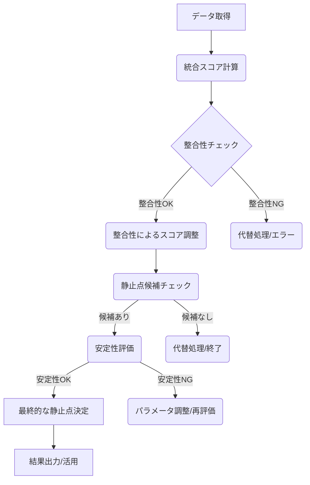

# コンセンサスモデルの実装（パート4：静止点検出と評価方法）[改善版]

## 本文書の目的

本文書は、読者がトリプルパースペクティブ型戦略AIレーダーの核心技術である静止点検出を理解し、n8nを使って実装し、自組織の意思決定プロセスを高度化できるようにすることを目的としています。静止点検出の理論的背景から具体的な実装、評価、活用方法までを網羅的に解説し、読者が実践的なスキルを習得できるよう支援します。

## 1. 静止点検出の概念

### このセクションの目的

読者が静止点の理論的背景を理解し、自組織の意思決定プロセスにどのように適用できるかを判断できるようにする。

静止点検出は、トリプルパースペクティブ型戦略AIレーダーの中核をなす概念であり、テクノロジー、マーケット、ビジネスという3つの異なる視点からの評価を統合し、最適な戦略的判断点を特定するプロセスです。これは単なる数値的な平均や多数決ではなく、各視点の重要度、確信度、そして視点間の整合性を考慮した、より洗練された意思決定メカニズムを提供します。静止点は、これらの多角的な評価が均衡し、安定した状態を示すポイントとして定義されます。

静止点の検出は、特に複雑で不確実性の高い環境下での戦略策定において重要です。例えば、新技術の導入評価、市場参入戦略の決定、競合分析など、多様な要素が絡み合う状況で、客観的かつ多角的な視点に基づいた最適解を見つけ出すのに役立ちます。静止点を特定することで、組織はリソース配分の最適化、リスクの低減、そして持続的な競争優位性の確保に向けた、より確かな一歩を踏み出すことができます。

## 2. 静止点検出アルゴリズム

### このセクションの目的

読者がアルゴリズムの各ステップを理解し、自身のユースケースに合わせてカスタマイズできるようにする。

静止点検出アルゴリズムは、3つの視点からの評価データを入力とし、一連の計算と評価プロセスを経て、最終的な静止点を特定します。以下にその主要なステップを示します。

### 2.1. 静止点検出プロセスのフロー


*図1: 静止点検出プロセスのフローチャート*

### 2.2. 統合スコア計算

各評価対象（例：特定の技術や戦略オプション）について、3つの視点（テクノロジー、マーケット、ビジネス）からの評価スコア（例：1〜5段階評価）と、それぞれの評価に対する確信度（例：0〜1）を入力とします。さらに、各視点の重要度（重み）を設定します。統合スコアは、各視点の評価スコアに確信度と重要度（重み）を掛け合わせ、それらを合計することで算出されます。

```
統合スコア = Σ (視点iの評価スコア * 視点iの確信度 * 視点iの重要度)
```

*スケーラビリティ考慮事項*: 評価対象が増加すると、この計算の繰り返し回数が増加します。単純な計算ですが、データ量によっては処理時間の線形増加が見込まれます。

### 2.3. 整合性による調整

3つの視点からの評価がどの程度一致しているかを示す「整合性スコア」を計算します。これは、例えば3つの評価スコア間の標準偏差や分散を計算し、その逆数を正規化するなどの方法で算出できます。整合性が低い（評価がばらついている）場合、統合スコアを下方修正します。これにより、全視点が一致して高く評価する対象をより重視することができます。

```
調整後統合スコア = 統合スコア * f(整合性スコア)
```
ここで `f(整合性スコア)` は整合性が高いほど1に近づき、低いほど0に近づく関数です。

*計算ロジックの図解*: (ここに整合性スコア計算とスコア調整のロジックを図示する。例：入力として3つの視点のスコア、出力として整合性スコアと調整後統合スコアを示す図)

*スケーラビリティ考慮事項*: 整合性スコアの計算（標準偏差など）はデータ点数（この場合は3）に依存するため、評価対象数が増えても計算負荷は大きく変動しません。

### 2.4. 静止点候補のチェック

調整後統合スコアが事前に設定された閾値（例：閾値1）を超え、かつ各視点の評価スコアもそれぞれ個別の閾値（例：閾値2, 3, 4）を満たしているものを「静止点候補」として特定します。

*パラメータ調整プロセス*: 閾値の設定は重要です。閾値1は全体の評価レベルを、閾値2〜4は各視点での最低限の評価レベルを決定します。これらの閾値は、過去のデータやシミュレーション、専門家の知見に基づいて調整する必要があります。初期値としては、例えば統合スコアの閾値1を上位20%に入る値、各視点の閾値2〜4を平均点以上などに設定し、結果を見ながら微調整します。

*スケーラビリティ考慮事項*: 候補チェックは単純な比較演算であり、評価対象数に対して線形に処理時間が増加します。

### 2.5. 安定性評価

静止点候補に対して「安定性」を評価します。これは、入力データ（評価スコア、確信度、重要度）に微小な変動を与えた場合に、その候補が依然として静止点候補として検出され続けるかどうかを評価するものです。例えば、モンテカルロシミュレーションのように、入力値にランダムなノイズを加えて複数回評価プロセスを実行し、候補が安定して検出される確率（安定性スコア）を計算します。安定性スコアが閾値（例：閾値5）を超えたものを、より信頼性の高い静止点と見なします。

*計算ロジックの図解*: (ここに安定性評価のプロセスを図示する。例：入力パラメータへのノイズ付加、複数回の評価実行、安定性スコア計算の流れを示す図)

*パラメータ調整プロセス*: 安定性評価の閾値5は、どの程度の堅牢性を求めるかによって調整します。一般的には0.5〜0.7の範囲で設定されることが多いですが、リスク許容度に応じて調整します。シミュレーション回数も精度と計算時間のトレードオフで決定します。

*スケーラビリティ考慮事項*: 安定性評価は計算負荷が高いステップです。特にモンテカルロシミュレーションは評価対象数×シミュレーション回数分の計算が必要となり、データ量増加に対して計算時間が急増する可能性があります。並列処理やサンプリング手法の導入が有効です。

### 2.6. 最終的な静止点決定

安定性評価をクリアした静止点候補の中から、最終的な静止点を決定します。複数の候補が存在する場合は、調整後統合スコアや安定性スコアに基づいてランク付けし、最も優れたものを選択するか、複数の有力な選択肢として提示します。

*代替解生成ロジック*: 安定性評価をクリアする候補が存在しない場合、いくつかの代替戦略が考えられます。
1.  **閾値の緩和**: 安定性評価の閾値5や静止点候補チェックの閾値1〜4を段階的に緩和し、再度評価を実行します。
2.  **パラメータの再検討**: 各視点の重要度（重み）を見直し、異なる重み付けで評価を再実行します。
3.  **準静止点の提示**: 安定性評価はクリアできなかったが、統合スコアが高い候補を「準静止点」として提示し、追加分析を促します。

*スケーラビリティ考慮事項*: 最終決定プロセスは比較や選択が主であり、計算負荷は比較的小さいです。

## 3. n8nによる静止点検出の実装

### このセクションの目的

読者がn8nプラットフォーム上で静止点検出システムを段階的に構築し、実際の業務データで活用できるようにする。

静止点検出アルゴリズムは、ノーコード/ローコードプラットフォームであるn8nを活用して効率的に実装できます。n8nのビジュアルインターフェースと豊富なノードにより、コーディングの知識が少ないユーザーでも複雑なロジックを構築・管理することが可能です。

### 3.1. 段階的実装アプローチ

静止点検出システムは、以下のフェーズで段階的に実装を進めることを推奨します。

1.  **フェーズ1 - 基本プロトタイプ**: データ取得（例：Google Sheets Readノード）、統合スコア計算（Functionノード）、静止点候補チェック（If/Switchノード）の基本フローを実装します。まずは主要なロジックが動作することを確認します。
2.  **フェーズ2 - 機能拡張**: 整合性スコア計算とスコア調整（Functionノード）、安定性評価（Functionノード、Loopノード）を追加します。アルゴリズムの精度を高めます。
3.  **フェーズ3 - 高度な機能**: データベース連携（例：Postgresノード）、外部システム統合（例：Webhookノード）、結果の可視化（例：データ可視化ツールへの連携）を追加します。システムの利便性と応用範囲を広げます。
4.  **フェーズ4 - 最適化とスケーリング**: パフォーマンス最適化、エラーハンドリング強化、大規模データ対応などの改善を行います。システムの堅牢性と効率性を向上させます。

*実装チェックリスト*: (各フェーズの完了を確認するための詳細なチェックリストをここに記述。例：フェーズ1 - データ取得ノード設定完了、統合スコア計算ロジック実装完了、候補チェック閾値設定完了など)

### 3.2. 主要なn8nノードと設定

- **データ取得**: Google Sheets Read, Postgres, MySQL, HTTP Requestなどのノードを使用し、3つの視点の評価データを取得します。
- **計算処理**: FunctionノードやCodeノード（JavaScript/Python）を使用して、統合スコア計算、整合性スコア計算、スコア調整、安定性評価などのカスタムロジックを実装します。
- **条件分岐**: IfノードやSwitchノードを使用して、整合性チェック、静止点候補チェック、安定性チェックなどの条件分岐を行います。
- **ループ処理**: Loopノードを使用して、安定性評価のためのモンテカルロシミュレーションなどを実装します。
- **データ操作**: Setノード、Mergeノード、Item Listsノードなどを使用して、データ構造の整形や結合を行います。
- **データベース連携**: 各種データベースノード（Postgres, MySQLなど）を使用して、評価結果の保存や参照を行います。
- **エラーハンドリング**: Error Triggerノードを使用して、ワークフロー実行中のエラーを捕捉し、通知（例：Slack, Emailノード）や代替処理フローへ分岐させます。

*n8nワークフロー画面例*: (ここにn8nの主要なワークフロー部分のスクリーンショットを挿入。ノードの接続関係、Functionノード内のコード例、Ifノードの設定例などを示す)

### 3.3. 大規模データ処理のパフォーマンス最適化

データ量が増加した場合、以下の最適化手法を検討します。

1.  **データベースクエリの最適化**: データ取得時に必要なデータのみを取得するようSQLクエリを最適化します。WHERE句での絞り込み、適切なインデックスの使用、JOIN操作の効率化などが重要です。例：`SELECT tech_score, market_score, business_score FROM evaluations WHERE project_id = 'XYZ' AND evaluation_date > '2024-01-01';`
2.  **計算処理のバッチ化**: n8nのSplitInBatchesノードを使用して、大量の評価対象データを適切なサイズのバッチ（例：100件ごと）に分割し、ループ処理で各バッチを順次処理します。これにより、一度に消費するメモリ量を抑え、安定した処理を実現します。
3.  **キャッシュ戦略**: 頻繁に変更されないパラメータ（例：視点の重み）や計算結果（例：過去の整合性スコア）をn8nのStatic Data機能や外部キャッシュ（例：Redis）に保存し、再利用することで計算負荷を軽減します。Functionノード内でキャッシュの有無を確認し、存在すればキャッシュ値を、なければ計算してキャッシュに保存するロジックを実装します。
4.  **非同期処理の活用**: 安定性評価など時間のかかる処理は、別のワークフローとして非同期に実行し、完了後にWebhookノードで結果を元のワークフローに通知する構成を検討します。これにより、メインのワークフローが長時間ブロックされるのを防ぎます。

### 3.4. エラーハンドリングと例外処理

堅牢なシステムを構築するためには、体系的なエラーハンドリングが不可欠です。

1.  **データ検証**: ワークフローの初期段階で、入力データの欠損値、異常値、データ型不整合などをチェックします。IfノードやFunctionノードで検証ロジックを実装し、問題があればエラーとして処理するか、デフォルト値で補完します。
2.  **エラー分類**: 発生しうるエラーを分類し（例：データ取得エラー、計算エラー、API連携エラー）、n8nのError Triggerノードで捕捉します。エラーの種類に応じて、処理を中断するか、代替処理を実行するか、管理者に通知するかなどの対応をSwitchノードで分岐させます。
3.  **グレースフルデグラデーション**: 一部のデータが欠損している場合でも、可能な範囲で処理を継続する設計を検討します。例えば、ある視点の評価データがない場合に、残りの視点だけで暫定的なスコアを計算するロジックをFunctionノードで実装します。
4.  **エラーログとモニタリング**: Error Triggerノードで捕捉したエラー情報を、発生時刻、エラー内容、関連データなどとともにデータベースやログファイルに記録します。重要なエラーが発生した場合は、SlackノードやEmailノードで管理者に即時通知します。

*エラーケース別の対応策表*:

| エラーケース | 原因 | 対応策 | n8nノード例 |
|------------|------|-------|-----------|
| データ欠損 | 入力データ不備 | デフォルト値補完 or エラー通知 | Function, If, Email |
| 計算エラー | ゼロ除算、型不一致 | 入力値チェック、try-catch構文 | Function |
| API接続エラー | 外部API障害 | リトライ処理、エラー通知 | HTTP Request, Wait, Slack |
| データベース接続エラー | DB障害、認証失敗 | フォールバックDB使用、ローカルキャッシュ | Postgres, Function |
| メモリ不足 | 大量データ処理 | バッチ処理、データ分割 | SplitInBatches, Loop |

### 3.5. データベーススキーマ設計

静止点検出に必要なデータを格納するためのデータベーススキーマ設計例を示します。

*ERD図*: (ここに主要なテーブルとその関連を示すERD図を記述または図示する想定。例：Projects, Evaluations, Perspectives, Results テーブルなど)

*テーブル定義例*:
- **Evaluations (評価データ)**
  - `evaluation_id` (PK)
  - `project_id` (FK)
  - `perspective_id` (FK)
  - `evaluation_score`
  - `confidence_score`
  - `evaluation_date`
- **Perspectives (視点マスタ)**
  - `perspective_id` (PK)
  - `perspective_name` (テクノロジー, マーケット, ビジネス)
  - `weight` (重要度)
- **Results (静止点結果)**
  - `result_id` (PK)
  - `project_id` (FK)
  - `integrated_score`
  - `adjusted_score`
  - `coherence_score`
  - `stability_score`
  - `is_equilibrium` (boolean)
  - `calculation_date`

*インデックス設計*: `project_id`, `evaluation_date`, `perspective_id` など、検索や結合で頻繁に使用される列にはインデックスを作成します。

## 4. 静止点の評価と活用

### このセクションの目的

読者が検出された静止点の品質を評価し、意思決定プロセスに効果的に統合できるようにする。

検出された静止点は、単なる計算結果ではなく、戦略的な意思決定に活用するための重要な情報源です。その品質を評価し、適切に解釈・活用することが求められます。

### 4.1. 静止点の評価指標

静止点の品質は、以下の指標を用いて多角的に評価します。

- **調整後統合スコア**: 全体的な評価レベルを示します。高いほど望ましいですが、他の指標とのバランスが重要です。
- **整合性スコア**: 視点間の一致度を示します。高いほど、異なる視点から一貫した評価が得られていることを意味します。
- **安定性スコア**: 結果の堅牢性を示します。高いほど、入力データの小さな変動に対して結果が安定していることを意味します。
- **各視点の評価スコア**: 個別の視点での評価レベルを確認し、全体のスコアが特定の視点に偏っていないかを確認します。

*結果の解釈方法*: これらの指標を総合的に評価します。例えば、統合スコアが高くても整合性や安定性が低い場合は、その結果の信頼性に注意が必要です。逆に、統合スコアが中程度でも整合性と安定性が高ければ、堅実な選択肢である可能性があります。これらの指標をダッシュボードなどで可視化し、意思決定者が直感的に理解できるようにすることが重要です。

*静止点評価結果の可視化例*: (ここに評価結果を示すダッシュボードやレーダーチャートの例を記述または図示する想定。各指標を視覚的に比較できるようにする)

### 4.2. 実装の評価と検証

静止点検出システム自体の性能と信頼性を評価・検証するためのフレームワークを構築します。

1.  **精度検証方法**: 専門家による評価結果や過去の成功事例など、既知の「正解」データセットとシステムが検出した静止点を比較し、精度（Precision）、再現率（Recall）、F値などを計算します。
2.  **バックテストフレームワーク**: 過去のデータを用いてシステムを実行し、その時点で検出された静止点が、後の結果（例：プロジェクトの成功、市場の反応）とどの程度一致していたかを検証します。n8nで過去データを順次読み込み、評価を実行するワークフローを構築します。
3.  **感度分析**: 視点の重みや各種閾値などのパラメータを変化させ、それが最終的な静止点の検出結果にどの程度影響を与えるかを分析します。n8nのLoopノードとSetノードを使い、パラメータを系統的に変更しながら評価を繰り返し実行します。
4.  **A/Bテスト設計**: 異なるアルゴリズム（例：異なる整合性スコアの計算方法）やパラメータ設定を持つ複数のバージョンのシステムを並行して実行し、どちらがより良い結果（例：より精度の高い静止点、より安定した結果）をもたらすかを比較検証します。

*評価指標の定義*: システム性能を評価する指標として、上記の精度・再現率・F値に加え、処理時間（データ取得から結果出力まで）、計算リソース使用量（CPU、メモリ）などを定義し、目標値を設定します。

### 4.3. 意思決定への統合

検出された静止点とその評価結果は、戦略会議やプロジェクト評価などの意思決定プロセスにインプットとして提供されます。静止点はあくまで客観的なデータに基づく推奨であり、最終的な判断は人間の経験や直感、定性的な情報も加味して行われるべきです。静止点情報は、議論の出発点や判断の根拠の一つとして活用されることで、より質の高い意思決定を支援します。

## 5. 用語集

- **安定性（Stability）**: 入力パラメータの小さな変化に対する出力の変化の度合いで測定される指標。高い安定性は、入力データの小さな変動に対して堅牢であることを意味する。
- **整合性（Coherence）**: 3つの視点の評価結果がどの程度一致しているかを表す指標。視点間の評価の類似度を測定し、0〜1の値で表される。
- **静止点（Equilibrium Point）**: テクノロジー、マーケット、ビジネスという3つの異なる視点からの評価が最適に統合される点。単なる数値的な平均や多数決ではなく、各視点の役割と相互関係を考慮した最適解を表す。
- **統合スコア（Integrated Score）**: 各視点の評価結果にその視点の重要度（重み）を掛け合わせ、それらを合計することで算出される総合評価値。
- **閾値（Threshold）**: 静止点候補を特定するための判断基準となる値。調整後統合スコア、重要度、確信度、整合性などの各指標に対して設定される。

*用語間の関連性図*: (ここに主要な用語間の関連性を示す概念図を記述または図示する想定。例：評価スコア→統合スコア→調整後統合スコア→静止点候補→安定性評価→静止点)
