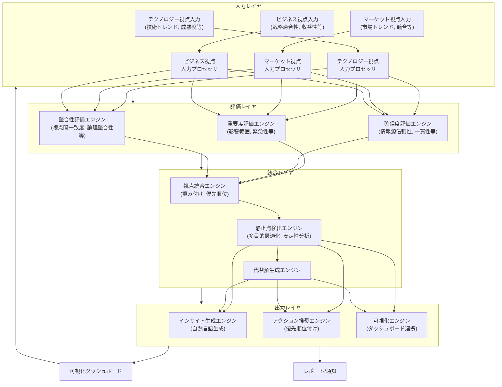
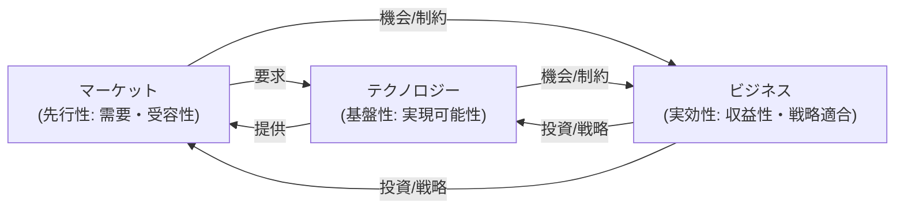

# コンセンサスモデルの実装（パート1：基本構造と設計原則） - 改訂版

## 1. コンセンサスモデルの概要と目的

トリプルパースペクティブ型戦略AIレーダーの中核をなすコンセンサスモデルは、テクノロジー、マーケット、ビジネスという3つの異なる視点から得られた分析結果を統合し、多角的かつ信頼性の高い解釈と戦略的な意思決定を支援するためのエンジンです。単一の視点では見落としがちな機会やリスクを捉え、複雑な状況下でも最適な判断を導き出すことを目指します。

本セクション（パート1）では、コンセンサスモデルの基本的な構造と、その設計において重視すべき原則、そしてn8nを用いた初期設定の実装について解説します。

### 1.1. コンセンサスモデルの主要な目的

コンセンサスモデルは、以下の主要な目的を達成するために設計されます：

1.  **複数視点からの情報統合**: テクノロジー（実現可能性）、マーケット（受容性・需要）、ビジネス（実効性・収益性）の各視点から得られる多様な情報を構造化し、統合的な理解を形成します。
2.  **変化点の重要度評価**: 検出された市場や技術の変化、ビジネス上のイベントなどの重要度を、影響範囲、変化の大きさ、戦略的関連性、時間的緊急性といった多角的な基準で評価します。
3.  **静止点（最適解）の検出**: 3つの視点の評価を総合し、現在の状況における最も有効な解釈や戦略的なポジション（静止点）を特定します。これには、判断の確信度評価や代替解の提示も含まれます。
4.  **アクション推奨の生成**: 検出された静止点や重要な変化に基づき、具体的な戦略的アクションを推奨します。アクションの優先順位付けや実行タイミングの提案も行います。

## 2. コンセンサスモデルの基本構造とアーキテクチャ

コンセンサスモデルは、入力、評価、統合、出力の4つの主要なレイヤーで構成されます。以下にその基本構造と、全体アーキテクチャの概念図を示します。

### 2.1. 基本構造（テキスト表現）

```
コンセンサスモデル
├── 入力レイヤ (Input Layer)
│   ├── テクノロジー視点入力プロセッサ (Technology Input Processor)
│   ├── マーケット視点入力プロセッサ (Market Input Processor)
│   └── ビジネス視点入力プロセッサ (Business Input Processor)
├── 評価レイヤ (Evaluation Layer)
│   ├── 重要度評価エンジン (Importance Evaluation Engine)
│   ├── 確信度評価エンジン (Confidence Evaluation Engine)
│   └── 整合性評価エンジン (Coherence Evaluation Engine)
├── 統合レイヤ (Integration Layer)
│   ├── 視点統合エンジン (Perspective Integration Engine)
│   ├── 静止点検出エンジン (Equilibrium Detection Engine)
│   └── 代替解生成エンジン (Alternative Solution Generation Engine)
└── 出力レイヤ (Output Layer)
    ├── インサイト生成エンジン (Insight Generation Engine)
    ├── アクション推奨エンジン (Action Recommendation Engine)
    └── 可視化エンジン (Visualization Engine)
```

### 2.2. 全体アーキテクチャ図 (Mermaid)


*図1: コンセンサスモデルの全体アーキテクチャ概念図*

### 2.3. 各レイヤーの詳細

#### 2.3.1. 入力レイヤ (Input Layer)

3つの視点からの分析結果（構造化データ、非構造化データ、スコア、トレンド情報など）を受け取り、後続の評価・統合プロセスで利用可能な統一された形式（例：特徴ベクトル、評価スコア付きオブジェクト）に変換・正規化します。

-   **テクノロジー視点入力プロセッサ**: 技術トレンド分析、特許分析、研究論文分析などの結果を入力。技術の成熟度（例：Gartner Hype Cycle）、採用率、将来のインパクトスコアなどを抽出・正規化。
-   **マーケット視点入力プロセッサ**: 市場調査レポート、競合情報、顧客レビュー、SNS分析などの結果を入力。市場規模、成長率、顧客センチメント、競合ポジショニングなどを抽出・正規化。
-   **ビジネス視点入力プロセッサ**: 財務諸表分析、社内KPIデータ、戦略文書などの結果を入力。ROI予測、戦略適合性スコア、リソース可用性、リスク評価などを抽出・正規化。

#### 2.3.2. 評価レイヤ (Evaluation Layer)

入力された情報を、定義された基準に基づいて評価し、スコアリングします。

-   **重要度評価エンジン**: 各情報の戦略的な重要性を評価。影響範囲（例：影響を受ける顧客数、市場規模）、変化の大きさ（例：成長率の変化幅）、戦略的関連性（例：KPIへの影響度）、時間的緊急性（例：対応までの猶予期間）などを複合的に評価し、重要度スコアを算出。
-   **確信度評価エンジン**: 各情報の信頼性や確からしさを評価。情報源の信頼性（例：過去の実績、専門性）、データ量と質、分析手法の妥当性、結果の一貫性・再現性などを評価し、確信度スコアを算出。
-   **整合性評価エンジン**: 異なる視点からの情報が互いに矛盾なく整合しているかを評価。視点間の一致度（例：技術的に有望だが市場ニーズがない）、論理的整合性（例：前提と結論の矛盾）、時間的整合性（例：過去のトレンドとの整合性）、コンテキスト整合性（例：業界全体の動向との整合性）などを評価し、整合性スコアを算出。

#### 2.3.3. 統合レイヤ (Integration Layer)

評価された情報を統合し、総合的な解釈と判断を導き出します。

-   **視点統合エンジン**: 3つの視点の評価結果（重要度、確信度、整合性スコア）を、定義された重み付けやルールに基づいて統合。例えば、「マーケット視点を先行指標とし、テクノロジー視点を実現可能性の基盤、ビジネス視点を最終的な実効性判断とする」といったルールを適用。統合スコアを算出。
-   **静止点検出エンジン**: 統合された評価空間の中から、最も安定的かつ有望な状態（静止点）を検出。多目的最適化アルゴリズム（例：NSGA-II）やパレート最適解探索、クラスタリング（例：DBSCAN）などの手法を用いて、複数の評価指標（例：高重要度、高確信度、高整合性）をバランス良く満たす解を探索。解の安定性（例：微小な入力変化に対する頑健性）も評価。
-   **代替解生成エンジン**: 最適解（静止点）だけでなく、次善の解や異なるトレードオフを持つ代替的な解釈・戦略オプションを生成。感度分析やシナリオプランニングの手法を用いて、異なる条件下での解を提示。

#### 2.3.4. 出力レイヤ (Output Layer)

統合結果を人間が理解しやすい形で提示します。

-   **インサイト生成エンジン**: 検出された静止点や重要な変化、代替解について、その意味合いや背景、潜在的な影響などを自然言語で解説。要約レポートやアラートを生成。
-   **アクション推奨エンジン**: 導き出されたインサイトに基づき、具体的な戦略的アクション（例：研究開発投資の強化、新規市場参入の検討、パートナーシップ締結）を推奨。アクションの優先順位、推奨される実行タイミング、期待される効果、必要なリソースなどを提示。
-   **可視化エンジン**: コンセンサスモデルの評価・統合プロセスと結果を、ダッシュボードやレポートを通じて視覚的に表示。レーダーチャート、散布図、時系列グラフ、ヒートマップなどを用いて、複雑な情報を直感的に理解できるように支援。

## 3. コンセンサスモデルの設計原則

効果的なコンセンサスモデルを構築するためには、以下の設計原則を重視します。

### 3.1. 視点間の関係性の尊重 (Respecting Perspective Relationships)

3つの視点は独立しているのではなく、相互に関連しています。この関係性をモデルに組み込むことが重要です。

-   **マーケット視点の先行性**: 市場のニーズや受容性がなければ、優れた技術もビジネスとして成立しません。マーケット視点の評価を初期のフィルターや重要な重みとして扱います。
-   **テクノロジー視点の基盤性**: 技術的な実現可能性がなければ、市場の要求に応えることはできません。テクノロジー視点の評価を、実現可能性の制約条件として考慮します。
-   **ビジネス視点の実効性**: 市場と技術が有望でも、事業として採算が合わなければ持続しません。ビジネス視点の評価を、最終的な実行可能性と収益性の判断基準とします。


*図2: 3つの視点の関係性概念図*

### 3.2. 多層的評価の実施 (Multi-Layered Evaluation)

評価は単一のスコアではなく、複数の層で行うことで、情報の信頼性と解釈の深さを向上させます。

-   **個別視点内評価**: 各視点内で、入力情報の重要度、確信度を評価。
-   **視点間整合性評価**: 異なる視点からの情報が互いに矛盾しないか評価。
-   **総合評価**: 全ての評価結果を統合し、全体としての重要度、確信度、整合性を評価。

### 3.3. 静止点の明確な定義と検出 (Clear Definition and Detection of Equilibrium)

「静止点」とは何かを明確に定義し、それを検出するための客観的な基準とアルゴリズムを設定します。

-   **定義**: 3つの視点の評価（重要度、確信度、整合性）が総合的に高く、かつ安定している状態。戦略的に注力すべき、あるいは現状維持が妥当と判断されるポイント。
-   **検出基準**: 事前に定義された重要度、確信度、整合性の閾値、およびそれらの組み合わせルール。
-   **安定性評価**: 検出された静止点が、入力情報のわずかな変動に対してどの程度安定しているかを評価（感度分析）。

### 3.4. 透明性と説明可能性の確保 (Transparency and Explainability)

コンセンサスモデルがどのように結論に至ったのかを追跡・説明できることが重要です。

-   **判断根拠の明示**: 各評価スコアの算出根拠、適用されたルール、統合プロセスを記録・提示。
-   **確信度の提示**: 最終的な判断や推奨アクションに対する確信度スコアを提示。
-   **代替解の提示**: 最適解だけでなく、代替的な解釈やオプションが存在することを示す。
-   **What-if分析**: 特定の入力やパラメータを変更した場合に結果がどう変わるかシミュレーションできる機能。

### 3.5. 適応性と学習能力の実装 (Adaptability and Learning Capability)

ビジネス環境は常に変化するため、コンセンサスモデルも変化に適応し、学習する能力を持つべきです。

-   **パラメータの自動調整**: モデルの予測や推奨と実際の結果との乖離に基づき、評価基準の重みや閾値を自動調整（例：強化学習、オンライン学習）。
-   **フィードバックの取り込み**: ユーザー（専門家、意思決定者）からのフィードバック（例：評価スコアの妥当性、推奨アクションの有効性）をモデルに反映。
-   **モデルの継続的改善**: 定期的にモデルの性能を評価し、必要に応じて構造やアルゴリズム自体を見直すプロセスを確立。

## 4. n8nによるコンセンサスモデルの基本実装（初期化）

n8nを活用して、コンセンサスモデルの基本構造を実装します。ここでは、モデルの動作に必要なパラメータやルールを定義し、データベースに保存する初期化ワークフローを示します。これは、コンセンサスモデルを実際に運用する前の準備段階にあたります。

### 4.1. コンセンサスモデル初期化ワークフロー (n8n)

このワークフローは、手動トリガーで開始され、コンセンサスモデルの動作に必要なパラメータ（各視点の重み、評価閾値など）と、評価・統合のためのルールを定義し、PostgreSQLデータベースに保存します。また、結果を格納するためのテーブルスキーマも作成します。

```javascript
// n8n workflow: Initialize Consensus Model
// Trigger: Manual
// Description: Defines and saves initial parameters, rules, and DB schema for the consensus model.
[
  {
    "id": "start",
    "type": "n8n-nodes-base.manualTrigger",
    "parameters": {},
    "typeVersion": 1,
    "notes": "コンセンサスモデルの初期化を手動で開始します。"
  },
  {
    "id": "defineConsensusParameters",
    "type": "n8n-nodes-base.function",
    "parameters": {
      "functionCode": `
        // Define consensus model parameters
        // これらの値は初期値であり、運用中に調整される可能性があります。
        const consensusParameters = {
          // Perspective weights (合計が1になるように)
          perspectiveWeights: {
            technology: 0.33,
            market: 0.34, // マーケット視点をわずかに重視
            business: 0.33
          },
          
          // Importance evaluation parameters (各要素の重みと評価閾値)
          importanceParameters: {
            impactScope: { weight: 0.25, thresholds: { low: 0.3, medium: 0.6, high: 0.8 } },
            changeMagnitude: { weight: 0.25, thresholds: { low: 0.3, medium: 0.6, high: 0.8 } },
            strategicRelevance: { weight: 0.30, thresholds: { low: 0.3, medium: 0.6, high: 0.8 } },
            timeUrgency: { weight: 0.20, thresholds: { low: 0.3, medium: 0.6, high: 0.8 } }
          },
          
          // Confidence evaluation parameters
          confidenceParameters: {
            sourceReliability: { weight: 0.30, thresholds: { low: 0.3, medium: 0.6, high: 0.8 } },
            dataVolume: { weight: 0.20, thresholds: { low: 0.3, medium: 0.6, high: 0.8 } },
            consistency: { weight: 0.30, thresholds: { low: 0.3, medium: 0.6, high: 0.8 } },
            verifiability: { weight: 0.20, thresholds: { low: 0.3, medium: 0.6, high: 0.8 } }
          },
          
          // Coherence evaluation parameters
          coherenceParameters: {
            perspectiveAgreement: { weight: 0.40, thresholds: { low: 0.3, medium: 0.6, high: 0.8 } },
            logicalCoherence: { weight: 0.30, thresholds: { low: 0.3, medium: 0.6, high: 0.8 } },
            temporalCoherence: { weight: 0.20, thresholds: { low: 0.3, medium: 0.6, high: 0.8 } },
            contextualCoherence: { weight: 0.10, thresholds: { low: 0.3, medium: 0.6, high: 0.8 } }
          },
          
          // Equilibrium point detection parameters (静止点検出の閾値)
          equilibriumParameters: {
            minImportance: 0.6, // 最低限必要な重要度
            minConfidence: 0.7, // 最低限必要な確信度
            minCoherence: 0.65, // 最低限必要な整合性
            stabilityThreshold: 0.1 // 安定性評価の閾値 (例: 感度分析でのスコア変動幅)
          }
        };
        
        return {json: {consensusParameters}};
      `
    },
    "notes": "コンセンサスモデルの評価と統合に使用するパラメータ（重み、閾値）を定義します。"
  },
  {
    "id": "saveConsensusParameters",
    "type": "n8n-nodes-base.postgres",
    "parameters": {
      "operation": "executeQuery",
      "query": `
        -- consensus_parameters テーブルが存在しない場合は作成
        CREATE TABLE IF NOT EXISTS consensus_parameters (
          id SERIAL PRIMARY KEY,
          parameters JSONB NOT NULL, -- パラメータ全体をJSONBで保存
          created_at TIMESTAMP WITH TIME ZONE DEFAULT CURRENT_TIMESTAMP,
          is_active BOOLEAN DEFAULT TRUE -- 現在有効なパラメータセットを示すフラグ
        );
        
        -- 既存の有効なパラメータを無効化 (常に最新の1セットのみ有効とする場合)
        UPDATE consensus_parameters
        SET is_active = FALSE
        WHERE is_active = TRUE;
        
        -- 新しいパラメータセットを挿入
        INSERT INTO consensus_parameters (parameters)
        VALUES ($1::jsonb); -- Functionノードからの出力をパラメータとして使用
      `,
      "values": "={{ JSON.stringify($json.consensusParameters) }}" // Functionノードの出力をJSON文字列として渡す
    },
    "notes": "定義したパラメータをPostgreSQLの`consensus_parameters`テーブルに保存します。常に最新のパラメータセットが有効になります。"
  },
  {
    "id": "defineConsensusRules",
    "type": "n8n-nodes-base.function",
    "parameters": {
      "functionCode": `
        // Define consensus rules (ルールベースの評価・統合ロジック)
        // これらは例であり、実際のビジネスロジックに合わせて定義・拡張します。
        const consensusRules = [
          // --- 視点統合ルール --- 
          {
            id: 'rule_market_first',
            name: 'マーケット視点先行ルール',
            description: 'マーケット視点の重要度が特に高い場合、その重みをさらに増加させる。',
            condition: 'market.importance > 0.8 && market.confidence > 0.7', // 条件式 (例)
            action: 'adjust_weight("market", 1.2)', // 実行アクション (例: 重みを1.2倍)
            priority: 10 // ルール適用優先度
          },
          {
            id: 'rule_tech_foundation',
            name: 'テクノロジー視点基盤ルール',
            description: 'テクノロジーの実現可能性（確信度）が低い場合、全体の確信度を下げる。',
            condition: 'technology.confidence < 0.5',
            action: 'adjust_overall_confidence(0.8)', // 全体確信度を0.8倍
            priority: 9
          },
          {
            id: 'rule_business_effectiveness',
            name: 'ビジネス視点実効性ルール',
            description: 'ビジネス視点の整合性が高い場合、推奨アクションの優先度を上げる。',
            condition: 'business.coherence > 0.8 && business.importance > 0.6',
            action: 'boost_action_priority(1.5)', // アクション優先度を1.5倍
            priority: 8
          },
          
          // --- 静止点検出ルール --- 
          {
            id: 'rule_high_consensus',
            name: '高コンセンサスルール',
            description: '全視点で重要度・確信度・整合性が高く、視点間の一致度も高い場合、強い静止点として検出。',
            condition: 'overall_importance > 0.8 && overall_confidence > 0.8 && overall_coherence > 0.7 && perspective_agreement > 0.8',
            action: 'mark_as_equilibrium("strong", 1.0)', // 強い静止点、スコア1.0
            priority: 10
          },
          {
            id: 'rule_market_tech_aligned',
            name: 'マーケット・テクノロジー一致ルール',
            description: 'マーケットとテクノロジーは一致しているがビジネス視点が不一致の場合、ビジネス課題を強調。',
            condition: 'agreement(market, technology) > 0.7 && agreement(market, business) < 0.5 && agreement(technology, business) < 0.5',
            action: 'highlight_issue("business_alignment")',
            priority: 7
          },
          {
            id: 'rule_all_perspectives_conflict',
            name: '全視点不一致ルール',
            description: '全ての視点が大きく不一致の場合、静止点検出は困難とし、代替解生成を促す。',
            condition: 'perspective_agreement < 0.4',
            action: 'trigger_alternative_generation(3)', // 代替解を3つ生成
            priority: 6
          }
          // 他にも多数のルールを定義可能...
        ];
        
        // ルールエンジンで解釈可能な形式で返す
        return {json: {consensusRules}};
      `
    },
    "notes": "コンセンサス形成のためのルールを定義します。条件(condition)と実行アクション(action)で構成されます。"
  },
  {
    "id": "saveConsensusRules",
    "type": "n8n-nodes-base.postgres",
    "parameters": {
      "operation": "executeQuery",
      "query": `
        -- consensus_rules テーブルが存在しない場合は作成
        CREATE TABLE IF NOT EXISTS consensus_rules (
          id VARCHAR(50) PRIMARY KEY, -- ルールの一意なID
          name VARCHAR(100) NOT NULL, -- ルールの名称
          description TEXT, -- ルールの説明
          condition TEXT NOT NULL, -- 適用条件式 (ルールエンジンで解釈)
          action TEXT NOT NULL, -- 実行アクション (ルールエンジンで解釈)
          priority INTEGER NOT NULL, -- 適用優先度 (高いほど優先)
          is_active BOOLEAN DEFAULT TRUE, -- ルールの有効/無効フラグ
          created_at TIMESTAMP WITH TIME ZONE DEFAULT CURRENT_TIMESTAMP,
          updated_at TIMESTAMP WITH TIME ZONE DEFAULT CURRENT_TIMESTAMP
        );

        -- ルール更新用のトリガー関数 (updated_atを自動更新)
        CREATE OR REPLACE FUNCTION update_updated_at_column()
        RETURNS TRIGGER AS $$
        BEGIN
           NEW.updated_at = now(); 
           RETURN NEW;
        END;
        $$ language 'plpgsql';

        DROP TRIGGER IF EXISTS update_consensus_rules_updated_at ON consensus_rules;
        CREATE TRIGGER update_consensus_rules_updated_at
        BEFORE UPDATE ON consensus_rules
        FOR EACH ROW
        EXECUTE FUNCTION update_updated_at_column();

        -- 既存のルールを一旦削除 (あるいはis_active=FALSEに更新)
        -- ここでは単純化のため全削除
        -- DELETE FROM consensus_rules;

        -- 新しいルールを挿入または更新 (UPSERT)
        INSERT INTO consensus_rules (id, name, description, condition, action, priority, is_active)
        VALUES
        
          (
            '{{ rule.id }}',
            '{{ rule.name | replace("'", "''") }}', -- シングルクォートをエスケープ
            '{{ rule.description | replace("'", "''") }}',
            '{{ rule.condition | replace("'", "''") }}',
            '{{ rule.action | replace("'", "''") }}',
            {{ rule.priority }},
            TRUE
          ),
        
        ON CONFLICT (id) DO UPDATE SET
          name = EXCLUDED.name,
          description = EXCLUDED.description,
          condition = EXCLUDED.condition,
          action = EXCLUDED.action,
          priority = EXCLUDED.priority,
          is_active = TRUE, -- 更新時も有効化
          updated_at = NOW(); -- updated_atを手動で更新
      `
    },
    "notes": "定義したルールをPostgreSQLの`consensus_rules`テーブルに保存（UPSERT）します。ルールはIDで管理されます。"
  },
  {
    "id": "createConsensusSchema",
    "type": "n8n-nodes-base.postgres",
    "parameters": {
      "operation": "executeQuery",
      "query": `
        -- コンセンサス結果を保存するテーブル (consensus_results)
        CREATE TABLE IF NOT EXISTS consensus_results (
          id SERIAL PRIMARY KEY, -- 結果ID
          execution_id VARCHAR(100) UNIQUE NOT NULL, -- ワークフロー実行ID
          analysis_target TEXT NOT NULL, -- 分析対象 (例: 特定技術、市場セグメント)
          analysis_timestamp TIMESTAMP WITH TIME ZONE NOT NULL, -- 分析時点
          perspective_inputs JSONB NOT NULL, -- 各視点からの入力データ
          evaluation_scores JSONB NOT NULL, -- 重要度、確信度、整合性の評価スコア
          integration_result JSONB NOT NULL, -- 統合結果 (総合スコア、ルール適用結果など)
          is_equilibrium BOOLEAN NOT NULL, -- 静止点として検出されたか
          equilibrium_details JSONB, -- 静止点の詳細 (スコア、安定性など)
          alternative_solutions JSONB, -- 代替解 (存在する場合)
          generated_insights TEXT, -- 生成されたインサイト (自然言語)
          created_at TIMESTAMP WITH TIME ZONE DEFAULT CURRENT_TIMESTAMP
        );
        
        -- 推奨アクションを保存するテーブル (consensus_actions)
        CREATE TABLE IF NOT EXISTS consensus_actions (
          id SERIAL PRIMARY KEY, -- アクションID
          consensus_result_id INTEGER NOT NULL REFERENCES consensus_results(id) ON DELETE CASCADE, -- 紐づく結果ID
          action_type VARCHAR(50) NOT NULL, -- アクション種別 (例: R&D, M&A, Marketing)
          action_description TEXT NOT NULL, -- アクション内容
          priority FLOAT NOT NULL, -- 優先度スコア
          recommended_timing VARCHAR(50), -- 推奨実行タイミング (例: Short-term, Mid-term)
          expected_impact TEXT, -- 期待される効果
          required_resources TEXT, -- 必要リソース (概算)
          confidence_level FLOAT, -- 推奨の確信度
          created_at TIMESTAMP WITH TIME ZONE DEFAULT CURRENT_TIMESTAMP
        );

        -- インデックス作成 (クエリパフォーマンス向上のため)
        CREATE INDEX IF NOT EXISTS idx_consensus_results_timestamp ON consensus_results(analysis_timestamp DESC);
        CREATE INDEX IF NOT EXISTS idx_consensus_results_target ON consensus_results(analysis_target);
        CREATE INDEX IF NOT EXISTS idx_consensus_actions_result_id ON consensus_actions(consensus_result_id);
      `
    }
  }
]
```
*コード1: コンセンサスモデル初期化ワークフロー (n8n)*

**コード解説:**

1.  **`start`**: ワークフローを手動で開始します。
2.  **`defineConsensusParameters` (Function Node)**: JavaScriptコード内で、コンセンサスモデルの動作に必要な各種パラメータ（視点ごとの重み、重要度・確信度・整合性評価の各要素の重みと閾値、静止点検出の閾値など）を定義します。これらの値は初期値であり、後の学習やチューニングで変更される可能性があります。
3.  **`saveConsensusParameters` (Postgres Node)**: `defineConsensusParameters`で定義されたパラメータをJSONB形式で`consensus_parameters`テーブルに保存します。`is_active`フラグにより、常に最新のパラメータセットのみが有効になるように管理します。
4.  **`defineConsensusRules` (Function Node)**: コンセンサス形成のためのルールを定義します。各ルールはID、名称、説明、適用条件（`condition`）、実行アクション（`action`）、優先度（`priority`）を持ちます。条件式やアクションは、後続のルールエンジン（パート2以降で実装）で解釈・実行されることを想定した形式で記述します。
5.  **`saveConsensusRules` (Postgres Node)**: `defineConsensusRules`で定義されたルールを`consensus_rules`テーブルに保存します。UPSERT（Insert or Update）処理により、既存のルールIDがあれば更新し、なければ新規挿入します。
6.  **`createConsensusSchema` (Postgres Node)**: コンセンサスモデルの実行結果（`consensus_results`）と、それに基づいて生成される推奨アクション（`consensus_actions`）を保存するためのテーブルスキーマを定義し、存在しない場合に作成します。適切なインデックスも作成し、クエリパフォーマンスを考慮します。

この初期化ワークフローを実行することで、コンセンサスモデルの評価・統合プロセスを実行するための基本的な設定とデータベース構造が準備されます。

## 5. まとめと次のステップ

本セクションでは、コンセンサスモデルの基本的な概念、4つのレイヤーからなる構造、設計における5つの重要な原則、そしてn8nを用いた初期化ワークフローについて解説しました。

コンセンサスモデルは、多様な情報を統合し、複雑な状況下での意思決定を支援する強力なツールとなり得ます。しかし、その効果を最大限に引き出すためには、明確な設計原則に基づき、透明性と適応性を持った実装を行うことが不可欠です。

次のセクション（パート2）では、今回定義した基本構造と原則に基づき、評価レイヤ（重要度、確信度、整合性評価エンジン）の具体的な実装方法について、n8nワークフローと連携するPythonスクリプトやAPIの活用例を交えながら詳細に解説していきます。

---

**(パート1 了)**

**(ここから改善提案に基づく追加セクション)**

## 6. 実装詳細の補強（パート1の範囲）

パート1で示した基本構造と初期化ワークフローに関連する実装の詳細を補強します。

### 6.1. パラメータとルールの管理

初期化ワークフローで定義・保存したパラメータとルールは、コンセンサスモデルの挙動を決定する重要な要素です。

-   **バージョニング**: `consensus_parameters`テーブルの`is_active`フラグや`created_at`タイムスタンプを利用して、パラメータセットの変更履歴を管理し、必要に応じて過去のバージョンに戻せるようにします。
-   **UIによる管理**: n8nのUIや、別途開発する管理画面を通じて、パラメータやルールをGUIで編集・管理できるようにすると、運用性が向上します。
-   **ルールのテスト**: 新しいルールを追加・変更する際には、そのルールが意図通りに動作するか、他のルールとの相互作用に問題がないかをテストする仕組み（ユニットテストやシナリオテスト）が必要です。

### 6.2. データ形式の標準化（入力レイヤ）

入力レイヤのプロセッサは、多様な形式の入力データを、後続の評価・統合レイヤで扱える標準化された形式に変換する必要があります。例えば、以下のようなJSON形式が考えられます。

```json
{
  "source_perspective": "market", // or "technology", "business"
  "data_source": "Gartner Report Q1 2025",
  "extracted_info": "AI in manufacturing adoption rate increased by 15%",
  "timestamp": "2025-06-03T10:00:00Z",
  "raw_data_reference": "/path/to/gartner_report.pdf",
  "initial_scores": { // Optional: Source system might provide initial scores
    "relevance": 0.8,
    "reliability": 0.9
  },
  "metadata": {
    "topic": "AI in Manufacturing",
    "region": "Global"
  }
}
```

## 7. 技術的課題と対応策（パート1の範囲）

初期化段階においても、いくつかの技術的課題が想定されます。

-   **データベーススキーマの柔軟性**: 将来的にパラメータやルールの構造が変更される可能性を考慮し、JSONB型を使用するなど、スキーマの柔軟性を確保します。
-   **パラメータ・ルールの整合性**: 多数のパラメータやルールを定義する際、設定ミスや矛盾が生じる可能性があります。定義時にバリデーションチェックを行う、あるいはテストケースで整合性を検証する仕組みが必要です。
-   **n8nワークフローの管理**: 初期化ワークフローが複雑化する場合、バージョン管理システム（Gitなど）でワークフロー定義（JSON）を管理することが推奨されます。

## 8. 評価と検証フレームワーク（パート1の範囲）

初期設定の妥当性を評価・検証するための考え方です。

-   **専門家レビュー**: 定義したパラメータの重みや閾値、ルールの妥当性について、対象分野の専門家によるレビューを実施します。
-   **感度分析**: 特定のパラメータ値を変更した場合に、想定される評価結果がどのように変化するかをシミュレーションし、パラメータの感度を確認します。
-   **初期ルールのカバレッジ**: 定義したルールが、想定される典型的なシナリオをカバーできているかを確認します。

## 9. 段階的実装ガイド（パート1の範囲）

コンセンサスモデル全体は複雑ですが、パート1の初期化部分は比較的独立して実装できます。

1.  **ステップ1: データモデル定義**: `consensus_parameters`, `consensus_rules`, `consensus_results`, `consensus_actions`のテーブルスキーマを設計・確定します。
2.  **ステップ2: パラメータ・ルールの初期値決定**: 専門家との議論や過去の事例に基づき、パラメータとルールの初期値を決定します。
3.  **ステップ3: n8n初期化ワークフロー実装**: コード1に示したn8nワークフローを実装し、パラメータとルールが正しくデータベースに保存されることを確認します。
4.  **ステップ4: スキーマ作成**: `createConsensusSchema`ノードを実行し、結果格納用のテーブルが正しく作成されることを確認します。

この段階まで完了すれば、コンセンサスモデルの評価・統合プロセス（パート2以降）を実装するための基盤が整います。

## 10. ユースケース例（パート1の範囲）

コンセンサスモデルの初期設定は、特定のユースケースを念頭に置いて行うことが効果的です。

-   **製造業（新技術導入評価）**: パラメータ設定において、「テクノロジー視点」の実現可能性と「ビジネス視点」のROIを特に重視する。ルール設定では、「既存プロセスとの互換性」や「サプライチェーンへの影響」を評価する条件を追加する。
-   **小売業（新市場参入評価）**: 「マーケット視点」の市場規模・成長性と「ビジネス視点」の競合状況・ブランド適合性を重視する。ルールでは、「現地法規制への対応」や「物流網構築の難易度」を評価する条件を追加する。
-   **金融業（新規投資戦略評価）**: 「マーケット視点」のマクロ経済動向と「ビジネス視点」のリスク・リターン評価を重視する。ルールでは、「規制当局の動向」や「ポートフォリオ全体への影響」を評価する条件を追加する。

初期設定段階でこれらのユースケースを考慮することで、より目的に合致したコンセンサスモデルの基盤を構築できます。

---

**(改善提案反映 終了)**

