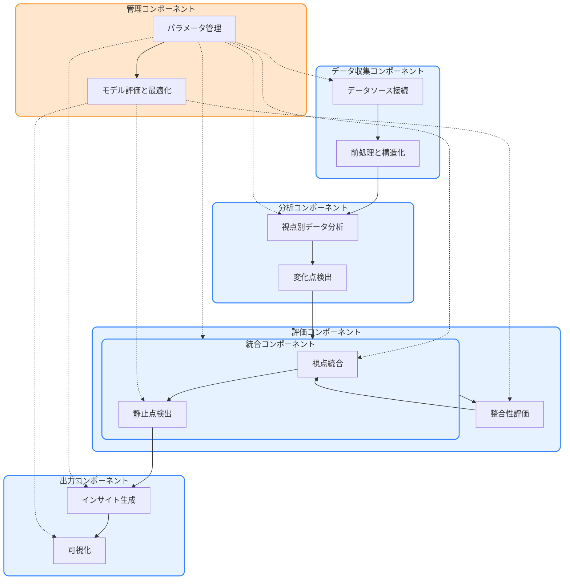

# コンセンサスモデルの実装（パート5：n8nによる全体オーケストレーション）

## コンセンサスモデルの全体アーキテクチャ

トリプルパースペクティブ型戦略AIレーダーのコンセンサスモデルは、複数のコンポーネントが連携して動作する複雑なシステムです。このセクションでは、n8nを活用したコンセンサスモデルの全体オーケストレーションについて解説します。

### システム全体の構成

コンセンサスモデルのシステム全体は、以下のコンポーネントで構成されます：

1. **データ収集コンポーネント**
   - 各視点（テクノロジー、マーケット、ビジネス）のデータソースからデータを収集
   - データの前処理と構造化

2. **分析コンポーネント**
   - 各視点でのデータ分析
   - 変化点検出
   - 重要度・確信度の初期評価

3. **評価コンポーネント**
   - 視点別の重要度・確信度評価
   - 視点間の整合性評価

4. **統合コンポーネント**
   - 視点統合
   - 静止点検出
   - 代替解生成

5. **出力コンポーネント**
   - インサイト生成
   - アクション推奨
   - 可視化

6. **管理コンポーネント**
   - パラメータ管理
   - ルール管理
   - モデル評価と最適化

> **📝 注記**: システム全体のアーキテクチャ図の作成については、[アーキテクチャ図作成のための留意事項](/home/ubuntu/part5_working_files/architecture_diagram_guidelines.md)を参照してください。この文書には、機能的観点、技術的観点、描画観点での詳細な留意点が記載されています。

### コンポーネント間の連携

コンポーネント間の連携は、n8nのワークフロー間の連携によって実現されます。主な連携フローは以下の通りです：

1. **データ収集 → 分析**
   - 収集されたデータが分析コンポーネントに渡される
   - 各視点で独立に分析が実行される

2. **分析 → 評価**
   - 分析結果が評価コンポーネントに渡される
   - 各視点で重要度・確信度が評価される
   - 視点間の整合性が評価される

3. **評価 → 統合**
   - 評価結果が統合コンポーネントに渡される
   - 視点間の統合が行われる
   - 静止点が検出される

4. **統合 → 出力**
   - 統合結果が出力コンポーネントに渡される
   - インサイトが生成される
   - アクションが推奨される
   - 結果が可視化される

5. **管理コンポーネントからの制御**
   - 各コンポーネントのパラメータが管理される
   - モデルの評価と最適化が行われる

以下のフローチャートは、コンポーネント間の連携を視覚的に表現したものです：

## n8nによる全体オーケストレーション

n8nは、コンセンサスモデルの各コンポーネントを連携させ、全体のワークフローを管理するためのプラットフォームとして機能します。このセクションでは、n8nを使用したコンセンサスモデルの実装方法について詳しく解説します。
