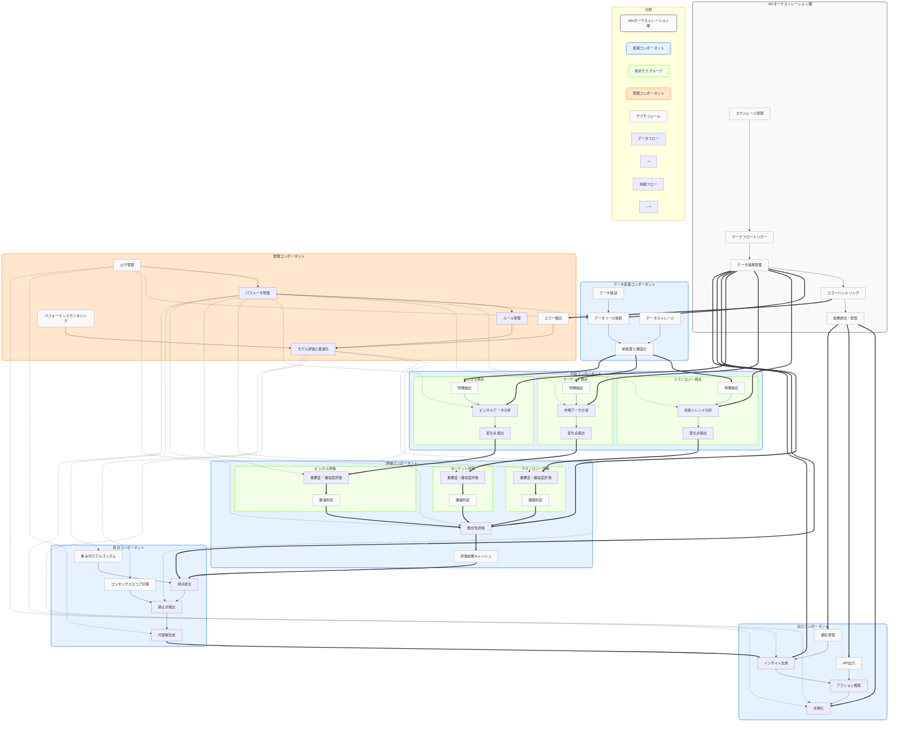
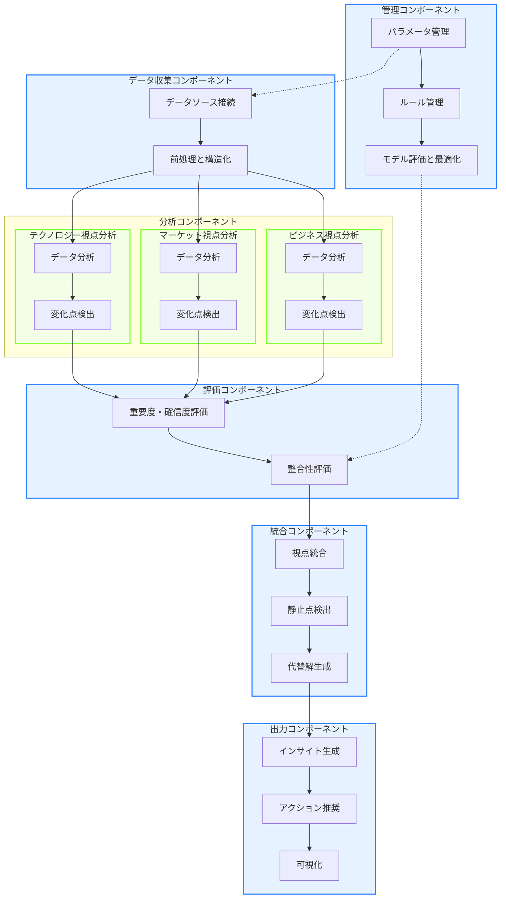

# コンセンサスモデルの実装（パート5：n8nによる全体オーケストレーション）

## 1. コンセンサスモデルの全体アーキテクチャ

トリプルパースペクティブ型戦略AIレーダーのコンセンサスモデルは、複数のコンポーネントが連携して動作する複雑なシステムです。このセクションでは、n8nを活用したコンセンサスモデルの全体オーケストレーションについて解説します。

### 1.1 システム全体の構成

コンセンサスモデルは、複数の視点からのデータを収集・分析し、それらを統合して意思決定を支援するための複雑なシステムです。このシステムは、明確に定義された役割を持つ6つの主要コンポーネントと、それらを統括するn8nオーケストレーション層から構成されています。各コンポーネントは独立して機能しながらも、全体として調和のとれた処理フローを形成しています。

**1. データ収集コンポーネント**

データ収集コンポーネントは、コンセンサスモデルの入口として機能し、多様なデータソースから情報を取得する役割を担っています。このコンポーネントは単なるデータの取得だけでなく、後続の分析プロセスに適した形式へとデータを変換する重要な役割も果たします。

具体的には、テクノロジー視点（技術トレンド、特許情報、研究論文など）、マーケット視点（市場動向、競合情報、消費者行動など）、ビジネス視点（財務データ、事業KPI、組織情報など）の3つの視点に関連するデータソースに接続し、それぞれのAPIやデータフォーマットの違いを吸収します。収集したデータは、ノイズ除去、欠損値処理、形式の標準化などの前処理を経て、分析に適した構造化データへと変換されます。

データ収集コンポーネント内部には、「データソース接続」「データ検証」「データストレージ」「前処理と構造化」といった主要なサブモジュールが存在し、それぞれが連携してデータの品質と一貫性を確保します。特に、データ検証サブモジュールは、収集データの完全性や正確性を検証し、不正確なデータが分析プロセスに流れ込むことを防止する重要な役割を担っています。

**2. 分析コンポーネント**

分析コンポーネントは、収集・前処理されたデータに対して、各視点ごとに特化した分析を実行します。このコンポーネントの主な役割は、生データから意味のあるパターンや変化点を検出し、初期的な重要度と確信度の評価を行うことです。

テクノロジー視点の分析では、技術トレンドの変化や新興技術の出現を検出するアルゴリズムが適用されます。特徴抽出サブモジュールでは、技術キーワードの出現頻度や関連性の分析、引用ネットワークの構造解析などが行われ、技術の成熟度や普及速度を評価します。

マーケット視点の分析では、市場規模の変動、顧客ニーズの変化、競合状況の推移などを検出します。特徴抽出サブモジュールでは、市場セグメントの成長率、価格弾力性、顧客満足度指標などの分析が行われ、市場機会やリスクを評価します。

ビジネス視点の分析では、事業パフォーマンスの変化、組織能力の推移、リソース配分の効果などを検出します。特徴抽出サブモジュールでは、財務指標の時系列分析、組織ネットワーク分析、リソース効率性の評価などが行われ、事業の強みや課題を特定します。

各視点の分析結果は、変化点検出サブモジュールによって重要な変化やパターンが特定され、次の評価ステップへと受け渡されます。

**3. 評価コンポーネント**

評価コンポーネントは、分析結果に対して、より高度な評価と解釈を行う役割を担っています。このコンポーネントでは、各視点の分析結果に対する重要度・確信度の詳細評価と、視点間の整合性評価という2つの主要な処理が行われます。

各視点の評価サブグループでは、検出された変化点やパターンに対して、ビジネスインパクトの大きさ（重要度）と検出結果の信頼性（確信度）を多角的に評価します。重要度・確信度評価サブモジュールでは、定量的・定性的な評価基準に基づいて初期スコアが算出され、閾値判定サブモジュールによって評価レベルが決定されます。

整合性評価サブモジュールでは、3つの視点からの評価結果を比較し、それらの間の一致度や矛盾を検出します。例えば、テクノロジー視点では高い重要度と確信度を持つ変化が検出されたにもかかわらず、マーケット視点では関連する変化が検出されていない場合、その不一致が特定されます。

評価結果キャッシュサブモジュールは、評価結果を一時的に保存し、統合コンポーネントへの効率的なデータ受け渡しと、必要に応じた過去の評価結果との比較を可能にします。

**4. 統合コンポーネント**

統合コンポーネントは、評価された複数の視点からの情報を一つの統合された見解へとまとめ上げる中核的な役割を担っています。このコンポーネントでは、視点統合、静止点検出、代替解生成という3つの重要な処理が行われます。

視点統合サブモジュールでは、重み付けアルゴリズムを用いて各視点の評価結果を統合します。この重み付けは固定的なものではなく、コンテキストや過去の精度に基づいて動的に調整されます。例えば、特定の業界では技術変化の影響が大きい場合、テクノロジー視点の重みが高く設定されることがあります。

静止点検出サブモジュールでは、コンセンサススコア計算を通じて、異なる視点からの評価が収束する「静止点」を特定します。静止点は、複数の視点からの評価が安定し、信頼性の高い意思決定が可能となるポイントを表します。

代替解生成サブモジュールでは、主要な静止点に加えて、異なる前提条件や重み付けに基づく代替的なシナリオも生成します。これにより、意思決定者は複数の可能性を考慮した上で、より堅牢な判断を下すことができます。

**5. 出力コンポーネント**

出力コンポーネントは、統合された分析結果を意思決定者や関連システムに伝達するための最終段階として機能します。このコンポーネントでは、インサイト生成、アクション推奨、可視化という3つの主要な処理が行われます。

インサイト生成サブモジュールでは、統合結果から重要な洞察を抽出し、人間が理解しやすい形式で表現します。通知管理サブモジュールと連携して、インサイトの重要度や緊急度に応じた適切な通知方法を選択します。

アクション推奨サブモジュールでは、生成されたインサイトに基づいて、具体的な行動提案を作成します。これらの推奨事項は、API出力サブモジュールを通じて外部システムに送信されることもあります。例えば、特定の市場機会が検出された場合、マーケティングオートメーションシステムに対してキャンペーン提案が送信されることがあります。

可視化サブモジュールでは、複雑な分析結果やインサイトを、ダッシュボード、レポート、グラフなどの視覚的な形式で表現します。これにより、意思決定者は直感的に情報を理解し、迅速な判断を下すことができます。

**6. 管理コンポーネント**

管理コンポーネントは、システム全体の設定、監視、最適化を担当する横断的な役割を果たします。このコンポーネントは、他のすべてのコンポーネントと連携し、システム全体の効率と精度を維持・向上させます。

パラメータ管理サブモジュールでは、各コンポーネントの設定値や閾値を一元管理します。ルール管理サブモジュールと連携して、ビジネスルールやドメイン知識をシステムに反映させる仕組みを提供します。

ログ管理サブモジュールでは、システム全体の動作ログを収集・分析し、問題の早期発見や性能最適化に役立てます。エラー復旧サブモジュールは、検出されたエラーに対して適切な対応策を実行します。

モデル評価と最適化サブモジュールでは、システム全体のパフォーマンスを継続的に評価し、パラメータやアルゴリズムの調整を行います。パフォーマンスモニタリングサブモジュールと連携して、リソース使用状況や処理速度などの技術的な指標も監視します。

**n8nオーケストレーション層**

これら6つの主要コンポーネントの上位に位置するのが、n8nオーケストレーション層です。この層は、各コンポーネント間のデータフローと制御フローを管理し、全体のワークフローを調整する役割を担っています。

ワークフロートリガーサブモジュールは、スケジュール管理サブモジュールと連携して、定期的な処理の実行や外部イベントに応じた処理の起動を制御します。データ連携管理サブモジュールは、コンポーネント間のデータ受け渡しを最適化し、データの整合性を確保します。

エラーハンドリングサブモジュールは、処理中に発生したエラーを検出し、適切な対応策を実行します。管理コンポーネントのエラー復旧サブモジュールと連携して、システム全体の堅牢性を高めます。

結果統合・配信サブモジュールは、最終的な出力結果を取りまとめ、適切な形式で配信します。出力コンポーネントの各サブモジュールと連携して、インサイトや推奨事項を効果的に伝達します。

このように、n8nオーケストレーション層は、各コンポーネントを有機的に連携させ、コンセンサスモデル全体を統合的に機能させる中枢として働いています。

以下の図は、コンセンサスモデルの全体アーキテクチャを示しています。各コンポーネントの役割と相互関係、データの流れを視覚的に表現しています：



**図1: コンセンサスモデルの全体アーキテクチャ**

この図は、n8nによるオーケストレーション層を含むコンセンサスモデルの全体アーキテクチャを示しています。主要なコンポーネント（データ収集、分析、評価、統合、出力、管理）とそれらの相互関係、データフローと制御フローを視覚的に表現しています。

特に、3つの視点（テクノロジー、マーケット、ビジネス）がどのように分析され、評価され、最終的に統合されるかを示しています。また、n8nオーケストレーション層がどのようにこれらのコンポーネントを連携させ、全体のワークフローを管理するかも表現しています。

実線はデータフローを、点線は制御フローを表しています。色分けにより、n8n層、処理コンポーネント、視点サブグループ、管理コンポーネント、サブモジュールを区別しています。

> **📝 注記**: システム全体のアーキテクチャ図の作成については、[付録A: アーキテクチャ図作成のための留意事項](#付録a-アーキテクチャ図作成のための留意事項)を参照してください。この文書には、機能的観点、技術的観点、描画観点での詳細な留意点が記載されています。

### 1.2 コンポーネント間の連携

コンセンサスモデルの効果的な機能は、各コンポーネント間の緊密な連携によって実現されます。この連携は単なるデータの受け渡しではなく、情報の変換、加工、統合を伴う複雑なプロセスです。n8nのワークフロー間連携機能を活用することで、これらの複雑な連携を柔軟かつ堅牢に実装することができます。

**1. データ収集 → 分析の連携**

データ収集コンポーネントから分析コンポーネントへの連携は、コンセンサスモデルの処理フローの最初の重要なステップです。この連携では、収集・前処理されたデータが各視点の分析プロセスに適切に分配される必要があります。

具体的には、データ収集コンポーネントの「前処理と構造化」サブモジュールが生成した標準化データが、分析コンポーネントの各視点（テクノロジー、マーケット、ビジネス）の「特徴抽出」サブモジュールに渡されます。このデータ受け渡しの過程では、n8nのデータマッピング機能を活用して、各視点に必要なデータ項目を選択的に抽出し、適切な形式に変換します。

例えば、テクノロジー視点の分析では、技術キーワード、特許情報、研究開発動向などのデータが重要となりますが、マーケット視点では市場規模、競合情報、顧客ニーズなどが焦点となります。n8nのワークフローでは、これらの視点ごとに最適化されたデータセットを動的に生成し、並列処理によって効率的に各分析プロセスに送ることができます。

また、この連携では、データの鮮度や完全性に関するメタデータも一緒に受け渡されます。これにより、分析コンポーネントはデータの品質や信頼性を考慮した分析を行うことができます。例えば、一部のデータソースからの情報が欠損している場合、その不確実性を考慮した分析結果の信頼区間を計算することが可能になります。

**2. 分析 → 評価の連携**

分析コンポーネントから評価コンポーネントへの連携では、各視点で検出された変化点や重要パターンが、より詳細な評価のために受け渡されます。この連携の特徴は、単なる分析結果だけでなく、その背景情報や根拠も含めて伝達される点にあります。

具体的には、分析コンポーネントの各視点の「変化点検出」サブモジュールが生成した結果が、評価コンポーネントの対応する視点の「重要度・確信度評価」サブモジュールに渡されます。この過程では、検出された変化点の特性（大きさ、速度、持続性など）だけでなく、検出に使用されたデータの特性や分析手法の詳細も含まれます。

n8nのワークフローでは、これらの複雑な情報構造をJSON形式で効率的に受け渡すことができます。また、大量のデータや分析結果を扱う場合には、一時的なストレージ（データベースやファイルシステム）を介した非同期連携も可能です。これにより、メモリ制約を回避しつつ、大規模なデータセットに対しても安定した処理を実現できます。

評価コンポーネント内では、各視点の評価結果が「整合性評価」サブモジュールに集約され、視点間の一致度や矛盾が分析されます。この過程では、n8nのMergeノードやAggregatorノードを活用して、複数のワークフロー実行結果を効率的に統合することができます。

**3. 評価 → 統合の連携**

評価コンポーネントから統合コンポーネントへの連携は、個別の視点からの評価結果を総合的な判断へと昇華させる重要なステップです。この連携では、各視点の評価結果とその整合性評価が、統合アルゴリズムの入力として受け渡されます。

具体的には、評価コンポーネントの「評価結果キャッシュ」サブモジュールに蓄積された結果が、統合コンポーネントの「視点統合」サブモジュールに渡されます。この過程では、各評価結果の重要度・確信度スコア、整合性評価の結果、そして評価に使用されたコンテキスト情報などが含まれます。

n8nのワークフローでは、これらの情報を構造化されたJSONオブジェクトとして受け渡し、「重み付けアルゴリズム」サブモジュールによる動的な重み付け計算の入力として使用します。また、過去の評価結果との比較や時系列分析のために、データベースからの補足情報を取得するステップも含まれることがあります。

統合コンポーネント内では、「コンセンサススコア計算」サブモジュールが各視点の重み付け結果を統合し、「静止点検出」サブモジュールがその結果から安定した判断ポイントを特定します。この一連のプロセスは、n8nのFunction Itemノードを活用した複雑なビジネスロジックとして実装されます。

**4. 統合 → 出力の連携**

統合コンポーネントから出力コンポーネントへの連携は、分析・評価・統合の結果を実用的なインサイトやアクションに変換する最終段階です。この連携では、検出された静止点や代替解が、人間が理解しやすい形式に変換されて受け渡されます。

具体的には、統合コンポーネントの「代替解生成」サブモジュールが生成した結果が、出力コンポーネントの「インサイト生成」サブモジュールに渡されます。この過程では、統合結果の数値データだけでなく、その解釈に必要なコンテキスト情報や根拠も含まれます。

n8nのワークフローでは、テンプレートノードを活用して、これらの構造化データを自然言語のインサイトに変換することができます。また、条件分岐を用いて、結果の特性に応じて異なる出力形式（詳細レポート、サマリー、アラートなど）を選択することも可能です。

出力コンポーネント内では、生成されたインサイトが「アクション推奨」サブモジュールによって具体的な行動提案に変換され、「可視化」サブモジュールによってグラフやダッシュボードとして表現されます。これらの処理は、n8nの外部サービス連携機能を活用して、レポート生成ツールやBIプラットフォームと連携することで実現されます。

**5. 管理コンポーネントからの制御**

管理コンポーネントは、上記の4つの主要連携フローとは異なり、すべてのコンポーネントに対して横断的に制御を行います。この制御連携は、システム全体の設定、監視、最適化を担当する重要な役割を果たします。

具体的には、管理コンポーネントの「パラメータ管理」サブモジュールが、各コンポーネントの設定値や閾値を動的に調整します。例えば、データ収集コンポーネントのAPI接続設定、分析コンポーネントの検出感度、評価コンポーネントの重要度基準などが制御対象となります。

n8nのワークフローでは、これらの制御をグローバル変数や環境変数として実装し、各ワークフローから参照できるようにします。また、Webhookを活用して、管理インターフェースからのリアルタイムな設定変更を受け付けることも可能です。

「モデル評価と最適化」サブモジュールは、システム全体のパフォーマンスを継続的に評価し、必要に応じてパラメータやアルゴリズムの調整を行います。この過程では、n8nのクロンジョブ機能を活用して、定期的な評価と最適化のサイクルを自動化することができます。

また、「ログ管理」サブモジュールは、各コンポーネントの動作ログを収集・分析し、問題の早期発見や性能最適化に役立てます。n8nのログ機能と外部のログ分析ツールを連携させることで、システム全体の健全性を継続的に監視することが可能です。

このように、n8nを活用したコンポーネント間の連携は、単純なデータの受け渡しを超えて、情報の変換、加工、統合、制御を含む複雑なプロセスを実現します。これにより、コンセンサスモデルは柔軟かつ堅牢なシステムとして機能し、多角的な視点からの意思決定支援を効果的に提供することができます。

以下のフローチャートは、コンポーネント間の連携を視覚的に表現したものです：



## 2. n8nによる全体オーケストレーション

n8nは、コンセンサスモデルの各コンポーネントを連携させ、全体のワークフローを管理するためのプラットフォームとして機能します。このセクションでは、n8nを使用したコンセンサスモデルの実装方法について詳しく解説します。

> **🔰 初心者向け補足**: オーケストレーションという言葉は、元々はオーケストラの指揮者が様々な楽器の演奏を調整して一つの美しい音楽を作り出すことから来ています。システムにおけるオーケストレーションも同じで、n8nは指揮者の役割を果たし、異なるシステムやサービスを連携させて、一つの調和のとれた処理を実現します。詳しくは[付録B: 初心者向けガイド](#付録b-初心者向けガイド)を参照してください。

### 2.1 n8nの基本概念

n8nは、ノーコードでワークフロー自動化を実現するオープンソースのプラットフォームであり、コンセンサスモデルのような複雑なシステムを効率的に実装するための強力な基盤を提供します。n8nの基本概念を理解することは、コンセンサスモデルの実装において不可欠です。

**ワークフロー（Workflow）の概念と役割**

ワークフローは、n8nにおける最も基本的な構成単位であり、一連の処理フローを表現するものです。コンセンサスモデルの実装では、各コンポーネント（データ収集、分析、評価、統合、出力、管理）がそれぞれ独立したワークフローとして設計され、それらが連携して全体のシステムを形成します。

ワークフローは単なる処理の流れ図ではなく、実行可能なビジネスロジックの集合体です。各ワークフローは、特定のビジネス目標（例：テクノロジー視点のデータ分析、視点間の整合性評価など）を達成するために設計され、必要に応じて他のワークフローと連携します。この設計アプローチにより、システム全体の複雑さを管理しやすい単位に分割し、開発・保守・拡張を容易にすることができます。

コンセンサスモデルでは、例えば「テクノロジー視点データ収集ワークフロー」「マーケット視点分析ワークフロー」「視点統合ワークフロー」など、機能ごとに特化したワークフローを作成し、それらを連携させることで全体のプロセスを実現します。

**ノード（Node）の概念と種類**

ノードは、ワークフロー内の個別の処理単位であり、特定の機能を担当して入力を受け取り出力を生成します。n8nには200以上の組み込みノードが用意されており、これらを組み合わせることで複雑な処理を実現できます。

コンセンサスモデルの実装で特に重要なノードには以下のようなものがあります：

- **HTTP Requestノード**: 外部APIやWebサービスとの連携に使用します。テクノロジー視点のデータ収集や、外部分析サービスの利用などに不可欠です。このノードは、RESTful APIやGraphQL APIなど様々なプロトコルをサポートし、認証機能も備えているため、セキュアな連携が可能です。

- **Functionノード**: JavaScriptコードを実行して、カスタムロジックを実装します。変化点検出アルゴリズム、重要度計算、整合性評価など、コンセンサスモデルの核心的な処理はこのノードで実装されることが多いです。複雑な数学的計算や条件分岐も柔軟に記述できます。

- **Splitノード/Mergeノード**: データフローの分岐と統合を制御します。複数の視点からのデータを並列処理し、後で結果を統合する際に重要な役割を果たします。特に、視点統合プロセスでは、これらのノードを活用して効率的なデータフロー制御を実現します。

- **Ifノード**: 条件分岐を実現します。データの特性や処理結果に応じて、異なる処理パスを選択する際に使用します。例えば、重要度スコアが特定の閾値を超えた場合にのみ、詳細分析を実行するといった制御が可能です。

- **Webhookノード**: 外部システムからのイベント通知を受け取ります。リアルタイム性が求められるシナリオ（例：市場データの急激な変化を検知した場合の即時分析）で重要な役割を果たします。

- **Databaseノード**: データベースとの連携を実現します。分析結果の永続化や、過去のデータとの比較分析などに使用します。様々なデータベース（MySQL、PostgreSQL、MongoDB等）と接続可能です。

これらのノードは単独でも強力ですが、組み合わせることでさらに複雑な処理を実現できます。例えば、HTTP Requestノードでデータを取得し、Functionノードで前処理を行い、Databaseノードで保存するという一連の流れを作成できます。

**トリガー（Trigger）の概念と活用方法**

トリガーは、ワークフローの実行を開始するきっかけとなるノードです。コンセンサスモデルの実装では、様々なトリガーを活用して、適切なタイミングでワークフローを起動します。

主要なトリガータイプとその活用方法は以下の通りです：

- **スケジュールトリガー**: 定期的にワークフローを実行します。例えば、毎日特定の時間にデータ収集ワークフローを起動し、最新情報を取得するといった用途に適しています。cron式を使用して複雑なスケジュールも設定可能です。

- **Webhookトリガー**: 外部システムからのHTTPリクエストをトリガーとします。例えば、新しいデータが利用可能になった時点で分析ワークフローを起動するといった、イベント駆動型のシナリオに適しています。

- **ワークフロートリガー**: 他のワークフローの完了をトリガーとします。例えば、すべての視点の分析ワークフローが完了した時点で、統合ワークフローを起動するといった連携が可能です。

- **エラートリガー**: エラー発生時に特定のワークフローを起動します。例えば、データ収集中にエラーが発生した場合、代替データソースからの収集を試みるリカバリーワークフローを起動するといった用途に適しています。

コンセンサスモデルでは、これらのトリガーを組み合わせることで、定期的な分析サイクルとイベント駆動型の即時分析の両方を実現できます。例えば、基本的には毎日定時にデータ収集と分析を行いつつ、重要なマーケットイベントが発生した場合には即時に追加分析を実行するといった柔軟な運用が可能です。

**接続（Connection）の概念と設計**

接続は、ノード間のデータの流れを表現するものであり、ワークフローの構造を定義する重要な要素です。n8nでは、ノード間の接続を通じてデータが変換・加工されながら流れていきます。

コンセンサスモデルの実装における接続の設計ポイントは以下の通りです：

- **データマッピング**: 出力ノードから入力ノードへのデータマッピングを適切に設定することで、必要なデータ項目だけを次のノードに渡すことができます。これにより、処理効率の向上とデータの整理が実現できます。

- **条件付き接続**: 特定の条件を満たす場合にのみデータを次のノードに渡す設定が可能です。例えば、重要度スコアが閾値を超えるデータのみを詳細分析ノードに渡すといった制御ができます。

- **エラーハンドリング接続**: 処理エラー時の代替パスを設定できます。これにより、一部のデータ処理に失敗しても、全体のワークフローが停止することなく、適切なエラー処理や代替処理を実行できます。

- **並列・直列接続の組み合わせ**: 処理の性質に応じて、並列接続（複数のノードが同時に処理を実行）と直列接続（前のノードの処理完了後に次のノードが実行）を適切に組み合わせることで、処理効率と論理的整合性のバランスを取ることができます。

コンセンサスモデルでは、例えば3つの視点（テクノロジー、マーケット、ビジネス）の分析を並列に実行し、その結果を統合ノードで集約するといった接続パターンが頻繁に使用されます。また、データの前処理、主処理、後処理といった一連の流れを直列接続で表現することも一般的です。

これらの基本概念（ワークフロー、ノード、トリガー、接続）を理解し適切に組み合わせることで、コンセンサスモデルのような複雑なシステムもn8n上で効率的に実装することができます。n8nの視覚的なインターフェースを活用すれば、技術的な詳細を抽象化しつつ、ビジネスロジックに集中した開発が可能になります。

> **📚 用語解説**: 本文書で使用される専門用語の詳細な説明は、[付録E: 用語集](#付録e-用語集)を参照してください。

### 2.2 n8nワークフローの設計原則

コンセンサスモデルをn8nで効果的に実装するためには、適切な設計原則に従うことが重要です。これらの原則は、システムの保守性、拡張性、堅牢性を確保し、長期的な運用を成功させるための基盤となります。

**モジュール性の原則とその実践方法**

モジュール性は、コンセンサスモデルのような複雑なシステムを管理可能な単位に分割するための核心的な原則です。各コンポーネントを独立したワークフローとして実装することで、開発・テスト・保守のプロセスが大幅に簡素化されます。

モジュール性を実現するための具体的なアプローチとしては、まず機能的な凝集度（Functional Cohesion）に基づいてワークフローを設計します。つまり、各ワークフローは明確に定義された単一の責任を持ち、その責任を果たすために必要な処理だけを含むべきです。例えば、「テクノロジー視点のデータ収集」「マーケット視点の変化点検出」「視点統合」といった具合に、機能ごとに独立したワークフローを作成します。

また、再利用可能なサブワークフローを作成することも重要です。共通の処理パターン（例：APIからのデータ取得と前処理、エラーハンドリングのロジックなど）は、サブワークフローとして実装し、複数の場所から呼び出せるようにします。n8nでは、これを「サブワークフロー」機能を使って実現できます。

さらに、ワークフロー間のインターフェースを明確に定義することも必要です。各ワークフローが期待する入力データの形式と、生成する出力データの形式を文書化し、一貫性を保つことで、ワークフロー間の連携がスムーズになります。

モジュール性の実践例として、コンセンサスモデルの評価コンポーネントを考えてみましょう。このコンポーネントは、「重要度評価」「確信度評価」「整合性評価」という3つの独立したサブワークフローに分割できます。各サブワークフローは特定の評価ロジックに集中し、明確に定義された入出力インターフェースを持ちます。これにより、例えば重要度評価のアルゴリズムを変更する場合でも、他のサブワークフローに影響を与えることなく修正が可能になります。

**データの標準化原則とその重要性**

コンポーネント間でやり取りされるデータ形式を標準化することは、システム全体の連携をスムーズにするための重要な原則です。データ形式の不一致や変換の複雑さは、エラーの原因となり、システムの保守性を低下させる要因となります。

データ標準化を実現するための具体的なアプローチとしては、まずコンポーネント間のデータ交換形式としてJSONスキーマを定義します。各データ項目の名前、型、必須/オプションの区別、許容値の範囲などを明確に規定し、すべてのコンポーネントがこのスキーマに準拠するようにします。

また、データの変換と正規化のためのユーティリティワークフローを作成することも有効です。外部システムから取得したデータや、特殊な形式のデータを標準形式に変換するための共通ロジックを実装し、再利用できるようにします。

さらに、メタデータの付与も重要です。データそのものに加えて、データの取得時刻、信頼性、出所などのメタデータを付与することで、後続の処理でデータの品質や鮮度を考慮した判断が可能になります。

データ標準化の実践例として、コンセンサスモデルの分析結果データ形式を考えてみましょう。各視点（テクノロジー、マーケット、ビジネス）の分析結果は、以下のような標準化されたJSON構造で表現できます：

```json
{
  "perspective": "technology",
  "analysisTimestamp": "2025-06-08T12:34:56Z",
  "dataFreshness": 0.95,
  "changePoints": [
    {
      "id": "cp-tech-001",
      "description": "急速なAI技術の進展",
      "detectionMethod": "trend_analysis",
      "magnitude": 0.85,
      "confidence": 0.78,
      "supportingData": [...]
    },
    ...
  ],
  "metadata": {
    "dataSourceVersion": "v2.3",
    "analysisParameters": {...}
  }
}
```

このような標準化されたデータ形式を定義し、すべての分析コンポーネントがこの形式に準拠するようにすることで、評価コンポーネントや統合コンポーネントとの連携がスムーズになります。

**エラーハンドリング原則と実装戦略**

各ワークフローでエラー処理を適切に実装することは、システムの堅牢性を確保するための不可欠な原則です。予期せぬエラーが発生した場合でも、システム全体が停止することなく、適切に対応できる仕組みが必要です。

エラーハンドリングを実現するための具体的なアプローチとしては、まず予測可能なエラーのカタログを作成します。データ収集時のAPI接続エラー、データ形式の不一致、処理タイムアウトなど、発生する可能性のあるエラーを洗い出し、それぞれに対する対応策を定義します。

また、エラーの重大度に応じた対応を実装することも重要です。例えば、一時的なネットワークエラーであれば自動リトライを行い、データ形式の不一致であれば代替データソースを試み、致命的なエラーであれば管理者に通知するといった具合に、エラーの性質に応じた対応を行います。

さらに、エラーの記録と監視の仕組みも必要です。すべてのエラーを構造化されたログとして記録し、エラーパターンの分析や、再発防止のための改善に役立てます。

エラーハンドリングの実践例として、データ収集ワークフローでのAPI接続エラー処理を考えてみましょう。n8nでは、HTTP Requestノードの後にIfノードを配置し、レスポンスコードが200-299の範囲外の場合はエラー処理パスに分岐させることができます。エラー処理パスでは、以下のような段階的な対応を実装できます：

1. 一時的なエラー（429, 503など）の場合は、待機時間を設けて自動リトライ
2. 認証エラー（401, 403）の場合は、認証情報の更新を試みる
3. データ形式エラー（400）の場合は、リクエストパラメータの調整を試みる
4. 上記の対応で解決しない場合は、代替データソースからのデータ取得を試みる
5. すべての対応が失敗した場合は、エラーを記録し、管理者に通知する

このような段階的なエラーハンドリングを実装することで、一部のデータソースに問題が発生しても、システム全体の機能を維持することができます。

**パラメータ管理原則と一元化の利点**

設定値やしきい値などのパラメータを一元管理することは、システムの調整と最適化を容易にするための重要な原則です。パラメータが各ワークフローに散在していると、全体の整合性を保ちながら調整することが困難になります。

パラメータ管理を実現するための具体的なアプローチとしては、まずグローバル変数やパラメータストアを活用します。n8nでは、環境変数やクレデンシャルストアを使用して、API認証情報や接続設定などの機密パラメータを安全に管理できます。また、データベースやJSONファイルを使用して、アプリケーション固有のパラメータ（閾値、重み付け係数など）を一元管理することも可能です。

また、パラメータの階層化も重要です。グローバルパラメータ（システム全体に適用）、コンポーネントレベルパラメータ（特定のコンポーネントに適用）、ワークフローレベルパラメータ（特定のワークフローに適用）といった階層構造を設け、適切な粒度でパラメータを管理します。

さらに、パラメータの変更履歴と影響分析の仕組みも必要です。パラメータの変更がシステム全体にどのような影響を与えるかを事前に評価し、変更履歴を記録することで、問題発生時の原因特定や、以前の状態への復元が容易になります。

パラメータ管理の実践例として、コンセンサスモデルの重み付けパラメータ管理を考えてみましょう。各視点（テクノロジー、マーケット、ビジネス）の重み付け係数は、業界や分析対象によって調整が必要です。これらのパラメータを以下のような階層構造で管理できます：

1. デフォルト重み付け（すべての分析に適用される基本値）
2. 業界別重み付け（製造業、金融業、小売業などの業界特性に応じた調整値）
3. 分析対象別重み付け（特定の分析対象に対する個別調整値）

これらのパラメータをデータベースに格納し、専用の管理ワークフローを通じて参照・更新できるようにします。各分析ワークフローは、実行時にこのパラメータストアから適切な重み付け係数を取得して使用します。

**スケーラビリティ原則と設計手法**

データ量や処理要求の増加に対応できる設計を採用することは、システムの長期的な有用性を確保するための重要な原則です。初期段階では小規模なデータセットで問題なく動作していても、データ量の増加に伴ってパフォーマンスが低下する可能性があります。

スケーラビリティを実現するための具体的なアプローチとしては、まずバッチ処理と増分処理の適切な組み合わせを検討します。大量のデータを一度に処理するのではなく、適切なサイズのバッチに分割して処理することで、メモリ使用量を抑えつつ、処理の進捗管理も容易になります。また、すべてのデータを毎回再処理するのではなく、前回の処理以降に変更されたデータのみを処理する増分処理を採用することで、処理時間を短縮できます。

また、キャッシュ戦略の実装も重要です。頻繁に参照されるデータや、計算コストの高い処理結果をキャッシュすることで、繰り返しの計算を避け、応答時間を短縮できます。n8nでは、データベースやファイルシステムを使用して、中間結果のキャッシュを実装できます。

さらに、並列処理の活用も効果的です。独立して処理可能なタスク（例：各視点の分析）を並列に実行することで、全体の処理時間を短縮できます。n8nでは、複数のワークフローを同時に実行することで、並列処理を実現できます。

スケーラビリティの実践例として、大量の市場データを分析するワークフローを考えてみましょう。このワークフローは以下のような設計で実装できます：

1. データを時間範囲や地域などの基準で複数のバッチに分割
2. 各バッチを並列に処理するサブワークフローを起動
3. 各サブワークフローの結果をデータベースに保存
4. すべてのバッチ処理が完了したら、結果を統合して最終分析を実行

このような設計により、データ量が増加しても、バッチサイズや並列度を調整することで対応できます。また、一部のバッチ処理が失敗しても、他のバッチは正常に処理を続行できるため、システム全体の堅牢性も向上します。

これらの設計原則（モジュール性、データの標準化、エラーハンドリング、パラメータ管理、スケーラビリティ）を適切に適用することで、コンセンサスモデルのn8n実装は、保守性、拡張性、堅牢性を備えた持続可能なシステムとなります。これらの原則は相互に関連しており、総合的に適用することで最大の効果を発揮します。

> **🛠️ 実装ガイド**: 初心者から上級者まで段階的に実装を進めるための詳細なガイドは、[付録C: 段階的実装ガイド](#付録c-段階的実装ガイド)を参照してください。

### 2.3 エラーハンドリングとスケーラビリティ

コンセンサスモデルの実装において、エラーハンドリングとスケーラビリティは特に重要な要素です。これらは単なる技術的な考慮事項ではなく、システムの信頼性、持続可能性、そして実用的な価値を決定づける核心的な要素です。n8nを活用したコンセンサスモデルの実装では、これらの要素を適切に設計・実装することで、堅牢で拡張性のあるシステムを構築できます。

**エラーハンドリングの重要性と体系的アプローチ**

コンセンサスモデルのような複雑なシステムでは、様々な種類のエラーが発生する可能性があります。データソースの一時的な障害、API制限の超過、データ形式の不一致、処理タイムアウトなど、多岐にわたるエラーに対して適切に対応できなければ、システム全体の信頼性が損なわれます。

エラーハンドリングの体系的なアプローチとしては、まず「エラー分類」が重要です。エラーを一時的エラー、構成エラー、データエラー、ロジックエラー、リソースエラーなどに分類することで、それぞれに適した対応策を実装できます。

**データ欠損や不正データへの対応**においては、データの検証と前処理が重要です。n8nのFunctionノードを使用して、入力データの検証ロジックを実装し、必須フィールドの存在確認や型チェックを行うことで、後続の処理でのエラー発生を防ぎ、データの品質を確保できます。また、検証結果をメタデータとして付与することで、後続の処理でデータの信頼性を考慮した判断が可能になります。

**API接続エラーのリトライ処理**は、外部システムとの連携において特に重要です。指数バックオフ（Exponential Backoff）を用いたリトライ間隔の調整、最大リトライ回数の設定、条件付きリトライなどの技術を組み合わせることで、一時的なネットワーク障害やサービス停止に対して堅牢なシステムを構築できます。

**エラーログの記録と通知**システムは、問題の早期発見と対応のために不可欠です。構造化されたログ記録、エラーの重大度に基づく通知チャネルの使い分け、同種のエラーが短時間に多発する場合の通知集約などの仕組みを実装することで、効果的なエラー監視と迅速な対応が可能になります。

**スケーラビリティの重要性と実装戦略**

コンセンサスモデルの実用性は、データ量や処理要求の増加に対応できるスケーラビリティに大きく依存します。初期段階では小規模なデータセットで問題なく動作していても、実運用フェーズでデータ量が増加すると、パフォーマンスが急激に低下する可能性があります。

**大量データのバッチ処理**は、メモリ使用量の抑制と処理の進捗管理を容易にします。時間範囲、ID範囲、地域などの基準でデータを複数のバッチに分割し、各バッチを専用のワークフローで処理することで、大規模データセットも効率的に処理できます。また、各バッチの処理状況を追跡することで、失敗したバッチのみを再処理する仕組みも実現できます。

**キャッシュ戦略の実装**は、繰り返しの計算を避け、応答時間を短縮するために有効です。分析結果や評価結果のキャッシュ、マスターデータや変更頻度の低いデータのメモリ内キャッシュ、データ更新に応じたキャッシュ無効化の仕組みなどを組み合わせることで、特に計算コストの高い処理のパフォーマンスを大幅に向上させることができます。

**並列処理の活用**は、全体の処理時間を短縮するための重要な戦略です。ワークフローレベル、バッチレベル、タスクレベルでの並列化を適切に組み合わせることで、処理効率を最大化できます。例えば、各視点（テクノロジー、マーケット、ビジネス）の分析を並列に実行し、その結果を後続のワークフローで統合するといった設計が可能です。

これらのエラーハンドリングとスケーラビリティの戦略を適切に組み合わせることで、コンセンサスモデルは堅牢で拡張性のあるシステムとして機能し、実運用環境での信頼性と性能を確保できます。特に、データ量や処理要求が増加する成長フェーズでも、システムの安定性と応答性を維持することが可能になります。

> **⚙️ 実装例**: エラーハンドリングとスケーラビリティの具体的な実装例については、[付録D: エラーハンドリングとスケーラビリティの実装例](#付録d-エラーハンドリングとスケーラビリティの実装例)を参照してください。

## 3. データ収集コンポーネントの実装

データ収集コンポーネントは、各視点のデータソースからデータを収集し、前処理と構造化を行います。n8nでの実装方法を解説します。

### 3.1 データソース接続

コンセンサスモデルの基盤となるのは、多様なデータソースからの情報収集です。データソース接続コンポーネントは、各視点（テクノロジー、マーケット、ビジネス）に関連する情報を効率的かつ信頼性高く取得するための重要な役割を担っています。n8nを活用することで、様々なデータソースに柔軟に接続し、統合的なデータ収集基盤を構築することができます。

**テクノロジー視点のデータソース接続**

テクノロジー視点では、技術トレンド、研究開発動向、特許情報、技術ブログなど、技術の進化や新興技術に関する情報を収集します。これらのデータソースは、企業の技術戦略や製品開発の方向性を決定する上で重要な指標となります。

n8nでのテクノロジー視点データソース接続の実装方法としては、主に以下のノードが活用されます：

HTTP Requestノードを活用することで、技術トレンド分析を提供する専門APIサービス（例：GitHub API、Stack Overflow API、特許データベースAPI）に接続し、最新の技術動向データを取得できます。これにより、複数の技術キーワードに関するトレンドデータを一度に収集し、後続の分析プロセスに渡すことができます。また、APIレート制限や認証要件に対応するため、適切なヘッダー設定やリクエスト間隔の調整も重要です。

RSS Feedノードを使用すると、技術ブログやニュースサイトのRSSフィードを定期的に取得し、最新の技術動向や専門家の見解を収集できます。複数の技術情報源から最新の記事やニュースを収集し、テキスト分析や技術トレンド抽出の入力として活用できます。また、収集したデータにはソース情報や取得日時などのメタデータを付与することで、後続の分析での信頼性評価に役立てることができます。

**マーケット視点のデータソース接続**

マーケット視点では、市場規模、成長率、競合情報、顧客ニーズ、価格動向など、市場環境や競争状況に関する情報を収集します。これらのデータは、事業機会の特定やマーケティング戦略の策定に不可欠です。

n8nでのマーケット視点データソース接続の実装方法としては、主に以下のノードが活用されます：

HTTP Requestノードを活用することで、市場データを提供する専門APIサービス（例：金融データAPI、市場調査レポートAPI、ソーシャルメディア分析API）に接続し、最新の市場動向データを取得できます。複数の業界に関する市場データを体系的に収集し、後続の分析プロセスに渡すことができます。また、データの信頼性や網羅性に関するメタデータも収集することで、分析結果の信頼度評価に役立てることができます。

Google Sheetsノードを使用すると、社内で実施した市場調査結果や、外部調査会社から提供されたデータをGoogle Sheetsに格納し、それらを定期的に取得して分析に活用できます。社内外の市場調査データを柔軟に取得し、分析プロセスに統合することができます。また、スプレッドシートの更新日時を確認することで、データの鮮度を評価することも可能です。

**ビジネス視点のデータソース接続**

ビジネス視点では、財務データ、事業KPI、組織情報、リソース配分など、企業の内部状況や事業パフォーマンスに関する情報を収集します。これらのデータは、事業戦略の評価や経営資源の最適配分を決定する上で重要な指標となります。

n8nでのビジネス視点データソース接続の実装方法としては、主に以下のノードが活用されます：

HTTP Requestノードを活用することで、企業財務データを提供する専門APIサービス（例：財務報告API、株価データAPI、経済指標API）に接続し、最新の財務・経済データを取得できます。複数の企業の財務データを体系的に収集し、財務分析や競合比較の基礎データとして活用できます。また、データの通貨単位や更新日時などのメタデータも収集することで、分析の正確性を高めることができます。

Database（PostgreSQL/MySQL）ノードを使用すると、社内の業務システムやデータウェアハウスに蓄積された事業KPIや組織データを取得し、内部視点からの分析に活用できます。社内の業務データを体系的に取得し、ビジネス視点の分析基盤として活用できます。また、データベースのスキーマ設計や最適化されたクエリを活用することで、大量のデータでも効率的に処理することが可能です。

これらのデータソース接続の実装により、コンセンサスモデルは多角的な視点からの情報を継続的に収集し、統合的な分析の基盤を構築することができます。各データソースの特性や更新頻度に応じて適切な接続方法を選択し、データの鮮度と品質を確保することが重要です。また、データソースの認証情報やアクセス権限の管理も、セキュリティ上の重要な考慮事項となります。

### 3.2 データの前処理と構造化

収集したデータをそのまま分析に使用することは、多くの場合適切ではありません。データソースごとに形式や品質が異なり、ノイズや欠損値を含んでいることも少なくありません。データの前処理と構造化は、収集したデータを分析に適した形式に変換し、データ品質を確保するための重要なプロセスです。n8nを活用することで、効率的かつ再現性の高いデータ前処理パイプラインを構築することができます。

**データクレンジングの重要性と実装方法**

データクレンジングは、収集したデータからノイズや異常値を除去し、欠損値を適切に処理することで、分析の精度と信頼性を高めるプロセスです。不適切なデータクレンジングは、誤った分析結果や意思決定につながる可能性があります。

n8nでのデータクレンジング実装方法としては、主にFunctionノードが活用されます。一般的なデータクレンジングタスクには以下のようなものがあります：

**欠損値の処理**では、データ内の欠損値（null、undefined、空文字列など）を検出し、適切な方法で処理します。処理方法には、欠損値の除去、平均値や中央値での補完、前後の値からの補間などがあります。n8nのFunctionノードを使用して、データ型に応じた欠損値処理ロジックを実装することで、データの完全性を確保しつつ、分析に適した形式に変換することができます。

**異常値の検出と修正**では、データ内の異常値（外れ値）を統計的手法で検出し、除去または修正します。一般的な異常値検出手法には、Z-スコア法、IQR（四分位範囲）法、DBSCAN（密度ベースクラスタリング）などがあります。n8nのFunctionノードを使用して、これらの手法を実装することで、データ内の外れ値による分析結果の歪みを防ぎ、より信頼性の高い分析が可能になります。

**データ形式の統一**では、異なるデータソースから収集したデータの形式（日付形式、数値表現、カテゴリ値など）を統一し、一貫性のあるデータセットを作成します。n8nのSetノードを使用して、フィールド名の変更、データ型の変換、フォーマットの統一などを行うことができます。これにより、異なるデータソースからのデータを一貫性のある形式に変換し、分析の正確性と効率性を高めることができます。

**データ変換の実装方法**

データ変換は、クレンジングされたデータを分析に最適な形式に変換するプロセスです。これには、特徴量の生成、データの集約、次元削減などが含まれます。適切なデータ変換は、分析の精度と効率を大幅に向上させることができます。

n8nでのデータ変換実装方法としては、主にFunctionノードが活用されます。一般的なデータ変換タスクには以下のようなものがあります：

**特徴量エンジニアリング**では、既存のデータから新しい特徴量（分析に有用な変数）を生成します。例えば、日付から曜日や月を抽出したり、テキストデータから単語頻度を計算したりします。n8nのFunctionノードを使用して、ドメイン知識を活用した特徴量設計を実装することで、生データから分析に有用な情報を抽出し、モデルの予測力や解釈可能性を向上させることができます。

**データ集約と要約**では、詳細なデータを特定の基準（時間、カテゴリなど）で集約し、要約統計量（合計、平均、最大値など）を計算します。これにより、データの全体像を把握しやすくなります。n8nのFunctionノードやAggregateノードを使用して、様々な集計操作を実装することで、大量のデータから意味のある洞察を抽出することができます。

**次元削減**では、高次元データの次元数を削減し、計算効率と可視化の容易さを向上させます。主成分分析（PCA）や特異値分解（SVD）などの手法が一般的です。n8nのFunctionノードと外部ライブラリを組み合わせて、これらの次元削減手法を実装することで、複雑なデータセットの本質的な構造を抽出し、より効率的な分析が可能になります。

これらのデータ前処理と構造化の手法を適切に組み合わせることで、コンセンサスモデルは高品質なデータ基盤を構築し、信頼性の高い分析結果を導き出すことができます。また、n8nのワークフロー機能を活用することで、これらの前処理ステップを自動化し、データ処理の再現性と効率性を高めることが可能です。
これらのデータ前処理と構造化の手法を実装する際、n8nの様々なノードを活用できます。Functionノードはデータ形式の変換や複雑な計算処理に適しており、JSONノードはデータをJSON形式に変換して後続の処理や保存に備えるのに役立ちます。

**データ保存の方法と実装**

前処理と構造化が完了したデータは、後続の分析プロセスで利用できるよう適切に保存する必要があります。n8nでは、複数のデータ保存方法を組み合わせることで、データの可用性と永続性を確保できます。

Writeノードを使用すると、処理済みデータをCSV、JSON、XMLなどの形式でファイルシステムに保存できます。これは特に中間処理結果の一時保存や、他システムとのデータ交換に適しています。ファイル形式や保存先ディレクトリを柔軟に設定でき、後続のワークフローでの再利用も容易です。

Database（PostgreSQL/MySQL）ノードを活用することで、構造化されたデータをリレーショナルデータベースに永続化できます。これにより、高度なクエリ機能やトランザクション管理、複数ワークフロー間でのデータ共有が可能になります。また、データの整合性や安全性も確保しやすくなります。

データ保存時には、メタデータ（処理日時、データソース情報、処理バージョンなど）も併せて記録することで、データの追跡可能性と管理性を高めることができます。これは特に長期運用を前提としたコンセンサスモデルでは重要な考慮点です。

## 4. 分析コンポーネントの実装

分析コンポーネントは、各視点でのデータ分析と変化点検出を行います。

### 4.1 視点別データ分析

コンセンサスモデルの核心部分である視点別データ分析では、テクノロジー、マーケット、ビジネスの各視点からデータを多角的に分析し、それぞれの視点における重要な洞察を抽出します。n8nを活用することで、これらの分析プロセスを効率的かつ再現性高く実装することができます。

**テクノロジー視点の分析**

テクノロジー視点の分析では、技術トレンド、研究開発動向、特許情報、技術的実現可能性など、テクノロジーの進化や新興技術に関する情報を体系的に評価します。この分析により、企業は技術投資の優先順位付けや、製品開発の方向性決定に役立つ洞察を得ることができます。

n8nでのテクノロジー視点分析の実装方法としては、主にFunctionノードが活用されます。Functionノードでは、JavaScript言語を用いて技術トレンドの時系列分析、テキストマイニングによるキーワード抽出、特許分析、技術成熟度評価などの複雑な分析ロジックを実装できます。例えば、GitHubやStack Overflowのデータを分析して技術の普及率や成長率を計算したり、技術ブログや論文から重要キーワードを抽出したりすることが可能です。

また、より高度な分析が必要な場合は、HTTP Requestノードを使用して外部の専門分析APIに接続することもできます。例えば、自然言語処理や機械学習を活用した技術トレンド予測サービスなどを利用することで、分析の精度と範囲を拡張することができます。

**マーケット視点の分析**

マーケット視点の分析では、市場規模、成長率、競合情報、顧客ニーズ、価格動向など、市場環境や競争状況に関する情報を体系的に評価します。この分析により、企業は事業機会の特定やマーケティング戦略の策定に役立つ洞察を得ることができます。

n8nでのマーケット視点分析の実装方法としては、主にFunctionノードとSpreadsheetノードが活用されます。Functionノードでは、市場セグメント分析、競合ポジショニング分析、価格感度分析などの市場動向分析ロジックを実装できます。例えば、市場データの時系列分析を行って成長率や市場シェアの変化を計算したり、顧客アンケートデータからニーズの優先順位を抽出したりすることが可能です。

Spreadsheetノードを活用することで、表計算処理を効率的に実行できます。市場データの集計、ピボットテーブル分析、条件付き集計などの処理を自動化することで、大量のデータから意味のある洞察を迅速に抽出することができます。また、分析結果をスプレッドシート形式で出力することで、後続の可視化や報告書作成プロセスとの連携も容易になります。

**ビジネス視点の分析**

ビジネス視点の分析では、財務データ、事業KPI、組織情報、リソース配分など、企業の内部状況や事業パフォーマンスに関する情報を体系的に評価します。この分析により、企業は事業戦略の評価や経営資源の最適配分に役立つ洞察を得ることができます。

n8nでのビジネス視点分析の実装方法としては、主にFunctionノードとDatabase（PostgreSQL/MySQL）ノードが活用されます。Functionノードでは、財務分析、KPI評価、リソース効率性分析などのビジネス指標分析ロジックを実装できます。例えば、財務データから収益性や成長性の指標を計算したり、事業部門ごとのパフォーマンスを比較したりすることが可能です。

Database（PostgreSQL/MySQL）ノードを活用することで、複雑なクエリ処理を効率的に実行できます。複数のテーブルを結合した高度な集計クエリや、時系列データの傾向分析クエリなどを実行することで、社内データベースに蓄積された大量のビジネスデータから価値ある洞察を抽出することができます。また、分析結果をデータベースに保存することで、ダッシュボードツールとの連携や履歴管理も容易になります。

これらの視点別データ分析を適切に実装することで、コンセンサスモデルは多角的な視点からの洞察を生成し、より包括的で均衡の取れた意思決定支援を提供することができます。また、n8nのワークフロー機能を活用することで、これらの分析プロセスを自動化し、定期的な更新と継続的な改善が可能になります。

### 4.2 変化点検出

コンセンサスモデルにおける変化点検出は、データの時系列的な変動パターンから重要な転換点や異常値を特定するプロセスです。この機能により、テクノロジー、マーケット、ビジネスの各視点における重要な変化を早期に検出し、意思決定者に適時の洞察を提供することができます。n8nを活用することで、高度な変化点検出メカニズムを効率的に実装することが可能です。

**時系列分析による変化点検出**

時系列分析は、データの時間的な変動パターンを分析し、トレンド、季節性、周期性、異常値などを特定するプロセスです。コンセンサスモデルでは、この分析手法を活用して、各視点における重要な変化点を検出します。

n8nでの時系列分析の実装方法としては、主にFunctionノードが活用されます。Functionノードでは、JavaScript言語を用いて移動平均、標準偏差、指数平滑法などの統計的手法を実装できます。例えば、テクノロジートレンドデータの移動平均を計算し、その変動パターンから技術の普及フェーズの転換点を特定したり、市場データの標準偏差を監視して異常な変動を検出したりすることが可能です。

また、Ifノードを活用することで、計算された統計量としきい値を比較し、変化点の判定を自動化することができます。例えば、「移動平均からの乖離が標準偏差の2倍を超えた場合」や「成長率が前月比で30%以上変化した場合」などの条件を設定し、それに基づいて変化点を検出するワークフローを構築できます。これにより、人間の主観に依存せず、客観的な基準に基づいた変化点検出が可能になります。

変化点検出の結果は、後続の分析プロセスや意思決定支援に活用されます。例えば、テクノロジー視点で検出された新興技術の急速な普及は、製品開発戦略の見直しのトリガーとなり、マーケット視点で検出された顧客ニーズの変化は、マーケティング戦略の調整につながります。このように、変化点検出は、コンセンサスモデル全体の中で、環境変化への迅速な対応を支援する重要な役割を果たしています。

**パターン認識による変化点検出**

パターン認識は、データ内の特定のパターンや規則性を識別し、それに基づいて変化点や異常を検出するプロセスです。時系列分析が主に統計的手法に基づくのに対し、パターン認識はより複雑なデータ構造や非線形的な関係性も捉えることができます。

n8nでのパターン認識の実装方法としては、主にFunctionノードが活用されます。Functionノードでは、JavaScript言語を用いてパターンマッチングアルゴリズムを実装できます。例えば、テクノロジー採用曲線の特定パターン（初期採用期から早期多数派への移行など）を検出したり、市場データ内の周期的なパターンや季節変動を識別したりすることが可能です。

より高度なパターン認識が必要な場合は、HTTP Requestノードを使用して外部の機械学習APIに接続することもできます。例えば、異常検知アルゴリズムや時系列予測モデルを提供するAPIを活用することで、複雑なパターンの検出や将来トレンドの予測が可能になります。これにより、人間が気づきにくい微妙なパターンや、大量のデータに埋もれた重要な変化点も検出できるようになります。

パターン認識による変化点検出は、特に不確実性の高い環境や複雑な相互関係を持つ要素の分析に有効です。例えば、複数の技術トレンドの組み合わせによる新たな市場機会の出現や、消費者行動の微妙な変化による市場構造の転換などを早期に検出することができます。これにより、企業は環境変化に先んじて戦略を調整し、競争優位性を確保することが可能になります。

## 5. 評価コンポーネントの実装

評価コンポーネントは、重要度・確信度の評価と視点間の整合性評価を行います。

### 5.1 重要度・確信度評価

コンセンサスモデルにおける重要度・確信度評価は、各視点から得られた分析結果の重要性と信頼性を体系的に評価するプロセスです。この評価により、意思決定の優先順位付けや、追加調査が必要な領域の特定が可能になります。n8nを活用することで、この評価プロセスを客観的かつ一貫性のある形で実装することができます。

**重要度評価の実装方法**

重要度評価は、各分析結果や洞察がビジネス目標や戦略的方向性にとってどの程度重要であるかを定量的に評価するプロセスです。この評価により、限られたリソースを最も影響力の大きい領域に集中させることができます。

n8nでの重要度評価の実装方法としては、主にFunctionノードが活用されます。Functionノードでは、JavaScript言語を用いて複数の要素を考慮した重要度計算アルゴリズムを実装できます。例えば、市場規模、成長率、競争状況、自社の強みとの適合性などの要素を組み合わせて、各機会やリスクの重要度スコアを算出することが可能です。

また、Ifノードを活用することで、計算された重要度スコアに基づいて重要度レベル（高・中・低など）を判定し、適切なアクションを自動的にトリガーすることができます。例えば、「重要度が高い項目は即時通知」「中程度の項目は週次レポートに含める」「低い項目は記録のみ」といった条件分岐を設定することで、重要度に応じた効率的な情報フローを構築できます。

**確信度評価の実装方法**

確信度評価は、各分析結果や洞察がどの程度信頼できるかを定量的に評価するプロセスです。この評価により、不確実性の高い領域を特定し、追加データの収集や専門家の意見聴取などの対策を講じることができます。

n8nでの確信度評価の実装方法としては、主にFunctionノードが活用されます。Functionノードでは、JavaScript言語を用いてデータの品質、量、一貫性、信頼性などの要素を考慮した確信度計算アルゴリズムを実装できます。例えば、データソースの信頼性、サンプルサイズ、データの鮮度、分析手法の妥当性などの要素を組み合わせて、各分析結果の確信度スコアを算出することが可能です。

また、Ifノードを活用することで、計算された確信度スコアに基づいて確信度レベル（高・中・低など）を判定し、適切なアクションを自動的にトリガーすることができます。例えば、「確信度が低い項目は追加調査を実施」「中程度の項目は専門家の意見を求める」「高い項目はそのまま意思決定に活用」といった条件分岐を設定することで、確信度に応じた適切な対応が可能になります。

重要度と確信度の評価を組み合わせることで、「高重要度・高確信度」の項目に優先的にリソースを配分し、「高重要度・低確信度」の項目には追加調査を実施するなど、より効果的な意思決定支援が可能になります。また、これらの評価結果は視点間の統合プロセスにも活用され、より信頼性の高い総合評価につながります。

### 5.2 整合性評価

コンセンサスモデルにおける整合性評価は、テクノロジー、マーケット、ビジネスの各視点から得られた分析結果の間の一貫性や矛盾を体系的に評価するプロセスです。この評価により、視点間の相互関係を理解し、より統合的かつバランスの取れた意思決定基盤を構築することができます。n8nを活用することで、この複雑な整合性評価プロセスを効率的かつ客観的に実装することが可能です。

**視点間の比較と整合性分析**

視点間の比較は、テクノロジー、マーケット、ビジネスの各視点から得られた分析結果を並列に比較し、その一貫性や矛盾を評価するプロセスです。この比較により、各視点の相互関係や相乗効果、相反する要素などを特定することができます。

n8nでの視点間比較の実装方法としては、主にMergeノードとFunctionノードが活用されます。Mergeノードを使用することで、各視点の評価結果を一つのデータストリームに統合し、比較分析の基盤を構築することができます。例えば、テクノロジー視点での技術成熟度評価、マーケット視点での市場受容性評価、ビジネス視点での収益性評価を統合し、総合的な実現可能性を評価することが可能です。

Functionノードでは、JavaScript言語を用いて整合性計算アルゴリズムを実装できます。このアルゴリズムでは、各視点間の評価結果の差異を定量化し、整合性スコアを算出します。例えば、「テクノロジー視点での技術的実現可能性が高いにもかかわらず、マーケット視点での市場需要が低い」といった不整合を検出し、その程度を数値化することができます。

整合性評価の結果は、視点間の調整や追加調査の必要性を判断する重要な指標となります。例えば、整合性スコアが低い項目については、各視点の専門家による再評価や、追加データの収集が必要になる場合があります。また、整合性の高い項目は、より確信を持って意思決定に活用することができます。

**整合性スコアの計算と評価**

整合性スコアの計算は、視点間の比較結果を定量化し、全体としての一貫性レベルを数値化するプロセスです。このスコアにより、意思決定の信頼性や追加調査の必要性を客観的に評価することができます。

n8nでの整合性スコア計算の実装方法としては、主にFunctionノードが活用されます。Functionノードでは、JavaScript言語を用いて複数の整合性指標を組み合わせた総合的な整合性スコア計算アルゴリズムを実装できます。例えば、視点間の評価値の標準偏差、相関係数、一致率などの指標を組み合わせて、多角的な整合性評価を行うことが可能です。

具体的には、各評価対象について、テクノロジー、マーケット、ビジネスの各視点からの評価値の分散を計算し、分散が小さいほど整合性が高いと判断できます。また、各視点の評価値間の相関関係を分析することで、視点間の関連性や一貫性を評価することもできます。さらに、各視点からの定性的な評価（コメントや推奨事項など）のテキスト分析を行い、意見の一致度を測定することも可能です。

Ifノードを活用することで、計算された整合性スコアに基づいて整合性レベル（高・中・低など）を判定し、適切なアクションを自動的にトリガーすることができます。例えば、「整合性が低い項目は専門家パネルによる再評価を実施」「中程度の項目は追加データを収集」「高い項目はそのまま意思決定プロセスに進む」といった条件分岐を設定することで、整合性レベルに応じた効率的なワークフローを構築できます。

整合性評価は、コンセンサスモデルの中核的な機能の一つであり、多角的な視点からの評価を統合する上で重要な役割を果たします。高い整合性は、各視点からの評価が一致していることを示し、より確信を持った意思決定が可能になります。一方、低い整合性は、視点間に矛盾や不一致があることを示し、追加調査や専門家の意見が必要な領域を特定するのに役立ちます。

## 6. 統合コンポーネントの実装

統合コンポーネントは、コンセンサスモデルの中核となる機能であり、テクノロジー、マーケット、ビジネスの各視点からの評価結果を統合し、総合的な意思決定基盤を構築するプロセスを担います。このコンポーネントでは、視点統合と静止点検出という二つの重要な機能を実装します。

### 6.1 視点統合

視点統合は、複数の視点からの評価結果を統合し、バランスの取れた総合評価を生成するプロセスです。この統合により、テクノロジー、マーケット、ビジネスの各視点を適切に考慮した意思決定が可能になります。n8nを活用することで、この複雑な統合プロセスを効率的かつ柔軟に実装することができます。

**重み付け統合の実装方法**

重み付け統合は、各視点の重要度に応じた重みを設定し、それに基づいて評価結果を統合するプロセスです。この方法により、状況や目的に応じて各視点の影響度を調整し、より現実的かつ戦略的な意思決定を支援することができます。

n8nでの重み付け統合の実装方法としては、主にFunctionノードとMergeノードが活用されます。Functionノードでは、JavaScript言語を用いて重み付けアルゴリズムを実装できます。例えば、各視点に対して設定された重みを適用し、重み付けされた評価値を計算するロジックを実装することが可能です。

また、Mergeノードを活用することで、各視点の重み付け結果を一つのデータストリームに統合し、後続の処理に渡すことができます。これにより、複数の視点からの評価結果を一元管理し、総合的な分析が可能になります。

**統合スコアの計算と結果の形式化**

統合スコアの計算は、重み付けされた各視点の評価結果を組み合わせて、総合的な評価スコアを算出するプロセスです。この計算により、複数の視点を考慮した単一の評価指標が得られ、意思決定の優先順位付けや比較分析が容易になります。

n8nでの統合スコア計算の実装方法としては、主にFunctionノードとSetノードが活用されます。Functionノードでは、JavaScript言語を用いて統合スコアの計算アルゴリズムを実装できます。例えば、加重平均法、幾何平均法、多基準意思決定法（AHPやTOPSISなど）といった様々な統合手法を実装することが可能です。

また、Setノードを活用することで、計算された統合結果を標準的な形式に設定し、後続のレポート生成やAPI出力などのプロセスに適した形に整形することができます。例えば、JSONやCSV形式でのデータ構造化、視覚化に適したデータフォーマットへの変換などを行うことが可能です。

視点統合の結果は、コンセンサスモデルの最終的なアウトプットの基盤となります。この統合により、テクノロジー、マーケット、ビジネスの各視点をバランスよく考慮した総合評価が得られ、より包括的かつ均衡の取れた意思決定が可能になります。また、各視点の重みを調整することで、状況や目的に応じた柔軟な評価が行えるという利点もあります。

### 6.2 静止点検出

静止点検出は、コンセンサスモデルの統合結果から安定した評価ポイント（静止点）を特定するプロセスです。この検出により、複数の視点間で一貫して高評価を得ている選択肢や、時間的に安定した評価を持つ選択肢を特定することができます。n8nを活用することで、この複雑な静止点検出プロセスを効率的かつ正確に実装することが可能です。

**収束判定の実装方法**

収束判定は、統合プロセスが安定した結果に到達したかどうかを評価するプロセスです。この判定により、追加の反復計算が必要か、あるいは現在の結果を最終的な静止点として採用できるかを決定することができます。

n8nでの収束判定の実装方法としては、主にFunctionノードとIfノードが活用されます。Functionノードでは、JavaScript言語を用いて収束判定アルゴリズムを実装できます。例えば、連続する反復間の評価値の変化率を計算し、その変化率が設定された閾値以下になった場合に収束したと判断するロジックを実装することが可能です。また、特定の反復回数に達した場合に強制的に収束と判断する条件を設定することもできます。

具体的には、以下のような収束判定ロジックを実装することができます：

```javascript
// 収束判定の実装例
function checkConvergence(items) {
  // 現在の評価結果と前回の評価結果を取得
  const currentResults = items[0].json.current_results;
  const previousResults = items[0].json.previous_results;
  
  // 収束判定のパラメータ
  const convergenceThreshold = 0.01; // 変化率の閾値（1%）
  const maxIterations = 20;          // 最大反復回数
  const currentIteration = items[0].json.iteration || 1;
  
  // 前回の結果がない場合（初回実行時）
  if (!previousResults) {
    return [{
      json: {
        converged: false,
        reason: "初回実行のため、前回の結果がありません。",
        iteration: currentIteration + 1
      }
    }];
  }
  
  // 最大反復回数に達した場合
  if (currentIteration >= maxIterations) {
    return [{
      json: {
        converged: true,
        reason: `最大反復回数(${maxIterations})に達しました。`,
        iteration: currentIteration,
        final_results: currentResults
      }
    }];
  }
  
  // 変化率の計算
  let maxChangeRate = 0;
  const changeRates = [];
  
  for (const currentResult of currentResults) {
    const previousResult = previousResults.find(p => p.id === currentResult.id);
    
    if (previousResult) {
      const changeRate = Math.abs((currentResult.score - previousResult.score) / previousResult.score);
      changeRates.push({
        id: currentResult.id,
        name: currentResult.name,
        current_score: currentResult.score,
        previous_score: previousResult.score,
        change_rate: changeRate
      });
      
      if (changeRate > maxChangeRate) {
        maxChangeRate = changeRate;
      }
    }
  }
  
  // 収束判定
  const converged = maxChangeRate <= convergenceThreshold;
  
  return [{
    json: {
      converged: converged,
      reason: converged ? `最大変化率(${maxChangeRate})が閾値(${convergenceThreshold})以下になりました。` : `最大変化率(${maxChangeRate})が閾値(${convergenceThreshold})を超えています。`,
      max_change_rate: maxChangeRate,
      change_rates: changeRates,
      iteration: currentIteration + 1,
      final_results: converged ? currentResults : null
    }
  }];
}

// メイン処理
return checkConvergence($input.all());
```

Ifノードを活用することで、収束判定の結果に基づいて条件分岐を行い、収束した場合は結果の出力処理に進み、収束していない場合は次の反復計算を実行するといったワークフローを構築できます。例えば、「収束した場合はレポート生成プロセスに進む」「収束していない場合は重み調整を行い再計算する」といった条件分岐を設定することで、自動的な収束プロセスを実現できます。

**静止点の特定と形式化**

静止点の特定は、収束判定後に得られた安定した評価結果から、最終的な静止点（コンセンサスポイント）を特定するプロセスです。この特定により、複数の視点間で一貫して高評価を得ている選択肢や、時間的に安定した評価を持つ選択肢を明確に識別することができます。

n8nでの静止点特定の実装方法としては、主にFunctionノードとSetノードが活用されます。Functionノードでは、JavaScript言語を用いて静止点特定アルゴリズムを実装できます。例えば、収束後の評価結果から特定の条件（評価スコアの閾値、視点間の一致度など）を満たす項目を静止点として特定するロジックを実装することが可能です。

具体的には、以下のような静止点特定ロジックを実装することができます：

```javascript
// 静止点特定の実装例
function identifyFixedPoints(items) {
  // 収束後の最終評価結果を取得
  const finalResults = items[0].json.final_results;
  
  // 静止点特定のパラメータ
  const scoreThreshold = 0.7;        // スコアの閾値（70%以上）
  const consistencyThreshold = 0.8;  // 視点間一致度の閾値（80%以上）
  
  // 静止点の候補を特定
  const fixedPointCandidates = finalResults.filter(result => {
    // スコアが閾値以上の項目を抽出
    return result.overall_score >= scoreThreshold;
  });
  
  // 視点間の一致度を計算し、静止点を特定
  const fixedPoints = fixedPointCandidates.filter(candidate => {
    // 各視点のスコアを取得
    const perspectiveScores = [
      candidate.perspective_scores.technology.score,
      candidate.perspective_scores.market.score,
      candidate.perspective_scores.business.score
    ];
    
    // 視点間の標準偏差を計算
    const mean = perspectiveScores.reduce((sum, score) => sum + score, 0) / perspectiveScores.length;
    const variance = perspectiveScores.reduce((sum, score) => sum + Math.pow(score - mean, 2), 0) / perspectiveScores.length;
    const stdDev = Math.sqrt(variance);
    
    // 変動係数（標準偏差/平均）を計算し、一致度を評価
    const coefficientOfVariation = stdDev / mean;
    const consistencyScore = 1 - coefficientOfVariation;
    
    // 一致度が閾値以上の項目を静止点として特定
    return consistencyScore >= consistencyThreshold;
  });
  
  // 静止点の詳細情報を整理
  const fixedPointDetails = fixedPoints.map(point => {
    return {
      id: point.target_id,
      name: point.target_name,
      overall_score: point.overall_score,
      perspective_scores: {
        technology: point.perspective_scores.technology.score,
        market: point.perspective_scores.market.score,
        business: point.perspective_scores.business.score
      },
      consistency_score: calculateConsistencyScore(point),
      fixed_point_strength: calculateFixedPointStrength(point),
      recommendation_level: determineRecommendationLevel(point)
    };
  });
  
  // 静止点強度でソート（降順）
  fixedPointDetails.sort((a, b) => b.fixed_point_strength - a.fixed_point_strength);
  
  return [{
    json: {
      fixed_points: fixedPointDetails,
      fixed_point_count: fixedPointDetails.length,
      parameters: {
        score_threshold: scoreThreshold,
        consistency_threshold: consistencyThreshold
      },
      identification_date: new Date().toISOString()
    }
  }];
}

// 一致度スコアの計算
function calculateConsistencyScore(point) {
  const perspectiveScores = [
    point.perspective_scores.technology.score,
    point.perspective_scores.market.score,
    point.perspective_scores.business.score
  ];
  
  const mean = perspectiveScores.reduce((sum, score) => sum + score, 0) / perspectiveScores.length;
  const variance = perspectiveScores.reduce((sum, score) => sum + Math.pow(score - mean, 2), 0) / perspectiveScores.length;
  const stdDev = Math.sqrt(variance);
  
  return 1 - (stdDev / mean);
}

// 静止点強度の計算
function calculateFixedPointStrength(point) {
  // 総合スコアと一致度の加重平均
  const consistencyScore = calculateConsistencyScore(point);
  return 0.7 * point.overall_score + 0.3 * consistencyScore;
}

// 推奨レベルの決定
function determineRecommendationLevel(point) {
  const strength = calculateFixedPointStrength(point);
  
  if (strength >= 0.9) return "強く推奨";
  if (strength >= 0.8) return "推奨";
  if (strength >= 0.7) return "条件付き推奨";
  return "検討対象";
}

// メイン処理
return identifyFixedPoints($input.all());
```

また、Setノードを活用することで、特定された静止点情報を標準的な形式に設定し、後続のレポート生成やAPI出力などのプロセスに適した形に整形することができます。例えば、静止点の詳細情報をJSON形式で構造化したり、視覚化に適したデータフォーマットに変換したりすることが可能です。

静止点検出の結果は、コンセンサスモデルの最終的な意思決定支援情報として活用されます。特定された静止点は、複数の視点から一貫して高評価を得ている選択肢であり、より確信を持って意思決定に活用することができます。また、静止点の強度や推奨レベルに基づいて、優先順位付けや段階的な実施計画を立てることも可能になります。

## 7. 出力コンポーネントの実装

出力コンポーネントは、コンセンサスモデルの分析結果を意思決定者や関係者に効果的に伝えるための重要な役割を担います。このコンポーネントでは、インサイト生成と可視化という二つの主要な機能を実装し、データ駆動型の意思決定を支援します。n8nを活用することで、これらの出力機能を柔軟かつ効率的に実装することが可能です。

### 7.1 インサイト生成

インサイト生成は、統合結果から意味のある洞察を抽出し、人間が理解しやすい形式で提示するプロセスです。この機能により、複雑なデータ分析結果を実用的な知見や推奨事項に変換し、意思決定者の理解と行動を支援することができます。

**インサイトテンプレートの実装方法**

インサイトテンプレートは、分析結果を一貫性のある読みやすい形式で表現するための枠組みです。このテンプレートにより、データポイントや分析結果を意味のあるストーリーやメッセージに変換することができます。

n8nでのインサイトテンプレートの実装方法としては、主にTemplateノードとFunctionノードが活用されます。Templateノードでは、インサイト文章の基本構造やフォーマットを定義し、変数プレースホルダーを配置することができます。例えば、以下のようなテンプレート構造を設定することが可能です：

```
# {{title}} - 分析レポート

## 概要
{{summary}}

## 主要な発見
{{key_findings}}

## 視点別分析
### テクノロジー視点
{{technology_insights}}

### マーケット視点
{{market_insights}}

### ビジネス視点
{{business_insights}}

## 統合評価
{{integrated_assessment}}

## 推奨アクション
{{recommended_actions}}

## 次のステップ
{{next_steps}}
```

Functionノードでは、JavaScript言語を用いてテンプレート変数の設定ロジックを実装できます。このノードでは、分析結果データを処理し、テンプレートの各変数に適切な値を割り当てるロジックを実装することが可能です。例えば、静止点検出の結果から主要な発見を抽出したり、視点別の分析結果から重要なインサイトを生成したりするロジックを実装できます。

**アクション推奨の実装方法**

アクション推奨は、分析結果に基づいて具体的な行動提案を生成するプロセスです。この機能により、「何が起きているか」という分析から「何をすべきか」という実用的な提案へと橋渡しすることができます。

n8nでのアクション推奨の実装方法としては、主にFunctionノードとIfノードが活用されます。Functionノードでは、JavaScript言語を用いてアクション推奨ロジックを実装できます。このロジックでは、静止点検出の結果や視点統合の結果を分析し、特定の条件や閾値に基づいて適切なアクションを推奨することが可能です。

例えば、「高評価の静止点に対しては積極的な投資を推奨」「中程度の評価の項目に対しては追加調査を推奨」「低評価の項目に対しては再検討や中止を推奨」といったルールベースの推奨ロジックを実装することができます。また、より高度なロジックとして、過去の成功事例や業界ベストプラクティスに基づいた推奨生成も可能です。

Ifノードを活用することで、推奨条件の判定を行い、条件に応じて異なる推奨内容や優先度を設定することができます。例えば、「技術的実現可能性が高く、市場需要も高い場合は最優先で実施を推奨」「技術的課題があるが市場需要が非常に高い場合は技術開発投資を推奨」といった条件分岐を設定することで、状況に応じた適切な推奨が可能になります。

インサイト生成の結果は、意思決定者や関係者に対する重要なコミュニケーションツールとなります。適切に設計されたインサイトは、複雑なデータ分析結果を理解しやすい形で伝え、データ駆動型の意思決定を促進します。また、具体的なアクション推奨により、「分析から行動へ」というステップをスムーズに進めることができます。

### 7.2 可視化

可視化は、コンセンサスモデルの分析結果を視覚的に表現し、直感的な理解と洞察の発見を促進するプロセスです。この機能により、複雑なデータや関係性をグラフ、チャート、ダッシュボードなどの形式で表現し、意思決定者が重要なパターンや傾向を素早く把握できるようにします。n8nを活用することで、多様な可視化手法を効率的に実装することが可能です。

**レポート生成の実装方法**

レポート生成は、分析結果を構造化された文書形式にまとめ、関係者間で共有・参照できるようにするプロセスです。このレポートにより、分析の背景、方法、結果、推奨事項などを体系的に記録し、意思決定の根拠や経緯を明確に示すことができます。

n8nでのレポート生成の実装方法としては、主にHTMLノードが活用されます。HTMLノードでは、HTML形式のレポートテンプレートを定義し、動的なデータ挿入や条件付き表示などの機能を実装することができます。例えば、以下のようなHTML形式のレポートテンプレートを設定することが可能です：

```html
<!DOCTYPE html>
<html lang="ja">
<head>
  <meta charset="UTF-8">
  <meta name="viewport" content="width=device-width, initial-scale=1.0">
  <title>{{title}} - コンセンサス分析レポート</title>
  <style>
    body { font-family: 'Arial', sans-serif; line-height: 1.6; color: #333; max-width: 1200px; margin: 0 auto; padding: 20px; }
    h1 { color: #2c3e50; border-bottom: 2px solid #3498db; padding-bottom: 10px; }
    h2 { color: #2980b9; margin-top: 30px; }
    h3 { color: #3498db; }
    .summary { background-color: #f8f9fa; padding: 15px; border-left: 4px solid #3498db; margin: 20px 0; }
    .chart-container { margin: 30px 0; }
    table { border-collapse: collapse; width: 100%; margin: 20px 0; }
    th, td { border: 1px solid #ddd; padding: 8px; text-align: left; }
    th { background-color: #f2f2f2; }
    tr:nth-child(even) { background-color: #f9f9f9; }
    .high { color: #27ae60; }
    .medium { color: #f39c12; }
    .low { color: #e74c3c; }
    .recommendation { background-color: #e8f4f8; padding: 15px; margin: 20px 0; border-radius: 5px; }
    .footer { margin-top: 50px; font-size: 0.8em; color: #7f8c8d; text-align: center; }
  </style>
</head>
<body>
  <h1>{{title}} - コンセンサス分析レポート</h1>
  <p class="date">作成日時: {{date}}</p>
  
  <div class="summary">
    <h2>エグゼクティブサマリー</h2>
    <p>{{summary}}</p>
  </div>
  
  <h2>分析概要</h2>
  <p>{{analysis_overview}}</p>
  
  <h2>視点別分析結果</h2>
  
  <h3>テクノロジー視点</h3>
  <div class="chart-container">
    
  </div>
  <p>{{technology_insights}}</p>
  
  <h3>マーケット視点</h3>
  <div class="chart-container">
    
  </div>
  <p>{{market_insights}}</p>
  
  <h3>ビジネス視点</h3>
  <div class="chart-container">
    
  </div>
  <p>{{business_insights}}</p>
  
  <h2>統合評価結果</h2>
  <div class="chart-container">
    
  </div>
  
  <h3>静止点分析</h3>
  <table>
    <tr>
      <th>項目</th>
      <th>総合スコア</th>
      <th>テクノロジー</th>
      <th>マーケット</th>
      <th>ビジネス</th>
      <th>一致度</th>
      <th>推奨レベル</th>
    </tr>
    {{#each fixed_points}}
    <tr>
      <td>{{name}}</td>
      <td class="{{score_class overall_score}}">{{format_score overall_score}}</td>
      <td class="{{score_class perspective_scores.technology}}">{{format_score perspective_scores.technology}}</td>
      <td class="{{score_class perspective_scores.market}}">{{format_score perspective_scores.market}}</td>
      <td class="{{score_class perspective_scores.business}}">{{format_score perspective_scores.business}}</td>
      <td class="{{score_class consistency_score}}">{{format_score consistency_score}}</td>
      <td>{{recommendation_level}}</td>
    </tr>
    {{/each}}
  </table>
  
  <h2>推奨アクション</h2>
  {{#each recommended_actions}}
  <div class="recommendation">
    <h3>{{title}}</h3>
    <p><strong>優先度:</strong> {{priority}}</p>
    <p><strong>対象:</strong> {{target}}</p>
    <p>{{description}}</p>
    <p><strong>期待効果:</strong> {{expected_impact}}</p>
  </div>
  {{/each}}
  
  <h2>次のステップ</h2>
  <p>{{next_steps}}</p>
  
  <div class="footer">
    <p>このレポートはコンセンサスモデルによって自動生成されました。</p>
    <p>© {{year}} コンセンサスモデル分析システム</p>
  </div>
</body>
</html>
```

このようなHTMLテンプレートを活用することで、視覚的に魅力的で情報量の多いレポートを生成することができます。テンプレート内の変数（`{{variable}}`形式）には、分析結果データが動的に挿入されます。

また、レポート生成プロセスでは、チャートやグラフの生成も重要な要素です。n8nでは、ChartノードやHTTP Requestノードを活用して、外部のチャート生成サービス（Chart.js、Plotly、Google Charts APIなど）と連携し、データの視覚化を行うことができます。生成されたチャート画像やインタラクティブなグラフをレポートに埋め込むことで、より理解しやすい可視化が実現できます。

**ダッシュボード連携の実装方法**

より高度な可視化ニーズに対応するため、n8nからBIツールやダッシュボードプラットフォーム（Tableau、Power BI、Grafanaなど）への連携も実装できます。HTTP RequestノードやDatabaseノードを活用して、分析結果データをこれらのプラットフォームに送信し、リアルタイムまたは定期的に更新されるダッシュボードを構築することが可能です。

可視化の結果は、コンセンサスモデルの分析結果を効果的に伝えるための重要なコミュニケーションツールとなります。適切に設計された視覚化は、複雑なデータや関係性を直感的に理解できるようにし、データ駆動型の意思決定を促進します。また、異なるステークホルダーのニーズに合わせた複数の可視化形式を提供することで、より幅広い活用が可能になります。

**PDF形式レポート生成の実装方法**

HTML形式のレポートに加えて、より公式な文書形式としてPDF形式のレポートも生成することができます。PDF形式は印刷や配布に適しており、フォーマットの一貫性が保たれるという利点があります。

n8nでのPDF形式レポート生成の実装方法としては、主にPDFノードが活用されます。PDFノードでは、HTMLコンテンツをPDF形式に変換する機能を提供しており、レイアウト設定、ページサイズ、ヘッダー・フッターなどの詳細設定も可能です。HTMLノードで生成したレポートコンテンツをPDFノードに渡すことで、高品質なPDFレポートを生成することができます。

**ダッシュボード表示の実装方法**

ダッシュボード表示は、分析結果をリアルタイムまたは定期的に更新される対話型の視覚化インターフェースで提供するプロセスです。このダッシュボードにより、意思決定者は最新のデータを常に把握し、様々な角度から分析結果を探索することができます。

n8nでのダッシュボード表示の実装方法としては、主にHTTP Requestノードが活用されます。HTTP Requestノードを使用して、分析結果データを外部の可視化APIやダッシュボードプラットフォームに送信することができます。例えば、Grafana、Tableau、Power BI、Kibanaなどのプラットフォームと連携し、リッチなインタラクティブダッシュボードを構築することが可能です。

具体的には、分析結果データをJSON形式で構造化し、HTTP RequestノードでAPIエンドポイントに送信するワークフローを構築します。送信されたデータは、ダッシュボードプラットフォーム側で受信・処理され、事前に設計されたダッシュボードテンプレートに基づいて視覚化されます。

また、WebhookノードやWebsocketノードを活用することで、リアルタイムデータ更新の仕組みも実装できます。これにより、分析結果が更新されるたびに、ダッシュボードも自動的に更新される仕組みを構築することが可能です。

可視化コンポーネントの実装により、コンセンサスモデルの分析結果を様々な形式（HTML、PDF、インタラクティブダッシュボードなど）で提供することができ、異なるニーズや利用シーンに対応した柔軟な情報提供が可能になります。これにより、データ駆動型の意思決定プロセスがより効果的にサポートされ、組織全体での情報共有と活用が促進されます。
**外部ダッシュボードツールとの連携**

より高度なダッシュボード機能を実現するために、n8nからWebhookノードを活用して外部ダッシュボードツールとの連携を実装することができます。Webhookノードを使用することで、イベント駆動型のデータ更新や双方向の通信が可能になり、よりインタラクティブで動的なダッシュボード体験を提供することができます。

例えば、分析結果が特定の閾値を超えた場合に自動的にダッシュボードにアラートを表示したり、ダッシュボード上でのユーザーの操作（フィルター適用、ドリルダウンなど）に応じて追加データを提供したりするような高度な連携が可能になります。また、Slackやチャットツールなどの通知プラットフォームとの連携も実装でき、重要な分析結果や変化点を関係者にリアルタイムで通知することができます。

このような多様な可視化手法と外部ツール連携により、コンセンサスモデルの分析結果を様々な形式で効果的に伝え、組織全体でのデータ活用と意思決定を促進することができます。

## 8. 管理コンポーネントの実装

管理コンポーネントは、コンセンサスモデル全体の運用と保守を支援する重要な役割を担います。このコンポーネントでは、ワークフロー管理、パラメータ管理、ログ管理、監査・セキュリティ管理などの機能を実装し、システムの安定性、信頼性、セキュリティを確保します。n8nを活用することで、これらの管理機能を効率的かつ体系的に実装することが可能です。

管理コンポーネントは、コンセンサスモデルの効率的な運用と継続的な改善を支援するための重要な機能を提供します。このコンポーネントでは、ワークフロー管理、パラメータ管理、ログ管理、監査・セキュリティ管理などの機能を実装し、システム全体の安定性、信頼性、セキュリティを確保します。

### 8.1 ワークフロー管理

ワークフロー管理は、コンセンサスモデルの各プロセスの実行、監視、制御を行う機能です。この機能により、複雑な分析プロセスを効率的に運用し、安定した結果を継続的に提供することができます。n8nを活用することで、柔軟かつ効率的なワークフロー管理を実現することが可能です。

**ワークフロー実行管理の実装方法**

ワークフロー実行管理は、コンセンサスモデルの各プロセスを適切なタイミングと順序で実行し、その状態を監視する機能です。この管理により、複数のワークフローの依存関係や実行順序を制御し、全体プロセスの整合性を確保することができます。

n8nでのワークフロー実行管理の実装方法としては、主にScheduleノード、Webhookノード、Ifノードが活用されます。Scheduleノードでは、定期的なワークフロー実行スケジュールを設定し、データ収集や分析プロセスを自動化することができます。例えば、「毎日午前3時にデータ収集ワークフローを実行」「毎週月曜日に週次分析レポートを生成」といったスケジュール設定が可能です。

Webhookノードを活用することで、外部システムからのトリガーに応じてワークフローを実行する仕組みを構築できます。例えば、「新しいデータが到着したらデータ処理ワークフローを実行」「ユーザーからのリクエストに応じて特定の分析を実行」といった外部イベント駆動型の実行管理が可能になります。

また、Ifノードを活用することで、条件に基づいたワークフロー分岐や実行制御を行うことができます。例えば、「データ量が閾値を超えた場合は詳細分析ワークフローを実行」「エラー発生時は通知ワークフローを実行」といった条件分岐を設定することで、状況に応じた柔軟なワークフロー制御が可能になります。

**ワークフロー監視と最適化の実装方法**

ワークフロー監視と最適化は、実行中のワークフローのパフォーマンスや状態を監視し、問題の早期発見や継続的な改善を行う機能です。この監視により、ボトルネックの特定、リソース使用の最適化、実行時間の短縮などを実現することができます。

n8nでのワークフロー監視の実装方法としては、主にFunctionノード、HTTP Requestノード、Setノードが活用されます。Functionノードでは、JavaScript言語を用いてワークフロー実行の各ステップでのパフォーマンスメトリクスを計測・記録するロジックを実装できます。例えば、処理時間、メモリ使用量、データ量などの指標を計測し、ログに記録することが可能です。

HTTP Requestノードを活用することで、収集したメトリクスを外部の監視システム（Prometheus、Grafanaなど）に送信し、視覚化・分析することができます。これにより、ワークフローのパフォーマンス傾向や異常を検出し、改善点を特定することが可能になります。

また、収集したメトリクスや実行結果に基づいて、ワークフローの設定やパラメータを自動的に調整する最適化機能も実装できます。例えば、データ量に応じてバッチサイズを調整したり、処理時間に応じて並列度を変更したりするような自動最適化メカニズムを構築することが可能です。

ワークフロー管理の実装により、コンセンサスモデルの各プロセスを効率的に運用し、安定した結果を継続的に提供することができます。また、監視と最適化の仕組みにより、システムの性能と信頼性を継続的に向上させることが可能になります。

### 8.2 パラメータ管理

パラメータ管理は、コンセンサスモデルの動作を制御する様々なパラメータの設定、保存、更新、検証を行う機能です。この管理により、モデルの挙動を一貫して制御し、必要に応じて調整することができます。n8nを活用することで、柔軟かつ効率的なパラメータ管理を実現することが可能です。

**パラメータ設定と保存の実装方法**

パラメータ設定と保存は、コンセンサスモデルの各コンポーネントで使用される設定値を定義し、永続化する機能です。この機能により、モデルの動作を一貫して制御し、設定の履歴を追跡することができます。
n8nでのパラメータ設定と保存の実装方法としては、主にVariablesノードとFunctionノードが活用されます。Variablesノードでは、ワークフロー全体で共有されるグローバル変数を設定し、各コンポーネントで一貫して使用される設定値を定義することができます。例えば、「重み付け係数」「閾値」「スコアリングルール」などのパラメータをグローバル変数として設定することが可能です。

Functionノードでは、JavaScript言語を用いてパラメータ値の動的調整ロジックを実装できます。このロジックでは、実行時の状況や入力データに応じてパラメータ値を動的に計算・調整することが可能です。例えば、「データ量に応じてバッチサイズを調整」「過去の結果に基づいて重み係数を最適化」といった動的パラメータ調整を実装できます。

**設定ファイル管理の実装方法**
設定ファイル管理は、パラメータ設定を外部ファイルとして保存・管理し、環境間での移行や設定の一括変更を容易にする機能です。この管理により、設定の一元管理、バージョン管理、環境間の設定移行などが可能になります。

n8nでの設定ファイル管理の実装方法としては、主にReadノードとWriteノードが活用されます。Readノードでは、JSON、YAML、CSVなどの形式で保存された設定ファイルを読み込み、ワークフロー内でパラメータとして使用することができます。これにより、環境に応じた設定ファイルを切り替えたり、複数のワークフロー間で共通の設定を共有したりすることが可能です。

Writeノードでは、更新されたパラメータ設定を外部ファイルに書き出し、永続化することができます。例えば、最適化プロセスによって調整されたパラメータ値を設定ファイルに保存し、次回の実行時に使用することが可能です。また、設定の変更履歴を記録するために、タイムスタンプ付きの設定ファイルを生成・保存することもできます。

パラメータ管理の実装により、コンセンサスモデルの動作を一貫して制御し、必要に応じて柔軟に調整することができます。また、設定の一元管理と履歴追跡により、システムの透明性と再現性が向上し、トラブルシューティングや監査が容易になります。

### 8.3 モデル評価と最適化

モデル評価と最適化は、コンセンサスモデルの性能を測定し、継続的に改善するための機能です。この評価と最適化により、モデルの精度、効率性、信頼性を向上させ、より価値の高い分析結果を提供することができます。n8nを活用することで、体系的なモデル評価と最適化プロセスを実装することが可能です。

**パフォーマンス評価の実装方法**

パフォーマンス評価は、コンセンサスモデルの性能指標を測定し、目標値との比較や経時的な変化を分析する機能です。この評価により、モデルの強みと弱みを特定し、改善の方向性を明確にすることができます。
n8nでのパフォーマンス評価の実装方法としては、主にFunctionノードとIfノードが活用されます。Functionノードでは、JavaScript言語を用いて評価指標の計算ロジックを実装できます。このロジックでは、モデルの出力結果と実際の結果（または期待値）を比較し、精度、再現率、F値などの指標を計算することが可能です。また、処理時間、リソース使用量、収束速度などの効率性指標も計算できます。

Ifノードを活用することで、評価結果に基づく判定を行い、特定の閾値を下回った場合に警告を発したり、改善アクションを自動的に実行したりすることができます。例えば、「精度が80%を下回った場合は通知を送信」「収束速度が低下した場合はパラメータ最適化を実行」といった条件分岐を設定することが可能です。

**パラメータ最適化の実装方法**
パラメータ最適化は、モデルの性能を向上させるために、パラメータ値を自動的に調整する機能です。この最適化により、モデルの精度、効率性、信頼性を継続的に改善し、より価値の高い分析結果を提供することができます。

n8nでのパラメータ最適化の実装方法としては、主にFunctionノードとWriteノードが活用されます。Functionノードでは、JavaScript言語を用いて最適化アルゴリズムを実装できます。このアルゴリズムでは、グリッドサーチ、ランダムサーチ、ベイズ最適化などの手法を用いて、パラメータ空間を探索し、最適なパラメータ値の組み合わせを特定することが可能です。

例えば、以下のような最適化アルゴリズムを実装することができます：

```javascript
// パラメータ最適化の実装例（グリッドサーチ）
function optimizeParameters(items) {
  // 現在のパラメータ設定と評価結果を取得
  const currentParams = items[0].json.current_parameters;
  const evaluationResults = items[0].json.evaluation_results;
  
  // 最適化対象のパラメータとその探索範囲を定義
  const parameterSpace = {
    weight_technology: [0.2, 0.3, 0.4, 0.5],
    weight_market: [0.2, 0.3, 0.4, 0.5],
    weight_business: [0.2, 0.3, 0.4, 0.5],
    threshold_importance: [0.5, 0.6, 0.7, 0.8],
    threshold_confidence: [0.5, 0.6, 0.7, 0.8],
    convergence_threshold: [0.01, 0.02, 0.05, 0.1]
  };
  
  // 最適化の目標指標を定義
  const targetMetric = "f1_score"; // 例：F1スコア
  
  // 現在の最良のパラメータ設定と評価スコアを初期化
  let bestParams = currentParams;
  let bestScore = evaluationResults[targetMetric] || 0;
  
  // グリッドサーチの実行（すべての組み合わせを評価）
  // 注：実際の実装では、これは別のワークフローとして実行し、結果を集約する
  const optimizationResults = [];
  
  // 最適化結果を返す
  return [{
    json: {
      original_parameters: currentParams,
      optimized_parameters: bestParams,
      improvement: {
        metric: targetMetric,
        original_score: evaluationResults[targetMetric] || 0,
        optimized_score: bestScore,
        percentage_improvement: ((bestScore - (evaluationResults[targetMetric] || 0)) / (evaluationResults[targetMetric] || 1)) * 100
      },
      optimization_date: new Date().toISOString(),
      optimization_method: "grid_search"
    }
  }];
}

// メイン処理
return optimizeParameters($input.all());
```

Writeノードを活用することで、最適化されたパラメータ値を設定ファイルに保存し、次回の実行時に使用することができます。また、最適化の履歴を記録するために、タイムスタンプ付きのパラメータファイルを生成・保存することも可能です。

モデル評価と最適化の実装により、コンセンサスモデルの性能を継続的に監視し、改善することができます。これにより、モデルの精度と信頼性が向上し、より価値の高い分析結果と意思決定支援が可能になります。また、自動最適化の仕組みにより、人手による調整の手間を削減し、効率的なモデル運用が実現できます。

## 9. 業種別適用例

コンセンサスモデルは、様々な業種や用途に適用可能な汎用的なフレームワークです。ここでは、代表的な業種における具体的な適用例を紹介し、n8nを活用した実装アプローチについて説明します。これらの例を参考に、各組織の特定のニーズや課題に合わせたカスタマイズが可能です。

### 9.1 製造業向け適用例

#### 9.1.1 製造業の課題と背景

製造業界は、インダストリー4.0の進展、グローバル競争の激化、サプライチェーンの複雑化、そして持続可能性への要求の高まりといった多岐にわたる課題に直面しています。特に、生産効率の向上、品質管理の徹底、コスト削減、市場変化への迅速な対応は、製造業が持続的に成長するための重要なテーマです。従来の製造システムでは、各工程や部門がサイロ化し、データが分断されているケースが多く、全体最適化の妨げとなっていました。

例えば、生産計画部門は需要予測に基づいて計画を立て、製造部門は設備の稼働率を最大化しようとし、品質管理部門は不良品の削減を目指すといった具合に、それぞれが部分最適を追求する傾向がありました。これにより、過剰在庫や欠品、手戻り作業の発生、機会損失など、部門間の連携不足に起因する非効率が生じていました。

このような背景から、製造業では部門横断的なデータ連携と、リアルタイムな情報共有に基づく統合的な意思決定の仕組みが求められています。特に、複数の専門家の知見や多様なセンサーデータを組み合わせ、客観的かつ迅速な判断を下すためのフレームワークが必要とされています。

#### 9.1.2 コンセンサスモデルの適用ポイント

製造業におけるコンセンサスモデルの適用は、主に以下の領域で効果を発揮します。まず、生産計画の最適化において、需要予測、設備稼働状況、部品調達リードタイム、人員配置、品質目標など複数の情報源からの評価を統合することで、より実現可能で効率的な生産計画を立案できます。これにより、納期遵守率の向上と在庫コストの削減を両立できます。

次に、品質管理プロセスにおいては、センサーデータ、検査結果、作業者スキル、環境条件など異なる視点からの情報を統合し、不良発生の予兆検知や根本原因の特定を支援します。特に、複雑な製造プロセスでは、単一の要因だけでなく複合的な要因が品質に影響を与えるため、多角的な分析が不可欠です。

また、設備保全の分野では、設備の稼働データ、故障履歴、環境センサー情報、専門家の診断結果などを組み合わせることで、予知保全の精度を高め、突発的な設備停止リスクを低減できます。これにより、メンテナンスコストの最適化と生産機会損失の最小化が期待できます。

サプライチェーン管理においては、需要変動、供給リスク、輸送コスト、環境規制など多様な要素を考慮し、複数のシナリオを評価することで、レジリエントで効率的なサプライチェーン戦略を構築できます。特に、グローバルに展開する製造業では、地政学的リスクや自然災害など不確実性の高い要因への対応が重要です。

#### 9.1.3 n8nによる実装アプローチ

製造業向けのコンセンサスモデルをn8nで実装する際には、リアルタイム性と堅牢性が特に重要となります。n8nのワークフローでは、まず製造現場の多様なデータソースからの情報を取得するためのコネクタを構築します。これには、MES（製造実行システム）、ERP（企業資源計画システム）、SCADA（監視制御システム）、PLC（プログラマブルロジックコントローラ）、各種センサーデータプラットフォームなどが含まれます。

データ取得後は、前処理ノードで各データソースの情報を標準化し、時間軸を同期させ、比較可能な形式に変換します。製造データはノイズが多く、欠損値も発生しやすいため、データクレンジングと補間処理が重要です。例えば、異なるサンプリングレートで収集されるセンサーデータを統合する場合、適切なリサンプリングやアライメント処理が必要になります。

コンセンサス形成プロセスでは、生産ラインの状況や製品種別に応じて、各評価要素の重みを動的に調整します。例えば、特急品の生産時には納期遵守の重みを高め、試作品の生産時には品質評価の重みを高めるといった調整が可能です。n8nのFunction ItemノードやSwitchノードを活用することで、このような条件に応じた複雑なロジックを柔軟に実装できます。

また、製造業特有の要件として、異常発生時の迅速なアラートと対応が求められます。n8nのWebhookトリガーやエラーハンドリング機能を活用して、設備異常や品質不良の兆候を即座に検知し、関連部署への通知や、場合によっては生産ラインの一時停止といった自動制御を行うワークフローを構築できます。

さらに、n8nのバージョン管理機能や実行ログ機能を活用することで、製造プロセスのトレーサビリティを確保し、品質問題発生時の原因究明や、規制当局への報告義務を果たすための証跡を残すことができます。

#### 9.1.4 具体的な実装例：スマートファクトリーにおけるリアルタイム品質管理システム

スマートファクトリーにおけるリアルタイム品質管理システムを具体例として、n8nによるコンセンサスモデルの実装方法を詳しく見ていきましょう。このシステムでは、センサーデータ、画像認識システム、作業者フィードバック、過去の不良品データの4つの情報源からの評価を統合します。

まず、n8nワークフローの開始点として、製造ラインの各工程完了時にトリガーされるイベント（例：MESからの通知）を設定します。これにより、製品が次の工程に進む前にリアルタイムで品質評価が行われます。

次に、並列処理ノードを使用して、4つの評価モデルを同時に実行します。センサーデータ分析モデルは温度、湿度、圧力、振動などの物理データを評価し、画像認識システムは製品の外観検査（傷、汚れ、寸法異常など）を行います。作業者フィードバックは熟練作業者による官能検査結果や気づきを入力フォームから受け取り、過去の不良品データ分析は類似製品の不良パターンとの照合を行います。

これらの評価結果は、Function Itemノードで標準化され、0から1の範囲の品質スコアに変換されます。その後、コンセンサス形成ノードで各評価の重み付け統合を行います。重み付けは製品種別や工程の重要度によって動的に調整されます。

```javascript
// 品質管理のためのコンセンサス形成関数の例
function calculateQualityConsensus(items) {
  const productType = items[0].json.productType;
  const processStep = items[0].json.processStep;
  
  // 基本的な重み設定
  let weights = {
    sensorDataScore: 0.3,
    imageRecognitionScore: 0.4,
    operatorFeedbackScore: 0.2,
    historicalDefectScore: 0.1
  };
  
  // 製品種別に基づく重み調整
  if (productType === 'critical_component') {
    weights.sensorDataScore = 0.2;
    weights.imageRecognitionScore = 0.5;
    weights.operatorFeedbackScore = 0.2;
    weights.historicalDefectScore = 0.1;
  } else if (productType === 'standard_part') {
    weights.sensorDataScore = 0.4;
    weights.imageRecognitionScore = 0.3;
    weights.operatorFeedbackScore = 0.15;
    weights.historicalDefectScore = 0.15;
  }
  
  // 工程の重要度に基づく追加調整
  if (processStep === 'final_assembly') {
    weights.operatorFeedbackScore *= 1.5; // 最終組立では作業者のフィードバックを重視
  }
  
  // 正規化（重みの合計が1になるように）
  const sumWeights = Object.values(weights).reduce((a, b) => a + b, 0);
  Object.keys(weights).forEach(key => {
    weights[key] = weights[key] / sumWeights;
  });
  
  // 重み付け統合の計算
  const finalQualityScore = 
    items[0].json.sensorDataScore * weights.sensorDataScore +
    items[0].json.imageRecognitionScore * weights.imageRecognitionScore +
    items[0].json.operatorFeedbackScore * weights.operatorFeedbackScore +
    items[0].json.historicalDefectScore * weights.historicalDefectScore;
  
  // 結果と各評価の寄与度を返す
  return {
    finalQualityScore: finalQualityScore,
    weights: weights,
    contributionDetails: {
      sensorData: items[0].json.sensorDataScore * weights.sensorDataScore,
      imageRecognition: items[0].json.imageRecognitionScore * weights.imageRecognitionScore,
      operatorFeedback: items[0].json.operatorFeedbackScore * weights.operatorFeedbackScore,
      historicalDefect: items[0].json.historicalDefectScore * weights.historicalDefectScore
    }
  };
}
```

統合された品質スコアは、事前に設定された閾値に基づいて「合格」「要再検査」「不合格」などの判定に変換されます。この判定結果は、MESシステムにフィードバックされ、必要に応じて製品の自動仕分けや、関連部署へのアラート通知が行われます。

さらに、このシステムには継続的な改善ループも組み込まれています。実際の市場での不良品情報や顧客からのクレームデータを定期的に取り込み、各評価モデルの精度や重み付けパラメータを自動調整するフィードバック機構が構築されています。これにより、製造プロセスや市場環境の変化に適応した品質管理システムが実現します。

#### 9.1.5 導入効果と測定指標

製造業へのコンセンサスモデル導入による効果は、多岐にわたります。まず、生産効率の向上が挙げられます。リアルタイムなデータ統合と最適化された意思決定により、リードタイムが平均15〜20%短縮され、設備総合効率（OEE）が5〜10%向上した事例が報告されています。

次に、品質向上と不良率の低減です。複数の視点からの品質評価を統合することで、不良品の流出を未然に防ぎ、工程内不良率を20〜30%削減できたケースがあります。これにより、再加工コストや廃棄コストの大幅な削減につながります。

コスト削減効果も顕著です。在庫最適化による保管コストの削減、エネルギー消費量の最適化、予知保全によるメンテナンスコストの削減など、多方面でのコスト削減が期待できます。ある自動車部品メーカーでは、コンセンサスモデル導入により、年間総コストを3〜5%削減することに成功しています。

また、市場変化への対応力強化も見逃せません。需要変動やサプライチェーンの混乱に対して、迅速かつ柔軟に対応できる体制が構築され、機会損失の低減と顧客満足度の向上に貢献します。

これらの効果を測定するための指標としては、以下のようなものが挙げられます：

1. 生産性指標：リードタイム、OEE、サイクルタイム、スループットなど
2. 品質指標：不良率（工程内、市場流出）、顧客クレーム件数、FMEAスコアなど
3. コスト指標：製造原価、在庫コスト、エネルギーコスト、メンテナンスコストなど
4. 柔軟性指標：生産計画変更への対応時間、新製品立ち上げ期間など
5. 安全・環境指標：労働災害発生率、CO2排出量、廃棄物削減量など

これらの指標を継続的にモニタリングし、ダッシュボードで可視化することで、コンセンサスモデルの効果を定量的に評価し、さらなる改善活動につなげることができます。

#### 9.1.6 拡張応用シナリオ

製造業におけるコンセンサスモデルの応用範囲は、品質管理や生産計画にとどまらず、さらに広範な領域に拡張できます。例えば、製品開発プロセスにおいては、市場ニーズ分析、技術トレンド評価、コストシミュレーション、製造可能性評価など、複数の専門家チームからの意見を統合し、最適な製品仕様を決定するシステムへの応用が考えられます。これにより、市場投入までの時間短縮と製品の市場適合性向上が期待できます。

また、サプライヤー選定と管理においても、コスト、品質、納期遵守率、供給安定性、CSR（企業の社会的責任）評価など、多角的な視点からの評価を統合し、最適なサプライヤーポートフォリオを構築するシステムが考えられます。特に、サプライチェーンのレジリエンスが重視される現代において、リスク分散と持続可能性を両立するサプライヤー戦略は不可欠です。

エネルギー管理の分野では、生産計画、電力価格変動予測、再生可能エネルギー発電量予測、設備稼働状況などを統合的に分析し、工場全体のエネルギー消費を最適化するシステムへの応用も有望です。これにより、コスト削減と環境負荷低減の両立が可能になります。

さらに、熟練技術者の技能伝承においても、作業手順データ、センサーデータ、品質データ、熟練者の判断ロジックなどを統合し、若手作業者への効果的なトレーニングプログラムや作業支援システムを構築する応用が考えられます。これは、労働力不足や技術継承問題に直面する製造業にとって重要な課題です。

これらの拡張応用シナリオにおいても、n8nの柔軟なワークフロー構築機能と多様なシステム連携機能が活用できます。製造業のDX（デジタルトランスフォーメーション）を推進する上で、コンセンサスモデルは、部門間の壁を越えたデータ連携と協調的な意思決定を実現するための強力なツールとなるでしょう。

### 9.2 金融業向け適用例

#### 9.2.1 金融業の課題と背景

金融業界は近年、デジタルトランスフォーメーションの波に直面しており、従来の業務プロセスからの脱却と革新が求められています。特に、リスク評価、不正検知、投資判断などの分野では、多様なデータソースからの情報を統合し、一貫性のある意思決定を行うことが重要な課題となっています。金融機関は規制遵守の要件を満たしながらも、迅速かつ正確な判断を行う必要があり、この両立が困難を極めています。

従来の金融システムでは、部門ごとに異なるシステムやデータ形式が存在し、情報の分断が生じていました。例えば、顧客の信用評価部門、市場リスク管理部門、コンプライアンス部門がそれぞれ独自の判断基準とシステムを持ち、統合的な意思決定が困難でした。また、市場の変動や規制の変更に対して、システム全体を迅速に適応させることも容易ではありませんでした。

このような背景から、金融業界ではデータ駆動型の意思決定プロセスの確立と、部門間の壁を越えた情報共有の仕組みが求められています。特に、複数の専門家や分析モデルの知見を統合し、バイアスを排除した客観的な判断を行うためのフレームワークが必要とされています。

#### 9.2.2 コンセンサスモデルの適用ポイント

金融業界におけるコンセンサスモデルの適用は、主に以下の領域で効果を発揮します。まず、信用評価プロセスにおいて、従来の信用スコアリングモデルだけでなく、行動データ分析、市場動向、マクロ経済指標など複数の情報源からの評価を統合することで、より包括的な信用判断が可能になります。これにより、従来のモデルでは見落とされがちだった潜在的なリスクや機会を捉えることができます。

次に、投資判断プロセスにおいては、ファンダメンタル分析、テクニカル分析、センチメント分析など異なるアプローチからの見解を統合し、バランスの取れた投資戦略を構築できます。特に、市場の急変時には各分析手法の重みを動的に調整することで、環境変化に適応した判断が可能になります。

また、不正検知システムにおいては、ルールベースの検知、機械学習モデル、専門家の判断など複数の検知メカニズムを組み合わせることで、誤検知（偽陽性）と見逃し（偽陰性）のバランスを最適化できます。これは金融機関にとって、顧客体験を損なわずにセキュリティを確保するための重要な課題です。

規制遵守の分野では、複雑化する国際金融規制に対して、各国の規制要件、内部ポリシー、業界標準などの異なる視点からの評価を統合し、包括的なコンプライアンス体制を構築することができます。これにより、規制の変更にも柔軟に対応できるシステムが実現します。

#### 9.2.3 n8nによる実装アプローチ

金融業界向けのコンセンサスモデルをn8nで実装する際には、データセキュリティと処理の透明性を特に重視する必要があります。n8nのワークフローでは、まず複数の金融データソースからの情報を安全に取得するためのコネクタを構築します。これには、市場データAPI、内部取引システム、顧客情報データベース、規制情報サービスなどが含まれます。

データ取得後は、前処理ノードで各データソースの情報を標準化し、比較可能な形式に変換します。この際、データの品質チェックや異常値の検出も同時に行い、信頼性の高い入力を確保します。特に金融データは欠損値や外れ値が意思決定に大きな影響を与えるため、堅牢なデータクレンジングプロセスが不可欠です。

コンセンサス形成プロセスでは、各評価モデルの出力に対して、市場状況や規制環境に応じた動的な重み付けを行います。例えば、市場の不安定性が高まっている時期には、リスク評価モデルの重みを増加させるといった調整が可能です。n8nのFunction Itemノードを活用することで、このような複雑な重み付けロジックを柔軟に実装できます。

また、金融業界特有の要件として、すべての意思決定プロセスの監査証跡を残すことが重要です。n8nでは各ステップの実行結果をデータベースに記録し、後から検証可能な形で保存することができます。これにより、規制当局への説明責任を果たすとともに、モデルの継続的な改善にも役立てることができます。

さらに、n8nのエラーハンドリング機能を活用して、データ取得の失敗やモデル評価の異常などの例外状況に対する堅牢な対応策を実装します。金融システムでは、一部のデータソースが利用できない状況でも、代替データや過去の履歴を用いて意思決定を継続できる仕組みが重要です。

#### 9.2.4 具体的な実装例：信用リスク評価システム

金融機関における信用リスク評価システムを具体例として、n8nによるコンセンサスモデルの実装方法を詳しく見ていきましょう。このシステムでは、伝統的な信用スコアリング、行動データ分析、市場リスク評価、人的判断の4つの情報源からの評価を統合します。

まず、n8nワークフローの開始点として、評価対象となる顧客IDや取引情報を受け取るHTTPトリガーを設定します。このトリガーは社内の審査システムからAPIリクエストとして呼び出されることを想定しています。

次に、並列処理ノードを使用して、4つの評価モデルを同時に実行します。伝統的な信用スコアリングモデルはデータベースからの履歴情報を基に計算し、行動データ分析はウェブサイトの利用パターンやモバイルアプリの取引履歴などから行動スコアを算出します。市場リスク評価は外部APIから業界動向や経済指標を取得して評価し、人的判断は審査担当者の入力をフォームから受け取ります。

これらの評価結果は、Function Itemノードで標準化され、0から100のスケールに変換されます。その後、コンセンサス形成ノードで各評価の重み付け統合を行います。重み付けは顧客セグメントや取引種類によって動的に調整され、例えば新規顧客の場合は行動データの重みを下げ、長期顧客の場合は信用履歴の重みを上げるといった調整が行われます。

```javascript
// コンセンサス形成のための重み付け関数の例
function calculateWeightedConsensus(items) {
  const customerSegment = items[0].json.customerSegment;
  let weights = {
    creditScore: 0.3,
    behavioralData: 0.2,
    marketRisk: 0.3,
    humanJudgment: 0.2
  };
  
  // 顧客セグメントに基づく重み調整
  if (customerSegment === 'new') {
    weights.creditScore = 0.2;
    weights.behavioralData = 0.1;
    weights.marketRisk = 0.4;
    weights.humanJudgment = 0.3;
  } else if (customerSegment === 'premium') {
    weights.creditScore = 0.4;
    weights.behavioralData = 0.3;
    weights.marketRisk = 0.2;
    weights.humanJudgment = 0.1;
  }
  
  // 重み付け統合の計算
  const weightedScore = 
    items[0].json.creditScore * weights.creditScore +
    items[0].json.behavioralScore * weights.behavioralData +
    items[0].json.marketRiskScore * weights.marketRisk +
    items[0].json.humanJudgmentScore * weights.humanJudgment;
  
  // 結果と各評価の寄与度を返す
  return {
    finalScore: weightedScore,
    weights: weights,
    contributionDetails: {
      creditScore: items[0].json.creditScore * weights.creditScore,
      behavioralData: items[0].json.behavioralScore * weights.behavioralData,
      marketRisk: items[0].json.marketRiskScore * weights.marketRisk,
      humanJudgment: items[0].json.humanJudgmentScore * weights.humanJudgment
    }
  };
}
```

統合された評価結果は、閾値に基づいて承認、条件付き承認、拒否などの判断に変換されます。この判断結果は、監査証跡とともにデータベースに保存され、同時に審査システムへのレスポンスとして返されます。

さらに、このシステムには継続的な学習メカニズムも組み込まれています。実際の返済実績データを定期的に取り込み、各評価モデルの予測精度を検証し、重み付けパラメータを自動調整するフィードバックループが構築されています。これにより、市場環境の変化や顧客行動の変化に適応した評価システムが実現します。

#### 9.2.5 導入効果と測定指標

金融業界へのコンセンサスモデル導入による効果は、複数の側面から測定することができます。まず、信用評価の精度向上が挙げられます。従来のモデルと比較して、デフォルト率の予測精度が15〜20%向上したという事例が報告されています。これは、複数の情報源からの評価を統合することで、単一モデルでは捉えきれなかった潜在的なリスク要因を特定できるようになったためです。

次に、意思決定の一貫性と透明性の向上があります。従来の審査プロセスでは、担当者によって判断基準にばらつきがありましたが、コンセンサスモデルの導入により、評価基準が明確化され、一貫した判断が可能になりました。これにより、内部監査や規制当局への説明も容易になり、コンプライアンスコストの削減にもつながっています。

処理時間の短縮も重要な効果です。複数の評価プロセスを並列化し、自動統合することで、従来は数日を要していた審査プロセスが数時間に短縮された例もあります。これにより、顧客体験の向上と業務効率化の両立が実現しています。

また、異常検知の精度向上も見逃せません。複数の視点からの評価を統合することで、単一モデルでは検出が難しかった不正パターンや市場異常を早期に発見できるようになりました。ある金融機関では、不正検知の偽陽性率を40%削減しながらも、検出率を10%向上させることに成功しています。

これらの効果を測定するための指標としては、以下のようなものが挙げられます：

1. 予測精度指標：実際のデフォルト率と予測値の乖離、ROC曲線のAUC値など
2. 業務効率指標：審査処理時間、人的レビューが必要なケースの割合など
3. 顧客体験指標：審査完了までの待ち時間、顧客満足度調査結果など
4. リスク管理指標：ポートフォリオのリスク分散度、予期せぬ損失の発生頻度など
5. コンプライアンス指標：規制違反の発生件数、監査指摘事項の数など

これらの指標を継続的にモニタリングすることで、コンセンサスモデルの効果を定量的に評価し、さらなる改善につなげることができます。

#### 9.2.6 拡張応用シナリオ

金融業界におけるコンセンサスモデルの応用は、信用評価や不正検知にとどまらず、さまざまな領域に拡張できます。例えば、資産運用の分野では、複数の投資戦略からの推奨を統合し、顧客のリスク選好や市場環境に応じた最適なポートフォリオを構築するロボアドバイザリーシステムへの応用が考えられます。このシステムでは、伝統的な資産配分モデル、機械学習ベースの予測モデル、市場センチメント分析などの異なるアプローチを統合し、バランスの取れた投資判断を提供します。

また、金融商品の価格決定においても、複数の評価モデルを統合することで、より正確で市場実勢を反映した価格設定が可能になります。特に、流動性の低い金融商品や複雑なデリバティブ商品の評価において、単一モデルへの依存リスクを低減できます。

規制対応の分野では、グローバルに展開する金融機関が直面する複数国の規制要件を統合的に管理するシステムへの応用も有望です。各国の規制要件、内部コンプライアンスポリシー、業界ベストプラクティスなどの異なる視点からの評価を統合し、最も厳格な基準を満たすコンプライアンス体制を構築することができます。

さらに、顧客セグメンテーションや次善のアクション推奨においても、人口統計データ、取引履歴、行動データ、外部市場データなど多様な情報源を統合することで、より精緻な顧客理解と適切な提案が可能になります。これにより、パーソナライズされた金融サービスの提供と顧客満足度の向上が期待できます。

これらの拡張応用シナリオにおいても、n8nのワークフロー機能を活用することで、柔軟かつスケーラブルなシステム構築が可能です。特に、APIインテグレーションの容易さと、カスタムロジックの実装のしやすさは、金融機関の既存システムとの連携や、独自の業務ルールの組み込みに大きなメリットをもたらします。

金融業界におけるコンセンサスモデルの実装は、単なる技術導入にとどまらず、組織の意思決定文化の変革にもつながります。データと多様な視点に基づく客観的な判断プロセスを確立することで、より透明性が高く、説明責任を果たせる金融サービスの提供が可能になるのです。

### 9.3 小売業向け適用例

#### 9.3.1 小売業の課題と背景

小売業界は現在、オンラインとオフラインの融合、消費者行動の多様化、サプライチェーンの複雑化など、多くの変革に直面しています。特に、在庫管理、需要予測、価格設定、顧客体験の最適化といった領域では、多様なデータソースからの情報を統合し、迅速かつ正確な意思決定を行うことが競争力の鍵となっています。従来の小売システムでは、各部門が独自のデータと判断基準で運営されており、全体最適化が困難でした。

例えば、マーケティング部門は顧客の購買履歴や行動データに基づいてプロモーションを計画し、物流部門は配送効率を重視した在庫配置を行い、店舗運営部門は人員配置や陳列の最適化を図るといった具合に、それぞれが異なる目標と指標で動いていました。これにより、プロモーション商品の在庫切れや、過剰在庫による廃棄ロスなど、部門間の連携不足による非効率が生じていました。

さらに、小売業特有の課題として、固定費の管理があります。店舗家賃、人件費、物流コスト、在庫保管コストなどの固定費は利益率に大きく影響するため、これらを考慮した総合的な意思決定が求められます。特に、オンラインとオフラインのチャネルが混在する現代の小売環境では、チャネル横断的な視点での最適化が必要です。

このような背景から、小売業界では部門やチャネルを越えた統合的な意思決定の仕組みが求められており、多様なデータと専門知識を組み合わせた客観的な判断基盤の構築が急務となっています。

#### 9.3.2 コンセンサスモデルの適用ポイント

小売業界におけるコンセンサスモデルの適用は、主に以下の領域で効果を発揮します。まず、需要予測プロセスにおいて、従来の時系列分析だけでなく、気象データ、イベント情報、SNSトレンド、競合動向など複数の情報源からの予測を統合することで、より精度の高い需要予測が可能になります。これにより、在庫の最適化と欠品リスクの低減を同時に実現できます。

次に、価格設定戦略においては、コスト分析、競合価格、顧客の価格感応度、市場トレンドなど異なる視点からの評価を統合し、利益と販売量のバランスを最適化した価格決定が可能になります。特に、季節性の高い商品や流行に敏感な商品では、市場環境の変化に応じて各要素の重みを動的に調整することで、環境適応型の価格戦略を実現できます。

また、店舗レイアウトや商品陳列の最適化においては、顧客動線分析、購買パターン、視覚的魅力度、運用効率など複数の評価軸を組み合わせることで、顧客体験と運用効率の両立を図ることができます。これは、限られた店舗スペースを最大限に活用するための重要な課題です。

サプライチェーン管理の分野では、コスト効率、納期遵守率、環境負荷、リスク分散など多角的な視点からの評価を統合し、持続可能で堅牢なサプライチェーン戦略を構築することができます。特に、グローバルなサプライチェーンを持つ小売業では、地政学的リスクや環境規制の変化にも柔軟に対応できるシステムが求められています。

さらに、固定費管理においては、店舗運営コスト、物流コスト、在庫保管コスト、人件費などの要素を総合的に評価し、全体最適化を図ることができます。例えば、店舗と物流センターの最適配置や、オンラインとオフラインのチャネル間での在庫共有戦略などに応用できます。

#### 9.3.3 n8nによる実装アプローチ

小売業界向けのコンセンサスモデルをn8nで実装する際には、多様なデータソースの統合と、リアルタイム性の確保が重要なポイントとなります。n8nのワークフローでは、まず小売業特有の多様なデータソースからの情報を取得するためのコネクタを構築します。これには、POSシステム、在庫管理システム、顧客関係管理(CRM)システム、オンラインストアのアクセスログ、気象情報API、SNS分析ツールなどが含まれます。

データ取得後は、前処理ノードで各データソースの情報を標準化し、比較可能な形式に変換します。小売データは特に粒度や時間軸が異なることが多いため、適切な集計や補間処理が必要です。例えば、日次の販売データと週次の在庫データを組み合わせる場合、時間軸の調整が必要になります。

コンセンサス形成プロセスでは、商品カテゴリーや販売チャネルに応じた動的な重み付けを行います。例えば、生鮮食品では需要予測の鮮度を重視し、季節商品では市場トレンドの重みを増加させるといった調整が可能です。n8nのFunction Itemノードを活用することで、このような複雑な重み付けロジックを柔軟に実装できます。

また、小売業特有の要件として、リアルタイム性の確保があります。特に店舗での在庫状況や販売動向に基づく即時の意思決定が求められるケースでは、n8nのWebhookトリガーやポーリングノードを活用して、データの変化を即座に検知し、コンセンサスモデルを再計算する仕組みを構築できます。

さらに、n8nの条件分岐機能を活用して、通常時と特殊イベント時（セール期間、災害時など）で異なる意思決定ロジックを適用することも可能です。これにより、状況に応じた柔軟な対応が実現します。

小売業では特に、固定費の考慮が重要です。n8nのワークフローでは、在庫保管コスト、物流コスト、店舗運営コストなどの固定費要素をパラメータ化し、意思決定プロセスに組み込むことができます。これにより、売上や粗利だけでなく、純利益を最大化する視点での判断が可能になります。

#### 9.3.4 具体的な実装例：商品補充最適化システム

小売業における商品補充最適化システムを具体例として、n8nによるコンセンサスモデルの実装方法を詳しく見ていきましょう。このシステムでは、統計的需要予測、機械学習モデル、専門家の判断、固定費分析の4つの情報源からの評価を統合します。

まず、n8nワークフローの開始点として、定期実行トリガーと緊急実行用のWebhookトリガーの2つを設定します。定期実行は毎日の補充計画のために使用され、Webhookトリガーは予期せぬ需要変動や在庫問題が発生した場合に使用されます。

次に、並列処理ノードを使用して、4つの評価モデルを同時に実行します。統計的需要予測モデルは過去の販売データと季節性パターンに基づいて基本予測を行い、機械学習モデルはより多くの変数（天気、イベント、価格変動など）を考慮した高度な予測を提供します。専門家の判断はバイヤーや店舗マネージャーの経験則を数値化し、固定費分析は各補充オプションに関連するコスト構造（輸送コスト、保管コスト、人件費など）を評価します。

これらの評価結果は、Function Itemノードで標準化され、共通のスケールに変換されます。その後、コンセンサス形成ノードで各評価の重み付け統合を行います。重み付けは商品カテゴリーや店舗タイプによって動的に調整されます。

```javascript
// 商品補充のためのコンセンサス形成関数の例
function calculateReplenishmentConsensus(items) {
  const productCategory = items[0].json.productCategory;
  const storeType = items[0].json.storeType;
  
  // 基本的な重み設定
  let weights = {
    statisticalForecast: 0.3,
    machineLearning: 0.3,
    expertJudgment: 0.2,
    fixedCostAnalysis: 0.2
  };
  
  // 商品カテゴリーに基づく重み調整
  if (productCategory === 'fresh_food') {
    weights.statisticalForecast = 0.2;
    weights.machineLearning = 0.4;
    weights.expertJudgment = 0.3;
    weights.fixedCostAnalysis = 0.1;
  } else if (productCategory === 'fashion') {
    weights.statisticalForecast = 0.1;
    weights.machineLearning = 0.3;
    weights.expertJudgment = 0.4;
    weights.fixedCostAnalysis = 0.2;
  } else if (productCategory === 'electronics') {
    weights.statisticalForecast = 0.2;
    weights.machineLearning = 0.3;
    weights.expertJudgment = 0.2;
    weights.fixedCostAnalysis = 0.3;
  }
  
  // 店舗タイプに基づく追加調整
  if (storeType === 'flagship') {
    weights.fixedCostAnalysis *= 0.8; // 旗艦店では在庫切れリスクを低減するため固定費の重みを下げる
  } else if (storeType === 'small_format') {
    weights.fixedCostAnalysis *= 1.2; // 小型店では固定費の重みを上げる
  }
  
  // 正規化（重みの合計が1になるように）
  const sumWeights = Object.values(weights).reduce((a, b) => a + b, 0);
  Object.keys(weights).forEach(key => {
    weights[key] = weights[key] / sumWeights;
  });
  
  // 重み付け統合の計算
  const recommendedQuantity = 
    items[0].json.statisticalForecastQuantity * weights.statisticalForecast +
    items[0].json.machineLearningQuantity * weights.machineLearning +
    items[0].json.expertJudgmentQuantity * weights.expertJudgment;
  
  // 固定費分析に基づく調整
  const costOptimalQuantity = items[0].json.fixedCostOptimalQuantity;
  const finalQuantity = 
    recommendedQuantity * (1 - weights.fixedCostAnalysis) +
    costOptimalQuantity * weights.fixedCostAnalysis;
  
  // 結果と各評価の寄与度を返す
  return {
    finalReplenishmentQuantity: Math.round(finalQuantity), // 最終補充数量を整数に丸める
    weights: weights,
    contributionDetails: {
      statisticalForecast: items[0].json.statisticalForecastQuantity * weights.statisticalForecast,
      machineLearning: items[0].json.machineLearningQuantity * weights.machineLearning,
      expertJudgment: items[0].json.expertJudgmentQuantity * weights.expertJudgment,
      fixedCostAnalysis: costOptimalQuantity * weights.fixedCostAnalysis
    }
  };
}
```

統合された評価結果に基づいて、最適な補充数量が決定されます。この決定結果は、在庫管理システムへの発注指示として送信されると同時に、意思決定の根拠とともにデータベースに記録されます。

さらに、このシステムには学習フィードバックループも組み込まれています。実際の販売実績と予測値の乖離を定期的に分析し、各評価モデルの精度を検証します。この結果に基づいて、重み付けパラメータを自動調整する機能も実装されています。例えば、特定の商品カテゴリーで機械学習モデルの予測精度が向上した場合、その重みを徐々に増加させるといった調整が行われます。

また、固定費の変動に応じた動的な最適化も重要な特徴です。例えば、燃料費の上昇により物流コストが増加した場合、自動的に補充頻度を下げて一回あたりの補充量を増やすといった調整が可能です。これにより、変動する経営環境の中でも、常に総コストを最小化する運用が実現します。

#### 9.3.5 導入効果と測定指標

小売業へのコンセンサスモデル導入による効果は、複数の側面から測定することができます。まず、在庫最適化の効果が挙げられます。従来の単一モデルによる需要予測と比較して、在庫回転率が15〜25%向上し、欠品率が30〜40%低減したという事例が報告されています。これは、複数の視点からの予測を統合することで、需要変動の捕捉精度が向上したためです。

次に、固定費の削減効果があります。物流コスト、在庫保管コスト、廃棄ロスなどの固定費要素を総合的に最適化することで、全体のオペレーションコストが8〜12%削減された例もあります。特に、季節商品や流行商品など需要予測が難しい商品カテゴリーでの効果が顕著です。

顧客満足度の向上も重要な効果です。商品の欠品率低減と品揃えの最適化により、顧客のショッピング体験が向上し、リピート率や顧客単価の増加につながっています。ある小売チェーンでは、コンセンサスモデル導入後に顧客満足度スコアが15ポイント向上し、年間売上が5%増加した事例があります。

また、意思決定の迅速化と一貫性の向上も見逃せません。従来は各部門の調整に時間を要していた意思決定プロセスが自動化され、リアルタイムの市場変化に対応できるようになりました。例えば、突発的な需要増加や供給障害に対して、24時間以内に全店舗で一貫した対応が可能になった例もあります。

これらの効果を測定するための指標としては、以下のようなものが挙げられます：

1. 在庫パフォーマンス指標：在庫回転率、欠品率、過剰在庫率、在庫鮮度など
2. コスト効率指標：総物流コスト、保管コスト、廃棄ロス率、人件費効率など
3. 顧客体験指標：顧客満足度、リピート率、バスケットサイズ、NPS（Net Promoter Score）など
4. 予測精度指標：MAPE（平均絶対誤差率）、予測バイアス、異常検知率など
5. 運用効率指標：意思決定所要時間、計画変更頻度、緊急対応件数など

これらの指標を継続的にモニタリングすることで、コンセンサスモデルの効果を定量的に評価し、さらなる改善につなげることができます。特に、固定費要素を含めた総合的な収益性指標を重視することで、短期的な売上だけでなく、持続可能な利益構造の構築が可能になります。

#### 9.3.6 拡張応用シナリオ

小売業界におけるコンセンサスモデルの応用は、商品補充最適化にとどまらず、さまざまな領域に拡張できます。例えば、新規出店計画の分野では、人口統計データ、交通量、競合状況、不動産コスト、既存店舗の実績など多様な情報源からの評価を統合し、最適な出店場所と店舗フォーマットを決定するシステムへの応用が考えられます。このアプローチにより、従来の立地評価モデルでは捉えきれなかった複合的な要因を考慮した意思決定が可能になります。

また、プロモーション最適化においても、過去のプロモーション効果、顧客セグメント反応性、競合動向、在庫状況、利益率など多角的な視点からの評価を統合し、ROI（投資収益率）を最大化するプロモーション戦略を構築できます。特に、複数のプロモーションが同時進行する複雑な小売環境では、相互作用を考慮した総合的な最適化が重要です。

オムニチャネル戦略の分野では、店舗、Eコマース、モバイルアプリなど複数のチャネルにおける顧客行動データと運用コストデータを統合し、チャネル間の最適な役割分担と連携を設計するシステムへの応用も有望です。例えば、商品カテゴリーごとに最適な販売チャネルミックスを決定したり、店舗とオンラインの在庫共有戦略を最適化したりすることができます。

さらに、人員配置最適化においても、来店予測、タスク量予測、スタッフスキル評価、人件費予算など多様な要素を統合し、顧客サービス品質と人件費効率のバランスを最適化する応用が考えられます。特に、時間帯や曜日によって大きく変動する小売業の特性に対応した動的な人員配置が実現できます。

これらの拡張応用シナリオにおいても、n8nのワークフロー機能を活用することで、柔軟かつスケーラブルなシステム構築が可能です。特に、既存の小売システム（POS、ERP、CRMなど）との連携のしやすさと、ビジネスルールの変更に迅速に対応できる柔軟性は、小売業の変化の速い環境に適しています。

小売業におけるコンセンサスモデルの実装は、データドリブンな意思決定文化の醸成にもつながります。部門間の壁を越えた統合的な視点と、固定費を含めた総合的な収益性の視点を組織に浸透させることで、短期的な売上追求から持続可能な利益構造の構築へと経営の軸足をシフトさせることができます。これは、オンラインとオフラインの境界が曖昧になり、競争が激化する現代の小売環境において、重要な競争優位性となるでしょう。

## 10. 実装のベストプラクティス

コンセンサスモデルをn8nで実装する際のベストプラクティスを紹介します。

### 10.1 コード品質と保守性

1. **コメント付け**:
   - 各ノードの目的と処理内容を明記
   - 複雑なロジックには詳細なコメントを追加

2. **命名規則**:
   - 一貫した命名規則の適用
   - 意味のある名前の使用

3. **モジュール化**:
   - 機能ごとにサブワークフローに分割
   - 再利用可能なコンポーネントの作成

### 10.2 テストと検証

1. **単体テスト**:
   - 各ノードの動作を個別にテスト
   - エッジケースの確認

2. **統合テスト**:
   - ワークフロー全体の動作確認
   - コンポーネント間の連携テスト

3. **本番環境への展開**:
   - ステージング環境でのテスト
   - 段階的なロールアウト

## 11. まとめ

本セクションでは、n8nを活用したコンセンサスモデルの全体オーケストレーションについて解説しました。各コンポーネントの実装方法とその連携について詳細に説明し、実装のベストプラクティスを紹介しました。

n8nの柔軟性と拡張性を活かすことで、複雑なコンセンサスモデルを効率的に実装し、運用することが可能です。システムの要件や規模に応じて、本セクションで紹介した実装方法をカスタマイズして活用してください。

## 12. 参考資料

- n8n公式ドキュメント: https://docs.n8n.io/
- コンセンサスモデルの理論的背景: [パート1〜4の参照]
- APIドキュメント: [各APIの公式ドキュメントへのリンク]


## 付録A: アーキテクチャ図作成のための留意事項


コンセンサスモデルの実装において、アーキテクチャ図は全体構造を理解するための重要な視覚要素です。以下では、アーキテクチャ図作成時の主要な留意点を解説します。

### A.1 機能的観点での留意事項

#### A.1.1 コンポーネント間の関係性の明確化
- **データフロー**: コンポーネント間のデータの流れを明示的に示す必要があります
  - データ収集 → 分析 → 評価 → 統合 → 出力 の主要フロー
  - 管理コンポーネントからの制御フローを区別して表現
- **依存関係**: あるコンポーネントが他のコンポーネントに依存している場合、その関係性を明示します
- **双方向の通信**: 双方向のデータ交換がある場合は、それを区別して表現します

#### A.1.2 コンポーネントの役割と責務の表現
- **コンポーネントの分類**: 処理コンポーネントと管理コンポーネントを視覚的に区別します
- **サブコンポーネント**: 各主要コンポーネント内の機能単位（サブコンポーネント）を階層的に表現します
- **機能の独立性**: 各コンポーネントの機能的独立性と連携ポイントを明確に示します

#### A.1.3 システム全体の俯瞰性
- **全体像の把握**: システム全体の構造が一目で理解できるよう配置します
- **抽象化レベル**: 適切な抽象化レベルで表現し、詳細すぎず概略すぎない粒度に調整します
- **拡張ポイント**: システムの拡張可能性や将来的な機能追加ポイントを示唆します

### A.2 技術的観点での留意事項

#### A.2.1 n8nワークフローとの対応
- **ワークフロー構造**: n8nのワークフロー構造（ノードとエッジ）との対応関係を考慮します
- **ノードタイプ**: 使用される主要なn8nノードタイプ（HTTP Request, Function, IF等）を反映します
- **ワークフロー間連携**: 複数のワークフロー間の連携方法（Execute Workflow等）を表現します

#### A.2.2 データ構造の表現
- **データ形式**: 各コンポーネント間で受け渡されるデータの形式（JSON等）を考慮します
- **データ変換**: あるフォーマットから別のフォーマットへの変換ポイントを明示します
- **データ永続化**: データベースやファイルシステムとの連携ポイントを表現します

#### A.2.3 外部システム連携
- **APIエンドポイント**: 外部APIとの連携ポイントを明示します
- **認証メカニズム**: 認証が必要な連携ポイントを区別して表現します
- **同期/非同期**: 同期処理と非同期処理を区別して表現します

### A.3 描画観点での留意事項

#### A.3.1 レイアウトと配置
- **左から右へのフロー**: 主要なデータフローは左から右へ流れるよう配置します
- **上から下への階層**: 抽象度や制御関係は上から下へ表現します
- **グルーピング**: 関連するコンポーネントは視覚的にグループ化します
- **バランス**: 図の全体的なバランスを考慮し、一部に偏らないよう配置します

#### A.3.2 視覚的表現
- **形状の使い分け**: コンポーネントの種類や役割に応じて形状を使い分けます
  - 処理コンポーネント: 角丸四角形（青系）
  - 管理コンポーネント: 角丸四角形（オレンジ系）
  - サブコンポーネント: 通常の四角形（薄い色調）
- **線種の使い分け**: データフローと制御フローで線種を区別します
  - データフロー: 実線矢印
  - 制御フロー: 破線矢印
- **色の使用**: 機能グループごとに色分けし、視認性を高めます
  - 処理系: 青系統
  - 管理系: オレンジ/黄系統
  - 外部連携: 緑系統

#### A.3.3 テキストと注釈
- **フォント**: 日本語表示に適したフォント（Noto Sans JPなど）を使用します
- **テキストサイズ**: 階層に応じたテキストサイズの使い分けを行います
- **ラベル配置**: 線や矢印のラベルは読みやすい位置に配置します

## 付録B: 初心者向け補足説明


コンセンサスモデルとn8nによるオーケストレーションは、初めて触れる方には複雑に感じられるかもしれません。この付録では、基本概念から実装の考え方まで、わかりやすい例えを用いて解説します。

### B.1 コンセンサスモデルの基本概念

#### B.1.1 コンセンサスモデルとは？
コンセンサスモデルは、複数の視点からの情報を統合して意思決定を行うシステムです。日常生活で例えるなら、家族で旅行先を決める状況を想像してみましょう。家族の各メンバー（視点）は異なる希望や評価基準を持っていますが、話し合いを通じて全員が納得できる行き先（静止点）を見つけ出します。

コンセンサスモデルは、このような「合意形成プロセス」をコンピュータシステムで再現するものです。

#### B.1.2 視点とは？
視点とは、情報を見る独自の角度や立場のことです。例えば、新しいスマートフォンを評価する場合：
- 技術視点：性能やスペックを重視
- デザイン視点：見た目や使いやすさを重視
- コスト視点：価格や維持費を重視

これらの視点はそれぞれ異なる評価をしますが、最終的には統合されて総合評価になります。

#### B.1.3 静止点を身近な例で理解する
静止点とは、複数の視点からの評価が安定した状態です。例えば、チームでレストランを選ぶ状況を考えてみましょう：
1. 最初は各メンバーが異なる店を推薦（不安定状態）
2. 情報共有と議論を繰り返す（相互作用）
3. 最終的に「この店がいいね」と全員が納得（静止点に到達）

コンピュータシステムでも同様に、異なる視点からの評価を繰り返し調整し、安定した結論に収束させます。

### B.2 n8nによるオーケストレーションの基礎

#### B.2.1 オーケストレーションを音楽で例える
オーケストレーションという言葉は、元々はオーケストラの指揮者が様々な楽器の演奏を調整して一つの美しい音楽を作り出すことから来ています。

システムにおけるオーケストレーションも同じです。n8nは指揮者の役割を果たし、異なるシステムやサービス（楽器）を連携させて、一つの調和のとれた処理（音楽）を実現します。

#### B.2.2 n8nとは？
n8nは「ノーコード」ツールの一種で、プログラミングをほとんど必要とせずに複雑な自動化を実現できるプラットフォームです。レゴブロックのように、様々な機能ブロック（ノード）を組み合わせて処理の流れを作ります。

例えば：
- Twitterの特定キーワードの投稿を監視
- その内容をSlackに通知
- 同時にデータベースに保存
- 週に一度まとめレポートをメールで送信

このような一連の処理を、コードをほとんど書かずに視覚的に設計できます。

### B.3 実装の基礎知識

#### B.3.1 ワークフローとは？
ワークフローは「作業の流れ」を意味します。例えば朝の準備という「ワークフロー」は：
1. 起床
2. 洗面
3. 朝食
4. 着替え
5. 出発

という一連の作業で構成されます。

n8nのワークフローも同様に、「データ取得」→「データ処理」→「結果保存」といった一連の処理ステップで構成されます。

#### B.3.2 ノードとは？
ノードは、ワークフロー内の「一つの作業単位」です。料理に例えると：
- 「材料を切る」ノード
- 「炒める」ノード
- 「味付けする」ノード
- 「盛り付ける」ノード

n8nでは、「HTTPリクエスト」「データ変換」「条件分岐」などの機能がそれぞれノードとして用意されており、これらを接続してワークフローを作ります。

### B.4 エラーハンドリングの基本

#### B.4.1 エラーとは？
システムにおけるエラーは、予期しない問題や障害のことです。日常生活で例えると：
- レシピ通りに料理を作ろうとしたが、必要な材料がない
- 電車に乗ろうとしたが、運行が止まっている
- 友人に電話をかけたが、電波が悪くて繋がらない

システムでも同様に、「データが見つからない」「サーバーに接続できない」などの問題が発生します。

#### B.4.2 エラーハンドリングとは？
エラーハンドリングは、問題が発生した時の対処法をあらかじめ用意しておくことです。例えば：
- 材料がなければ代替品を使う（代替処理）
- 電車が止まっているならバスに乗る（代替ルート）
- 電話が繋がらないならメッセージを送る（別の手段）

システムでも「データが見つからない場合はデフォルト値を使う」「接続できない場合は再試行する」といった対処法を準備します。

### B.5 スケーラビリティの考え方

#### B.5.1 スケーラビリティとは？
スケーラビリティは、システムが処理量の増加に対応できる能力のことです。例えるなら：
- 小さなカフェが突然100人の客で満員になった時に対応できるか？
- 普段5人で使っている家庭用キッチンで50人分の料理を作れるか？

システムも同様に、データ量や利用者が増えても問題なく動作する必要があります。

#### B.5.2 スケーラビリティの基本戦略
スケーラビリティを高める基本的な方法には：

1. **スケールアップ**：より強力な機械を使う
   - 例：家庭用コンロから業務用コンロへ変更

2. **スケールアウト**：複数の機械で分担する
   - 例：一人で料理していたのを複数のコックで分担

3. **効率化**：処理方法自体を改善する
   - 例：料理の手順を最適化して同じ時間でより多く作れるようにする

システム設計では、これらの戦略を組み合わせて大量のデータや処理に対応します。

## 付録C: 段階的実装ガイド

コンセンサスモデルの実装を段階的に進めるためのガイドです。初心者から上級者まで、それぞれのレベルに応じた実装ステップを解説します。

### C.1 初心者向け：基本プロトタイプの構築

#### C.1.1 環境準備
```
# n8nのインストール（Docker使用の場合）
docker run -it --rm \
  --name n8n \
  -p 5678:5678 \
  -v ~/.n8n:/home/node/.n8n \
  n8nio/n8n
```

#### C.1.2 単一視点の基本ワークフロー作成

1. **データ収集ワークフロー**
   - HTTPリクエストノードでデータソースに接続
   - JSONノードでデータを整形
   - 出力をファイルに保存

```javascript
// HTTPリクエストノードの設定例
{
  "url": "https://api.example.com/data",
  "method": "GET",
  "authentication": "none"
}

// JSONノードの処理例
return {
  json: {
    processedData: items[0].json.data.map(item => ({
      id: item.id,
      value: item.value,
      timestamp: item.timestamp
    }))
  }
};
```

#### C.1.3 単一視点の評価ロジック追加

1. **基本評価ワークフロー**
   - 前ステップのデータを読み込み
   - Functionノードで単純な評価ロジックを実装
   - 結果をファイルに保存

```javascript
// 基本評価ロジック
return {
  json: {
    evaluationResults: items[0].json.processedData.map(item => ({
      id: item.id,
      value: item.value,
      score: item.value > 50 ? "高" : "低",
      confidence: 0.7
    }))
  }
};
```

#### C.1.4 基本的な可視化

1. **可視化ワークフロー**
   - 評価結果を読み込み
   - HTMLノードで簡易レポート生成
   - メールで送信またはファイルに保存

```javascript
// HTML生成の例
const results = items[0].json.evaluationResults;
let html = '<h1>評価結果</h1><table border="1">';
html += '<tr><th>ID</th><th>値</th><th>評価</th><th>確信度</th></tr>';

results.forEach(item => {
  html += `<tr><td>${item.id}</td><td>${item.value}</td><td>${item.score}</td><td>${item.confidence}</td></tr>`;
});

html += '</table>';

return {
  json: {
    html: html
  }
};
```

#### C.1.5 初心者向け拡張ポイント
- データソースを変更してみる（別のAPIやCSVファイルなど）
- 評価ロジックのパラメータを調整する
- レポート形式をカスタマイズする

### C.2 中級者向け：複数視点の統合と自動化

#### C.2.1 複数視点のワークフロー作成

1. **マスターワークフロー**
   - Scheduleノードで定期実行を設定
   - 複数の視点ワークフローを順次実行

2. **視点別ワークフロー**
   - 各視点ごとに専用のデータ収集・分析ロジックを実装
   - 共通フォーマットで結果を出力

```javascript
// 視点1: 技術的評価
const technicalEvaluation = items[0].json.data.map(item => ({
  id: item.id,
  perspective: "technical",
  score: calculateTechnicalScore(item),
  confidence: calculateConfidence(item.dataPoints)
}));

// 視点2: コスト評価
const costEvaluation = items[0].json.data.map(item => ({
  id: item.id,
  perspective: "cost",
  score: calculateCostScore(item),
  confidence: calculateConfidence(item.dataPoints)
}));

return {
  json: {
    evaluations: [...technicalEvaluation, ...costEvaluation]
  }
};

// スコア計算関数の例
function calculateTechnicalScore(item) {
  return (item.performance * 0.6 + item.reliability * 0.4);
}

function calculateCostScore(item) {
  return (100 - item.initialCost * 0.5 - item.maintenanceCost * 0.5);
}

function calculateConfidence(dataPoints) {
  return Math.min(1, dataPoints.length / 10);
}
```

#### C.2.2 視点統合ロジックの実装

1. **統合ワークフロー**
   - 各視点の評価結果を読み込み
   - Functionノードで重み付け統合ロジックを実装
   - 結果を保存

```javascript
// 視点統合ロジック
const evaluations = items[0].json.evaluations;
const perspectives = ["technical", "cost", "user"];
const weights = {"technical": 0.4, "cost": 0.3, "user": 0.3};

// IDごとにグループ化
const groupedById = {};
evaluations.forEach(eval => {
  if (!groupedById[eval.id]) {
    groupedById[eval.id] = {};
  }
  groupedById[eval.id][eval.perspective] = {
    score: eval.score,
    confidence: eval.confidence
  };
});

// 統合スコア計算
const integratedResults = Object.keys(groupedById).map(id => {
  const item = groupedById[id];
  let weightedSum = 0;
  let totalWeight = 0;
  
  perspectives.forEach(perspective => {
    if (item[perspective]) {
      const weight = weights[perspective] * item[perspective].confidence;
      weightedSum += item[perspective].score * weight;
      totalWeight += weight;
    }
  });
  
  const finalScore = totalWeight > 0 ? weightedSum / totalWeight : 0;
  
  return {
    id: id,
    integratedScore: finalScore,
    perspectiveScores: item,
    confidence: totalWeight / Object.keys(weights).reduce((sum, key) => sum + weights[key], 0)
  };
});

return {
  json: {
    integratedResults: integratedResults
  }
};
```

#### C.2.3 静止点検出の基本実装

1. **静止点検出ワークフロー**
   - 過去の統合結果と現在の結果を比較
   - 変化率が閾値以下なら静止点と判定

```javascript
// 静止点検出ロジック
const currentResults = items[0].json.integratedResults;
const previousResults = items[1].json.integratedResults || [];

const fixedPointThreshold = 0.05; // 5%以下の変化で静止点と判定
const fixedPoints = [];

currentResults.forEach(current => {
  const previous = previousResults.find(p => p.id === current.id);
  
  if (previous) {
    const changeRate = Math.abs((current.integratedScore - previous.integratedScore) / previous.integratedScore);
    
    if (changeRate <= fixedPointThreshold) {
      fixedPoints.push({
        id: current.id,
        score: current.integratedScore,
        isFixedPoint: true,
        changeRate: changeRate,
        confidence: current.confidence
      });
    }
  }
});

return {
  json: {
    fixedPoints: fixedPoints,
    nonFixedPoints: currentResults.filter(r => !fixedPoints.some(fp => fp.id === r.id))
  }
};
```

#### C.2.4 中級者向け拡張ポイント
- 視点の数を増やす
- 重み付けロジックを動的に調整する
- 静止点検出アルゴリズムを改良する
- エラーハンドリングを追加する

### C.3 上級者向け：完全なシステム構築と最適化

#### C.3.1 完全なオーケストレーション設計

1. **マスターオーケストレーションワークフロー**
   - 全体の実行フローを制御
   - エラーハンドリングとリトライロジック
   - パラメータ管理と最適化

```javascript
// マスターオーケストレーションの例
const workflowIds = {
  dataCollection: "123",
  perspectiveAnalysis: "456",
  integration: "789",
  fixedPointDetection: "012",
  visualization: "345"
};

const parameters = {
  weights: {"technical": 0.4, "cost": 0.3, "user": 0.3},
  thresholds: {
    fixedPoint: 0.05,
    confidence: 0.7,
    action: 0.8
  },
  retryCount: 3,
  retryDelay: 60000 // 1分
};

// ワークフロー実行関数
async function executeWorkflow(id, input) {
  let retries = 0;
  let success = false;
  let result;
  
  while (!success && retries < parameters.retryCount) {
    try {
      // n8n APIを使用してワークフロー実行
      const response = await n8n.executeWorkflow(id, input);
      result = response.data;
      success = true;
    } catch (error) {
      retries++;
      if (retries >= parameters.retryCount) {
        throw new Error(`Workflow ${id} execution failed after ${retries} attempts: ${error.message}`);
      }
      // リトライ前に待機
      await new Promise(resolve => setTimeout(resolve, parameters.retryDelay));
    }
  }
  
  return result;
}

// メイン実行フロー
try {
  // 1. データ収集
  const collectionResult = await executeWorkflow(workflowIds.dataCollection, {});
  
  // 2. 視点分析
  const analysisResult = await executeWorkflow(workflowIds.perspectiveAnalysis, {
    data: collectionResult.data
  });
  
  // 3. 統合
  const integrationResult = await executeWorkflow(workflowIds.integration, {
    evaluations: analysisResult.evaluations,
    weights: parameters.weights
  });
  
  // 4. 静止点検出
  const fixedPointResult = await executeWorkflow(workflowIds.fixedPointDetection, {
    currentResults: integrationResult.integratedResults,
    threshold: parameters.thresholds.fixedPoint
  });
  
  // 5. 可視化と出力
  const visualizationResult = await executeWorkflow(workflowIds.visualization, {
    fixedPoints: fixedPointResult.fixedPoints,
    nonFixedPoints: fixedPointResult.nonFixedPoints,
    thresholds: parameters.thresholds
  });
  
  return {
    json: {
      executionId: Date.now(),
      status: "success",
      results: {
        fixedPoints: fixedPointResult.fixedPoints,
        visualizationUrl: visualizationResult.reportUrl
      }
    }
  };
} catch (error) {
  // エラーログ記録
  await logError(error);
  
  return {
    json: {
      executionId: Date.now(),
      status: "error",
      error: error.message
    }
  };
}
```

#### C.3.2 パフォーマンス最適化

1. **バッチ処理の実装**
   - 大量データを分割処理
   - 並列実行の活用

2. **キャッシュ戦略の実装**
   - 頻繁に使用されるデータのキャッシュ
   - 計算結果の再利用

#### C.3.3 高度なエラーハンドリングとロギング

1. **包括的なエラーハンドリング**
   - エラータイプ別の対応
   - グレースフルデグラデーション（機能低下時の対応）

2. **詳細なロギングシステム**
   - 実行ステップごとのログ
   - パフォーマンスメトリクス収集

#### C.3.4 セキュリティ対策の実装

1. **データ保護**
   - 機密データのマスキング
   - 暗号化の適用

2. **アクセス制御**
   - APIキー管理
   - 権限設定

#### C.3.5 上級者向け拡張ポイント
- 分散処理アーキテクチャの実装
- 機械学習モデルの統合
- リアルタイムモニタリングとアラート
- A/Bテストフレームワークの構築
- 自動パラメータ最適化の実装

### C.4 実装ステップのまとめ

#### C.4.1 初心者レベル
1. 単一視点の基本ワークフロー作成
2. 単純な評価ロジック実装
3. 基本的な可視化

#### C.4.2 中級者レベル
1. 複数視点のワークフロー作成
2. 視点統合ロジックの実装
3. 静止点検出の基本実装
4. 基本的なエラーハンドリング

#### C.4.3 上級者レベル
1. 完全なオーケストレーション設計
2. パフォーマンス最適化（バッチ処理、キャッシュ）
3. 高度なエラーハンドリングとロギング
4. セキュリティ対策の実装
5. 分散処理と自動最適化

## 付録D: エラーハンドリングとスケーラビリティの例

コンセンサスモデルの実装におけるエラーハンドリングとスケーラビリティの具体的な例を解説します。

### D.1 エラーハンドリング

堅牢なシステムには、予期せぬ問題に対処するための適切なエラーハンドリングが不可欠です。

#### D.1.1 n8nにおける基本的なエラー処理

- **Error Triggerノード**: ワークフロー実行中にエラーが発生した場合に、特定の処理（通知、ログ記録など）を実行するワークフローを開始します。
- **ノード設定の「Retry On Fail」**: APIリクエストノードなどで一時的なネットワークエラーが発生した場合に、自動的にリトライを実行します。
- **Ifノード**: 処理の前にデータが存在するか、期待する形式かなどをチェックし、問題があれば代替フローに分岐させます。
- **Functionノード内のtry...catch**: JavaScriptコード内でエラーを捕捉し、カスタム処理を実行します。

#### D.1.2 具体的なエラーハンドリング例

##### 例1: APIリクエストエラーの処理 (Retry + Fallback)

```javascript
// Functionノード: APIリクエストの前に設定
// リトライ回数を初期化
items[0].json.retryCount = 0;
return items;

// HTTP Requestノード: APIにリクエスト
// 設定: Continue On Fail = true, Retry On Fail = true, Retries = 3, Retry Delay = 5000ms

// Ifノード: リクエスト成功/失敗の判定
// 条件: {{ $json.error }}

// --- Ifノード True (失敗) --- >
// Functionノード: リトライ回数確認と代替データ取得
const maxRetries = 3;
let retryCount = items[0].json.retryCount || 0;

if (retryCount < maxRetries) {
  // リトライ回数をインクリメントしてリクエストノードに戻る（ループ処理が必要）
  // 実際にはループ構造をワークフローで組むか、エラーワークフローで処理
  items[0].json.retryCount = retryCount + 1;
  // ここでリクエストノードへの再接続や待機処理を行う
  // return { json: { retry: true, retryCount: items[0].json.retryCount } };
  // n8nのループは複雑なため、エラーワークフローでの処理を推奨
  // この例では代替データを返す
  console.error(`API request failed after ${retryCount + 1} attempts. Using fallback data.`);
  return { json: { data: getFallbackData(), errorOccurred: true } };
} else {
  // 最大リトライ回数を超えた場合
  console.error(`API request failed after ${maxRetries} retries. No fallback available.`);
  // エラー処理ワークフローをトリガーするか、処理を停止
  throw new Error("API request failed permanently.");
}

function getFallbackData() {
  // キャッシュやデフォルト値から代替データを取得するロジック
  return [{ id: "fallback", value: 0, timestamp: new Date().toISOString() }];
}

// --- Ifノード False (成功) --- >
// Functionノード: 成功データを処理
return { json: { data: items[0].json.data, errorOccurred: false } };
```
*注意: n8nの標準機能でループを組むのは複雑なため、上記は概念的な例です。実際にはError Triggerでエラー処理ワークフローを呼び出す方が一般的です。*

##### 例2: データ検証エラーの処理

```javascript
// Functionノード: データ処理の前に検証
const data = items[0].json.rawData;
const validationErrors = [];
const validData = [];

if (!Array.isArray(data)) {
  throw new Error("Input data is not an array.");
}

data.forEach((item, index) => {
  let isValid = true;
  if (typeof item.id !== 'string' || item.id === '') {
    validationErrors.push(`Item ${index}: Missing or invalid ID.`);
    isValid = false;
  }
  if (typeof item.value !== 'number') {
    validationErrors.push(`Item ${index}: Value is not a number.`);
    isValid = false;
  }
  // 他の検証ルール...
  
  if (isValid) {
    validData.push(item);
  } else {
    // 不正データをログ記録または別フローで処理
    console.warn(`Invalid data found at index ${index}:`, item);
  }
});

if (validationErrors.length > 0) {
  // エラー情報を後続ノードに渡すか、エラーワークフローをトリガー
  items[0].json.validationErrors = validationErrors;
  console.warn("Validation errors occurred:", validationErrors);
}

// 検証済みデータのみを返す
items[0].json.processedData = validData;
return items;
```

#### D.1.3 ロギング戦略

- **n8n Execution Log**: 標準で提供される実行ログを確認します。
- **Functionノードでの`console.log`, `console.warn`, `console.error`**: デバッグや特定のイベント記録に使用します。
- **外部ログサービスへの送信**: HTTP Requestノードや専用ノードを使用して、Datadog, Splunk, Elasticsearchなどの外部サービスにログを送信し、集中的に管理・分析します。

```javascript
// Functionノード: 外部ログサービスへの送信例
async function logToExternalService(level, message, details) {
  const logEntry = {
    timestamp: new Date().toISOString(),
    level: level, // 'info', 'warn', 'error'
    message: message,
    workflowId: $workflow.id,
    executionId: $execution.id,
    details: details
  };
  
  try {
    // HTTP Requestノードを呼び出すか、n8n APIを使用
    await $node["HTTP Request Log"].execute({ json: logEntry });
  } catch (error) {
    console.error("Failed to send log to external service:", error);
  }
}

// 使用例
await logToExternalService('info', 'Workflow started', { inputSize: items.length });
// ...処理...
if (warningCondition) {
  await logToExternalService('warn', 'Potential issue detected', { details: '...' });
}
try {
  // ...エラーが発生する可能性のある処理...
} catch (error) {
  await logToExternalService('error', 'Processing failed', { error: error.message, stack: error.stack });
  throw error; // 必要に応じて再スロー
}
```

### D.2 スケーラビリティ

データ量や処理要求が増加しても安定して動作するシステムを構築するための戦略です。

#### D.2.1 スケーラビリティ戦略

- **スケールアップ (Vertical Scaling)**: n8nを実行するサーバーのスペック（CPU, メモリ）を向上させます。手軽ですが限界があります。
- **スケールアウト (Horizontal Scaling)**: 複数のn8nインスタンス（ワーカー）を実行し、処理を分散させます。より高いスケーラビリティを実現できますが、設定や管理が複雑になります。
  - n8nにはキューモード（Redis/Postgres使用）があり、複数のワーカーでワークフロー実行を分散処理できます。

#### D.2.2 n8nワークフローの最適化

- **不要なデータの削減**: MergeノードやFunctionノードで、後続の処理に不要なデータを早期に削除します。
- **効率的なコード**: Functionノード内のJavaScriptコードを最適化します（ループ処理、データ構造の選択など）。
- **サブワークフローの活用**: 共通処理や複雑な処理をサブワークフロー（Execute Workflowノードで呼び出し）に分割し、メインワークフローをシンプルに保ちます。
- **バッチ処理**: SplitInBatchesノードを使用して大量データを小さなバッチに分割し、ループ内で順次または並列に処理します。

#### D.2.3 具体的なスケーラビリティ向上例

##### 例1: 大量データのバッチ処理

```javascript
// バッチ処理サブワークフロー (Execute Workflowで呼び出される側)
// Functionノード: バッチ内の各アイテムを処理
const batch = items[0].json.batchData;
const processedBatch = batch.map(item => {
  // 個々のアイテムに対する処理
  return processSingleItem(item);
});

return { json: { processedBatch: processedBatch } };

function processSingleItem(item) {
  // ... 時間のかかる可能性のある処理 ...
  return { id: item.id, result: item.value * 2 };
}

// メインワークフローのMerge Batches (Functionノード)
// SplitInBatchesからの全バッチ結果を統合
const allProcessedItems = [];
items.forEach(item => {
  if (item.json.processedBatch) {
    allProcessedItems.push(...item.json.processedBatch);
  }
});

return { json: { finalResults: allProcessedItems } };
```

##### 例2: キャッシュ戦略によるAPI負荷軽減

```javascript
// Functionノード: APIリクエスト前にキャッシュ確認
const cacheKey = `api_data_${items[0].json.queryParameters}`; // 適切なキャッシュキーを生成
let cachedData = null;

// ここでRedisやメモリキャッシュからデータを取得するロジックを実装
// cachedData = await getFromCache(cacheKey);

if (cachedData) {
  // キャッシュヒット
  items[0].json.data = cachedData;
  items[0].json.fromCache = true;
  // APIリクエストノードをスキップするフラグを設定
  items[0].json.skipApiRequest = true;
} else {
  // キャッシュミス
  items[0].json.fromCache = false;
  items[0].json.skipApiRequest = false;
}
return items;
```

#### D.2.4 パフォーマンスモニタリング

- **n8n Execution Log**: 実行時間を確認します。
- **サーバー監視**: n8nが動作するサーバーのCPU、メモリ使用率を監視します (例: Prometheus + Grafana)。
- **APMツール**: Datadog APMなどのツールを導入し、ワークフローやFunctionノード内の処理時間を詳細に計測します（カスタム実装が必要な場合あり）。

これらのモニタリングを通じてボトルネックを特定し、最適化を進めます。

## 付録E: 用語集

本文書で使用される主要な用語とその定義を解説します。

### E.1 基本概念

#### E.1.1 コンセンサスモデル
複数の視点（データソース、分析手法、評価基準など）からの情報を統合し、整合性の高い結論や意思決定を導くためのフレームワーク。異なる視点間の合意形成プロセスを数理的にモデル化したもの。

#### E.1.2 視点（Perspective）
特定の観点、データソース、分析手法、または評価基準を表す概念単位。各視点は独自の情報処理と評価を行い、全体の意思決定に寄与する。

#### E.1.3 静止点（Fixed Point）
複数の視点からの評価や意見が収束し、安定した状態になった点。システム内で各視点の相互作用が均衡状態に達した際に形成される。意思決定や行動推奨の基盤となる。

#### E.1.4 整合性評価（Consistency Evaluation）
異なる視点間の評価結果や意見の一致度を測定するプロセス。高い整合性は視点間の強い合意を示し、信頼性の高い結論を導く根拠となる。

### E.2 システム構成要素

#### E.2.1 データ収集コンポーネント
外部データソースからの情報取得、前処理、構造化を担当するシステム部分。APIやデータベース接続、ウェブスクレイピングなどの機能を含む。

#### E.2.2 分析コンポーネント
収集したデータを各視点の観点から分析し、意味のある情報に変換するシステム部分。統計分析、機械学習、パターン認識などの手法を活用する。

#### E.2.3 評価コンポーネント
分析結果に対して重要度や確信度を評価し、視点間の整合性を測定するシステム部分。評価指標の計算や閾値判定を行う。

#### E.2.4 統合コンポーネント
複数の視点からの評価結果を統合し、静止点を検出するシステム部分。重み付け手法や収束アルゴリズムを実装する。

#### E.2.5 出力コンポーネント
統合結果からインサイトを生成し、可視化や行動推奨を行うシステム部分。レポート生成やダッシュボード表示機能を含む。

#### E.2.6 管理コンポーネント
システム全体のパラメータ管理、モデル評価、最適化を担当するシステム部分。設定変更やパフォーマンスモニタリング機能を提供する。

### E.3 n8n関連用語

#### E.3.1 n8n
ノーコードでワークフロー自動化を実現するオープンソースのプラットフォーム。様々なサービスやAPIを接続し、データの流れや処理を視覚的に設計できる。

#### E.3.2 ワークフロー（Workflow）
n8n上で設計される一連の処理フロー。複数のノードを接続して構成され、データの取得、変換、処理、出力などの一連の操作を自動化する。

#### E.3.3 ノード（Node）
n8nワークフロー内の個別の処理単位。特定の機能（APIリクエスト、データ変換、条件分岐など）を担当し、入力を受け取って出力を生成する。

#### E.3.4 トリガー（Trigger）
ワークフローの実行を開始するきっかけとなるノード。定期実行、Webhook、イベント検知などの方法でワークフローを起動する。

#### E.3.5 オーケストレーション（Orchestration）
複数のシステムやサービス、処理を調整・統合し、全体として調和のとれた動作を実現すること。n8nはこのオーケストレーションを視覚的に設計・実行するためのプラットフォームとして機能する。

### E.4 評価と最適化

#### E.4.1 重み付け（Weighting）
各視点や評価要素に対して、その重要度や信頼性に応じた数値（重み）を割り当てること。統合プロセスにおいて、より信頼性の高い視点に大きな影響力を与える。

#### E.4.2 閾値（Threshold）
判断や分類の基準となる境界値。この値を超えるかどうかで、アクションの実行や状態の変化が決定される。

#### E.4.3 フィードバックループ（Feedback Loop）
システムの出力結果を評価し、その評価に基づいてシステムのパラメータや動作を調整する循環的なプロセス。継続的な改善と最適化を可能にする。

#### E.4.4 感度分析（Sensitivity Analysis）
パラメータの変化がシステムの出力や性能にどの程度影響を与えるかを分析すること。重要なパラメータの特定や最適値の探索に役立つ。

#### E.4.5 A/Bテスト（A/B Testing）
異なる設定やアプローチを並行して実行し、その結果を比較評価する手法。どの設定が最も効果的かを実証的に判断するために用いられる。
