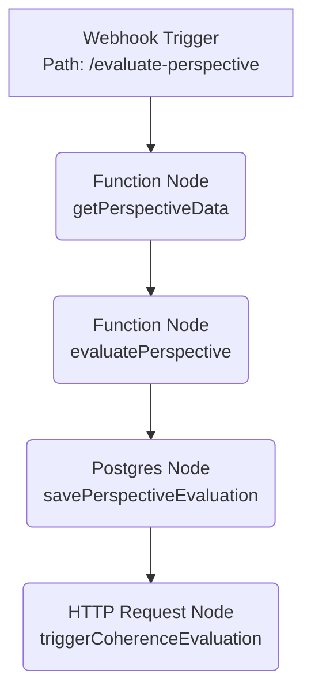
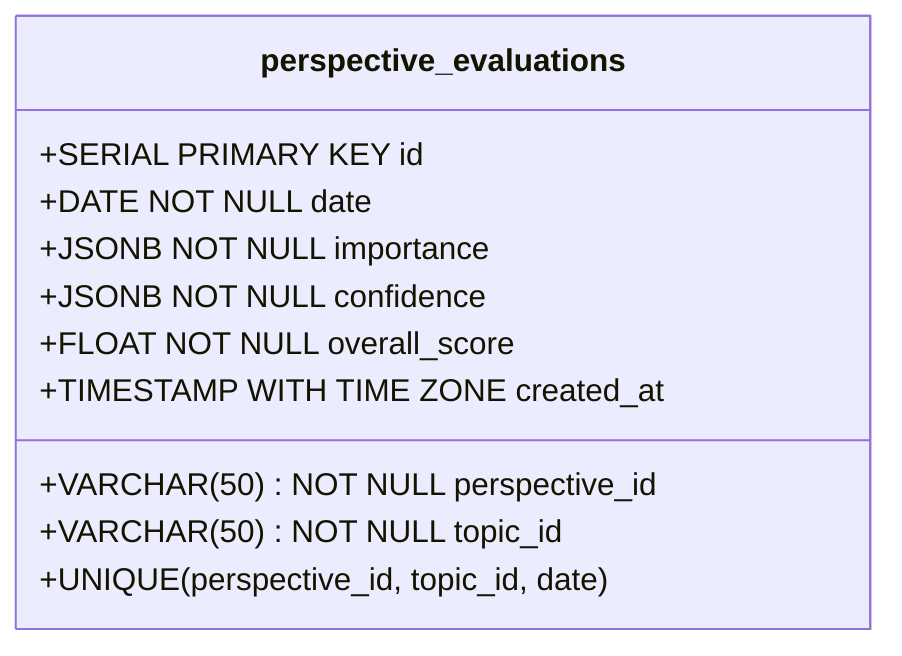
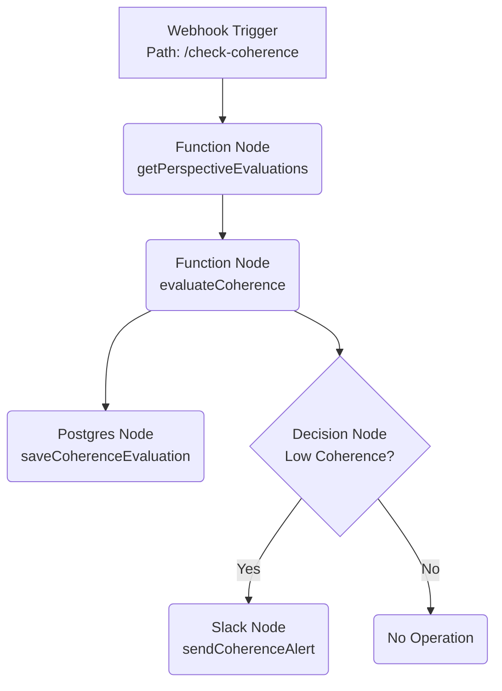

# コンセンサスモデルの実装（パート2：基本ロジックと評価メカニズム）- 設計原則関連性セクション追加版

## 1. コンセンサスモデルの評価メカニズムの概要と目的

パート1で解説したコンセンサスモデルの基本構造と設計原則に基づき、本稿（パート2）では、その中核をなす評価メカニズムの具体的な実装ロジックに焦点を当てます。評価メカニズムは、トリプルパースペクティブ型戦略AIレーダーが多様な情報源から得られたインプットを処理し、信頼性の高い判断を導き出すための重要なステップです。

### 1.1. 評価メカニズムの位置づけと重要性

コンセンサスモデル全体において、評価メカニズムは「情報の質と意味合いを定量化・定性化する」役割を担います。テクノロジー、マーケット、ビジネスという3つの異なる視点から収集された情報は、そのままでは比較や統合が困難です。評価メカニズムは、これらの情報を共通の基準で評価し、それぞれの「重要度」と「確信度」、そして視点間の「整合性」を明らかにすることで、後続の統合プロセスと意思決定支援の基盤を築きます。

この評価プロセスを通じて、単なる情報の羅列ではなく、戦略的な意味合いを持つインサイトへと昇華させることが可能になります。特に、変化の激しい現代のビジネス環境においては、情報の重要性や信頼性を迅速かつ正確に評価する能力が、競争優位性を確立する上で不可欠です。

### 1.2. 評価メカニズムの主要な目的

評価メカニズムは、以下の主要な目的を達成するために設計されます：

1.  **視点別情報の重要度と確信度の定量化**: 各視点から得られた情報（変化点、分析結果など）が、戦略的にどれほど重要か、そしてその情報がどれほど確からしいかを客観的なスコアとレベルで示します。
2.  **視点間の整合性の評価と検証**: 3つの視点からの評価結果が互いに矛盾なく整合しているか、あるいはどの視点間で不一致が生じているかを評価し、判断の信頼性を検証します。
3.  **信頼性の高い統合評価結果の導出**: 個別の評価結果を統合し、全体としての重要度、確信度、整合性を示すことで、多角的な視点を反映した総合的な評価を提供します。
4.  **意思決定支援のための明確な指標提供**: 評価結果を、意思決定者が理解しやすい明確な指標（スコア、レベル、アラートなど）として提示し、迅速かつ適切な判断を支援します。

## 1.3. パート1の設計原則との関連性

パート2で解説する評価メカニズムは、パート1で定義された5つの主要設計原則を具体的に実装するものです。以下に、各設計原則がどのように評価メカニズムに反映されているかを説明します。

#### 1.3.1. 多角的視点の統合

評価メカニズムは、テクノロジー、マーケット、ビジネスという3つの異なる視点からの情報を個別に評価し、それらを統合するプロセスを提供します。特に「整合性評価プロセス」では、視点間の一致度を評価し、潜在的な矛盾や不一致を検出することで、より包括的な理解を促進します。これにより、単一の視点では見落とされがちな重要な洞察や、視点間の相互作用から生まれる新たな知見を捉えることが可能になります。

#### 1.3.2. 適応性と柔軟性

評価メカニズムは、評価パラメータ（重み、閾値など）を調整可能な設計となっており、異なるビジネスコンテキストや変化する環境に適応できます。多層的評価アプローチを採用することで、状況に応じて評価の焦点や精度を調整する柔軟性を持ち、評価結果のフィードバックを取り入れて継続的に改善するメカニズムも組み込まれています。これにより、静的なルールベースの評価ではなく、動的に進化する評価システムを実現しています。

#### 1.3.3. 透明性と説明可能性

評価プロセスの各ステップは明示的に記録され、評価スコアの算出ロジックも明確に定義されています。定量的評価と定性的解釈の両方を提供することで、評価結果の背景にある理由や根拠を理解しやすくしています。これにより、「ブラックボックス」的な評価を避け、ユーザーが評価結果を信頼し、適切に解釈できるようになります。

#### 1.3.4. 段階的実装

評価メカニズムは、基本的な評価コンポーネント（重要度評価、確信度評価）から始め、より高度な整合性評価へと段階的に構築できるよう設計されています。n8nワークフローによるモジュール化された実装と、拡張性を考慮したデータベーススキーマ設計により、機能を徐々に追加・改善していくアプローチが可能です。これにより、初期段階から価値を提供しながら、時間をかけてシステムを成熟させることができます。

#### 1.3.5. 人間中心の拡張知能

評価メカニズムは、完全に自動化された判断を下すのではなく、評価結果を人間が解釈し、最終的な判断を行うための支援ツールとして位置づけられています。専門家の知見を取り入れる仕組みや、定性的な解釈の余地を残すことで、人間の直感や経験と機械的な分析を組み合わせた、より豊かな意思決定プロセスを実現します。

これらの設計原則の具体的な実装例は、本稿の後半で詳述する評価ロジック、データベーススキーマ、APIエンドポイント設計などに見ることができます。パート1で示された抽象的な原則が、パート2ではどのように実践的なシステムとして具現化されているかを理解することで、コンセンサスモデル全体の一貫性と体系性をより深く把握することができるでしょう。

## 2. 評価メカニズムの基本構造とアーキテクチャ

評価メカニズムは、大きく「視点別評価プロセス」と「整合性評価プロセス」の2つの段階で構成されます。以下にその基本構造とプロセス全体のフローを示します。

### 2.1. 評価プロセス全体のフロー（テキスト表現）

```
評価メカニズム
├── 視点別評価プロセス (Perspective Evaluation Process)
│   ├── 重要度評価コンポーネント (Importance Evaluation Component)
│   │   ├── 影響範囲評価 (Impact Scope Evaluation)
│   │   ├── 変化の大きさ評価 (Change Magnitude Evaluation)
│   │   ├── 戦略的関連性評価 (Strategic Relevance Evaluation)
│   │   └── 時間的緊急性評価 (Time Urgency Evaluation)
│   └── 確信度評価コンポーネント (Confidence Evaluation Component)
│       ├── 情報源信頼性評価 (Source Reliability Evaluation)
│       ├── データ量・質評価 (Data Volume/Quality Evaluation)
│       ├── 一貫性評価 (Consistency Evaluation)
│       └── 検証可能性評価 (Verifiability Evaluation)
└── 整合性評価プロセス (Coherence Evaluation Process)
    ├── 視点間一致度評価 (Perspective Agreement Evaluation)
    ├── 論理的整合性評価 (Logical Coherence Evaluation)
    ├── 時間的整合性評価 (Temporal Coherence Evaluation)
    └── コンテキスト整合性評価 (Contextual Coherence Evaluation)
```

### 2.2. 評価プロセス全体のフロー図（Mermaid）

```mermaid
graph LR
    A[入力: 視点別情報<br>(変化点, 分析結果)] --> B[視点別評価プロセス<br>n8n Workflow 1]
    B -- 重要度・確信度評価 --> C[評価結果DB]
    C --> D[整合性評価プロセス<br>n8n Workflow 2]
    
    subgraph 視点別評価
        B
    end
    
    subgraph 統合評価
        D
    end
    
    D -- 整合性評価 --> C
    C --> E[出力: 統合評価結果<br>(重要度, 確信度, 整合性)]"]
```
*図1: コンセンサスモデル評価プロセス全体のフロー図。視点別評価と整合性評価の連携を示す。*

このフロー図は、まず各視点からの情報が「視点別評価プロセス」で個別に評価され（重要度・確信度）、その結果がデータベースに保存されることを示しています。その後、「整合性評価プロセス」がデータベースから各視点の評価結果を取得し、それらの間の整合性を評価します。最終的に、重要度、確信度、整合性の3つの評価軸に基づいた統合評価結果が出力されます。

### 2.3. 各評価コンポーネントの詳細

#### 2.3.1. 重要度評価コンポーネント

入力された情報が戦略的にどれほど重要かを評価します。以下の4つの要素から構成されます：

-   **影響範囲評価**: その情報が影響を及ぼす範囲の広さ（例：影響を受ける顧客数、市場規模、関連部署数）を評価します。
-   **変化の大きさ評価**: 検出された変化の度合い（例：成長率の変化幅、技術的進歩の度合い、競合のシェア変動率）を評価します。
-   **戦略的関連性評価**: その情報が自社の戦略目標や重要業績評価指標（KPI）にどれほど関連しているかを評価します。
-   **時間的緊急性評価**: その情報に対して対応が必要となるまでの時間的な猶予（例：市場投入までの期間、競合の動きに対する反応速度）を評価します。

#### 2.3.2. 確信度評価コンポーネント

入力された情報の信頼性や確からしさを評価します。以下の4つの要素から構成されます：

-   **情報源信頼性評価**: 情報の出所（例：公式発表、信頼できる調査機関、専門家の意見、匿名の情報）の信頼性を評価します。
-   **データ量・質評価**: 評価の根拠となるデータの量（例：データポイント数、サンプルサイズ）と質（例：データの網羅性、正確性、最新性）を評価します。
-   **一貫性評価**: 同じ情報源からの時系列データの一貫性や、複数の情報源間での情報の一致度を評価します。
-   **検証可能性評価**: その情報が客観的な事実に基づいており、第三者による検証が可能かどうかを評価します。

#### 2.3.3. 整合性評価コンポーネント

3つの視点からの評価結果が互いに矛盾なく整合しているかを評価します。以下の4つの要素から構成されます：

-   **視点間一致度評価**: テクノロジー、マーケット、ビジネスの各視点からの評価結果（例：重要度スコア、確信度レベル）がどれほど一致しているかを評価します。
-   **論理的整合性評価**: 各視点の評価の根拠となるロジックや前提条件に矛盾がないかを評価します。
-   **時間的整合性評価**: 現在の評価結果が、過去のトレンドや評価結果と整合しているかを評価します。
-   **コンテキスト整合性評価**: 評価結果が、より広範な業界動向やマクロ環境の文脈と整合しているかを評価します。

## 3. 評価メカニズムの設計原則

効果的な評価メカニズムを構築するためには、パート1で述べたコンセンサスモデル全体の設計原則に加え、評価プロセス特有の以下の原則を重視します。

### 3.1. 定量的評価と定性的解釈の両立

評価結果は、客観的な比較と判断を可能にするための定量的なスコアと、その意味合いを直感的に理解するための定性的なレベル（例：High/Medium/Low）の両方で表現します。単なる数値だけでなく、その数値が示す具体的な意味合いや背景を解釈するためのガイドラインを提供することが重要です。また、定量評価には限界があることを認識し、最終的な判断においては専門家による定性的な解釈も加味できる柔軟性を持たせます。

### 3.2. 多層的評価アプローチ

評価は単一の指標で行うのではなく、複数の要素を組み合わせた多層的なアプローチを採用します。例えば、重要度評価では影響範囲、変化の大きさ、戦略的関連性、時間的緊急性という複数の要素を評価し、それらを重み付けして統合スコアを算出します。これにより、評価の網羅性と信頼性を高めます。各要素の重み付けや評価レベルを決定する閾値は、ビジネスの状況や目的に応じて調整可能であるべきです。

### 3.3. 評価の透明性と説明可能性

評価メカニズムが「ブラックボックス」にならないよう、どのように評価スコアやレベルが算出されたのかを追跡・説明できることが不可欠です。どのデータが評価に用いられ、どのような計算ロジック（重み付け、閾値など）が適用されたのかを記録し、必要に応じてユーザーが確認できるようにします。これにより、評価結果への信頼を高め、ユーザーが結果を解釈し、次のアクションを検討する際の助けとなります。

### 3.4. 評価結果のフィードバックと継続的改善

評価メカニズムは一度構築したら終わりではなく、継続的にその有効性を検証し、改善していく必要があります。評価結果と実際のビジネス成果との関連性を分析したり、ユーザーからのフィードバック（例：評価スコアの妥当性、見逃していた重要な要素）を収集したりすることで、評価ロジックやパラメータを定期的に見直し、最適化していくプロセスを組み込みます。将来的には、機械学習の手法を用いてパラメータを自動調整するメカニズムの導入も検討できます。

## 4. 視点別評価プロセスの実装

ここからは、評価メカニズムの第一段階である「視点別評価プロセス」の具体的な実装について解説します。このプロセスでは、テクノロジー、マーケット、ビジネスの各視点から入力された情報を個別に評価し、その「重要度」と「確信度」を算出します。実装にはn8nワークフローを活用し、評価結果をデータベースに永続化します。

### 4.1. n8nによる視点別評価ワークフロー

視点別評価プロセスは、外部からのトリガー（例：新しい分析結果の通知）を受けて起動し、関連データの取得、評価ロジックの実行、結果の保存、そして後続の整合性評価プロセスのトリガーまでを自動化するn8nワークフローとして実装します。

#### 4.1.1. ワークフロー構造（Mermaid）


*図2: n8n視点別評価ワークフローの構造。Webhookトリガーから整合性評価トリガーまでの一連の流れを示す。*

このワークフローは以下の主要ノードで構成されます：

1.  **Webhook Trigger**: `/evaluate-perspective` パスへのHTTP POSTリクエストを受け付け、ワークフローを開始します。リクエストボディには、評価対象のトピックIDや視点IDなどの情報が含まれます。
2.  **Function Node (getPerspectiveData)**: Webhookで受け取った情報に基づき、関連する分析結果や基礎データをデータベースや他の情報源から取得します。
3.  **Function Node (evaluatePerspective)**: 取得したデータと事前定義された評価パラメータを用いて、重要度と確信度の評価ロジックを実行します。
4.  **Postgres Node (savePerspectiveEvaluation)**: 算出された評価結果（スコア、レベル、構成要素）を、後述する`perspective_evaluations`テーブルに保存します。
5.  **HTTP Request Node (triggerCoherenceEvaluation)**: 視点別評価が完了したことを通知するため、整合性評価ワークフロー（`/check-coherence`）をHTTPリクエストでトリガーします。

#### 4.1.2. 重要度評価ロジック（JavaScript）

`evaluatePerspective` Function Node内で実行される重要度評価の主要なロジック例を以下に示します。このコードは、入力データとパラメータに基づき、4つの評価要素（影響範囲、変化の大きさ、戦略的関連性、時間的緊急性）のスコアを算出し、重み付け統合スコアと評価レベルを決定します。

```javascript
/**
 * 視点別情報の重要度を評価する関数
 * @param {object} analysisResults - 分析結果データ（影響範囲、変化の大きさ等の情報を含む）
 * @param {object} params - 重要度評価パラメータ（各要素の重み、閾値など）
 * @returns {object} - 重要度評価結果（スコア、レベル、各要素のスコア）
 */
function evaluateImportance(analysisResults, params) {
  // デフォルト値やエラーハンドリングを追加することが望ましい
  if (!analysisResults || !params) {
    console.error("評価に必要なデータまたはパラメータが不足しています。");
    return { score: 0, level: 'low', components: {} };
  }

  // 1. 影響範囲の評価 (例: 0-100のスコアに正規化)
  // analysisResults.impactMetrics.customerCount などを使用
  const impactScore = calculateImpactScope(analysisResults.impactMetrics, params.impactScope);
  
  // 2. 変化の大きさの評価 (例: 0-100のスコアに正規化)
  // analysisResults.changeMetrics.growthRateDelta などを使用
  const magnitudeScore = calculateChangeMagnitude(analysisResults.changeMetrics, params.changeMagnitude);
  
  // 3. 戦略的関連性の評価 (例: 0-100のスコアに正規化)
  // analysisResults.relevanceMetrics.kpiImpact などを使用
  const relevanceScore = calculateStrategicRelevance(analysisResults.relevanceMetrics, params.strategicRelevance);
  
  // 4. 時間的緊急性の評価 (例: 0-100のスコアに正規化)
  // analysisResults.urgencyMetrics.timeToMarket などを使用
  const urgencyScore = calculateTimeUrgency(analysisResults.urgencyMetrics, params.timeUrgency);
  
  // 5. 重み付け計算 (各要素の重みの合計は1になるように調整)
  const weightedScore = 
    (params.impactScope.weight * impactScore) +
    (params.changeMagnitude.weight * magnitudeScore) +
    (params.strategicRelevance.weight * relevanceScore) +
    (params.timeUrgency.weight * urgencyScore);
  
  // 6. レベル判定 (閾値はパラメータで定義)
  let level;
  if (weightedScore >= params.thresholds.high) {
    level = 'high';
  } else if (weightedScore >= params.thresholds.medium) {
    level = 'medium';
  } else {
    level = 'low';
  }
  
  // 7. 結果オブジェクトの返却
  return {
    score: parseFloat(weightedScore.toFixed(2)), // スコアは小数点以下2桁に丸める
    level: level,
    components: {
      impact_scope: impactScore,
      change_magnitude: magnitudeScore,
      strategic_relevance: relevanceScore,
      time_urgency: urgencyScore
    }
  };
}

// 各要素のスコア計算関数 (calculateImpactScope など) は別途定義する必要がある
// これらの関数は、入力データとパラメータに基づき、0-100の範囲でスコアを返す
function calculateImpactScope(metrics, params) { /* ... 実装 ... */ return 75; }
function calculateChangeMagnitude(metrics, params) { /* ... 実装 ... */ return 60; }
function calculateStrategicRelevance(metrics, params) { /* ... 実装 ... */ return 80; }
function calculateTimeUrgency(metrics, params) { /* ... 実装 ... */ return 50; }

// --- 実行例 ---
/*
const exampleAnalysisResults = {
  impactMetrics: { customerCount: 10000 },
  changeMetrics: { growthRateDelta: 0.15 },
  relevanceMetrics: { kpiImpact: 0.8 },
  urgencyMetrics: { timeToMarket: 6 }
};
const exampleParams = {
  impactScope: { weight: 0.3, /* ...他のパラメータ... */ },
  changeMagnitude: { weight: 0.2, /* ...他のパラメータ... */ },
  strategicRelevance: { weight: 0.3, /* ...他のパラメータ... */ },
  timeUrgency: { weight: 0.2, /* ...他のパラメータ... */ },
  thresholds: { high: 75, medium: 50 }
};

const importanceResult = evaluateImportance(exampleAnalysisResults, exampleParams);
console.log(importanceResult);
// 出力例: { score: 68.50, level: 'medium', components: { impact_scope: 75, change_magnitude: 60, strategic_relevance: 80, time_urgency: 50 } }
*/
```
*コード1: 重要度評価ロジックのJavaScript実装例。各評価要素のスコア計算と重み付け統合を行う。*

#### 4.1.3. 確信度評価ロジック（JavaScript）

同様に、`evaluatePerspective` Function Node内で実行される確信度評価の主要なロジック例を以下に示します。このコードは、入力データとパラメータに基づき、4つの評価要素（情報源信頼性、データ量・質、一貫性、検証可能性）のスコアを算出し、重み付け統合スコアと評価レベルを決定します。

```javascript
/**
 * 視点別情報の確信度を評価する関数
 * @param {object} analysisResults - 分析結果データ（情報源、データ品質等の情報を含む）
 * @param {object} params - 確信度評価パラメータ（各要素の重み、閾値など）
 * @returns {object} - 確信度評価結果（スコア、レベル、各要素のスコア）
 */
function evaluateConfidence(analysisResults, params) {
  // デフォルト値やエラーハンドリングを追加することが望ましい
  if (!analysisResults || !params) {
    console.error("評価に必要なデータまたはパラメータが不足しています。");
    return { score: 0, level: 'low', components: {} };
  }

  // 1. 情報源信頼性の評価 (例: 0-100のスコアに正規化)
  // analysisResults.sourceInfo.reliabilityScore などを使用
  const reliabilityScore = calculateSourceReliability(analysisResults.sourceInfo, params.sourceReliability);
  
  // 2. データ量・質の評価 (例: 0-100のスコアに正規化)
  // analysisResults.dataMetrics.volume, analysisResults.dataMetrics.quality などを使用
  const dataScore = calculateDataVolumeQuality(analysisResults.dataMetrics, params.dataVolumeQuality);
  
  // 3. 一貫性の評価 (例: 0-100のスコアに正規化)
  // analysisResults.consistencyMetrics.internalConsistency, analysisResults.consistencyMetrics.externalConsistency などを使用
  const consistencyScore = calculateConsistency(analysisResults.consistencyMetrics, params.consistency);
  
  // 4. 検証可能性の評価 (例: 0-100のスコアに正規化)
  // analysisResults.verifiabilityMetrics.isVerifiable などを使用
  const verifiabilityScore = calculateVerifiability(analysisResults.verifiabilityMetrics, params.verifiability);
  
  // 5. 重み付け計算 (各要素の重みの合計は1になるように調整)
  const weightedScore = 
    (params.sourceReliability.weight * reliabilityScore) +
    (params.dataVolumeQuality.weight * dataScore) +
    (params.consistency.weight * consistencyScore) +
    (params.verifiability.weight * verifiabilityScore);
  
  // 6. レベル判定 (閾値はパラメータで定義)
  let level;
  if (weightedScore >= params.thresholds.high) {
    level = 'high';
  } else if (weightedScore >= params.thresholds.medium) {
    level = 'medium';
  } else {
    level = 'low';
  }
  
  // 7. 結果オブジェクトの返却
  return {
    score: parseFloat(weightedScore.toFixed(2)), // スコアは小数点以下2桁に丸める
    level: level,
    components: {
      source_reliability: reliabilityScore,
      data_volume_quality: dataScore,
      consistency: consistencyScore,
      verifiability: verifiabilityScore
    }
  };
}

// 各要素のスコア計算関数 (calculateSourceReliability など) は別途定義する必要がある
function calculateSourceReliability(sourceInfo, params) { /* ... 実装 ... */ return 85; }
function calculateDataVolumeQuality(dataMetrics, params) { /* ... 実装 ... */ return 70; }
function calculateConsistency(consistencyMetrics, params) { /* ... 実装 ... */ return 75; }
function calculateVerifiability(verifiabilityMetrics, params) { /* ... 実装 ... */ return 90; }

// --- 実行例 ---
/*
const exampleAnalysisResultsConf = {
  sourceInfo: { reliabilityScore: 0.9 },
  dataMetrics: { volume: 500, quality: 'good' },
  consistencyMetrics: { internalConsistency: 0.8, externalConsistency: 0.7 },
  verifiabilityMetrics: { isVerifiable: true }
};
const exampleParamsConf = {
  sourceReliability: { weight: 0.3, /* ...他のパラメータ... */ },
  dataVolumeQuality: { weight: 0.2, /* ...他のパラメータ... */ },
  consistency: { weight: 0.2, /* ...他のパラメータ... */ },
  verifiability: { weight: 0.3, /* ...他のパラメータ... */ },
  thresholds: { high: 80, medium: 60 }
};

const confidenceResult = evaluateConfidence(exampleAnalysisResultsConf, exampleParamsConf);
console.log(confidenceResult);
// 出力例: { score: 81.50, level: 'high', components: { source_reliability: 85, data_volume_quality: 70, consistency: 75, verifiability: 90 } }
*/
```
*コード2: 確信度評価ロジックのJavaScript実装例。各評価要素のスコア計算と重み付け統合を行う。*

### 4.2. データベーススキーマ設計

視点別評価プロセスで算出された結果は、後続の整合性評価プロセスや最終的なコンセンサス形成で利用されるため、データベースに永続化する必要があります。ここでは、PostgreSQLを想定したテーブルスキーマの設計例を示します。

#### 4.2.1. 視点別評価結果テーブル（Mermaid）


*図3: 視点別評価結果テーブル（`perspective_evaluations`）のスキーマ定義。クラス図形式で表現。*

このテーブルの各カラムは以下の情報を格納します：

-   `id`: 各評価レコードの一意な識別子（自動採番）。
-   `perspective_id`: 評価対象の視点（例：'technology', 'market', 'business'）。
-   `topic_id`: 評価対象のトピックや変化点の一意な識別子。
-   `date`: 評価が実施された日付。
-   `importance`: 重要度評価の結果（スコア、レベル、各要素のスコア）をJSONB形式で格納。
-   `confidence`: 確信度評価の結果（スコア、レベル、各要素のスコア）をJSONB形式で格納。
-   `overall_score`: 重要度と確信度を組み合わせた総合スコア（計算方法は別途定義）。
-   `created_at`: レコードが作成されたタイムスタンプ。
-   `UNIQUE (perspective_id, topic_id, date)`: 同じ視点、同じトピック、同じ日付の評価が重複しないようにするためのユニーク制約。

JSONB型を使用することで、評価要素の内訳などの構造化データを柔軟に格納できます。

### 4.3. APIエンドポイント設計

視点別評価ワークフローを外部からトリガーするためのAPIエンドポイントを設計します。ここでは、Webhookトリガーノードで設定する`/evaluate-perspective`エンドポイントの仕様例を示します。

-   **エンドポイント**: `POST /evaluate-perspective`
-   **説明**: 指定されたトピックと視点について、最新の分析結果に基づき重要度と確信度を評価し、結果をデータベースに保存します。
-   **リクエストボディ (JSON)**:
    ```json
    {
      "topic_id": "tech_trend_001",
      "perspective_id": "technology",
      "analysis_date": "2025-06-03",
      "trigger_source": "data_pipeline_job_123"
    }
    ```
    -   `topic_id` (string, required): 評価対象のトピックID。
    -   `perspective_id` (string, required): 評価対象の視点ID。
    -   `analysis_date` (string, optional): 評価に使用する分析データの基準日（指定がない場合は最新）。
    -   `trigger_source` (string, optional): ワークフローをトリガーした要因（ログ記録用）。
-   **レスポンス**: 
    -   **成功時 (202 Accepted)**: ワークフローが正常に開始されたことを示します。実際の評価は非同期で行われるため、結果はレスポンスボディには含まれません。
        ```json
        {
          "status": "accepted",
          "message": "Perspective evaluation workflow started for topic 'tech_trend_001' and perspective 'technology'.",
          "workflow_execution_id": "exec_abc123xyz"
        }
        ```
    -   **失敗時 (400 Bad Request)**: リクエストボディに必要なパラメータが不足している場合など。
        ```json
        {
          "status": "error",
          "message": "Missing required parameter: topic_id"
        }
        ```
    -   **失敗時 (500 Internal Server Error)**: ワークフローの開始に失敗した場合など。
        ```json
        {
          "status": "error",
          "message": "Failed to start perspective evaluation workflow."
        }
        ```
-   **認証**: 必要に応じてAPIキーやトークンによる認証メカニズムを導入します。
-   **エラーハンドリング**: n8nワークフロー内でエラーが発生した場合、適切なログ記録と通知（例：Slack通知、エラーDBへの記録）を行うように設計します。

このAPIエンドポイントにより、他のシステムやプロセスから容易に視点別評価プロセスを呼び出すことが可能になります。

## 5. 整合性評価プロセスの実装

視点別評価プロセスに続き、評価メカニズムの第二段階である「整合性評価プロセス」の具体的な実装について解説します。このプロセスでは、3つの視点からの評価結果を比較し、それらの間の整合性を評価します。

### 5.1. n8nによる整合性評価ワークフロー

整合性評価プロセスは、視点別評価プロセスの完了を受けて起動し、関連する評価結果の取得、整合性評価ロジックの実行、結果の保存、そして必要に応じたアラート通知までを自動化するn8nワークフローとして実装します。

#### 5.1.1. ワークフロー構造（Mermaid）


*図4: n8n整合性評価ワークフローの構造。Webhookトリガーからアラート通知までの一連の流れを示す。*

このワークフローは以下の主要ノードで構成されます：

1.  **Webhook Trigger**: `/check-coherence` パスへのHTTP POSTリクエストを受け付け、ワークフローを開始します。リクエストボディには、評価対象のトピックIDなどの情報が含まれます。
2.  **Function Node (getPerspectiveEvaluations)**: Webhookで受け取った情報に基づき、データベースから関連する視点別評価結果を取得します。
3.  **Function Node (evaluateCoherence)**: 取得した評価結果と事前定義された評価パラメータを用いて、整合性評価ロジックを実行します。
4.  **Postgres Node (saveCoherenceEvaluation)**: 算出された整合性評価結果を、`coherence_evaluations`テーブルに保存します。
5.  **Decision Node**: 整合性スコアが閾値を下回る場合（低整合性）、アラート通知を行うかどうかを判断します。
6.  **Slack Node (sendCoherenceAlert)**: 低整合性の場合、その詳細情報をSlackチャンネルに通知します。

#### 5.1.2. 整合性評価ロジック（JavaScript）

`evaluateCoherence` Function Node内で実行される整合性評価の主要なロジック例を以下に示します。このコードは、3つの視点からの評価結果を比較し、4つの評価要素（視点間一致度、論理的整合性、時間的整合性、コンテキスト整合性）のスコアを算出し、重み付け統合スコアと評価レベルを決定します。

```javascript
/**
 * 視点間の整合性を評価する関数
 * @param {Array} perspectiveEvaluations - 各視点の評価結果の配列
 * @param {object} params - 整合性評価パラメータ（各要素の重み、閾値など）
 * @returns {object} - 整合性評価結果（スコア、レベル、各要素のスコア）
 */
function evaluateCoherence(perspectiveEvaluations, params) {
  // デフォルト値やエラーハンドリングを追加することが望ましい
  if (!perspectiveEvaluations || perspectiveEvaluations.length < 2 || !params) {
    console.error("評価に必要なデータまたはパラメータが不足しています。");
    return { score: 0, level: 'low', components: {} };
  }

  // 1. 視点間一致度の評価 (例: 0-100のスコアに正規化)
  // 各視点の重要度スコアと確信度スコアの分散を計算
  const agreementScore = calculatePerspectiveAgreement(perspectiveEvaluations, params.perspectiveAgreement);
  
  // 2. 論理的整合性の評価 (例: 0-100のスコアに正規化)
  // 各視点の評価根拠の論理的整合性を評価
  const logicalScore = calculateLogicalCoherence(perspectiveEvaluations, params.logicalCoherence);
  
  // 3. 時間的整合性の評価 (例: 0-100のスコアに正規化)
  // 過去の評価結果との整合性を評価
  const temporalScore = calculateTemporalCoherence(perspectiveEvaluations, params.temporalCoherence);
  
  // 4. コンテキスト整合性の評価 (例: 0-100のスコアに正規化)
  // より広範な業界動向やマクロ環境との整合性を評価
  const contextualScore = calculateContextualCoherence(perspectiveEvaluations, params.contextualCoherence);
  
  // 5. 重み付け計算 (各要素の重みの合計は1になるように調整)
  const weightedScore = 
    (params.perspectiveAgreement.weight * agreementScore) +
    (params.logicalCoherence.weight * logicalScore) +
    (params.temporalCoherence.weight * temporalScore) +
    (params.contextualCoherence.weight * contextualScore);
  
  // 6. レベル判定 (閾値はパラメータで定義)
  let level;
  if (weightedScore >= params.thresholds.high) {
    level = 'high';
  } else if (weightedScore >= params.thresholds.medium) {
    level = 'medium';
  } else {
    level = 'low';
  }
  
  // 7. 結果オブジェクトの返却
  return {
    score: parseFloat(weightedScore.toFixed(2)), // スコアは小数点以下2桁に丸める
    level: level,
    components: {
      perspective_agreement: agreementScore,
      logical_coherence: logicalScore,
      temporal_coherence: temporalScore,
      contextual_coherence: contextualScore
    }
  };
}

// 各要素のスコア計算関数 (calculatePerspectiveAgreement など) は別途定義する必要がある
function calculatePerspectiveAgreement(evaluations, params) { /* ... 実装 ... */ return 65; }
function calculateLogicalCoherence(evaluations, params) { /* ... 実装 ... */ return 80; }
function calculateTemporalCoherence(evaluations, params) { /* ... 実装 ... */ return 70; }
function calculateContextualCoherence(evaluations, params) { /* ... 実装 ... */ return 75; }

// --- 実行例 ---
/*
const examplePerspectiveEvaluations = [
  { perspective_id: 'technology', importance: { score: 75 }, confidence: { score: 80 } },
  { perspective_id: 'market', importance: { score: 65 }, confidence: { score: 70 } },
  { perspective_id: 'business', importance: { score: 70 }, confidence: { score: 75 } }
];
const exampleParamsCoherence = {
  perspectiveAgreement: { weight: 0.4, /* ...他のパラメータ... */ },
  logicalCoherence: { weight: 0.2, /* ...他のパラメータ... */ },
  temporalCoherence: { weight: 0.2, /* ...他のパラメータ... */ },
  contextualCoherence: { weight: 0.2, /* ...他のパラメータ... */ },
  thresholds: { high: 75, medium: 50 }
};

const coherenceResult = evaluateCoherence(examplePerspectiveEvaluations, exampleParamsCoherence);
console.log(coherenceResult);
// 出力例: { score: 71.00, level: 'medium', components: { perspective_agreement: 65, logical_coherence: 80, temporal_coherence: 70, contextual_coherence: 75 } }
*/
```
*コード3: 整合性評価ロジックのJavaScript実装例。各評価要素のスコア計算と重み付け統合を行う。*

### 5.2. パート3のコンセンサス基準との接続性

パート2で実装する評価メカニズムは、パート3で詳述するコンセンサス基準と密接に関連しています。評価メカニズムが算出する重要度、確信度、整合性のスコアは、パート3のコンセンサス基準の入力として使用され、最終的なコンセンサス形成の基盤となります。

具体的には、以下の点でパート3のコンセンサス基準と接続しています：

1. **評価結果の標準化**: パート2の評価メカニズムは、異なる視点からの情報を共通の評価基準（重要度、確信度、整合性）で標準化します。これにより、パート3のコンセンサス基準で異なる視点からの評価結果を比較・統合することが可能になります。

2. **閾値の設定基盤**: パート2で定義する評価レベル（High/Medium/Low）の閾値は、パート3のコンセンサス基準における判断閾値の設定に影響します。例えば、「重要度が高く、確信度も高い情報のみをコンセンサス形成の対象とする」といった基準を設定する際の基盤となります。

3. **整合性評価の活用**: パート2の整合性評価結果は、パート3のコンセンサス形成プロセスにおいて、視点間の不一致を解消するための重要な指標となります。整合性が低い場合は、追加の検証や専門家の判断を仰ぐなどの対応をトリガーします。

4. **重み付けメカニズムの共有**: パート2で導入する評価要素の重み付けの考え方は、パート3の重み付け方法にも適用されます。状況やコンテキストに応じて重みを動的に調整する仕組みは、両パートで共通の設計原則に基づいています。

このように、パート2の評価メカニズムはパート3のコンセンサス基準の前提条件を整え、両者が一体となってコンセンサスモデル全体の信頼性と有効性を高めています。パート3を読む際には、パート2で解説した評価ロジックやデータ構造を念頭に置くことで、コンセンサス形成プロセスの理解がより深まるでしょう。

## 6. まとめと次のステップ

本稿（パート2）では、コンセンサスモデルの中核をなす評価メカニズムの設計と実装について解説しました。視点別評価プロセスと整合性評価プロセスの2段階からなる評価メカニズムは、多角的な視点からの情報を共通の基準で評価し、それらの整合性を検証することで、信頼性の高い判断の基盤を提供します。

### 6.1. 主要なポイントの振り返り

-   **評価メカニズムの基本構造**: 重要度評価、確信度評価、整合性評価の3つの評価軸を中心に構成されています。
-   **評価プロセスの設計原則**: 定量的評価と定性的解釈の両立、多層的評価アプローチ、評価の透明性と説明可能性、評価結果のフィードバックと継続的改善を重視しています。
-   **n8nによる実装**: 視点別評価ワークフローと整合性評価ワークフローを、n8nを用いて自動化する方法を示しました。
-   **データベース設計**: 評価結果を永続化するためのデータベーススキーマを設計しました。
-   **APIエンドポイント**: 外部からワークフローをトリガーするためのAPIエンドポイントを定義しました。
-   **パート1の設計原則との関連性**: 多角的視点の統合、適応性と柔軟性、透明性と説明可能性、段階的実装、人間中心の拡張知能という5つの設計原則が、評価メカニズムにどのように反映されているかを示しました。
-   **パート3のコンセンサス基準との接続性**: 評価メカニズムがコンセンサス基準とどのように連携し、全体のコンセンサス形成プロセスを支えるかを説明しました。

### 6.2. 次のステップ

パート2で解説した評価メカニズムを基盤として、次のパート3では「コンセンサス基準と重み付け方法」について詳述します。具体的には、以下のトピックを取り上げる予定です：

-   **コンセンサス基準の定義**: どのような条件が満たされた場合にコンセンサスが形成されたと判断するかの基準を定義します。
-   **重み付け方法の詳細**: 静的重み付け、動的重み付け、コンテキスト依存の重み付けなど、異なるアプローチとその適用シナリオを解説します。
-   **コンセンサス形成プロセス**: 評価結果からコンセンサスを導き出すための具体的なプロセスとアルゴリズムを示します。
-   **コンセンサスの検証と調整**: 形成されたコンセンサスの信頼性を検証し、必要に応じて調整するメカニズムを解説します。

また、パート4では「静止点検出と評価方法」について解説し、コンセンサスモデルが収束状態（静止点）に達したかどうかを判断する方法と、その評価方法について詳述します。

最終的に、パート5では「n8nによる全体オーケストレーション」として、パート1から4で解説した各コンポーネントを統合し、実際のビジネスプロセスに組み込むための方法を示します。

これらのパートを通じて、コンセンサスモデルの全体像と実装方法を段階的に理解し、実際のビジネス課題に適用するための知識と技術を習得することができるでしょう。
