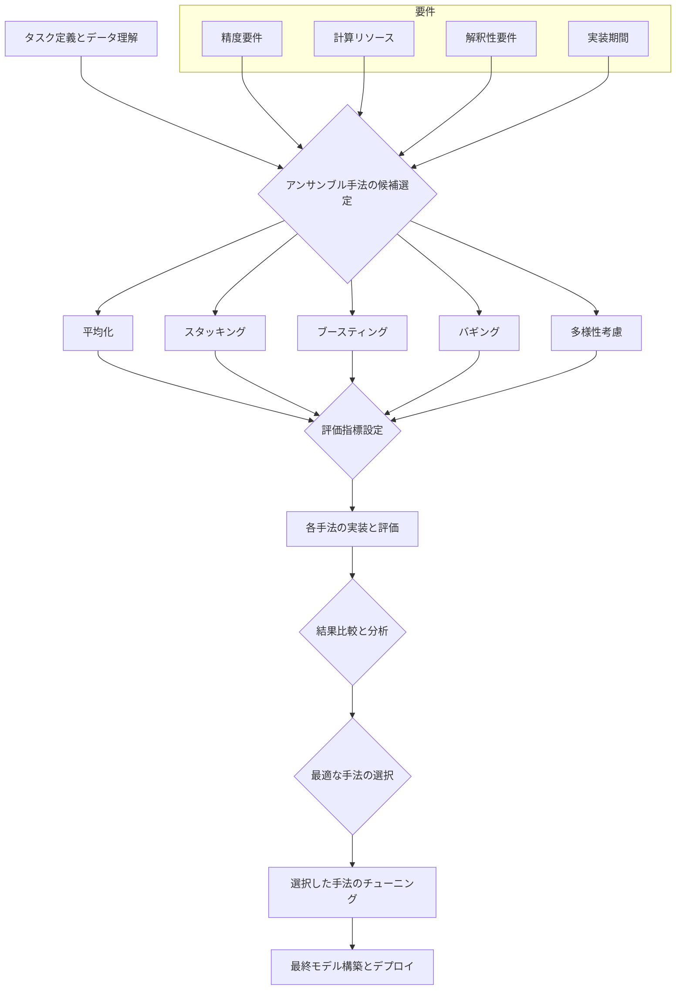

# 予測モデルの実装と統合（パート2-4：アンサンブル手法の実装）

## アンサンブル手法による予測の概要

トリプルパースペクティブ型戦略AIレーダーにおける予測エンジンでは、単一のモデルに依存するのではなく、複数のモデルを組み合わせるアンサンブル手法を活用することで、より堅牢で精度の高い予測を実現します。アンサンブル手法は、異なるモデルの長所を活かし、短所を補完することで、予測の安定性と精度を向上させます。本セクションでは、主要なアンサンブル手法のn8nによる実装について解説します。

### アンサンブル予測の基本概念

アンサンブル予測は、以下のステップで行われます：

1. **複数モデルの構築**: 異なるアルゴリズム、パラメータ、トレーニングデータを使用して複数のモデルを構築
2. **個別予測の生成**: 各モデルで独立に予測を生成
3. **予測の統合**: 何らかの方法（平均、加重平均、投票など）で個別予測を統合
4. **最終予測の生成**: 統合された予測を最終結果として出力

トリプルパースペクティブ型戦略AIレーダーでは、以下のようなアンサンブル手法を活用します：

- 平均化アンサンブル（単純平均、加重平均）
- スタッキングアンサンブル
- ブースティングアンサンブル
- バギングアンサンブル
- 多様性を考慮したアンサンブル

## 主要なアンサンブル手法の実装

本セクションでは、主要なアンサンブル手法の概念とn8nによる実装例を解説します。

### 1. 平均化アンサンブル

**概念**: 最も基本的なアンサンブル手法で、複数のモデルの予測結果を単純に平均するか、各モデルの信頼度に応じて重み付けして平均します。実装が容易で、多くの場合、単一モデルよりも安定した予測が得られます。

**n8nによる実装**: Functionノードを使用して、複数のモデルからの予測値を受け取り、単純平均または加重平均を計算します。

```javascript
// n8n workflow: Averaging Ensemble Implementation
// Function node for averaging ensemble
[
  {
    "id": "averagingEnsemble",
    "type": "n8n-nodes-base.function",
    "parameters": {
      "functionCode": `
        // Input: Predictions from multiple models and ensemble parameters
        const modelPredictions = $input.item.json.model_predictions || [];
        const parameters = $input.item.json.parameters || {};
        
        // Extract parameters
        const ensembleType = parameters.ensemble_type || 'simple_average';
        const weights = parameters.weights || [];
        
        // Validate input
        if (modelPredictions.length === 0) {
          throw new Error('No model predictions provided');
        }
        
        // Extract test data and predictions
        const testData = [];
        const allPredictions = [];
        
        // Organize predictions by test case
        modelPredictions.forEach(modelResult => {
          const modelName = modelResult.model_name;
          const predictions = modelResult.predictions || [];
          
          predictions.forEach((pred, idx) => {
            // Initialize test case if not exists
            if (!testData[idx]) {
              testData[idx] = pred.features || pred.sequence || \`Test case \${idx + 1}\`;
            }
            
            // Initialize predictions array if not exists
            if (!allPredictions[idx]) {
              allPredictions[idx] = [];
            }
            
            // Add prediction
            allPredictions[idx].push({
              model: modelName,
              prediction: pred.prediction
            });
          });
        });
        
        // Generate ensemble predictions
        const ensemblePredictions = [];
        
        for (let i = 0; i < testData.length; i++) {
          const testCase = testData[i];
          const predictions = allPredictions[i] || [];
          
          // Skip if no predictions
          if (predictions.length === 0) continue;
          
          let ensemblePrediction;
          
          if (ensembleType === 'simple_average') {
            // Simple average
            const sum = predictions.reduce((acc, p) => acc + p.prediction, 0);
            ensemblePrediction = sum / predictions.length;
          } else if (ensembleType === 'weighted_average') {
            // Weighted average
            let weightedSum = 0;
            let weightSum = 0;
            
            predictions.forEach((p, idx) => {
              const weight = idx < weights.length ? weights[idx] : 1;
              weightedSum += p.prediction * weight;
              weightSum += weight;
            });
            
            ensemblePrediction = weightSum > 0 ? weightedSum / weightSum : 0;
          } else {
            // Default to simple average
            const sum = predictions.reduce((acc, p) => acc + p.prediction, 0);
            ensemblePrediction = sum / predictions.length;
          }
          
          ensemblePredictions.push({
            test_case: i + 1,
            features: testCase,
            individual_predictions: predictions,
            ensemble_prediction: ensemblePrediction
          });
        }
        
        return {
          json: {
            ensemble_type: ensembleType,
            num_models: modelPredictions.length,
            model_names: modelPredictions.map(m => m.model_name),
            weights: ensembleType === 'weighted_average' ? weights : null,
            predictions: ensemblePredictions
          }
        };
      `
    }
  }
]
```

**実装のポイント**: 加重平均を使用する場合、各モデルの性能（例：検証データでの精度）に基づいて重みを決定することが重要です。

### 2. スタッキングアンサンブル

**概念**: 複数のベースモデル（レベル0）の予測結果を入力として、メタモデル（レベル1）を訓練し、最終予測を生成する手法です。メタモデルは、ベースモデルの予測結果の最適な組み合わせ方を学習します。異なる種類のモデルを組み合わせることで、より高い精度が期待できます。

**n8nによる実装**: Execute Commandノードを使用してPythonスクリプトを実行し、scikit-learnなどのライブラリを活用してスタッキングを実装します。ベースモデルの予測を生成し、それをメタモデルの入力として使用します。

```javascript
// n8n workflow: Stacking Ensemble Implementation
// Execute Command node to run Python script
[
  {
    "id": "executePythonScript",
    "type": "n8n-nodes-base.executeCommand",
    "parameters": {
      "command": "python3",
      "arguments": "-c \"import sys, json; data = json.loads(sys.stdin.read()); import numpy as np; from sklearn.ensemble import RandomForestRegressor, GradientBoostingRegressor; from sklearn.linear_model import LinearRegression; from sklearn.svm import SVR; # Extract data base_models_train = data['base_models_train']; base_models_test = data['base_models_test']; y_train = np.array(data['y_train']); # Prepare meta-features X_meta_train = np.array([[pred for pred in model['predictions']] for model in base_models_train]).T; X_meta_test = np.array([[pred for pred in model['predictions']] for model in base_models_test]).T; # Create and train meta-model params = data['parameters']; meta_model_type = params.get('meta_model_type', 'linear'); if meta_model_type == 'linear': meta_model = LinearRegression(); elif meta_model_type == 'random_forest': meta_model = RandomForestRegressor(n_estimators=params.get('n_estimators', 100), max_depth=params.get('max_depth', 10)); elif meta_model_type == 'gradient_boosting': meta_model = GradientBoostingRegressor(n_estimators=params.get('n_estimators', 100), learning_rate=params.get('learning_rate', 0.1)); elif meta_model_type == 'svr': meta_model = SVR(kernel=params.get('kernel', 'rbf'), C=params.get('C', 1.0)); else: meta_model = LinearRegression(); # Train meta-model meta_model.fit(X_meta_train, y_train); # Make predictions meta_predictions = meta_model.predict(X_meta_test).tolist(); # Prepare output result = {'predictions': [{'test_case': i + 1, 'base_model_predictions': [model['predictions'][i] for model in base_models_test], 'meta_prediction': meta_predictions[i]} for i in range(len(meta_predictions))], 'model_info': {'meta_model_type': meta_model_type, 'base_models': [model['model_name'] for model in base_models_train], 'parameters': params}}; print(json.dumps(result))\"",
      "executeInShell": true
    }
  },
  // ... (SetStackingInput and ProcessStackingResults nodes as before)
]
```

**実装のポイント**: ベースモデルの選択が重要です。多様なモデル（例：線形モデル、ツリーベースモデル、深層学習モデル）を組み合わせると効果的です。メタモデルの選択も性能に影響します（例：線形回帰、ランダムフォレスト）。過学習を防ぐために、ベースモデルの予測はクロスバリデーションを用いて生成することが推奨されます。

### 3. ブースティングアンサンブル

**概念**: モデルを逐次的に構築し、各モデルが前のモデルの誤差を修正するように訓練する手法です。代表的なアルゴリズムにAdaBoost、Gradient Boosting、XGBoost、LightGBMなどがあります。高い精度が期待できますが、パラメータ調整が複雑になることがあります。

**n8nによる実装**: Execute Commandノードを使用してPythonスクリプトを実行し、scikit-learnやXGBoostなどのライブラリを活用してブースティングを実装します。

```javascript
// n8n workflow: Boosting Ensemble Implementation
// Execute Command node to run Python script
[
  {
    "id": "executePythonScript",
    "type": "n8n-nodes-base.executeCommand",
    "parameters": {
      "command": "python3",
      "arguments": "-c \"import sys, json; data = json.loads(sys.stdin.read()); import numpy as np; from sklearn.ensemble import AdaBoostRegressor, GradientBoostingRegressor; from sklearn.tree import DecisionTreeRegressor; # Extract data X_train = np.array([item['features'] for item in data['training_data']]); y_train = np.array([item['target'] for item in data['training_data']]); X_test = np.array([item['features'] for item in data['test_data']]); # Create and train boosting model params = data['parameters']; boosting_type = params.get('boosting_type', 'adaboost'); if boosting_type == 'adaboost': base_estimator = DecisionTreeRegressor(max_depth=params.get('base_max_depth', 3)); model = AdaBoostRegressor(base_estimator=base_estimator, n_estimators=params.get('n_estimators', 50), learning_rate=params.get('learning_rate', 1.0)); elif boosting_type == 'gradient_boosting': model = GradientBoostingRegressor(n_estimators=params.get('n_estimators', 100), learning_rate=params.get('learning_rate', 0.1), max_depth=params.get('max_depth', 3), subsample=params.get('subsample', 1.0)); else: base_estimator = DecisionTreeRegressor(max_depth=params.get('base_max_depth', 3)); model = AdaBoostRegressor(base_estimator=base_estimator, n_estimators=params.get('n_estimators', 50), learning_rate=params.get('learning_rate', 1.0)); # Train model model.fit(X_train, y_train); # Make predictions predictions = model.predict(X_test).tolist(); # Get feature importances if hasattr(model, 'feature_importances_'): feature_importances = model.feature_importances_.tolist(); else: feature_importances = None; # Prepare output result = {'predictions': [{'features': data['test_data'][i]['features'], 'prediction': predictions[i]} for i in range(len(predictions))], 'model_info': {'boosting_type': boosting_type, 'feature_importances': feature_importances, 'parameters': params}}; print(json.dumps(result))\"",
      "executeInShell": true
    }
  },
  // ... (SetBoostingInput and ProcessBoostingResults nodes as before)
]
```

**実装のポイント**: 学習率、木の深さ、サブサンプリング率などのハイパーパラメータの調整が性能に大きく影響します。過学習に注意し、早期停止などのテクニックを活用することが重要です。

### 4. バギングアンサンブル

**概念**: 元のデータセットからブートストラップサンプル（重複を許したランダムサンプリング）を複数作成し、各サンプルで独立にモデルを訓練する手法です。各モデルの予測結果を平均化または多数決で統合します。モデルのバリアンス（分散）を低減する効果があります。ランダムフォレストはバギングの一種で、特徴量のランダム選択も加わります。

**n8nによる実装**: Execute Commandノードを使用してPythonスクリプトを実行し、scikit-learnのBaggingRegressorやRandomForestRegressorなどを活用してバギングを実装します。

```javascript
// n8n workflow: Bagging Ensemble Implementation
// Execute Command node to run Python script
[
  {
    "id": "executePythonScript",
    "type": "n8n-nodes-base.executeCommand",
    "parameters": {
      "command": "python3",
      "arguments": "-c \"import sys, json; data = json.loads(sys.stdin.read()); import numpy as np; from sklearn.ensemble import BaggingRegressor; from sklearn.tree import DecisionTreeRegressor; from sklearn.linear_model import LinearRegression; from sklearn.svm import SVR; # Extract data X_train = np.array([item['features'] for item in data['training_data']]); y_train = np.array([item['target'] for item in data['training_data']]); X_test = np.array([item['features'] for item in data['test_data']]); # Create base estimator params = data['parameters']; base_estimator_type = params.get('base_estimator_type', 'decision_tree'); if base_estimator_type == 'decision_tree': base_estimator = DecisionTreeRegressor(max_depth=params.get('max_depth', 10)); elif base_estimator_type == 'linear': base_estimator = LinearRegression(); elif base_estimator_type == 'svr': base_estimator = SVR(kernel=params.get('kernel', 'rbf'), C=params.get('C', 1.0)); else: base_estimator = DecisionTreeRegressor(max_depth=params.get('max_depth', 10)); # Create and train bagging model model = BaggingRegressor(base_estimator=base_estimator, n_estimators=params.get('n_estimators', 10), max_samples=params.get('max_samples', 1.0), max_features=params.get('max_features', 1.0), bootstrap=params.get('bootstrap', True), bootstrap_features=params.get('bootstrap_features', False)); # Train model model.fit(X_train, y_train); # Make predictions predictions = model.predict(X_test).tolist(); # Prepare output result = {'predictions': [{'features': data['test_data'][i]['features'], 'prediction': predictions[i]} for i in range(len(predictions))], 'model_info': {'bagging_type': 'Bagging', 'base_estimator': base_estimator_type, 'parameters': params}}; print(json.dumps(result))\"",
      "executeInShell": true
    }
  },
  // ... (SetBaggingInput and ProcessBaggingResults nodes as before)
]
```

**実装のポイント**: ベースモデルの数（n_estimators）を増やすことで性能が向上する傾向がありますが、計算コストも増加します。ベースモデルの種類やパラメータも性能に影響します。

### 5. 多様性を考慮したアンサンブル

**概念**: 単純な平均化や多数決だけでなく、モデル間の予測の「多様性」を明示的に考慮して重み付けや選択を行う手法です。予測が異なる傾向を持つモデルを組み合わせることで、アンサンブル全体の頑健性を高めます。例えば、精度が高いモデルだけでなく、他のモデルとは異なる予測をするモデルにも一定の重みを与えるなどの方法があります。

**n8nによる実装**: Functionノードを使用して、各モデルの精度とモデル間の予測の差異（多様性）を計算し、それらを組み合わせて重みを決定し、加重平均を計算します。

```javascript
// n8n workflow: Diversity-Aware Ensemble Implementation
// Function node for diversity-aware ensemble
[
  {
    "id": "diversityAwareEnsemble",
    "type": "n8n-nodes-base.function",
    "parameters": {
      "functionCode": `
        // Input: Predictions from multiple models and ensemble parameters
        const modelPredictions = $input.item.json.model_predictions || [];
        const parameters = $input.item.json.parameters || {};
        
        // Extract parameters
        const diversityWeight = parameters.diversity_weight || 0.5;
        const accuracyMetric = parameters.accuracy_metric || 'rmse';
        const modelAccuracies = parameters.model_accuracies || [];
        
        // Validate input
        if (modelPredictions.length === 0) {
          throw new Error('No model predictions provided');
        }
        
        // Extract test data and predictions
        const testData = [];
        const allPredictions = [];
        
        // Organize predictions by test case
        modelPredictions.forEach(modelResult => {
          const modelName = modelResult.model_name;
          const predictions = modelResult.predictions || [];
          
          predictions.forEach((pred, idx) => {
            // Initialize test case if not exists
            if (!testData[idx]) {
              testData[idx] = pred.features || pred.sequence || \`Test case \${idx + 1}\`;
            }
            
            // Initialize predictions array if not exists
            if (!allPredictions[idx]) {
              allPredictions[idx] = [];
            }
            
            // Add prediction
            allPredictions[idx].push({
              model: modelName,
              prediction: pred.prediction
            });
          });
        });
        
        // Calculate diversity matrix for each test case
        const diversityMatrices = [];
        
        for (const predictions of allPredictions) {
          const n = predictions.length;
          const diversityMatrix = Array(n).fill().map(() => Array(n).fill(0));
          
          for (let i = 0; i < n; i++) {
            for (let j = 0; j < n; j++) {
              if (i === j) {
                diversityMatrix[i][j] = 0;
              } else {
                // Calculate diversity as absolute difference between predictions
                diversityMatrix[i][j] = Math.abs(predictions[i].prediction - predictions[j].prediction);
              }
            }
          }
          
          diversityMatrices.push(diversityMatrix);
        }
        
        // Calculate model weights based on accuracy and diversity
        const calculateModelWeights = (predictions, diversityMatrix) => {
          const n = predictions.length;
          const weights = Array(n).fill(0);
          
          // Calculate accuracy weights
          for (let i = 0; i < n; i++) {
            const modelName = predictions[i].model;
            const accuracyIndex = modelAccuracies.findIndex(acc => acc.model === modelName);
            
            if (accuracyIndex >= 0) {
              const accuracy = modelAccuracies[accuracyIndex].accuracy;
              
              // For RMSE and MAE, lower is better, so invert
              if (accuracyMetric === 'rmse' || accuracyMetric === 'mae') {
                weights[i] = 1 / (accuracy + 0.0001); // Avoid division by zero
              } else {
                weights[i] = accuracy;
              }
            } else {
              weights[i] = 1; // Default weight if accuracy not provided
            }
          }
          
          // Normalize accuracy weights
          const sumAccuracyWeights = weights.reduce((sum, w) => sum + w, 0);
          for (let i = 0; i < n; i++) {
            weights[i] /= sumAccuracyWeights;
          }
          
          // Calculate diversity weights
          const diversityWeights = Array(n).fill(0);
          
          for (let i = 0; i < n; i++) {
            // Sum of diversities with other models
            diversityWeights[i] = diversityMatrix[i].reduce((sum, d) => sum + d, 0);
          }
          
          // Normalize diversity weights
          const sumDiversityWeights = diversityWeights.reduce((sum, w) => sum + w, 0);
          for (let i = 0; i < n; i++) {
            diversityWeights[i] = sumDiversityWeights > 0 ? diversityWeights[i] / sumDiversityWeights : 1 / n;
          }
          
          // Combine accuracy and diversity weights
          const combinedWeights = Array(n).fill(0);
          
          for (let i = 0; i < n; i++) {
            combinedWeights[i] = (1 - diversityWeight) * weights[i] + diversityWeight * diversityWeights[i];
          }
          
          // Normalize combined weights
          const sumCombinedWeights = combinedWeights.reduce((sum, w) => sum + w, 0);
          for (let i = 0; i < n; i++) {
            combinedWeights[i] = sumCombinedWeights > 0 ? combinedWeights[i] / sumCombinedWeights : 1 / n;
          }
          
          return combinedWeights;
        };
        
        // Generate ensemble predictions
        const ensemblePredictions = [];
        
        for (let i = 0; i < testData.length; i++) {
          const testCase = testData[i];
          const predictions = allPredictions[i] || [];
          const diversityMatrix = diversityMatrices[i] || [];
          
          // Skip if no predictions
          if (predictions.length === 0) continue;
          
          // Calculate weights
          const weights = calculateModelWeights(predictions, diversityMatrix);
          
          // Calculate weighted average
          let weightedSum = 0;
          
          for (let j = 0; j < predictions.length; j++) {
            weightedSum += predictions[j].prediction * weights[j];
          }
          
          ensemblePredictions.push({
            test_case: i + 1,
            features: testCase,
            individual_predictions: predictions.map((p, idx) => ({
              model: p.model,
              prediction: p.prediction,
              weight: weights[idx]
            })),
            ensemble_prediction: weightedSum
          });
        }
        
        return {
          json: {
            ensemble_type: 'Diversity-Aware Ensemble',
            diversity_weight: diversityWeight,
            accuracy_metric: accuracyMetric,
            num_models: modelPredictions.length,
            model_names: modelPredictions.map(m => m.model_name),
            predictions: ensemblePredictions
          }
        };
      `
    }
  }
]
```

**実装のポイント**: 多様性の定義と測定方法、精度と多様性のバランス（diversity_weight）の調整が重要です。多様性を高めるために、異なるアルゴリズム、異なる特徴量セット、異なる学習データを用いたモデルを組み合わせることが有効です。

## アンサンブル手法の比較と選択ガイド

最適なアンサンブル手法は、タスクの特性、データの種類、利用可能な計算リソース、予測精度と解釈性のトレードオフなど、多くの要因によって異なります。以下に、主要なアンサンブル手法の比較と選択のガイドラインを示します。

### 手法の比較

| 手法                 | 主な特徴                                                     | 長所                                                         | 短所                                                               | 主な用途                                   |
| -------------------- | ------------------------------------------------------------ | ------------------------------------------------------------ | -------------------------------------------------------------------------- | ------------------------------------------ |
| **平均化**           | 複数モデルの予測を平均化                                     | 実装が容易、安定性が向上                                     | 大きな精度向上は期待できない、モデル間の相関が高いと効果が薄い             | ベースライン、手軽な改善                   |
| **スタッキング**     | ベースモデルの予測をメタモデルで学習                         | 高い精度が期待できる、異なるモデルの長所を活かせる           | 実装が複雑、計算コストが高い、過学習のリスク                               | 精度最優先のタスク                         |
| **ブースティング**   | 逐次的にモデルを構築し、前のモデルの誤差を修正               | 高い精度が期待できる                                         | パラメータ調整が複雑、過学習しやすい、計算コストが高い                     | 精度重視のタスク、構造化データ             |
| **バギング**         | ブートストラップサンプルでモデルを並列学習し、結果を統合     | モデルのバリアンスを低減、過学習を抑制、並列処理が可能       | バイアスは低減しない、計算コストが高い                                     | 不安定なモデル（決定木など）の安定化       |
| **多様性考慮**     | モデル間の予測の差異（多様性）を考慮して統合                 | 頑健性が向上、未知の状況への対応力向上                       | 多様性の定義・測定が難しい、実装が複雑                                     | 頑健性重視、多様なモデルが存在する場合     |

### アンサンブル手法選択のフローチャート



*図：アンサンブル手法選択のフローチャート - 要件に基づく適切な手法選択から実装・評価までのプロセス*

### 選択ガイドライン

1.  **ベースラインとして平均化**: まずは単純な平均化アンサンブルを試して、ベースライン性能を確認します。
2.  **精度を追求するならスタッキング・ブースティング**: 計算コストや実装の複雑さを許容できる場合、スタッキングやブースティング（特にXGBoostやLightGBM）が高い精度を達成する可能性があります。
3.  **モデルの安定性向上にはバギング**: ベースモデルが不安定な場合（例：決定木）、バギング（ランダムフォレストなど）が有効です。
4.  **頑健性を重視するなら多様性考慮**: 予測の安定性や未知の状況への対応力を高めたい場合、多様性を考慮したアンサンブルを検討します。
5.  **計算リソースと相談**: スタッキングやブースティングは計算コストが高くなる傾向があります。利用可能なリソースに応じて手法を選択します。
6.  **解釈性の要件**: 一般的に、平均化やバギングは比較的解釈しやすいですが、スタッキングやブースティングは解釈が難しくなることがあります。解釈性が重要な場合は、SHAPなどの解釈ツールと組み合わせることを検討します。
7.  **実験と評価**: 最終的には、候補となる複数のアンサンブル手法を実際に試行し、評価指標に基づいて最適なものを選択することが重要です。

## 実装上の課題と対応策

アンサンブル手法を実装する際には、いくつかの課題に直面する可能性があります。以下に主な課題とその対応策を示します。

1.  **計算リソース要件**: 複数のモデルを訓練・実行するため、計算時間とメモリ使用量が増加します。
    *   **対応策**: モデルの軽量化（パラメータ削減、プルーニング）、分散処理環境の利用（n8nのWorkerノード活用など）、効率的なアルゴリズム（LightGBMなど）の選択、必要なモデル数や複雑さの最適化。
2.  **モデル選択の複雑さ**: どのモデルを組み合わせるか、どのアンサンブル手法を選択するかが難しい場合があります。
    *   **対応策**: 自動化ツール（AutoMLライブラリの一部機能など）の活用、クロスバリデーションによる厳密な評価、ドメイン知識に基づいたヒューリスティックな選択、段階的なアプローチ（単純なものから試す）。
3.  **データ品質問題**: ベースモデルの性能はデータ品質に依存し、それがアンサンブル全体の性能に影響します。
    *   **対応策**: 徹底したデータ前処理（欠損値補完、異常値除去、正規化）、特徴量エンジニアリング、データ拡張、頑健なモデル（外れ値に強いモデルなど）の選択。
4.  **n8n環境での実装と連携**: Pythonスクリプトの実行やライブラリ管理、ノード間のデータ受け渡しに工夫が必要です。
    *   **対応策**: Execute CommandノードでのPython環境設定（仮想環境利用など）、JSON形式での効率的なデータシリアライズ/デシリアライズ、エラーハンドリングの強化、n8nのメモリ・実行時間制限への配慮（処理の分割など）。
5.  **アンサンブルモデルの解釈性**: 複数のモデルが組み合わさるため、予測根拠の解釈が難しくなることがあります。
    *   **対応策**: SHAPやLIMEなどのモデル解釈ツールの活用、比較的解釈しやすいベースモデル（線形モデル、決定木など）の利用、アンサンブル手法自体の解釈性向上（例：ルールベースのメタモデル）。
6.  **過学習のリスク**: 特にスタッキングやブースティングでは、過学習のリスクが高まる可能性があります。
    *   **対応策**: 適切なクロスバリデーション戦略、正則化、早期停止、ハイパーパラメータの慎重なチューニング。

## 段階的実装アプローチ

アンサンブル手法の実装は、プロジェクトの要件やチームのスキルレベルに応じて段階的に進めることが推奨されます。

1.  **フェーズ1：基本実装（初心者向け）**
    *   **目標**: アンサンブルの基本的な効果を体験する。
    *   **手法**: 単純平均化アンサンブル。
    *   **ステップ**: 2〜3個の異なるベースモデル（例：ARIMA, RandomForest）を訓練し、それらの予測を単純平均するn8nワークフローを構築する。
2.  **フェーズ2：性能向上（中級者向け）**
    *   **目標**: より高度なアンサンブル手法を導入し、精度向上を目指す。
    *   **手法**: 加重平均、バギング（RandomForest）、基本的なブースティング（AdaBoost）。
    *   **ステップ**: ベースモデルの検証精度に基づいて加重平均を実装する。scikit-learnを用いてRandomForestやAdaBoostを実装し、n8nから呼び出す。
3.  **フェーズ3：最適化と応用（上級者向け）**
    *   **目標**: 精度と頑健性を最大化し、複雑な要件に対応する。
    *   **手法**: スタッキング、高度なブースティング（XGBoost, LightGBM）、多様性を考慮したアンサンブル。
    *   **ステップ**: クロスバリデーションを用いたスタッキングを実装する。XGBoostやLightGBMを導入し、ハイパーパラメータチューニングを行う。多様性指標を定義し、精度と多様性のバランスを取るアンサンブルを構築する。

**実装の進化ロードマップ**: まずは単純な平均化から始め、徐々にバギング、ブースティング、スタッキングへと移行していくことで、アンサンブル手法の理解を深めながら実装を進めることができます。

## 業種別・用途別のカスタマイズガイド

アンサンブル手法の選択と実装は、対象となる業種や具体的な用途によってカスタマイズすることが重要です。

1.  **製造業**
    *   **用途**: 需要予測、品質管理（不良品予測）、設備保全予測。
    *   **カスタマイズ**: 時系列特性を捉えるモデル（ARIMA, LSTM）と、他の要因（設備センサーデータ、生産計画）を考慮するモデル（RandomForest, XGBoost）を組み合わせたスタッキングや加重平均が有効。異常検知にはIsolation Forestなどのアンサンブルも活用。
2.  **小売業**
    *   **用途**: 販売予測、顧客行動予測（購買予測、離反予測）、在庫最適化。
    *   **カスタマイズ**: 季節性やイベント効果を捉えるモデルと、顧客属性や商品特性を考慮するモデルのアンサンブル。特に販売予測では、精度が重要となるため、XGBoostやLightGBMなどのブースティング系が有効な場合が多い。顧客セグメントごとにモデルを構築し、アンサンブルすることも考えられる。
3.  **金融業**
    *   **用途**: 市場予測（株価、為替）、信用リスク評価、不正検知。
    *   **カスタマイズ**: 市場予測では、異なる時間スケールや情報源に基づくモデルのアンサンブル。信用リスク評価では、解釈性も重要となるため、線形モデルや決定木を含むアンサンブルや、SHAP等で解釈可能な手法が好まれる。不正検知では、不均衡データに対応できるアンサンブル手法（例：EasyEnsemble, BalanceCascade）が有効。
4.  **データタイプ別**
    *   **時系列データ**: ARIMA, Prophet, LSTMなどの時系列モデルをベースとしたアンサンブル。
    *   **構造化データ**: RandomForest, XGBoost, LightGBMなどのツリーベースのアンサンブルが強力。
    *   **テキストデータ**: トピックモデル、単語埋め込みベースのモデル、Transformerベースのモデルなどを組み合わせたアンサンブル。
5.  **優先事項別**
    *   **予測精度最優先**: スタッキング、ブースティング（XGBoost, LightGBM）。
    *   **解釈性重視**: 線形モデルや決定木ベースのバギング、SHAP等で解釈可能なモデルのアンサンブル。
    *   **計算効率重視**: 単純平均、軽量なベースモデルを用いたバギング。
    *   **頑健性重視**: 多様性を考慮したアンサンブル、異なるタイプのモデルを組み合わせたスタッキング。

## 現実的な実装と限界

アンサンブル手法は強力ですが、万能ではありません。現実的な実装における考慮事項と限界を理解しておくことが重要です。

1.  **「No Free Lunch」定理**: 全てのタスクに対して常に最良となる単一のアンサンブル手法は存在しません。タスクやデータに応じて最適な手法は異なります。
2.  **ベースモデルの品質**: アンサンブルの性能は、個々のベースモデルの品質に大きく依存します。質の低いモデルばかりを集めても、良いアンサンブルは作れません。
3.  **多様性の確保**: 効果的なアンサンブルのためには、ベースモデル間の適度な多様性が必要です。類似したモデルばかりを集めても、性能向上は限定的です。
4.  **計算コストと複雑性**: 高度なアンサンブル手法ほど、実装と運用（訓練、推論、管理）のコストと複雑性が増大します。費用対効果を考慮する必要があります。
5.  **データの代表性**: 訓練データが実際の運用環境のデータを十分に代表していない場合、アンサンブルモデルも現実世界でうまく機能しない可能性があります。
6.  **解釈性のトレードオフ**: 精度を追求するほど、モデルの解釈性が低下する傾向があります。ビジネス要件に応じて、精度と解釈性のバランスを取る必要があります。

## まとめと次のステップ

本セクションでは、トリプルパースペクティブ型戦略AIレーダーにおけるアンサンブル手法の実装について詳細に解説しました。平均化、スタッキング、ブースティング、バギング、多様性考慮といった主要な手法の概念、n8nによる実装例、比較と選択ガイド、実装上の課題、段階的アプローチ、業種別カスタマイズ、そして現実的な限界について説明しました。

アンサンブル手法は、単一モデルの限界を超えるための強力な武器ですが、その選択と実装には慎重な検討が必要です。本セクションで提供した情報を参考に、タスクに最適なアンサンブル戦略を構築してください。

次のセクション「パート2-5：モデル統合ワークフローと自動化」では、これまでに実装した様々な予測モデル（時系列、機械学習、深層学習、アンサンブル）をn8n上で統合し、予測プロセス全体を自動化するワークフローの構築について解説します。

<!-- 視覚的要素のプレースホルダー -->

### 付録：視覚的要素（例）

- **アンサンブル手法概念図**: 各手法（平均化、スタッキング、ブースティング、バギング）の仕組みを図解。
- **手法比較表**: 上記の表をより詳細化し、視覚的に表現。
- **モデル選択フローチャート**: 上記のフローチャートをMermaid等で描画。
- **予測結果可視化例**: 単一モデルとアンサンブルモデルの予測結果を比較するグラフ。

