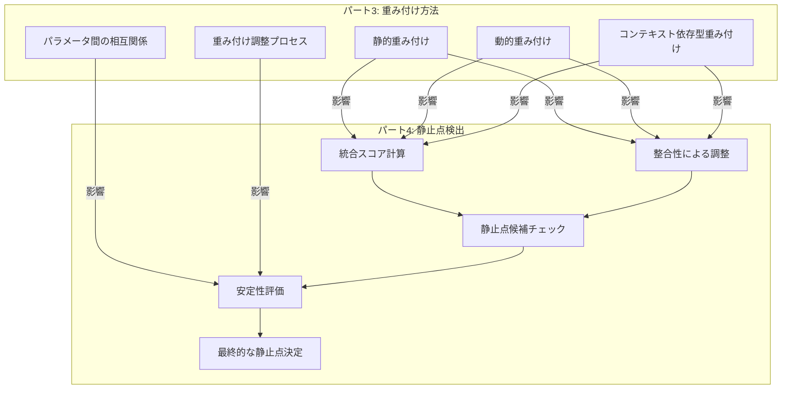
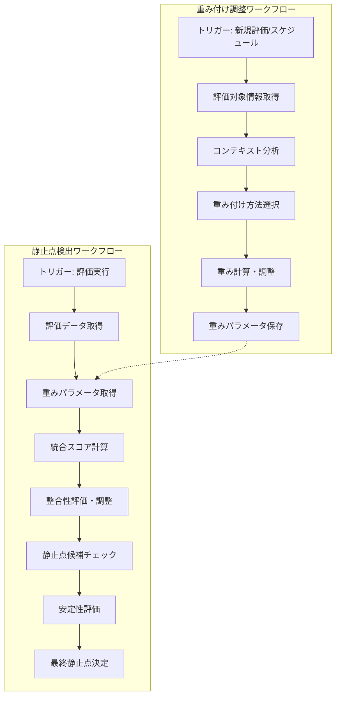

# 8. パート3の重み付け方法が静止点検出に与える影響

## このセクションの目的

読者がパート3で説明された重み付け方法がパート4の静止点検出プロセスにどのように影響するかを理解し、両者を効果的に連携させた実装ができるようにする。

## 概要

トリプルパースペクティブ型戦略AIレーダーの核心は、パート3で説明した「重み付け方法」とパート4で説明した「静止点検出」の有機的な連携にあります。これらは独立したコンポーネントではなく、相互に影響し合う一体のシステムとして機能します。本セクションでは、パート3で解説した3つの重み付け方法（静的重み付け、動的重み付け、コンテキスト依存型重み付け）が、静止点検出プロセスの各段階にどのような影響を与えるかを詳細に説明します。

両パートの主要概念間の関連性を以下の図に示します。



*図1: パート3の重み付け方法とパート4の静止点検出プロセスの関連性マップ*

この図からわかるように、重み付け方法は特に統合スコア計算、整合性による調整、安定性評価の3つの段階に大きな影響を与えます。以下のセクションでは、これらの影響を詳細に解説し、実装時の連携ポイントと実践的なユースケースを提供します。

## 8.1 重み付け方法と統合スコア計算の関係

静止点検出プロセスの最初のステップである統合スコア計算は、パート3で説明した重み付け方法に直接依存しています。パート4の「2.2 統合スコア計算」で説明したように、統合スコアは以下の式で計算されます：

```
統合スコア = Σ (視点iの評価スコア * 視点iの確信度 * 視点iの重要度)
```

ここで「視点iの重要度」が、パート3で説明した重み付け方法によって決定される値です。重み付け方法の選択によって、統合スコアの計算結果は大きく変わる可能性があります。

### 8.1.1 静的重み付けの影響

静的重み付け（パート3の「3.1 静的重み付け」参照）では、各視点に固定された重みを割り当てます。例えば、テクノロジー視点(0.4)、マーケット視点(0.3)、ビジネス視点(0.3)といった具合です。

この方法の統合スコア計算への影響は以下の通りです：

- **計算の安定性**: 重みが固定されているため、同じ評価スコアと確信度に対して常に同じ統合スコアが得られます。これにより、時間経過による変動が少なく、結果の予測可能性が高まります。

- **閾値設定の容易さ**: 統合スコアの範囲が予測可能なため、静止点候補を特定するための閾値設定が比較的容易です。

- **限界**: 評価対象の特性や状況の変化に適応できないため、特定のケースでは不適切な統合スコアが算出される可能性があります。

静的重み付けを使用した統合スコア計算の例を以下に示します：

```javascript
// 静的重み付けを使用した統合スコア計算
function calculateIntegratedScore(scores, confidences) {
  // 静的重み
  const weights = {
    technology: 0.4,
    market: 0.3,
    business: 0.3
  };
  
  let integratedScore = 0;
  
  // 各視点のスコアに確信度と重みを掛け合わせて合計
  integratedScore += scores.technology * confidences.technology * weights.technology;
  integratedScore += scores.market * confidences.market * weights.market;
  integratedScore += scores.business * confidences.business * weights.business;
  
  return integratedScore;
}
```

### 8.1.2 動的重み付けの影響

動的重み付け（パート3の「3.2 動的重み付け」参照）では、評価プロセス中に重み値が変化します。確信度、時間経過、フィードバックなどの要因に基づいて調整されます。

この方法の統合スコア計算への影響は以下の通りです：

- **適応的な統合スコア**: 状況の変化に応じて重みが調整されるため、より状況に適した統合スコアが算出可能です。例えば、特定の視点の確信度が低い場合、その視点の重みを下げることで、より信頼性の高い視点を重視した評価が可能になります。

- **時系列変化の反映**: プロジェクトのフェーズに応じた重み変化により、発展段階に適した評価が可能です。例えば、初期段階ではテクノロジー視点を重視し、成熟段階ではビジネス視点を重視するといった調整ができます。

- **閾値設定の複雑化**: 重みが動的に変化するため、静止点候補の閾値設定が複雑になります。状況に応じた適応的な閾値設定が必要になる場合があります。

動的重み付けを使用した統合スコア計算の例を以下に示します：

```javascript
// 動的重み付けを使用した統合スコア計算
function calculateIntegratedScoreWithDynamicWeights(scores, confidences, phase) {
  // 基本重み
  let weights = {
    technology: 0.4,
    market: 0.3,
    business: 0.3
  };
  
  // フェーズに基づく重み調整
  switch(phase) {
    case 'early':
      weights = { technology: 0.5, market: 0.3, business: 0.2 };
      break;
    case 'growth':
      weights = { technology: 0.4, market: 0.4, business: 0.2 };
      break;
    case 'mature':
      weights = { technology: 0.3, market: 0.3, business: 0.4 };
      break;
  }
  
  // 確信度に基づく重み調整
  weights.technology *= (1 + (confidences.technology - 0.5) * 0.4);
  weights.market *= (1 + (confidences.market - 0.5) * 0.4);
  weights.business *= (1 + (confidences.business - 0.5) * 0.4);
  
  // 重みの正規化
  const totalWeight = weights.technology + weights.market + weights.business;
  weights.technology /= totalWeight;
  weights.market /= totalWeight;
  weights.business /= totalWeight;
  
  // 統合スコア計算
  let integratedScore = 0;
  integratedScore += scores.technology * confidences.technology * weights.technology;
  integratedScore += scores.market * confidences.market * weights.market;
  integratedScore += scores.business * confidences.business * weights.business;
  
  return integratedScore;
}
```

### 8.1.3 コンテキスト依存型重み付けの影響

コンテキスト依存型重み付け（パート3の「3.3 コンテキスト依存型重み付け」参照）では、評価対象の特性や評価コンテキストに基づいて重みを調整します。例えば、技術駆動型案件ではテクノロジー視点を重視し、市場駆動型案件ではマーケット視点を重視するといった具合です。

この方法の統合スコア計算への影響は以下の通りです：

- **対象特性に最適化された統合スコア**: 評価対象の性質に応じた重み付けにより、より適切な統合スコアが算出可能です。これにより、異なる特性を持つ評価対象に対して、それぞれ最適化された評価が可能になります。

- **多様な評価対象への対応**: 技術駆動型、市場駆動型など異なる特性を持つ対象に対して、それぞれ最適化された評価が可能です。これにより、多様な評価対象に対して公平かつ適切な評価が実現します。

- **比較可能性の低下**: 異なるコンテキストで評価された対象間の直接比較が難しくなる可能性があります。これは、異なる重み付けが適用されているため、統合スコアの絶対値の比較が必ずしも意味を持たないためです。

コンテキスト依存型重み付けを使用した統合スコア計算の例を以下に示します：

```javascript
// コンテキスト依存型重み付けを使用した統合スコア計算
function calculateIntegratedScoreWithContextualWeights(scores, confidences, nature) {
  // 評価対象の性質に基づく重み設定
  let weights;
  
  switch(nature) {
    case 'tech_driven':
      weights = { technology: 0.5, market: 0.3, business: 0.2 };
      break;
    case 'market_driven':
      weights = { technology: 0.2, market: 0.5, business: 0.3 };
      break;
    case 'business_driven':
      weights = { technology: 0.2, market: 0.3, business: 0.5 };
      break;
    default:
      weights = { technology: 0.33, market: 0.33, business: 0.34 };
  }
  
  // 統合スコア計算
  let integratedScore = 0;
  integratedScore += scores.technology * confidences.technology * weights.technology;
  integratedScore += scores.market * confidences.market * weights.market;
  integratedScore += scores.business * confidences.business * weights.business;
  
  return integratedScore;
}
```

## 8.2 重み付け方法と整合性評価の相互作用

パート4の「2.3 整合性による調整」で説明したように、整合性評価は3つの視点からの評価がどの程度一致しているかを示す「整合性スコア」を計算し、それに基づいて統合スコアを調整するプロセスです。重み付け方法は、この整合性評価と調整プロセスにも大きな影響を与えます。

### 8.2.1 静的重み付けと整合性の相互作用

静的重み付けを使用する場合、整合性評価と調整プロセスは比較的単純です。

- **整合性評価の単純化**: 重みが固定されているため、整合性スコアの解釈が比較的容易です。例えば、3つの視点の評価スコア間の標準偏差を計算する場合、各視点の重要度が一定であるため、結果の解釈が直感的です。

- **視点間バランスの固定化**: 重要度の低い視点の不整合が常に軽視される傾向があります。例えば、ビジネス視点の重みが常に低い場合、ビジネス視点の評価が他の視点と大きく異なっていても、整合性スコアへの影響は限定的です。

- **調整効果の予測可能性**: 整合性による調整効果が予測しやすく、安定した結果が得られます。これにより、システムの動作が理解しやすくなります。

静的重み付けを考慮した整合性スコア計算と調整の例を以下に示します：

```javascript
// 静的重み付けを考慮した整合性スコア計算
function calculateCoherenceScore(scores, weights) {
  // 重み付き平均を計算
  const weightedMean = (
    scores.technology * weights.technology +
    scores.market * weights.market +
    scores.business * weights.business
  );
  
  // 重み付き分散を計算
  const weightedVariance = (
    weights.technology * Math.pow(scores.technology - weightedMean, 2) +
    weights.market * Math.pow(scores.market - weightedMean, 2) +
    weights.business * Math.pow(scores.business - weightedMean, 2)
  );
  
  // 整合性スコアは分散の逆数を正規化したもの
  // 分散が小さいほど整合性が高い
  const coherenceScore = 1 / (1 + weightedVariance);
  
  return coherenceScore;
}

// 整合性による統合スコアの調整
function adjustScoreByCoherence(integratedScore, coherenceScore) {
  // 整合性が高いほど調整が少なく、低いほど下方修正が大きい
  return integratedScore * (0.5 + 0.5 * coherenceScore);
}
```

### 8.2.2 動的重み付けと整合性の相互作用

動的重み付けを使用する場合、整合性評価と調整プロセスはより複雑になります。

- **整合性評価の複雑化**: 重みが変動するため、整合性スコアの解釈が複雑になります。例えば、時間経過とともに重みが変化する場合、同じ評価スコアセットでも整合性スコアが変化する可能性があります。

- **確信度との相乗効果**: 確信度に基づく重み調整と整合性評価が相互に影響し、より洗練された調整が可能になります。例えば、確信度の低い視点の重みを下げることで、整合性評価においてもその視点の影響を適切に制限できます。

- **時間経過による変化**: プロジェクトフェーズに応じた重み変化により、整合性の重要性も変化します。例えば、初期段階では整合性よりも革新性を重視し、成熟段階では整合性をより重視するといった調整が可能です。

動的重み付けを考慮した整合性スコア計算と調整の例を以下に示します：

```javascript
// 動的重み付けを考慮した整合性スコア計算と調整
function calculateAndAdjustWithDynamicWeights(scores, confidences, phase) {
  // 動的重み付けで統合スコアを計算
  const weights = calculateDynamicWeights(confidences, phase);
  const integratedScore = calculateIntegratedScore(scores, confidences, weights);
  
  // 整合性スコアを計算（重みと確信度を考慮）
  const coherenceScore = calculateDynamicCoherenceScore(scores, weights, confidences);
  
  // フェーズに応じて整合性の重要度を調整
  let coherenceImportance;
  switch(phase) {
    case 'early':
      coherenceImportance = 0.3; // 初期段階では整合性の重要度を低く
      break;
    case 'growth':
      coherenceImportance = 0.5; // 成長段階では中程度
      break;
    case 'mature':
      coherenceImportance = 0.7; // 成熟段階では高く
      break;
    default:
      coherenceImportance = 0.5;
  }
  
  // 整合性による調整（フェーズに応じた重要度を考慮）
  const adjustedScore = integratedScore * (
    (1 - coherenceImportance) + coherenceImportance * coherenceScore
  );
  
  return adjustedScore;
}
```

### 8.2.3 コンテキスト依存型重み付けと整合性の相互作用

コンテキスト依存型重み付けを使用する場合、整合性評価はさらに多様化します。

- **コンテキスト特有の整合性評価**: 評価対象の性質に応じて整合性の重要度や解釈が変化します。例えば、技術駆動型案件では技術的な整合性を重視し、市場駆動型案件では市場視点との整合性を重視するといった調整が可能です。

- **選択的整合性の強調**: 特定のコンテキストでは、特定の視点間の整合性がより重視されます。例えば、製品開発案件ではテクノロジー視点とマーケット視点の整合性が特に重要かもしれません。

- **整合性評価の多様化**: 同じ整合性スコアでも、コンテキストに応じて異なる調整が適用される可能性があります。これにより、コンテキストに最適化された評価が可能になります。

コンテキスト依存型重み付けを考慮した整合性スコア計算と調整の例を以下に示します：

```javascript
// コンテキスト依存型重み付けを考慮した整合性評価
function evaluateContextualCoherence(scores, nature) {
  let coherenceScore;
  let criticalPerspectives;
  
  // 評価対象の性質に基づいて重要な視点の組み合わせを決定
  switch(nature) {
    case 'tech_driven':
      // 技術駆動型では、テクノロジーとマーケットの整合性を重視
      coherenceScore = calculatePairCoherence(
        scores.technology, scores.market, 0.7, 0.3
      );
      break;
    case 'market_driven':
      // 市場駆動型では、マーケットとビジネスの整合性を重視
      coherenceScore = calculatePairCoherence(
        scores.market, scores.business, 0.6, 0.4
      );
      break;
    case 'business_driven':
      // ビジネス駆動型では、ビジネスとテクノロジーの整合性を重視
      coherenceScore = calculatePairCoherence(
        scores.business, scores.technology, 0.7, 0.3
      );
      break;
    default:
      // デフォルトでは全視点の整合性を均等に評価
      coherenceScore = calculateStandardCoherence(scores);
  }
  
  return coherenceScore;
}

// 2つの視点間の整合性を計算
function calculatePairCoherence(score1, score2, weight1, weight2) {
  const weightedMean = score1 * weight1 + score2 * weight2;
  const variance = 
    weight1 * Math.pow(score1 - weightedMean, 2) +
    weight2 * Math.pow(score2 - weightedMean, 2);
  
  return 1 / (1 + variance);
}
```

## 8.3 重み付け方法と安定性評価の関係

パート4の「2.5 安定性評価」で説明したように、安定性評価は静止点候補に対して「安定性」を評価するプロセスです。これは、入力データ（評価スコア、確信度、重要度）に微小な変動を与えた場合に、その候補が依然として静止点候補として検出され続けるかどうかを評価するものです。重み付け方法は、この安定性評価プロセスにも大きな影響を与えます。

### 8.3.1 静的重み付けと安定性評価の関係

静的重み付けを使用する場合、安定性評価は比較的単純です。

- **安定性評価の単純化**: 重みの変動がないため、入力パラメータの変動影響が限定的です。安定性評価では、評価スコアと確信度のノイズのみを考慮すればよいため、シミュレーションが比較的単純になります。

- **ノイズ耐性の評価**: 評価スコアと確信度のノイズに対する耐性を純粋に評価できます。重みが固定されているため、これらのパラメータの変動の影響をより明確に分析できます。

- **安定性閾値の設定容易性**: 安定性スコアの解釈が比較的容易で、閾値設定が明確です。例えば、「90%のシミュレーションで静止点候補として検出される」といった明確な基準を設定しやすくなります。

静的重み付けを使用した安定性評価の例を以下に示します：

```javascript
// 静的重み付けを使用した安定性評価
function evaluateStabilityWithStaticWeights(scores, confidences, weights, numSimulations = 100) {
  let stabilityCounter = 0;
  
  // モンテカルロシミュレーション
  for (let i = 0; i < numSimulations; i++) {
    // スコアと確信度にランダムなノイズを追加
    const noisyScores = addNoise(scores, 0.1);
    const noisyConfidences = addNoise(confidences, 0.05);
    
    // ノイズを加えたパラメータで統合スコアを計算
    const integratedScore = calculateIntegratedScore(noisyScores, noisyConfidences, weights);
    
    // 整合性スコアを計算
    const coherenceScore = calculateCoherenceScore(noisyScores, weights);
    
    // 整合性による調整
    const adjustedScore = adjustScoreByCoherence(integratedScore, coherenceScore);
    
    // 静止点候補の閾値チェック
    if (adjustedScore >= THRESHOLD) {
      stabilityCounter++;
    }
  }
  
  // 安定性スコア = 静止点候補として検出された割合
  const stabilityScore = stabilityCounter / numSimulations;
  
  return stabilityScore;
}

// パラメータにノイズを追加する関数
function addNoise(params, noiseFactor) {
  const result = {};
  for (const key in params) {
    // 正規分布に従うランダムノイズを生成
    const noise = noiseFactor * (Math.random() + Math.random() + Math.random() - 1.5);
    result[key] = Math.max(0, Math.min(1, params[key] + noise));
  }
  return result;
}
```

### 8.3.2 動的重み付けと安定性評価の関係

動的重み付けを使用する場合、安定性評価はより複雑になります。

- **重み変動の安定性への影響**: 重みの動的変化自体が安定性評価に影響を与えます。確信度や時間経過に基づく重み調整が、安定性評価の結果に大きく影響する可能性があります。

- **複合的な安定性評価**: 評価スコア、確信度、重みの変動すべてを考慮した総合的な安定性評価が必要です。これにより、シミュレーションの複雑性が増しますが、より現実的な安定性評価が可能になります。

- **安定性シミュレーションの複雑化**: モンテカルロシミュレーションなどで、重みの変動も考慮する必要があります。例えば、確信度の変動が重みに与える影響もシミュレーションに含める必要があります。

動的重み付けを使用した安定性評価の例を以下に示します：

```javascript
// 動的重み付けを使用した安定性評価
function evaluateStabilityWithDynamicWeights(scores, confidences, phase, numSimulations = 100) {
  let stabilityCounter = 0;
  
  // モンテカルロシミュレーション
  for (let i = 0; i < numSimulations; i++) {
    // スコアと確信度にランダムなノイズを追加
    const noisyScores = addNoise(scores, 0.1);
    const noisyConfidences = addNoise(confidences, 0.05);
    
    // 動的重み付けを計算（確信度の変動が重みに影響）
    const weights = calculateDynamicWeights(noisyConfidences, phase);
    
    // ノイズを加えたパラメータで統合スコアを計算
    const integratedScore = calculateIntegratedScore(noisyScores, noisyConfidences, weights);
    
    // 整合性スコアを計算
    const coherenceScore = calculateCoherenceScore(noisyScores, weights);
    
    // 整合性による調整
    const adjustedScore = adjustScoreByCoherence(integratedScore, coherenceScore);
    
    // 静止点候補の閾値チェック
    if (adjustedScore >= THRESHOLD) {
      stabilityCounter++;
    }
  }
  
  // 安定性スコア = 静止点候補として検出された割合
  const stabilityScore = stabilityCounter / numSimulations;
  
  return stabilityScore;
}
```

### 8.3.3 コンテキスト依存型重み付けと安定性評価の関係

コンテキスト依存型重み付けを使用する場合、安定性評価はさらに複雑になります。

- **コンテキスト分類の安定性**: 評価対象のコンテキスト分類の安定性が全体の安定性に影響します。例えば、評価対象が「技術駆動型」と「市場駆動型」の境界にある場合、小さな入力変動でコンテキスト分類が変わり、重みが大きく変化する可能性があります。

- **コンテキスト境界での不安定性**: コンテキスト分類が曖昧な場合、小さな入力変動で大きな重み変化が生じる可能性があります。これは、安定性評価において特に注意すべき点です。

- **コンテキスト特有の安定性基準**: 評価対象の性質に応じて、安定性の重要度や許容範囲が変化します。例えば、高リスク・高リターンの技術駆動型案件では、安定性の要求が低くなる可能性があります。

コンテキスト依存型重み付けを使用した安定性評価の例を以下に示します：

```javascript
// コンテキスト依存型重み付けを使用した安定性評価
function evaluateStabilityWithContextualWeights(scores, confidences, nature, numSimulations = 100) {
  let stabilityCounter = 0;
  let contextChangeCounter = 0;
  
  // 元のコンテキスト分類を保存
  const originalNature = nature;
  
  // モンテカルロシミュレーション
  for (let i = 0; i < numSimulations; i++) {
    // スコアと確信度にランダムなノイズを追加
    const noisyScores = addNoise(scores, 0.1);
    const noisyConfidences = addNoise(confidences, 0.05);
    
    // ノイズを加えたスコアに基づいてコンテキスト再分類
    const simulatedNature = classifyNature(noisyScores);
    
    // コンテキスト変化をカウント
    if (simulatedNature !== originalNature) {
      contextChangeCounter++;
    }
    
    // コンテキストに基づく重み付けを取得
    const weights = getContextualWeights(simulatedNature);
    
    // 統合スコア計算と評価
    const integratedScore = calculateIntegratedScore(noisyScores, noisyConfidences, weights);
    const coherenceScore = calculateCoherenceScore(noisyScores, weights);
    const adjustedScore = adjustScoreByCoherence(integratedScore, coherenceScore);
    
    // 静止点候補の閾値チェック
    if (adjustedScore >= THRESHOLD) {
      stabilityCounter++;
    }
  }
  
  // 安定性スコア = 静止点候補として検出された割合
  const stabilityScore = stabilityCounter / numSimulations;
  
  // コンテキスト安定性 = コンテキストが変化しなかった割合
  const contextStability = 1 - (contextChangeCounter / numSimulations);
  
  // 総合安定性スコア = 静止点安定性とコンテキスト安定性の加重平均
  const overallStability = 0.7 * stabilityScore + 0.3 * contextStability;
  
  return {
    stabilityScore,
    contextStability,
    overallStability
  };
}
```

## 8.4 n8nによる実装連携ポイント

パート3の重み付け方法とパート4の静止点検出プロセスを効果的に連携させるためには、n8nワークフローの適切な設計が重要です。ここでは、両者を連携させるための主要なポイントと実装例を示します。

### 8.4.1 重み付け調整ワークフローと静止点検出ワークフローの連携

重み付け調整ワークフローと静止点検出ワークフローを連携させるための基本的なアプローチを以下に示します。



*図2: 重み付け調整ワークフローと静止点検出ワークフローの連携*

この連携を実現するための主要なポイントは以下の通りです：

1. **データフロー設計**: 重み付け調整の結果を静止点検出プロセスに効率的に渡す設計が重要です。一般的には、共通のデータベースやストレージを介して連携します。

2. **タイミング制御**: 重み調整と静止点検出のタイミング同期が重要です。重み調整が完了してから静止点検出を実行するか、最新の重みパラメータを常に参照する設計にします。

3. **共通パラメータ管理**: 両ワークフロー間で共有されるパラメータの一元管理が重要です。パラメータの整合性を保ち、バージョン管理を適切に行います。

### 8.4.2 静的重み付けの実装連携

静的重み付けの場合、連携は比較的単純です。

```javascript
// 静的重み付けの共有実装例（n8nのFunctionノード内）
function getStaticWeights() {
  // 設定ファイルやデータベースから静的重みを取得
  return {
    technology: 0.4,
    market: 0.3,
    business: 0.3
  };
}

// 静止点検出ワークフローでの使用
const weights = getStaticWeights();
const integratedScore = calculateIntegratedScore(scores, confidences, weights);
```

n8nでの実装例：

1. **重み設定ワークフロー**:
   - HTTPノードまたはManualトリガーで開始
   - Functionノードで重み値を設定
   - Postgresノードでデータベースに保存

2. **静止点検出ワークフロー**:
   - HTTPノードまたはScheduleトリガーで開始
   - Postgresノードでデータベースから重み値を取得
   - Functionノードで統合スコア計算と静止点検出を実行

### 8.4.3 動的重み付けの実装連携

動的重み付けの場合、リアルタイム連携がより重要になります。

```javascript
// 動的重み付けの連携実装例（n8nのFunctionノード内）
function getDynamicWeights(topic, phase, confidences) {
  // 基本重みを取得
  let weights = getBaseWeights(topic);
  
  // フェーズに基づく調整
  weights = adjustWeightsByPhase(weights, phase);
  
  // 確信度に基づく調整
  weights = adjustWeightsByConfidence(weights, confidences);
  
  // 重みの正規化
  return normalizeWeights(weights);
}

// 静止点検出ワークフローでの使用
const weights = getDynamicWeights(topic, currentPhase, confidences);
const integratedScore = calculateIntegratedScore(scores, confidences, weights);
```

n8nでの実装例：

1. **動的重み調整ワークフロー**:
   - Scheduleトリガーで定期的に実行
   - HTTPノードまたはDatabaseノードで最新の評価データを取得
   - Functionノードで確信度とフェーズに基づいて重みを調整
   - Postgresノードでデータベースに更新された重みを保存
   - (オプション) Webhookノードで静止点検出ワークフローをトリガー

2. **静止点検出ワークフロー**:
   - Webhookトリガーまたはスケジュールで実行
   - Postgresノードでデータベースから最新の重みと評価データを取得
   - Functionノードで統合スコア計算と静止点検出を実行

### 8.4.4 コンテキスト依存型重み付けの実装連携

コンテキスト依存型重み付けの場合、コンテキスト分類ロジックの共有が重要になります。

```javascript
// コンテキスト依存型重み付けの連携実装例（n8nのFunctionノード内）
function getContextualWeights(topic) {
  // トピックの性質を分析
  const nature = analyzeTopicNature(topic);
  
  // 性質に基づいて重みを調整
  switch(nature) {
    case 'tech_driven':
      return { technology: 0.5, market: 0.3, business: 0.2 };
    case 'market_driven':
      return { technology: 0.2, market: 0.5, business: 0.3 };
    case 'business_driven':
      return { technology: 0.2, market: 0.3, business: 0.5 };
    default:
      return { technology: 0.33, market: 0.33, business: 0.34 };
  }
}

// 静止点検出ワークフローでの使用
const weights = getContextualWeights(topic);
const integratedScore = calculateIntegratedScore(scores, confidences, weights);
```

n8nでの実装例：

1. **コンテキスト分析ワークフロー**:
   - HTTPノードまたはDatabaseノードで評価対象データを取得
   - Functionノードでコンテキスト分析を実行
   - Switchノードでコンテキストタイプごとにフローを分岐
   - 各分岐でFunctionノードを使用して適切な重みを計算
   - Postgresノードでデータベースにコンテキストと重みを保存

2. **静止点検出ワークフロー**:
   - HTTPノードまたはScheduleトリガーで開始
   - Postgresノードでデータベースからコンテキストと重みを取得
   - Functionノードで統合スコア計算と静止点検出を実行

## 8.5 実践的なユースケース例

パート3の重み付け方法とパート4の静止点検出の連携を活用した実践的なユースケース例を紹介します。

### 8.5.1 技術投資判断における連携活用

先端技術への投資判断は、不確実性が高く、多角的な視点からの評価が必要な典型的な意思決定課題です。以下に、量子コンピューティング技術への投資を検討する企業の例を示します。

**ステップ1: 評価フェーズの特定と重み付け方法の選択**

量子コンピューティング技術は現在初期段階にあるため、動的重み付けを採用し、テクノロジー視点の重みを高く設定します。

```javascript
// 初期段階の重み設定
const weights = {
  technology: 0.5,  // テクノロジー視点を重視
  market: 0.3,
  business: 0.2
};
```

**ステップ2: 各視点からの評価と確信度の設定**

各視点から評価を行い、確信度を設定します。

```javascript
// 評価スコア（0〜1）
const scores = {
  technology: 0.85,  // 技術的可能性は高い
  market: 0.60,      // 市場はまだ不確実
  business: 0.40     // ビジネスモデルは未成熟
};

// 確信度（0〜1）
const confidences = {
  technology: 0.80,  // 技術評価の確信度は高い
  market: 0.50,      // 市場評価は中程度の確信度
  business: 0.40     // ビジネス評価は確信度が低い
};
```

**ステップ3: 動的重み付けの適用**

確信度に基づいて重みを調整します。

```javascript
// 確信度に基づく重み調整
weights.technology *= (1 + (confidences.technology - 0.5) * 0.4);  // 0.5 → 0.56
weights.market *= (1 + (confidences.market - 0.5) * 0.4);          // 0.3 → 0.3
weights.business *= (1 + (confidences.business - 0.5) * 0.4);      // 0.2 → 0.18

// 重みの正規化
const totalWeight = weights.technology + weights.market + weights.business;
weights.technology /= totalWeight;  // 0.56 → 0.54
weights.market /= totalWeight;      // 0.3 → 0.29
weights.business /= totalWeight;    // 0.18 → 0.17
```

**ステップ4: 統合スコア計算と整合性評価**

調整された重みを使用して統合スコアを計算し、整合性を評価します。

```javascript
// 統合スコア計算
const integratedScore = 
  scores.technology * confidences.technology * weights.technology +
  scores.market * confidences.market * weights.market +
  scores.business * confidences.business * weights.business;
// = 0.85 * 0.8 * 0.54 + 0.6 * 0.5 * 0.29 + 0.4 * 0.4 * 0.17 = 0.37 + 0.09 + 0.03 = 0.49

// 整合性スコア計算（簡略化）
const meanScore = (scores.technology + scores.market + scores.business) / 3;  // 0.62
const variance = (
  Math.pow(scores.technology - meanScore, 2) +
  Math.pow(scores.market - meanScore, 2) +
  Math.pow(scores.business - meanScore, 2)
) / 3;  // 0.035
const coherenceScore = 1 / (1 + variance);  // 0.97

// 整合性による調整
const adjustedScore = integratedScore * (0.7 + 0.3 * coherenceScore);  // 0.49 * 0.99 = 0.49
```

**ステップ5: 静止点候補チェックと安定性評価**

調整後の統合スコアが閾値を超えるか確認し、安定性を評価します。

```javascript
// 静止点候補チェック
const THRESHOLD = 0.45;
const isCandidate = adjustedScore >= THRESHOLD;  // true

// 安定性評価（モンテカルロシミュレーション）
const stabilityScore = evaluateStability(scores, confidences, weights);  // 例: 0.75
```

**ステップ6: 最終的な静止点決定と意思決定支援**

安定性評価の結果に基づいて最終的な静止点を決定し、意思決定を支援します。

```javascript
// 安定性閾値チェック
const STABILITY_THRESHOLD = 0.7;
const isStableEquilibrium = stabilityScore >= STABILITY_THRESHOLD;  // true

// 意思決定支援情報の生成
const decisionSupport = {
  recommendation: isStableEquilibrium ? "投資推奨" : "さらなる調査が必要",
  confidence: stabilityScore,
  keyFactors: {
    strengths: ["技術的実現可能性が高い"],
    weaknesses: ["ビジネスモデルが未成熟"],
    opportunities: ["初期参入による競争優位性"],
    threats: ["市場形成の不確実性"]
  },
  suggestedApproach: "段階的投資アプローチ"
};
```

この例では、動的重み付けにより、確信度の高いテクノロジー視点の評価が重視され、最終的に投資推奨という結果になりました。ただし、ビジネスモデルの未成熟さを考慮して、段階的投資アプローチが推奨されています。

### 8.5.2 製品開発方針決定における連携活用

AIアシスタント製品の開発方針を決定する例を示します。この場合、コンテキスト依存型重み付けを採用し、製品の特性に応じた評価を行います。

**ステップ1: 製品コンテキストの分析と重み付け方法の選択**

AIアシスタント製品は技術と市場の両方が重要なため、コンテキスト依存型重み付けを採用します。

```javascript
// 製品の性質分析
const productFeatures = analyzeProductFeatures(productData);
const techScore = productFeatures.technicalComplexity;  // 0.75
const marketScore = productFeatures.marketPotential;    // 0.80
const businessScore = productFeatures.businessModel;    // 0.60

// コンテキスト分類
let nature;
if (techScore > 0.7 && techScore > marketScore && techScore > businessScore) {
  nature = 'tech_driven';
} else if (marketScore > 0.7 && marketScore > techScore && marketScore > businessScore) {
  nature = 'market_driven';
} else if (businessScore > 0.7 && businessScore > techScore && businessScore > marketScore) {
  nature = 'business_driven';
} else {
  nature = 'balanced';
}
// この場合、nature = 'market_driven'

// コンテキストに基づく重み設定
const weights = getContextualWeights(nature);  // { technology: 0.35, market: 0.45, business: 0.2 }
```

**ステップ2〜6: 評価、統合スコア計算、静止点検出**

前述の技術投資判断の例と同様のプロセスで、評価、統合スコア計算、静止点検出を行います。ただし、コンテキスト依存型重み付けを使用するため、市場視点の評価がより重視されます。

最終的な意思決定支援情報は以下のようになります：

```javascript
const decisionSupport = {
  recommendation: "特定業界向けAIアシスタント開発を推奨",
  confidence: 0.82,
  keyFactors: {
    strengths: ["市場需要が明確", "技術的実現可能性が高い"],
    weaknesses: ["競合が多い"],
    opportunities: ["特定業界に特化することで差別化可能"],
    threats: ["大手テック企業との競合"]
  },
  suggestedApproach: "特定業界（医療、法律、金融など）に特化したAIアシスタント開発"
};
```

この例では、コンテキスト依存型重み付けにより、市場視点の評価が重視され、汎用AIアシスタントではなく特定業界に特化したAIアシスタント開発という方針が推奨されました。

### 8.5.3 業種別の適用ガイド

重み付け方法と静止点検出の連携は、業種によって最適な適用方法が異なります。以下に、主要な業種別の適用ガイドを示します。

**製造業**:
- 推奨重み付け方法: 製品ライフサイクルに基づく動的重み付け
- 重点視点: 初期段階ではテクノロジー視点、成熟段階ではビジネス視点
- 静止点検出の特徴: 安定性評価を重視し、長期的な製品戦略を支援

**金融業**:
- 推奨重み付け方法: リスク評価を組み込んだコンテキスト依存型重み付け
- 重点視点: リスク・リターンバランスに基づく重み調整
- 静止点検出の特徴: 整合性評価を重視し、リスク管理を強化

**小売業**:
- 推奨重み付け方法: 消費者トレンドに応じた動的重み付け
- 重点視点: マーケット視点の重みを高く設定
- 静止点検出の特徴: 統合スコア計算での市場データの重視

**医療・ヘルスケア**:
- 推奨重み付け方法: 規制要件を考慮したコンテキスト依存型重み付け
- 重点視点: 技術的実現可能性と規制適合性のバランス
- 静止点検出の特徴: 安全性と有効性の整合性を重視

各業種に適した重み付け方法と静止点検出の連携により、より効果的な意思決定支援が可能になります。
