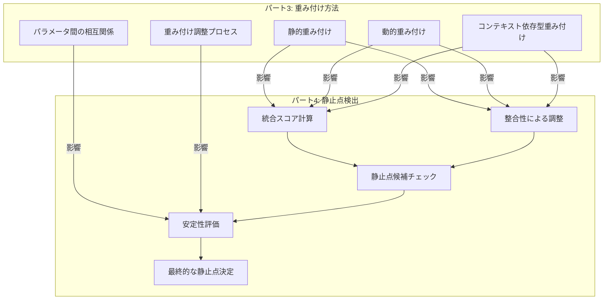

# パート3の重み付け方法が静止点検出に与える影響の説明セクション構成設計

## 1. セクション概要と目的

### 1.1 セクションの位置付け
- パート4「静止点検出と評価方法」の中に新たに追加するセクション
- パート3「コンセンサス基準と重み付け方法」との連携を説明する橋渡し的役割
- 読者がパート間の関連性を理解し、全体像を把握できるようにする

### 1.2 セクションの目的
- パート3で説明された重み付け方法（静的、動的、コンテキスト依存型）がパート4の静止点検出プロセスにどのように影響するかを明確に説明する
- 両パートの概念間の相互作用と依存関係を視覚的に示す
- 実装時の連携ポイントと注意点を提供する

### 1.3 想定読者と前提知識
- パート3とパート4の基本概念を理解している読者
- n8nによる実装に関心がある実務者
- 多視点型意思決定支援システムの構築を検討している意思決定者

## 2. セクション構造と内容概要

### 2.1 セクションタイトルと導入
- タイトル：「8. パート3の重み付け方法が静止点検出に与える影響」
- 導入部：両パートの関係性の概要と本セクションの目的・構成の説明
- 主要概念の簡潔な要約と相互関係の概観図（Mermaidダイアグラム）

### 2.2 サブセクション構成
1. **8.1 重み付け方法と統合スコア計算の関係**
   - 静的・動的・コンテキスト依存型重み付けが統合スコア計算に与える影響
   - 各重み付け方法の特性と統合スコアへの反映メカニズム
   - 計算例と視覚的説明

2. **8.2 重み付け方法と整合性評価の相互作用**
   - 重み付けパラメータが整合性スコア計算と調整プロセスに与える影響
   - 各重み付け方法における整合性評価の特徴と注意点
   - 整合性調整の最適化方法

3. **8.3 重み付け方法と安定性評価の関係**
   - 重み付けの変動が安定性評価に与える影響
   - 各重み付け方法における安定性シミュレーションの設計と実装
   - 安定性評価の精度向上のためのベストプラクティス

4. **8.4 n8nによる実装連携ポイント**
   - 重み付け調整ワークフローと静止点検出ワークフローの連携方法
   - データフローとパラメータ共有の設計
   - 実装例とコードスニペット

5. **8.5 実践的なユースケース例**
   - 技術投資判断における重み付け方法と静止点検出の連携活用
   - 製品開発方針決定における段階的アプローチと重み付け調整
   - 業種別の適用ガイドと成功事例

### 2.3 クロスリファレンス設計
- パート3の関連セクションへの明示的な参照
  - 例：「3.2 動的重み付けの実装」→「8.1 重み付け方法と統合スコア計算の関係」
- パート4の関連セクションへの明示的な参照
  - 例：「2.2 統合スコア計算」→「8.1 重み付け方法と統合スコア計算の関係」
- 一貫した参照形式：「パートX、セクションY.Z『セクションタイトル』参照」

## 3. 視覚的要素の設計

### 3.1 概念関連図
- パート3の重み付け方法とパート4の静止点検出プロセスの関連性を示すネットワーク図
- 主要概念間の相互作用と影響の流れを視覚化
- Mermaidダイアグラムで実装

### 3.2 プロセスフロー図
- 重み付け調整から静止点検出までの一連のプロセスフロー
- 各ステップでの重み付け方法の影響ポイントを強調
- Mermaidダイアグラムで実装

### 3.3 比較表
- 各重み付け方法が静止点検出の各段階に与える影響の比較表
- メリット・デメリット・適用シナリオの明確化
- HTML表形式で実装

### 3.4 実装コード例
- n8nワークフローのスクリーンショットと主要ノードの設定例
- 重み付け調整と静止点検出の連携コードスニペット
- コードブロックとして実装

## 4. 実装上の考慮事項

### 4.1 セクションの長さと詳細度
- 全体で約3,000〜4,000語
- 各サブセクションは600〜800語程度
- 視覚的要素と説明テキストのバランスを考慮

### 4.2 スタイルと一貫性
- パート4の既存スタイルに合わせた見出しレベルと書式
- 専門用語の一貫した使用と必要に応じた説明
- 明確で簡潔な文体と論理的な流れ

### 4.3 相互参照の実装
- 明示的なセクション番号と参照リンク
- 関連概念への参照を適切に配置
- 将来の更新を考慮した柔軟な参照構造

## 5. 評価基準

### 5.1 内容の評価基準
- 技術的正確性：両パートの概念と関連性が正確に説明されているか
- 完全性：重要な連携ポイントがすべて網羅されているか
- 実用性：実装時に参照できる具体的なガイダンスが提供されているか

### 5.2 構造の評価基準
- 論理的一貫性：説明の流れが論理的で理解しやすいか
- 相互参照の適切さ：関連セクションへの参照が適切に配置されているか
- 視覚的要素の効果：図表が概念理解を助けているか

### 5.3 読者体験の評価基準
- 理解のしやすさ：複雑な概念が分かりやすく説明されているか
- ナビゲーションの容易さ：セクション間の移動と関連情報の発見が容易か
- 実践への応用：読者が自身のユースケースに適用できる知識が得られるか
