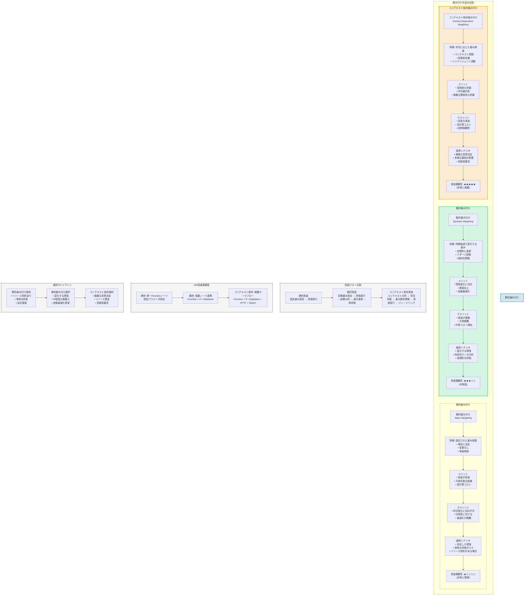

# 重み付け方法の比較概念図

## 重み付け方法の比較（静的、動的、コンテキスト依存）



## 重み付け方法の特性比較表

| 特性 | 静的重み付け | 動的重み付け | コンテキスト依存重み付け |
|------|------------|------------|-------------------|
| **定義** | 固定された重み係数を使用 | 時間経過で変化する重み | 状況に応じて調整される重み |
| **更新頻度** | 更新なし | 定期的/イベント駆動 | リアルタイム/状況変化時 |
| **入力依存性** | 入力に依存しない | 過去の結果に依存 | 現在のコンテキストに依存 |
| **実装複雑性** | 低 | 中 | 高 |
| **計算コスト** | 低 | 中 | 高 |
| **精度** | 基本的 | 向上 | 最高 |
| **適応性** | なし | 中程度 | 高 |
| **説明可能性** | 高 | 中 | 低〜中 |
| **n8n実装** | 単一Functionノード | 複数ノード連携 | 複雑ワークフロー |

## 重み付け方法の選択基準

重み付け方法の選択は、以下の要因に基づいて行うことが推奨されます：

1. **評価対象の性質**：
   - 安定した対象 → 静的重み付け
   - 時間変化する対象 → 動的重み付け
   - 複雑な相互作用を持つ対象 → コンテキスト依存重み付け

2. **利用可能なリソース**：
   - リソース制約あり → 静的重み付け
   - 中程度のリソース → 動的重み付け
   - リソース豊富 → コンテキスト依存重み付け

3. **精度要求**：
   - 基本的な精度で十分 → 静的重み付け
   - 向上した精度が必要 → 動的重み付け
   - 最高精度が必要 → コンテキスト依存重み付け

4. **実装の容易さ**：
   - 迅速な実装が必要 → 静的重み付け
   - 中程度の開発時間 → 動的重み付け
   - 長期的な開発が可能 → コンテキスト依存重み付け

## n8nでの実装アプローチ

### 静的重み付け実装
```javascript
// Functionノードでの実装例
const weights = {
  tech: 0.33,
  market: 0.33,
  business: 0.34
};

const scores = {
  tech: items.tech_score,
  market: items.market_score,
  business: items.business_score
};

// 重み付け計算
const weightedScore = 
  weights.tech * scores.tech + 
  weights.market * scores.market + 
  weights.business * scores.business;

return { weightedScore };
```

### 動的重み付け実装
```javascript
// Functionノードでの実装例（一部）
// 過去のデータに基づいて重みを調整
const baseWeights = {
  tech: 0.33,
  market: 0.33,
  business: 0.34
};

// 過去の結果から調整係数を計算
const adjustmentFactors = calculateAdjustmentFactors(historicalData);

// 重みの動的調整
const adjustedWeights = {
  tech: baseWeights.tech * adjustmentFactors.tech,
  market: baseWeights.market * adjustmentFactors.market,
  business: baseWeights.business * adjustmentFactors.business
};

// 正規化（合計が1になるように）
const sum = adjustedWeights.tech + adjustedWeights.market + adjustedWeights.business;
const normalizedWeights = {
  tech: adjustedWeights.tech / sum,
  market: adjustedWeights.market / sum,
  business: adjustedWeights.business / sum
};

// 重み付け計算
const weightedScore = 
  normalizedWeights.tech * scores.tech + 
  normalizedWeights.market * scores.market + 
  normalizedWeights.business * scores.business;

return { weightedScore, normalizedWeights };
```

### コンテキスト依存重み付け実装
```javascript
// Functionノードでの実装例（一部）
// コンテキスト情報の分析
const context = {
  topicNature: items.topic_nature,  // 技術駆動型、市場駆動型など
  changeStage: items.change_stage,  // 初期、成長期、成熟期など
  confidenceScores: {
    tech: items.tech_confidence,
    market: items.market_confidence,
    business: items.business_confidence
  },
  externalFactors: items.external_factors  // 外部要因（規制変更、市場混乱など）
};

// コンテキストに基づく重み調整ルール
const weightAdjustmentRules = {
  // 技術駆動型トピックでは技術視点の重みを増加
  techDriven: { tech: 1.5, market: 0.8, business: 0.7 },
  // 市場駆動型トピックでは市場視点の重みを増加
  marketDriven: { tech: 0.7, market: 1.5, business: 0.8 },
  // 初期段階では技術視点を重視
  earlyStage: { tech: 1.3, market: 0.9, business: 0.8 },
  // 成熟期ではビジネス視点を重視
  matureStage: { tech: 0.8, market: 0.9, business: 1.3 },
  // 確信度が低い視点の重みを減少
  lowConfidence: 0.7
};

// コンテキストに基づく重み調整
let contextualWeights = { tech: 0.33, market: 0.33, business: 0.34 };

// トピック性質に基づく調整
if (context.topicNature === 'tech_driven') {
  contextualWeights.tech *= weightAdjustmentRules.techDriven.tech;
  contextualWeights.market *= weightAdjustmentRules.techDriven.market;
  contextualWeights.business *= weightAdjustmentRules.techDriven.business;
} else if (context.topicNature === 'market_driven') {
  // 市場駆動型の調整...
}

// 変化段階に基づく調整
if (context.changeStage === 'early') {
  // 初期段階の調整...
}

// 確信度に基づく調整
if (context.confidenceScores.tech < 0.5) {
  contextualWeights.tech *= weightAdjustmentRules.lowConfidence;
}
// 他の視点の確信度調整...

// 外部要因の考慮
// ...

// 正規化
const sum = contextualWeights.tech + contextualWeights.market + contextualWeights.business;
const normalizedWeights = {
  tech: contextualWeights.tech / sum,
  market: contextualWeights.market / sum,
  business: contextualWeights.business / sum
};

// 重み付け計算
const weightedScore = 
  normalizedWeights.tech * scores.tech + 
  normalizedWeights.market * scores.market + 
  normalizedWeights.business * scores.business;

return { weightedScore, normalizedWeights, contextFactors: context };
```
