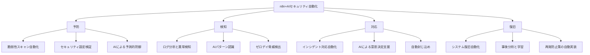
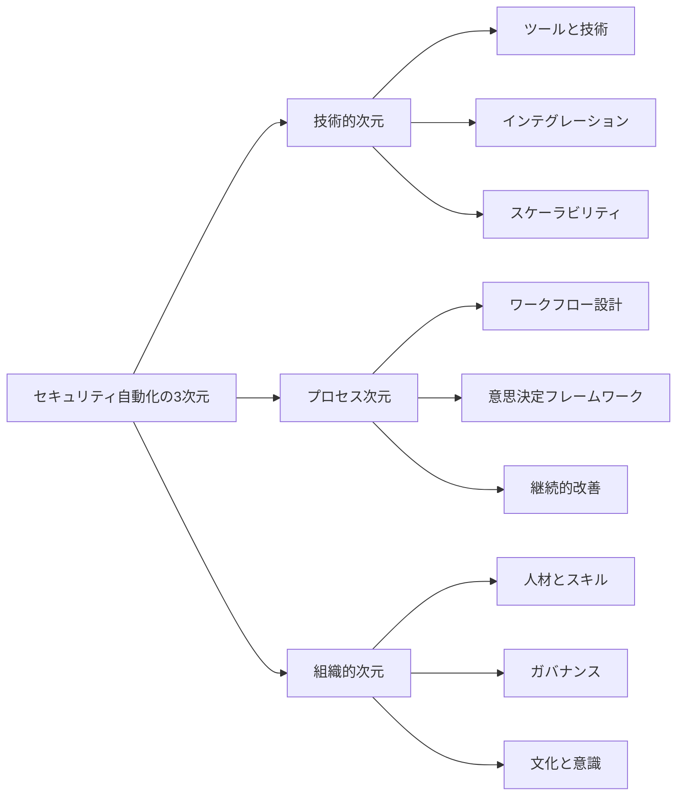
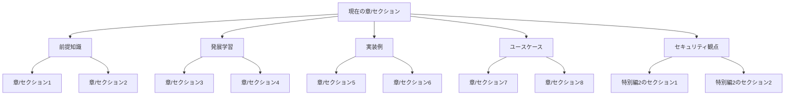

# 「n8n+生成AIによる次世代業務自動化」シリーズ セキュリティ自動化章強化案

## #META:ファイル情報
- #CREATED_AT:2025-06-12
- #PRIORITY:高
- #PURPOSE:セキュリティ自動化章の強化と索引・相互リンク設計
- #STATUS:作成完了
- #RELATED_FILES:revised_outline.md,chapter_integration_detailed.md

## セキュリティ自動化章の強化案

### 1. 冒頭部分の構造化とビジョン設定

特別編2「n8n+AIによるセキュリティ自動化」の冒頭部分を以下のように強化します：

#### 1.1 セキュリティ自動化の全体ビジョン



#### 1.2 セキュリティ自動化の3つの次元



#### 1.3 n8n+AIによるセキュリティ変革マトリックス

| セキュリティ領域 | 従来のアプローチ | n8n自動化 | n8n+AI自動化 |
|-------------|-------------|----------|------------|
| 脅威検知 | 手動ログ分析、定期スキャン | スケジュールされた自動スキャン、ルールベースのアラート | リアルタイム異常検知、コンテキスト認識型分析、予測的脅威ハンティング |
| インシデント対応 | 手順書に基づく手動対応 | 事前定義されたプレイブックの自動実行 | 状況適応型対応、AIによる意思決定支援、動的プレイブック生成 |
| 脆弱性管理 | 定期的な脆弱性スキャン | 自動スキャンと報告 | 優先度の自動判定、コンテキスト認識型リスク評価、修正の自動検証 |
| コンプライアンス | 手動チェックと報告 | 自動チェックと報告生成 | 継続的コンプライアンス監視、予測的コンプライアンスリスク分析、自動修正提案 |
| セキュリティ教育 | 定期的な全体研修 | 役割ベースの自動トレーニング割り当て | パーソナライズされた適応型学習、行動分析に基づくターゲットトレーニング |

### 2. 全編におけるセキュリティ観点の位置づけ

各章にセキュリティ観点を明示的に組み込み、特別編2との関連性を強化します：

#### 2.1 各章のセキュリティ観点マッピング

| 章 | セキュリティ観点の組み込みポイント | 特別編2との関連性 |
|---|--------------------------|--------------|
| 第1話：n8nとは何か？ | n8nのセキュリティアーキテクチャと基本機能の解説 | 基本的なセキュリティ機能の紹介と特別編2への橋渡し |
| 第2話：基本的な業務自動化 | 自動化におけるセキュリティベストプラクティス | 基本的なセキュリティ自動化の実装例と特別編2への参照 |
| 第3話：生成AIとの連携 | AIモデル利用時のセキュリティ考慮事項 | AIセキュリティの基本概念と特別編2のAIセキュリティ分析への参照 |
| 第4話：データ分析と意思決定支援 | データセキュリティと分析プロセスの保護 | セキュリティデータ分析の基本と特別編2の高度な実装への参照 |
| 第5話：組織的展開と発展戦略 | セキュリティガバナンスと自動化の統合 | 組織的セキュリティ戦略と特別編2のSOC構築への参照 |
| 特別編1：戦略AIレーダー | 情報収集と分析におけるセキュリティ考慮事項 | 情報セキュリティと特別編2の脅威インテリジェンスへの参照 |
| 第7話：カスタム開発と拡張 | セキュアな開発プラクティスとコード検証 | セキュアコーディングと特別編2のセキュリティ自動化拡張への参照 |
| 付録：導入ケーススタディ集 | 各事例におけるセキュリティ側面の強調 | 実践的セキュリティ実装と特別編2の具体的手法への参照 |

#### 2.2 セキュリティ観点の視覚的表現

各章の「セキュリティTips」セクションで使用する統一アイコンとフォーマット：

```
🔒 セキュリティTips
-------------------
• 考慮すべきセキュリティ側面
• 実装時のセキュリティベストプラクティス
• 特別編2の関連セクションへの参照リンク
```

### 3. 特別編2の章構成強化

特別編2「n8n+AIによるセキュリティ自動化」の章構成を以下のように強化します：

#### 3.1 改訂版章構成

1. **n8n+AIセキュリティ自動化の全体像**
   - セキュリティ自動化の概念と重要性
   - n8nとAIがセキュリティにもたらす変革
   - セキュリティ自動化の3つの次元（技術・プロセス・組織）
   - セキュリティ変革マトリックス

2. **セキュリティ監視と脅威検知の自動化**
   - ログ収集と分析の自動化
   - 異常検知アルゴリズムの実装
   - AIを活用した脅威パターン認識
   - リアルタイムセキュリティダッシュボード

3. **インシデント対応プロセスの自動化**
   - アラート生成と優先度付け
   - 自動対応アクションの設計
   - エスカレーションフローの構築
   - インシデント対応プレイブックの自動化

4. **AIを活用したセキュリティ分析と予測**
   - 大規模言語モデルによるログ分析
   - 攻撃パターンの学習と予測
   - ゼロデイ脆弱性の早期検出
   - 予測的セキュリティ対策の実装

5. **セキュリティ自動化のガバナンスと監査**
   - 自動化プロセスの監査証跡
   - コンプライアンス要件への対応
   - セキュリティポリシーの自動適用
   - 継続的セキュリティ評価

6. **実践：SOC（Security Operations Center）ワークフローの構築**
   - 統合監視ダッシュボードの開発
   - インシデント対応プレイブックの自動化
   - 脅威インテリジェンスの統合
   - SOC効率の測定と最適化

#### 3.2 視覚要素の強化

各セクションに追加する視覚要素：

1. **セキュリティ自動化アーキテクチャ図**（Mermaid形式）
   - n8nを中心としたセキュリティツール連携の全体像
   - データフローと処理パイプライン
   - AIモデルの統合ポイント

2. **セキュリティ監視ダッシュボード設計図**
   - リアルタイムモニタリングの視覚化
   - アラート優先度の表現方法
   - ドリルダウン分析の構造

3. **インシデント対応フロー図**
   - 検知から解決までの自動化プロセス
   - 人間の介入ポイント
   - 意思決定フレームワーク

4. **AIセキュリティ分析モデル図**
   - データ入力と前処理
   - モデルアーキテクチャ
   - 出力と意思決定支援

5. **セキュリティガバナンスフレームワーク図**
   - ポリシー、手順、技術の関係
   - 監査と報告の流れ
   - 継続的改善サイクル

## 索引と相互リンクの相関設計

### 1. 索引システムの構造

#### 1.1 索引カテゴリ

1. **概念索引**
   - n8nの基本概念
   - 自動化の原則
   - AIの基本概念
   - セキュリティの基本概念

2. **技術索引**
   - n8nノード
   - APIとWebhook
   - AIモデルとサービス
   - セキュリティツールと技術

3. **実装索引**
   - ワークフロー実装例
   - コードサンプル
   - 設定例
   - トラブルシューティング

4. **ユースケース索引**
   - 業種別ユースケース
   - 機能別ユースケース
   - 規模別ユースケース
   - 複合ユースケース

#### 1.2 索引エントリ構造

各索引エントリは以下の情報を含みます：

```
[用語/概念名]
- 定義: 簡潔な説明
- 主要参照: 最も詳細に解説されている章とセクション
- 関連参照: 関連する他の章とセクション
- 関連用語: 関連する他の索引エントリ
```

### 2. 相互リンクシステムの構造

#### 2.1 リンクタイプ

1. **前提知識リンク**
   - 形式: 「本セクションを理解するには、[章/セクション]の理解が前提となります」
   - 配置: 各セクションの冒頭

2. **発展学習リンク**
   - 形式: 「より高度な内容については、[章/セクション]をご参照ください」
   - 配置: 各セクションの終わり

3. **実装例リンク**
   - 形式: 「実装例は[章/セクション]で詳しく解説しています」
   - 配置: 概念説明の後

4. **ユースケースリンク**
   - 形式: 「実際の適用例は[章/セクション]のケーススタディをご参照ください」
   - 配置: 実装例の後

5. **セキュリティ観点リンク**
   - 形式: 「セキュリティ観点については[特別編2の章/セクション]をご参照ください」
   - 配置: 各機能・実装の説明の後

#### 2.2 視覚的リンク表現

各章の終わりに「関連コンテンツマップ」を配置：



### 3. 索引と相互リンクの統合

#### 3.1 索引からのリンク

索引エントリから各章の該当セクションへの直接リンクを提供：

```
[用語/概念名]
- 定義: 簡潔な説明
- 主要参照: [第X章 Y.Z節へのリンク]
- 関連参照: [第A章 B.C節へのリンク], [第D章 E.F節へのリンク]
- 関連用語: [関連用語1へのリンク], [関連用語2へのリンク]
```

#### 3.2 本文からの索引参照

本文中の重要用語に索引参照を付加：

```
...n8nのワークフロー[→索引:ワークフロー]では、トリガー[→索引:トリガー]とアクション[→索引:アクション]を組み合わせて...
```

#### 3.3 デジタル版での実装案

デジタル版では、以下の機能を実装：

- ホバーで用語の簡易説明を表示
- クリックで索引エントリにジャンプ
- 関連コンテンツマップのインタラクティブ化
- 章間ナビゲーションの視覚的サポート

## 用語集編集方針

### 1. 用語集作成プロセス

1. **全章の執筆・編集完了後に実施**
   - 全てのコンテンツが確定した段階で開始
   - 各章で使用された全ての専門用語を抽出

2. **用語の統一と標準化**
   - 「語彙の揺れ・用語の揺れパターンと統一案」に基づく調整
   - 一貫した表記・表現の適用
   - 必要に応じた用語の定義の精緻化

3. **用語集の構造化**
   - アルファベット順と機能カテゴリ別の2種類の索引を提供
   - 各用語に簡潔な定義と詳細解説を提供
   - 関連用語への参照を含める

### 2. 用語集エントリ構造

各用語集エントリは以下の情報を含みます：

```
[用語]
- 品詞: 名詞/動詞/形容詞など
- 定義: 簡潔な説明（1-2文）
- 詳細: より詳しい解説（必要に応じて）
- 用例: 実際の使用例
- 関連用語: 関連する他の用語
- 参照: 詳しく解説されている章とセクション
```

### 3. 用語集と本文の連携

1. **本文中での用語の初出時の扱い**
   - 初出時に簡潔な定義を括弧内に記載
   - 例: 「n8n[ノーコード・ローコード型ワークフロー自動化ツール]を使用して...」

2. **用語集参照の表記**
   - 本文中の重要用語に用語集参照を付加
   - 例: 「...Webhookトリガー[→用語集]を設定します...」

3. **デジタル版での実装**
   - 用語にホバーすると簡易定義を表示
   - クリックで用語集の該当エントリにジャンプ

## 次のステップ

1. **セキュリティ自動化章の詳細設計**
   - 冒頭部分の構造化とビジョン設定の具体化
   - 全編におけるセキュリティ観点の組み込み方の詳細化
   - 視覚要素の設計と作成

2. **索引と相互リンクシステムの詳細設計**
   - 索引カテゴリとエントリ構造の確定
   - 相互リンクタイプと表現方法の具体化
   - 視覚的ナビゲーション要素の設計

3. **各章の執筆・編集作業の開始**
   - 第1～3章のアウトラインへの微調整と最新情報の更新
   - 第4章の候補ファイル統合と内容拡充
   - 第5章の候補ファイル整理・統合と内容拡充
   - 特別編1の再構成と本編との関連付け強化

4. **用語集の準備作業**
   - 用語抽出の仕組みの準備
   - 用語定義テンプレートの作成
   - 「語彙の揺れ・用語の揺れパターンと統一案」の精査と更新
