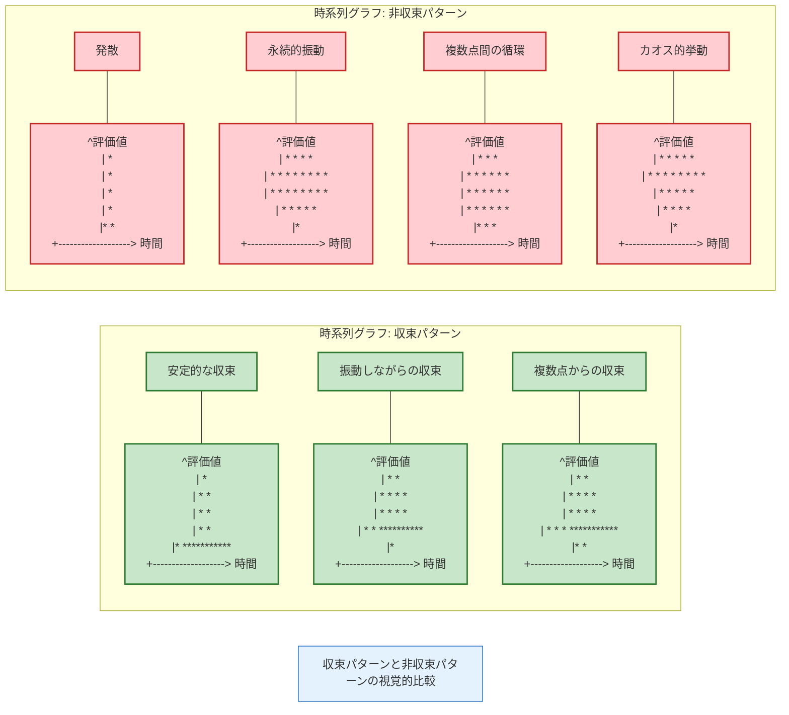
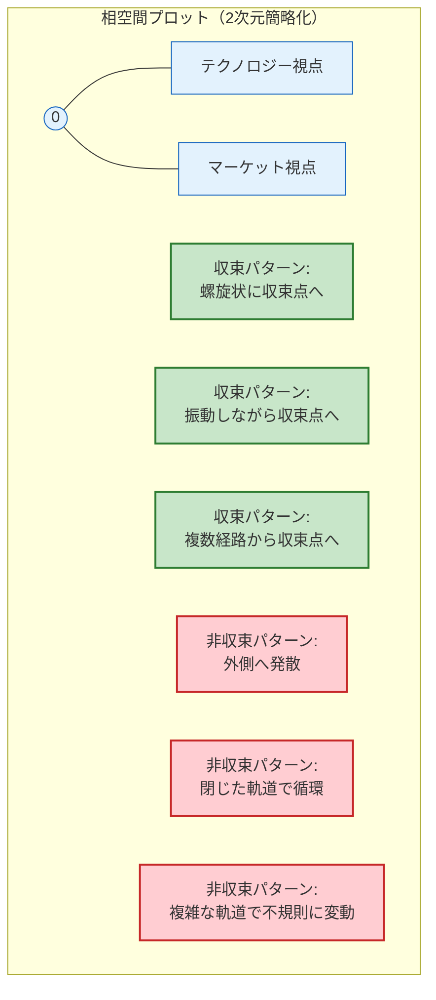
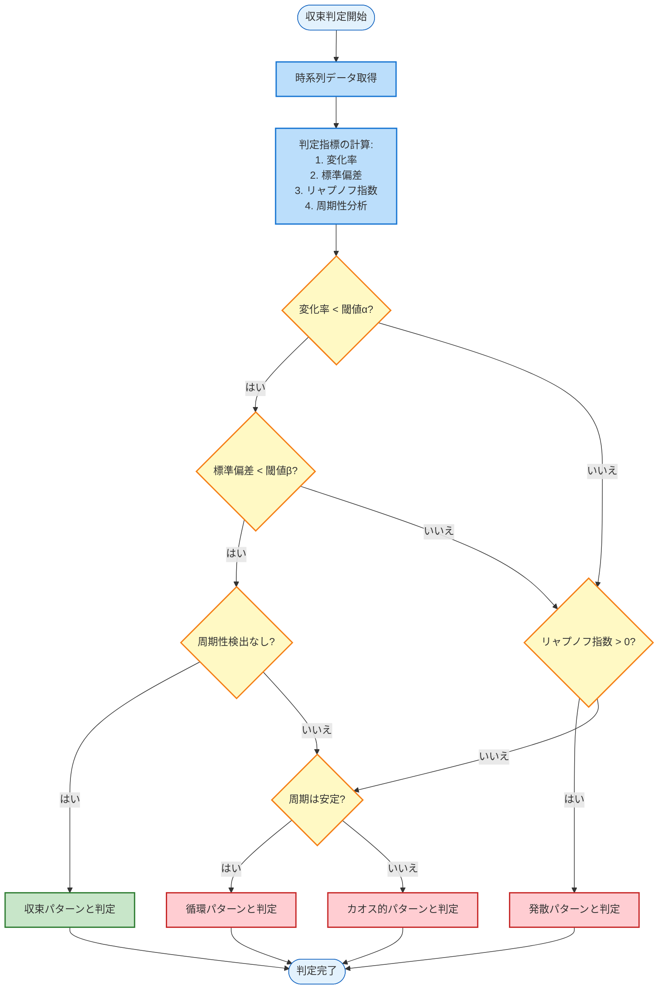

# 収束パターンと非収束パターンの視覚的比較

静止点検出プロセスにおいて、収束パターンと非収束パターンを正確に識別することは極めて重要です。この視覚的比較は、実際のデータで静止点の収束状態を判断するための参考となります。

## 時系列グラフによる比較

以下の図は、時間経過に伴う評価値の変化パターンを示しています。収束パターンと非収束パターンの典型的な挙動の違いに注目してください。



### 収束パターンの特徴
- **安定的な収束**: 初期の変動後、一定の値に落ち着き、その後変化しなくなります。
- **振動しながらの収束**: 振幅が徐々に小さくなりながら、最終的に一定の値に収束します。
- **複数点からの収束**: 異なる初期値から始まっても、同じ値に収束します。

### 非収束パターンの特徴
- **発散**: 時間経過とともに値が一方向に増加し続けます。
- **永続的振動**: 一定の振幅と周期で永続的に振動し続けます。
- **複数点間の循環**: 複数の値の間を規則的に循環します。
- **カオス的挙動**: 予測不可能な不規則な変動を示します。

## 相空間プロットによる比較

相空間プロットは、複数の視点（テクノロジー、マーケット、ビジネス）の評価値の関係を視覚化します。以下は2次元に簡略化した表現です。



相空間プロットでは、収束パターンは最終的に一点に集まる軌道を描き、非収束パターンは発散、循環、または不規則な軌道を描きます。実際の3次元相空間（テクノロジー、マーケット、ビジネスの3軸）では、これらのパターンはより複雑になりますが、基本的な特徴は同じです。

## 収束判定のフローチャート

以下のフローチャートは、時系列データから収束・非収束パターンを判定するプロセスを示しています。



このフローチャートでは、以下の指標を用いて収束・非収束パターンを判定します：

1. **変化率**: 連続するイテレーション間の評価値の変化率
2. **標準偏差**: 直近n回の評価値の標準偏差
3. **リャプノフ指数**: 軌道の安定性を示す指標
4. **周期性分析**: 自己相関分析による周期性の検出

## 収束・非収束パターンの特徴比較

```mermaid
classDiagram
    %% 収束・非収束パターンの特徴比較表
    class "収束パターンの特徴" {
        +変化率: 時間経過とともに減少し0に近づく
        +標準偏差: 一定値以下に安定
        +リャプノフ指数: 負の値
        +周期性: 消失または減衰
        +予測可能性: 高い
        +n8n実装の複雑さ: 中程度
    }
    
    class "非収束パターンの特徴" {
        +変化率: 一定または増加
        +標準偏差: 高い値を維持または増加
        +リャプノフ指数: 正の値または0
        +周期性: 持続または不規則
        +予測可能性: 低い
        +n8n実装の複雑さ: 高い
    }
    
    class "n8n実装のポイント" {
        +収束判定: Function, If/Switchノードで条件分岐
        +時系列分析: Functionノードで統計計算
        +閾値設定: 環境変数またはデータベースで管理
        +可視化: 外部ツール連携またはWebhookで通知
        +自動介入: 非収束検出時に自動パラメータ調整
    }
```

## n8nでの実装方法

n8nで収束・非収束パターンの検出を実装する際の主要なポイントは以下の通りです：

### 1. データ収集と前処理
- Google Sheets ReadノードやHTTP Requestノードで時系列データを取得
- Functionノードで正規化や移動平均などの前処理を実施

### 2. 収束判定ロジック
```javascript
// Functionノードでの収束判定ロジックの例
function detectConvergence(timeSeriesData, options = {}) {
  const {
    changeRateThreshold = 0.01,
    stdDevThreshold = 0.05,
    windowSize = 10
  } = options;
  
  // 直近のデータポイントを取得
  const recentData = timeSeriesData.slice(-windowSize);
  
  // 変化率の計算
  const lastValue = recentData[recentData.length - 1];
  const prevValue = recentData[recentData.length - 2];
  const changeRate = Math.abs((lastValue - prevValue) / prevValue);
  
  // 標準偏差の計算
  const mean = recentData.reduce((sum, val) => sum + val, 0) / recentData.length;
  const variance = recentData.reduce((sum, val) => sum + Math.pow(val - mean, 2), 0) / recentData.length;
  const stdDev = Math.sqrt(variance);
  
  // 収束判定
  const isConverging = changeRate < changeRateThreshold && stdDev < stdDevThreshold;
  
  return {
    isConverging,
    metrics: {
      changeRate,
      stdDev,
      mean
    }
  };
}

// 入力データから収束判定を実行
const result = detectConvergence(items[0].json.timeSeriesData, {
  changeRateThreshold: 0.005,
  stdDevThreshold: 0.03
});

// 結果を出力
return {
  json: {
    isConverging: result.isConverging,
    metrics: result.metrics,
    recommendation: result.isConverging ? 
      "静止点として採用可能" : 
      "さらなる評価または代替処理が必要"
  }
};
```

### 3. 可視化と通知
- 収束・非収束の検出結果をデータベースに保存
- Webhookノードで外部可視化ツールにデータを送信
- Slackノードなどで重要な状態変化を通知

### 4. 自動介入
非収束パターンが検出された場合、以下のような自動介入を実装できます：
- 重み付けパラメータの自動調整
- 閾値の段階的緩和
- 代替評価方法への切り替え

## 実践的な応用

収束・非収束パターンの識別は、以下のようなシナリオで特に重要です：

1. **技術投資判断**: 複数の技術オプションの評価が安定して一貫した結論に収束するかどうかを確認
2. **市場参入戦略**: 異なる市場シナリオ下での戦略評価が収束するかどうかを分析
3. **製品開発優先順位**: 複数の製品候補の評価が明確な優先順位に収束するかを検証

収束パターンが見られる場合は、その静止点を信頼性の高い判断基準として採用できます。非収束パターンの場合は、より詳細な分析や代替アプローチが必要となります。
